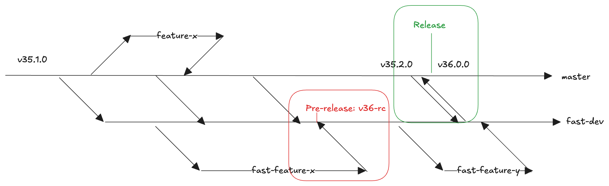

# Versioning Scheme Tied to FAST Releases

**authors:** [Ludo](https://github.com/ludoo),  [Julio](https://github.com/juliocc), [Simone](https://github.com/sruffilli) \
**date:** Oct 29, 2024
**last update**: Oct 30, 2024

## Status

Piloting

## Context

Our current versioning scheme releases new versions based on changes across modules. This approach was suitable when modules were the primary focus of development. However, with the increasing importance of FAST, this process no longer aligns with our priorities. We need a versioning scheme that reflects the significance of FAST releases and allows for more frequent updates to modules and documentation. The current release process wasn't designed with FAST in mind, causing friction and delaying releases.

## Proposal

Change the versioning schema as follows:

- **Major Release (X.0.0):** A major release is reserved for changes that introduce breaking changes to the core functionality of FAST.  This means any modification that requires users to change variables or manipulate state to maintain compatibility. Removing functionality from FAST is also considered a breaking change.
- **minor release (1.Y.0):** A minor release signifies breaking changes within individual modules or components of the project, while maintaining backward compatibility with the overall structure and purpose of the module collection.
- **Patch Release (1.0.Z)**: Any other changes that do not introduce breaking changes, including bug fixes, performance enhancements, and new non-breaking features, constitute a patch release. These updates are backward compatible and should not require any modifications to existing Terraform configurations.

For the purpose of this document, a breaking change is any code change that forces any caller to update their references to the modified code. The following is a non-exhaustive list of **breaking** changes for a module:
- Adding a new required input variable.
- Removing or renaming an existing input variable referenced elsewhere in the codebase.
- Adding new required fields to the type of an existing variable referenced elsewhere in the codebase.
- Removing or renamaing an existing output referenced elsewhere in the codebase.
- Changing the structure of an output referenced elsewhere in the codebase.

The following is a non-exhaustive list of **non-breaking** changes for a module:
- Adding new optional input variables.
- Adding new optional fields to existing input variables.
- Adding new output variables.
- Adding new resources do not affect existing resources.

### Development Workflow:

* **Modules and Documentation:** Changes to modules and documentation will be made directly to the `master` branch.
* **FAST Development:** large FAST changes will occur in a dedicated, protected branch named `fast-dev`.

As shown in the diagram below, the repository will now contain two long-lived branches: `master` and `fast-dev`.

### FAST Release Process:

This case is highlighted in green in the the diagram above. The process is as follows:

1. Merge `master` into `fast-dev`. This ensures that the latest module and documentation changes are included in the FAST release.
1. Create a PR from `fast-dev` to master. This allows for a final review of all changes included in the release and ensures that all tests pass against the release candidate.
1. Merge the PR into `master` and tag with the new major version number (e.g., v2.0.0, v3.0.0).
1. Create a new release from the `master` branch in GitHub as explained in the [Contributing guide](https://github.com/GoogleCloudPlatform/cloud-foundation-fabric/blob/master/CONTRIBUTING.md#cutting-a-new-release)

### FAST Pre-release Process: (Red box in diagram)

This case is highlighted in red in the the diagram above. The process is as follows:

1. Merge `master` into `fast-dev`. This ensures that the latest module and documentation changes are included in the FAST release.
1. Create a new pre-release from `fast-dev` in GitHub as explained in the [Contributing guide](https://github.com/GoogleCloudPlatform/cloud-foundation-fabric/blob/master/CONTRIBUTING.md#cutting-a-new-release)

### Development Workflow Examples:

#### Scenario 1: changes that don't break FAST for existing users

- Start a new branch from `master`.
- Devolop changes.
- Open and merge a PR against master. In the description, use the `breaks-modules` (if needed) label in the PR.

#### Scenario 2: changes that break FAST for existing users

- Start a new branch from `fast-dev`.
- Devolop changes.
- Open and merge a PR against fast-dev. In the description, use the `breaks-Fast` (if needed) label in the PR.

> [!TIP]
> Aas part of the development of your changes, we encourage merge `master` frequently into your own branch to simplify the final merge back to master.

## Decision

Pilot starting from version 35.

## Consequences

- **Clearer Versioning:** Version numbers will clearly indicate major FAST releases.
- **Faster Module Updates:** Modules and documentation can be updated more frequently without being tied to the FAST release cycle.
- **Improved FAST Release Process:** The dedicated fast-dev branch and PR process will lead to more stable and predictable FAST releases.
- **Increased Development Velocity:** Decoupling module and FAST development will increase overall development velocity.
- **Potential Learning Curve:** Developers will need to adapt to the new branching and release workflow.

## Implementation:

- Create the protected `fast-dev` branch.
- Update documentation to reflect the new versioning scheme and release process.
- Create new labels for PRs, update changelog generation script to account for the new labels and branches.

As a future improvement we can consider developing a GitHub Action for automated release creation, including tagging, release notes generation, etc.
