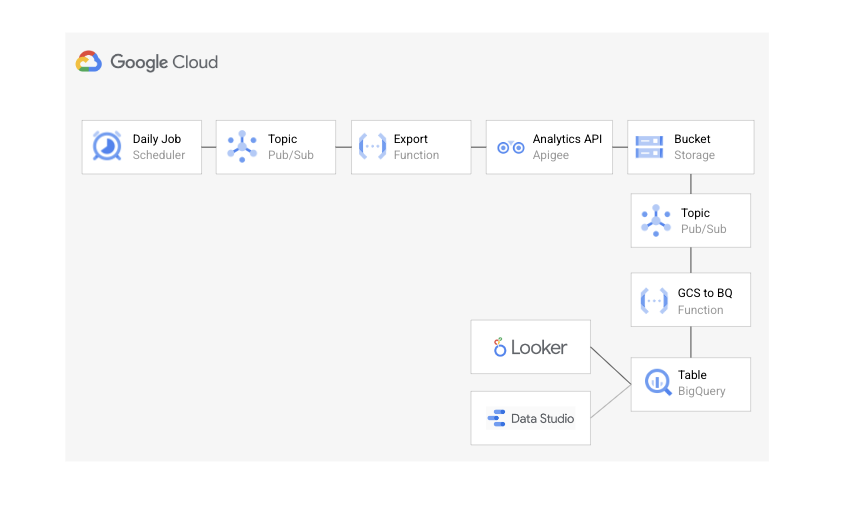
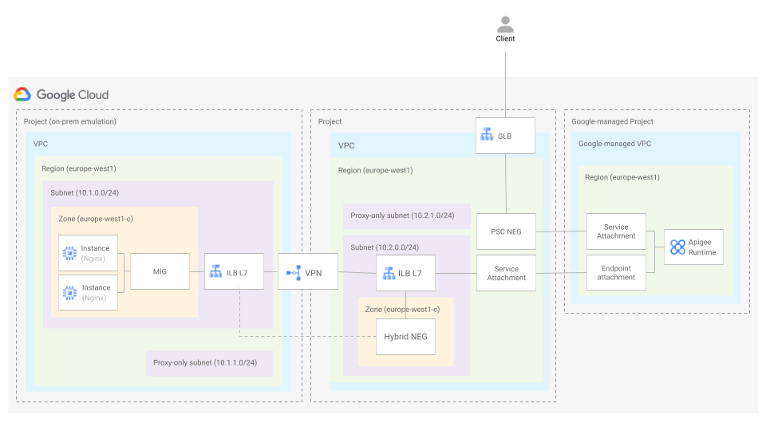

# Apigee Blueprints

The blueprints in this folder contain a variety of deployment scenarios for Apigee Hybrid and Apigee X.

## Blueprints

### Apigee Hybrid on GKE

 This [blueprint](./hybrid-gke/) shows how to do a non-prod deployment of Apigee Hybrid on GKE(../factories/net-vpc-firewall-yaml/).

 

### Apigee X analytics in BigQuery

This [blueprint](./bigquery-analytics/) shows how to export on a daily basis the Apigee analytics of an organization to a BigQuery table.

 

### Apigee X network patterns

The following blueprints demonstrate a set of networking scenarios that can be implemented for Apigee X deployments.

#### Apigee X - Northbound: GLB with PSC Neg, Southbouth: PSC with ILB (L7) and Hybrid NEG
This [blueprint](./network-patterns/nb-glb-psc-neg-sb-psc-ilbl7-hybrid-neg/) shows how to expose an on-prem target backend to clients in the Internet.