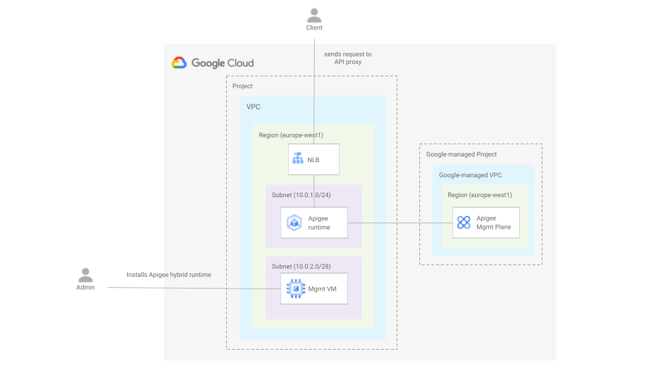

# Apigee Hybrid on GKE

This example installs Apigee hybrid in a non-prod environment on a GKE private cluster using Terraform and Ansible.
The Terraform configuration deploys all the required infrastructure including a management VM used to run an ansible playbook to the actual Apigee Hybrid setup.

The diagram below depicts the architecture.



## Running the blueprint

1. Clone this repository or [open it in cloud shell](https://ssh.cloud.google.com/cloudshell/editor?cloudshell_git_repo=https%3A%2F%2Fgithub.com%2Fterraform-google-modules%2Fcloud-foundation-fabric&cloudshell_print=cloud-shell-readme.txt&cloudshell_working_dir=blueprints%2Fapigee%2Fhybrid), then go through the following steps to create resources:

2. Copy the file [terraform.tfvars.sample](./terraform.tfvars.sample) to a file called ```terraform.tfvars``` and update the values if required.

3. Initialize the terraform configuration

    ```
    terraform init
    ```

4. Apply the terraform configuration

    ```
    terraform apply
    ```

    Create an A record in your DNS registrar to point the environment group hostname to the public IP address returned after the terraform configuration was applied. You might need to wait some time until the certificate is provisioned.

5. Install Apigee hybrid using de ansible playbook that is in the ansible folder by running this command

    ansible-playbook playbook.yaml -vvv

## Testing the blueprint

2. Deploy an api proxy

    ```
    ./deploy-apiproxy.sh apis-test
    ```

3. Send a request

    ```
    curl -v https://HOSTNAME/httpbin/headers
    ```
<!-- BEGIN TFDOC -->
## Variables

| name | description | type | required | default |
|---|---|:---:|:---:|:---:|
| [hostname](variables.tf#L50) | Host name. | <code>string</code> | ✓ |  |
| [project_id](variables.tf#L86) | Project ID. | <code>string</code> | ✓ |  |
| [cluster_machine_type](variables.tf#L17) | Cluster nachine type. | <code>string</code> |  | <code>&#34;e2-standard-4&#34;</code> |
| [cluster_network_config](variables.tf#L23) | Cluster network configuration. | <code title="object&#40;&#123;&#10;  nodes_cidr_block              &#61; string&#10;  pods_cidr_block               &#61; string&#10;  services_cidr_block           &#61; string&#10;  master_authorized_cidr_blocks &#61; map&#40;string&#41;&#10;  master_cidr_block             &#61; string&#10;&#125;&#41;">object&#40;&#123;&#8230;&#125;&#41;</code> |  | <code title="&#123;&#10;  nodes_cidr_block    &#61; &#34;10.0.1.0&#47;24&#34;&#10;  pods_cidr_block     &#61; &#34;172.16.0.0&#47;20&#34;&#10;  services_cidr_block &#61; &#34;192.168.0.0&#47;24&#34;&#10;  master_authorized_cidr_blocks &#61; &#123;&#10;    internal &#61; &#34;10.0.0.0&#47;8&#34;&#10;  &#125;&#10;  master_cidr_block &#61; &#34;10.0.0.0&#47;28&#34;&#10;&#125;">&#123;&#8230;&#125;</code> |
| [deletion_protection](variables.tf#L43) | Prevent Terraform from destroying data storage resources (storage buckets, GKE clusters, CloudSQL instances) in this blueprint. When this field is set in Terraform state, a terraform destroy or terraform apply that would delete data storage resources will fail. | <code>bool</code> |  | <code>false</code> |
| [mgmt_server_config](variables.tf#L55) | Mgmt server configuration. | <code title="object&#40;&#123;&#10;  disk_size     &#61; number&#10;  disk_type     &#61; string&#10;  image         &#61; string&#10;  instance_type &#61; string&#10;&#125;&#41;">object&#40;&#123;&#8230;&#125;&#41;</code> |  | <code title="&#123;&#10;  disk_size     &#61; 50&#10;  disk_type     &#61; &#34;pd-ssd&#34;&#10;  image         &#61; &#34;projects&#47;ubuntu-os-cloud&#47;global&#47;images&#47;family&#47;ubuntu-2204-lts&#34;&#10;  instance_type &#61; &#34;n1-standard-2&#34;&#10;&#125;">&#123;&#8230;&#125;</code> |
| [mgmt_subnet_cidr_block](variables.tf#L71) | Management subnet CIDR block. | <code>string</code> |  | <code>&#34;10.0.2.0&#47;28&#34;</code> |
| [project_create](variables.tf#L77) | Parameters for the creation of the new project. | <code title="object&#40;&#123;&#10;  billing_account_id &#61; string&#10;  parent             &#61; string&#10;&#125;&#41;">object&#40;&#123;&#8230;&#125;&#41;</code> |  | <code>null</code> |
| [region](variables.tf#L91) | Region. | <code>string</code> |  | <code>&#34;europe-west1&#34;</code> |
| [zone](variables.tf#L97) | Zone. | <code>string</code> |  | <code>&#34;europe-west1-c&#34;</code> |

## Outputs

| name | description | sensitive |
|---|---|:---:|
| [ip_address](outputs.tf#L17) | GLB IP address. |  |
<!-- END TFDOC -->
## Test

```hcl
module "test" {
  source = "./fabric/blueprints/apigee/hybrid-gke"
  project_create = {
    billing_account_id = "12345-12345-12345"
    parent             = "folders/123456789"
  }
  project_id = "my-project"
  hostname   = "test.myorg.org"
}
# tftest modules=18 resources=61
```
