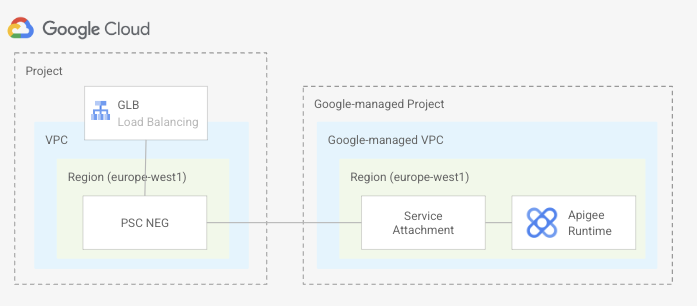
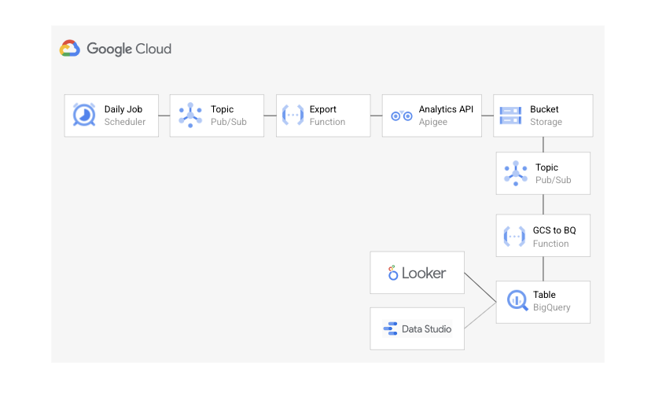

# Apigee X Analytics in Bigquery

The following blueprint shows to how to create an Apigee X trial organization, with an environment group, an environment attached to that environment group and an instance attached to that environment. It creates a NEG that exposes Apigee service attachment. The NEG is added as a backend to a GLB. API proxy requests will pass through the GLB.



In addition to this it also creates the setup depicted in the diagram below to export the Apigee analytics of an organization daily to a BigQuery table.



Find below a description on how the analytics export to BigQuery works:

1. A Cloud Scheduler Job runs daily at a selected time, publishing a message to a Pub/Sub topic.
2. The message published triggers the execution of a function that makes a call to the Apigee Analytics Export API to export the analytical data available for the previous day. 
3. The export function is passed the Apigee organization, environments, datastore name as environment variables. The service account used to run the function needs to be granted the Apigee Admin role on the project. The Apigee Analytics engine asynchronously exports the analytical data to a GCS bucket. This requires the _Apigee Service Agent_ service account to be granted the _Storage Admin_ role on the project. 
4. A notification of the files created on GCS is received in a Pub/Sub topic that triggers the execution of the cloud function in charge of loading the data from GCS to the right BigQuery table partition. This function is passed the name of the BigQuery dataset, its location and the name of the table inside that dataset as environment variables. The service account used to run the function needs to be granted the _Storage Object Viewer_ role on the GCS bucket, the _BigQuery Job User_ role on the project and the _BigQuery Data Editor_ role on the table.

Note: This setup only works if you are not using custom analytics.

## Running the blueprint

1. Clone this repository or [open it in cloud shell](https://ssh.cloud.google.com/cloudshell/editor?cloudshell_git_repo=https%3A%2F%2Fgithub.com%2Fterraform-google-modules%2Fcloud-foundation-fabric&cloudshell_print=cloud-shell-readme.txt&cloudshell_working_dir=blueprints%2Fcloud-operations%apigee), then go through the following steps to create resources:

2. Copy the file [terraform.tfvars.sample](./terraform.tfvars.sample) to a file called ```terraform.tfvars``` and update the values if required.

3. Initialize the terraform configuration

    ```terraform init```

4. Apply the terraform configuration

    ```terraform apply```

Once the resources have been created, do the following:

Create an A record in your DNS registrar to point the environment group hostname to the public IP address returned after the terraform configuration was applied. You might need to wait some time until the certificate is provisioned.

## Testing the blueprint

Do the following to verify that everything works as expected.

1. Create an Apigee datastore

    ```./create-datastore.sh```

2. Deploy an api proxy

    ```./deploy-apiproxy.sh test```

3. Send some traffic to the proxy

    ```./send-requests.sh test.my-domain.com 1000```

4. At 4am (UTC) every day the Cloud Scheduler will run and will export the analytics to the BigQuery table. Double-check they are there.
<!-- BEGIN TFDOC -->

## Variables

| name | description | type | required | default |
|---|---|:---:|:---:|:---:|
| [envgroups](variables.tf#L54) | Environment groups (NAME => [HOSTNAMES]). | <code>map&#40;list&#40;string&#41;&#41;</code> | ✓ |  |
| [environments](variables.tf#L60) | Environments. | <code title="map&#40;object&#40;&#123;&#10;  display_name &#61; optional&#40;string&#41;&#10;  description  &#61; optional&#40;string&#41;&#10;  node_config &#61; optional&#40;object&#40;&#123;&#10;    min_node_count               &#61; optional&#40;number&#41;&#10;    max_node_count               &#61; optional&#40;number&#41;&#10;    current_aggregate_node_count &#61; number&#10;  &#125;&#41;&#41;&#10;  iam       &#61; optional&#40;map&#40;list&#40;string&#41;&#41;&#41;&#10;  envgroups &#61; list&#40;string&#41;&#10;&#125;&#41;&#41;">map&#40;object&#40;&#123;&#8230;&#125;&#41;&#41;</code> | ✓ |  |
| [instances](variables.tf#L76) | Instance. | <code title="map&#40;object&#40;&#123;&#10;  display_name         &#61; optional&#40;string&#41;&#10;  description          &#61; optional&#40;string&#41;&#10;  region               &#61; string&#10;  environments         &#61; list&#40;string&#41;&#10;  psa_ip_cidr_range    &#61; string&#10;  disk_encryption_key  &#61; optional&#40;string&#41;&#10;  consumer_accept_list &#61; optional&#40;list&#40;string&#41;&#41;&#10;&#125;&#41;&#41;">map&#40;object&#40;&#123;&#8230;&#125;&#41;&#41;</code> | ✓ |  |
| [project_id](variables.tf#L32) | Project ID. | <code>string</code> | ✓ |  |
| [psc_config](variables.tf#L104) | PSC configuration. | <code>map&#40;string&#41;</code> | ✓ |  |
| [datastore_name](variables.tf#L97) | Datastore | <code>string</code> |  | <code>&#34;gcs&#34;</code> |
| [organization](variables.tf#L38) | Apigee organization. | <code title="object&#40;&#123;&#10;  display_name            &#61; optional&#40;string, &#34;Apigee organization created by tf module&#34;&#41;&#10;  description             &#61; optional&#40;string, &#34;Apigee organization created by tf module&#34;&#41;&#10;  authorized_network      &#61; optional&#40;string, &#34;vpc&#34;&#41;&#10;  runtime_type            &#61; optional&#40;string, &#34;CLOUD&#34;&#41;&#10;  billing_type            &#61; optional&#40;string&#41;&#10;  database_encryption_key &#61; optional&#40;string&#41;&#10;  analytics_region        &#61; optional&#40;string, &#34;europe-west1&#34;&#41;&#10;&#125;&#41;">object&#40;&#123;&#8230;&#125;&#41;</code> |  | <code title="&#123;&#10;&#125;">&#123;&#8230;&#125;</code> |
| [path](variables.tf#L90) | Bucket path. | <code>string</code> |  | <code>&#34;&#47;analytics&#34;</code> |
| [project_create](variables.tf#L17) | Parameters for the creation of the new project. | <code title="object&#40;&#123;&#10;  billing_account_id &#61; string&#10;  parent             &#61; string&#10;&#125;&#41;">object&#40;&#123;&#8230;&#125;&#41;</code> |  | <code>null</code> |
| [vpc_create](variables.tf#L26) | Boolean flag indicating whether the VPC should be created or not. | <code>bool</code> |  | <code>true</code> |

## Outputs

| name | description | sensitive |
|---|---|:---:|
| [ip_address](outputs.tf#L17) | IP address. |  |

<!-- END TFDOC -->
