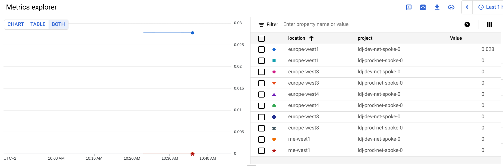

# Compute Engine quota monitoring

This blueprint improves on the [GCE quota exporter tool](https://github.com/GoogleCloudPlatform/professional-services/tree/master/tools/gce-quota-sync) (by the same author of this blueprint), and shows a practical way of collecting and monitoring [Compute Engine resource quotas](https://cloud.google.com/compute/quotas) via Cloud Monitoring metrics as an alternative to the [built-in quota metrics](https://cloud.google.com/monitoring/alerts/using-quota-metrics).

Compared to the built-in metrics, it offers a simpler representation of quotas and quota ratios which is especially useful in charts, allows filtering or combining quotas between different projects regardless of their monitoring workspace, and optionally creates alerting policies without the need to interact directly with the monitoring API.

Regardless of its specific purpose, this blueprint is also useful in showing how to manipulate and write time series to cloud monitoring. The resources it creates are shown in the high level diagram below:


The Cloud Function arguments that control function execution (for example to set which project quotas to monitor) are defined in the Cloud Scheduler payload sent in the PubSub message, so that a single function can be used for different configurations by creating more schedules.

Quota time series are stored using [custom metrics](https://cloud.google.com/monitoring/custom-metrics) with different metric types for usage, limit and utilization; metric types are based on a common prefix defaulting to `quota` and two tokens representing the quota name and type of data. This is an example:

- `custom.googleapis.com/quota/firewalls/usage`
- `custom.googleapis.com/quota/firewalls/limit`
- `custom.googleapis.com/quota/firewalls/ratio`

All custom metrics are associated to the `global` resource type and use [gauge kind](https://cloud.google.com/monitoring/api/v3/kinds-and-types#metric-kinds)

Metric labels contain

- `project` set to the project of the quota
- `location` set to the region of the quota (or `global` for project-level quotas)
- `quota` containing the string representation of `usage / limit` for the quota, to provide an immediate reference when checking ratios; this can be easily turned off in code if reducing cardinality is needed

Labels are set with project id (which may differ from the monitoring workspace projects) and region (quotas that are not region specific are labelled  `global`), this is how the `ratio` metric for a quota looks in in Metrics Explorer



## Configuring resources

The projects where resources are created is also the one where metrics will be written, and is configured via the `project_id` variable. The project can optionally be created by configuring the `project_create_config` variable.

The region, location of the bundle used to deploy the function, and scheduling frequency can also be configured via the relevant variables.

## Configuring Cloud Function parameters

The `quota_config` variable mirrors the arguments accepted by the Python program, and allows configuring several different aspects of its behaviour:

- `quota_config.discover_root` organization or folder to be used to discover all underlying projects to track quotas for, in `organizations/nnnnn` or `folders/nnnnn` format
- `quota_config.exclude` do not generate metrics for quotas matching prefixes listed here
- `quota_config.include` only generate metrics for quotas matching prefixes listed here
- `quota_config.projects` projects to track quotas for, defaults to the project where metrics are stored, if projects are automatically discovered, those in this list are appended. 
- `quota_config.regions` regions to track quotas for, defaults to the `global` region for project-level quotas
- `dry_run` do not write actual metrics
- `verbose` increase logging verbosity

The solution can also create a basic monitoring alert policies, to demonstrate how to raise alerts when quotas utilization goes over a predefined threshold, to enable it, set variable `alert_create` to true and reapply main.tf after main.py has run at least one and quota monitoring metrics have been created.

## Running the blueprint

Clone this repository or [open it in cloud shell](https://ssh.cloud.google.com/cloudshell/editor?cloudshell_git_repo=https%3A%2F%2Fgithub.com%2FGoogleCloudPlatform%2Fcloud-foundation-fabric&cloudshell_print=cloud-shell-readme.txt&cloudshell_working_dir=blueprints%2Fcloud-operations%2Fquota-monitoring), then go through the following steps to create resources:

- `terraform init`
- `terraform apply -var project_id=my-project-id`
<!-- BEGIN TFDOC -->
## Variables

| name | description | type | required | default |
|---|---|:---:|:---:|:---:|
| [project_id](variables.tf#L54) | Project id that references existing project. | <code>string</code> | ✓ |  |
| [alert_configs](variables.tf#L17) | Configure creation of monitoring alerts for specific quotas. Keys match quota names. | <code title="map&#40;object&#40;&#123;&#10;  documentation &#61; optional&#40;string&#41;&#10;  enabled       &#61; optional&#40;bool&#41;&#10;  labels        &#61; optional&#40;map&#40;string&#41;&#41;&#10;  threshold     &#61; optional&#40;number, 0.75&#41;&#10;&#125;&#41;&#41;">map&#40;object&#40;&#123;&#8230;&#125;&#41;&#41;</code> |  | <code>&#123;&#125;</code> |
| [bundle_path](variables.tf#L33) | Path used to write the intermediate Cloud Function code bundle. | <code>string</code> |  | <code>&#34;.&#47;bundle.zip&#34;</code> |
| [name](variables.tf#L39) | Arbitrary string used to name created resources. | <code>string</code> |  | <code>&#34;quota-monitor&#34;</code> |
| [project_create_config](variables.tf#L45) | Create project instead of using an existing one. | <code title="object&#40;&#123;&#10;  billing_account &#61; string&#10;  parent          &#61; optional&#40;string&#41;&#10;&#125;&#41;">object&#40;&#123;&#8230;&#125;&#41;</code> |  | <code>null</code> |
| [quota_config](variables.tf#L59) | Cloud function configuration. | <code title="object&#40;&#123;&#10;  exclude &#61; optional&#40;list&#40;string&#41;, &#91;&#10;    &#34;a2&#34;, &#34;c2&#34;, &#34;c2d&#34;, &#34;committed&#34;, &#34;g2&#34;, &#34;interconnect&#34;, &#34;m1&#34;, &#34;m2&#34;, &#34;m3&#34;,&#10;    &#34;nvidia&#34;, &#34;preemptible&#34;&#10;  &#93;&#41;&#10;  discovery_root &#61; optional&#40;string, &#34;&#34;&#41;&#10;  dry_run        &#61; optional&#40;bool, false&#41;&#10;  include        &#61; optional&#40;list&#40;string&#41;&#41;&#10;  projects       &#61; optional&#40;list&#40;string&#41;&#41;&#10;  regions        &#61; optional&#40;list&#40;string&#41;&#41;&#10;  verbose        &#61; optional&#40;bool, false&#41;&#10;&#125;&#41;">object&#40;&#123;&#8230;&#125;&#41;</code> |  | <code>&#123;&#125;</code> |
| [region](variables.tf#L85) | Compute region used in the example. | <code>string</code> |  | <code>&#34;europe-west1&#34;</code> |
| [schedule_config](variables.tf#L91) | Schedule timer configuration in crontab format. | <code>string</code> |  | <code>&#34;0 &#42; &#42; &#42; &#42;&#34;</code> |
<!-- END TFDOC -->
## Test

```hcl
module "test" {
  source     = "./fabric/blueprints/cloud-operations/compute-quota-monitoring"
  name       = "name"
  project_id = "test"
  project_create_config = {
    billing_account = "12345-ABCDE-12345"
  }
}
# tftest modules=4 resources=26
```
