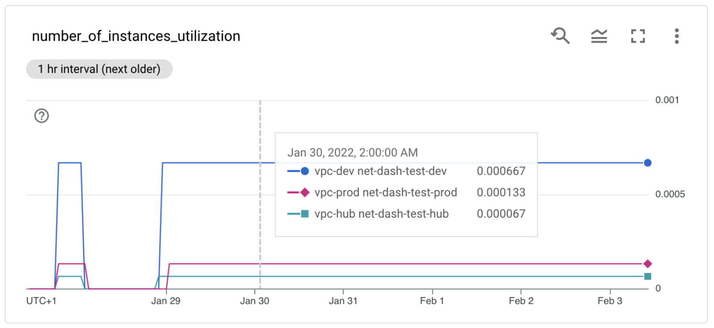

# Networking Dashboard

This repository provides an end-to-end solution to gather some GCP Networking quotas and limits (that cannot be seen in the GCP console today) and display them in a dashboard.
The goal is to allow for better visibility of these limits, facilitating capacity planning and avoiding hitting these limits.

Here is an example of dashboard you can get with this solution:

Here you see utilization (usage compared to the limit) for a specific metric (number of instances per VPC) for multiple VPCs and projects.

Three metric descriptors are created for each monitored resource: usage, limit and utilization. You can follow each of these and create alerting policies if a threshold is reached.

## Usage

Clone this repository, then go through the following steps to create resources:
- Create a terraform.tfvars file with the following content:
  - organization_id = "<YOUR-ORG-ID>"
  - billing_account = "<YOUR-BILLING-ACCOUNT>"
  - monitoring_project_id = "project-0" # Monitoring project where the dashboard will be created and the solution deployed
  - monitored_projects_list = ["project-1", "project2"] # Projects to be monitored by the solution
  - monitored_folders_list = ["folder_id"] # Folders to be monitored by the solution
- `terraform init`
- `terraform apply`

Once the resources are deployed, go to the following page to see the dashboard: https://console.cloud.google.com/monitoring/dashboards?project=<YOUR-MONITORING-PROJECT>.
A dashboard called "quotas-utilization" should be created.

The Cloud Function runs every 10 minutes by default so you should start getting some data points after a few minutes.
You can use the metric explorer to view the data points for the different custom metrics created: https://console.cloud.google.com/monitoring/metrics-explorer?project=<YOUR-MONITORING-PROJECT>.
You can change this frequency by modifying the "schedule_cron" variable in variables.tf.

Note that some charts in the dashboard align values over 1h so you might need to wait 1h to see charts on the dashboard views.

Once done testing, you can clean up resources by running `terraform destroy`.

## Supported limits and quotas
The Cloud Function currently tracks usage, limit and utilization of:
- active VPC peerings per VPC
- VPC peerings per VPC
- instances per VPC
- instances per VPC peering group
- Subnet IP ranges per VPC peering group
- internal forwarding rules for internal L4 load balancers per VPC
- internal forwarding rules for internal L7 load balancers per VPC
- internal forwarding rules for internal L4 load balancers per VPC peering group
- internal forwarding rules for internal L7 load balancers per VPC peering group
- Dynamic routes per VPC (note: assumes global routing is ON)
- Dynamic routes per VPC peering group (note: assumes custom routes importing/exporting is ON)
- Static routes per project (VPC drill down is available for usage)
- Static routes per VPC peering group (note: assumes custom routes sharing is ON for all peered networks)
- IP utilization per subnet (% of IP addresses used in a subnet)
- VPC firewall rules per project (VPC drill down is available for usage)
- Tuples per Firewall Policy

It writes this values to custom metrics in Cloud Monitoring and creates a dashboard to visualize the current utilization of these metrics in Cloud Monitoring.

Note that metrics are created in the cloud-function/metrics.yaml file. also note that the Cloud Function assumes all VPCs in peering groups are within the same organization. 

You can also edit default limits for a specific network in that file. See the example for `vpc_peering_per_network`.

## Next steps and ideas
In a future release, we could support:
- Google managed VPCs that are peered with PSA (such as Cloud SQL or Memorystore)
- Dynamic routes calculation for VPCs/PPGs with "global routing" set to OFF
- Static routes calculation for projects/PPGs with "custom routes importing/exporting" set to OFF

If you are interested in this and/or would like to contribute, please contact legranda@google.com.
