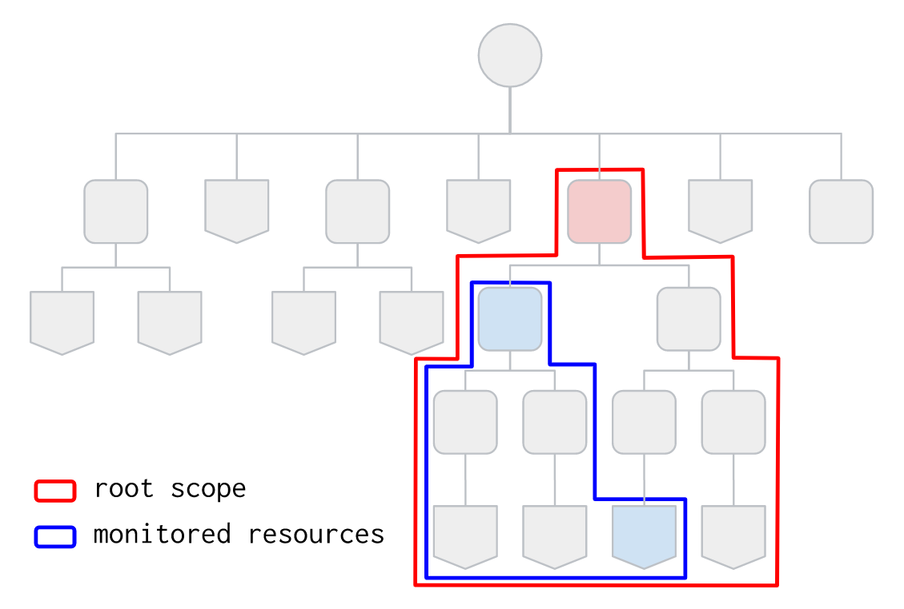

# Network Dashboard Discovery via Cloud Function

This simple Terraform setup allows deploying the [discovery tool for the Network Dashboard](../src/) to a Cloud Function, triggered by a schedule via PubSub.


## Project and function-level configuration

A single project is used both for deploying the function and to collect generated timeseries: writing timeseries to a separate project is not supported here for brevity, but is very simple to implement (basically change the value for `op_project` in the schedule payload queued in PubSub). The project is configured with the required APIs, and it can also optionally be created via the `project_create_config` variable.

The function uses a dedicated service account which is created for this purpose. Roles to allow discovery can optionally be set at the top-level discovery scope (organization or folder) via the `grant_discovery_iam_roles` variable, those of course require the right set of permissions on the part of the identity running `terraform apply`. The alternative when IAM bindings cannot be managed on the top-level scope, is to assign `roles/compute.viewer` and `roles/cloudasset.viewer` to the function service account from a separate process, or manually in the console.

A few configuration values for the function which are relevant to this example can also be configured in the `cloud_function_config` variable, particularly the `debug` attribute which turns on verbose logging to help in troubleshooting.

## Discovery configuration

Discovery configuration is done via the `discovery_config` variable, which mimics the set of options available when running the discovery tool in cli mode. Pay particular care in defining the right top-level scope via the `discovery_root` attribute, as this is the root of the hierarchy used to discover Compute resources and it needs to include the individual folders and projects that needs to be monitored, which are defined via the `monitored_folders` and `monitored_projects` attributes.

The following schematic diagram of a resource hierarchy illustrates the interplay between root scope and monitored resources. The root scope is set to the top-level red folder and completely encloses every resource that needs to be monitored. The blue folder and project are set as monitored defining the actual perimeter used to discover resources. Note that setting the root scope to the blue folder would have resulted in the rightmost project being excluded.



This is an example of a working configuration, where the discovery root is set at the org level, but resources used to compute timeseries need to be part of the hierarchy of two specific folders:

```tfvars
# cloud_function_config = {
#   debug = true
# }
discovery_config = {
  discovery_root     = "organizations/1234567890"
  monitored_folders  = ["3456789012", "7890123456"]
  monitored_projects = []
  # if you have custom quota not returned by the API, compile a file and set
  # its pat here; format is described in ../src/custom-quotas.sample
  # custom_quota_file  = "../src/custom-quotas.yaml"
}
grant_discovery_iam_roles = true
project_create_config = {
  billing_account_id = "12345-ABCDEF-12345"
  parent_id          = "folders/2345678901"
}
project_id = "my-project"
```

## Manual triggering for troubleshooting

If the function crashes or its behaviour is not as expected, you can turn on debugging via the `cloud_function_config.debug` variable attribute, then manually trigger the function from the console by specifying a payload with a single `data` attribute containing the base64-encoded arguments passed to the function by Cloud Scheduler. You can get the pre-computed payload from the `troubleshooting_payload` output:

```bash
# copy and paste to the function's "Testing" tab in the console
tf output -raw troubleshooting_payload
```

## Monitoring dashboard

A monitoring dashboard can be optionally be deployed int he same project by setting the `dashboard_json_path` variable to the path of a dashboard JSON file. A sample dashboard is in included, and can be deployed with this variable configuration:

```tfvars
dashboard_json_path = "../dashboards/quotas-utilization.json"
```
<!-- BEGIN TFDOC -->
## Variables

| name | description | type | required | default |
|---|---|:---:|:---:|:---:|
| [discovery_config](variables.tf#L49) | Discovery configuration. Discovery root is the organization or a folder. If monitored folders and projects are empty, every project under the discovery root node will be monitored. | <code title="object&#40;&#123;&#10;  discovery_root     &#61; string&#10;  monitored_folders  &#61; list&#40;string&#41;&#10;  monitored_projects &#61; list&#40;string&#41;&#10;  custom_quota_file  &#61; optional&#40;string&#41;&#10;&#125;&#41;">object&#40;&#123;&#8230;&#125;&#41;</code> | ✓ |  |
| [project_id](variables.tf#L101) | Project id where the Cloud Function will be deployed. | <code>string</code> | ✓ |  |
| [bundle_path](variables.tf#L17) | Path used to write the intermediate Cloud Function code bundle. | <code>string</code> |  | <code>&#34;.&#47;bundle.zip&#34;</code> |
| [cloud_function_config](variables.tf#L23) | Optional Cloud Function configuration. | <code title="object&#40;&#123;&#10;  bucket_name          &#61; optional&#40;string&#41;&#10;  build_worker_pool_id &#61; optional&#40;string&#41;&#10;  bundle_path          &#61; optional&#40;string, &#34;.&#47;bundle.zip&#34;&#41;&#10;  debug                &#61; optional&#40;bool, false&#41;&#10;  memory_mb            &#61; optional&#40;number, 256&#41;&#10;  source_dir           &#61; optional&#40;string, &#34;..&#47;src&#34;&#41;&#10;  timeout_seconds      &#61; optional&#40;number, 540&#41;&#10;  version              &#61; optional&#40;string, &#34;v1&#34;&#41;&#10;  vpc_connector &#61; optional&#40;object&#40;&#123;&#10;    name            &#61; string&#10;    egress_settings &#61; optional&#40;string, &#34;ALL_TRAFFIC&#34;&#41;&#10;  &#125;&#41;&#41;&#10;&#125;&#41;">object&#40;&#123;&#8230;&#125;&#41;</code> |  | <code>&#123;&#125;</code> |
| [dashboard_json_path](variables.tf#L43) | Optional monitoring dashboard to deploy. | <code>string</code> |  | <code>null</code> |
| [grant_discovery_iam_roles](variables.tf#L67) | Optionally grant required IAM roles to Cloud Function service account. | <code>bool</code> |  | <code>false</code> |
| [labels](variables.tf#L74) | Billing labels used for the Cloud Function, and the project if project_create is true. | <code>map&#40;string&#41;</code> |  | <code>&#123;&#125;</code> |
| [monitoring_project](variables.tf#L80) | Project where generated metrics will be written. Default is to use the same project where the Cloud Function is deployed. | <code>string</code> |  | <code>null</code> |
| [name](variables.tf#L86) | Name used to create Cloud Function related resources. | <code>string</code> |  | <code>&#34;net-dash&#34;</code> |
| [project_create_config](variables.tf#L92) | Optional configuration if project creation is required. | <code title="object&#40;&#123;&#10;  billing_account_id &#61; string&#10;  parent_id          &#61; optional&#40;string&#41;&#10;&#125;&#41;">object&#40;&#123;&#8230;&#125;&#41;</code> |  | <code>null</code> |
| [region](variables.tf#L106) | Compute region where the Cloud Function will be deployed. | <code>string</code> |  | <code>&#34;europe-west1&#34;</code> |
| [schedule_config](variables.tf#L112) | Schedule timer configuration in crontab format. | <code>string</code> |  | <code>&#34;&#42;&#47;30 &#42; &#42; &#42; &#42;&#34;</code> |

## Outputs

| name | description | sensitive |
|---|---|:---:|
| [bucket](outputs.tf#L17) | Cloud Function deployment bucket resource. |  |
| [project_id](outputs.tf#L22) | Project id. |  |
| [service_account](outputs.tf#L27) | Cloud Function service account. |  |
| [troubleshooting_payload](outputs.tf#L35) | Cloud Function payload used for manual triggering. | ✓ |
<!-- END TFDOC -->
