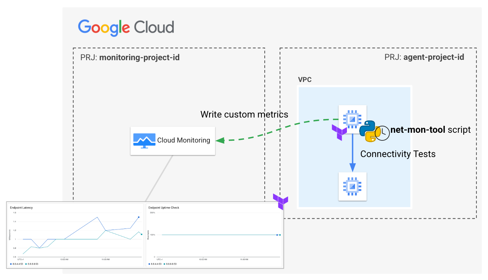
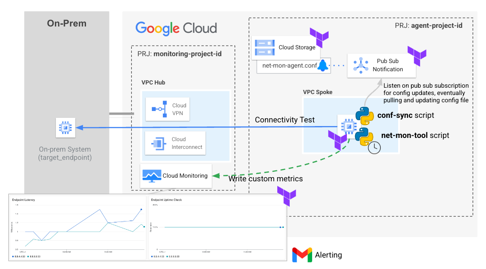
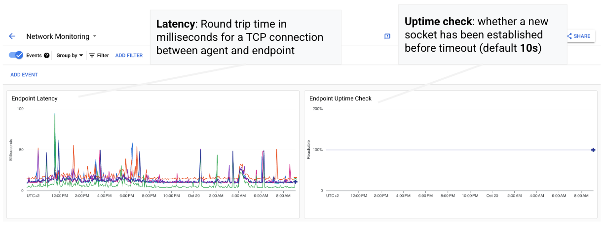
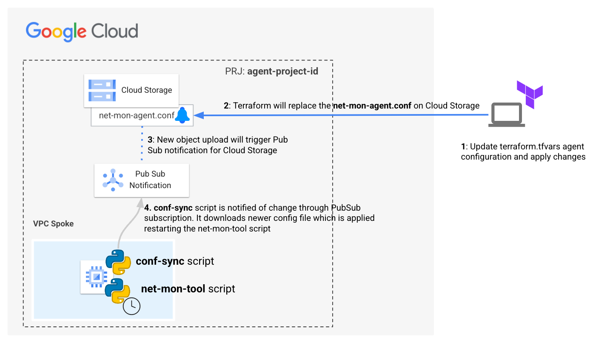

# Network Monitoring Tool

The **Network Monitoring Tool** is a custom solution based on Google Cloud
Products and custom Python scripts for running connectivity tests on Google
Cloud Infrastructure. The tool is capable of running connectivity tests, in the
form of TCP connections, from agents running on Compute Engine instances hosted
in VPC Networks and endpoints either available in GCP, on-prem systems, or
publicly available.

The tool is composed of the following components:

- **Custom Python script**: This script is responsible for testing, on a given
  schedule, connectivity to a given list of target endpoints (IP, port).
  Connectivity is tested by establishing a TCP connection between the agent and
  the server. The Python script is also responsible for publishing custom
  metrics
  to Cloud Monitoring according to the results.
  <br/><br/>
- **Custom Metrics and Dashboard**: A set of custom metrics for tracking latency
  for each endpoint (round trip time in milliseconds for the connection to be
  established)
  as well as an uptime metric published in case the agent is able to create the
  connection within the configured timeout. A sample dashboard is provided in
  the code
  plotting those metrics as well as a sample alert sending email notification.
  Please find more information on this in
  the Dashboard section below.



The primary distinction between this solution and the Google Managed one for
conducting [private uptime checks](https://cloud.google.com/monitoring/uptime-checks/private-checks)
is the ability to run connectivity tests from the subnets available in your VPC.
This is important because it allows you to test connectivity from the same
subnets that are running your production workloads. This can be helpful for
troubleshooting connectivity issues or increases in latency, moreover you can be
notified if there are any problems with the connectivity between your production
workloads and the external services that they depend on.

<!-- TOC -->

* [Network Monitoring Tool](#network-monitoring-tool)
    * [Architecture](#architecture)
    * [Network Monitoring Dashboard](#network-monitoring-dashboard)
    * [Configuration Update process](#configuration-update-process)
    * [Setup](#setup)
        * [Prerequisites](#prerequisites)
            * [Setting up the project for the deployment](#setting-up-the-project-for-the-deployment)
            * [Networking requirements](#networking-requirements)
        * [Deployment](#deployment)
            * [Step 0: Cloning the repository](#step-0--cloning-the-repository)
            * [Step 2: Prepare the variables](#step-2--prepare-the-variables)
            * [Step 3: Deploy resources](#step-3--deploy-resources)
            * [Step 4: Use the created resources](#step-4--use-the-created-resources)
        * [Cleaning up your environment](#cleaning-up-your-environment)
    * [Variables](#variables)
    * [Test](#test)

<!-- TOC -->

## Architecture

Please find below a low-level diagram representing the architecture of the
solution, including all GCP resources required for the script to run properly.
This diagram shows a real-world enterprise scenario based on a traditional
hub-and-spoke network architecture, where this agent might be deployed for
testing connectivity towards on-premises endpoints.



The main components that are deployed in this architecture are the following (
you can learn about them by following the hyperlinks):

- [Compute Engine](https://cloud.google.com/compute): Secure and customizable
  compute service that lets you create and run virtual machines on Google’s
  infrastructure.
- [Pub Sub](https://cloud.google.com/pubsub): Pub/Sub is an asynchronous and
  scalable messaging service that decouples services producing messages from
  services processing those messages.
- [Cloud Storage](https://cloud.google.com/storage): Cloud Storage is a managed
  service for storing unstructured data. Store any amount of data and retrieve
  it as often as you like.
- [Cloud Monitoring](https://cloud.google.com/monitoring):
  One integrated service for metrics, uptime monitoring, dashboards, and alerts.

## Network Monitoring Dashboard

The sample dashboard provides a graphical representation of the custom metrics
collected by the running agents. The dashboard can be customized to display the
metrics in a way that is most relevant to the specific needs of the user.

The dashboard includes the following metrics:

- **Latency**: The round trip time in milliseconds for the connection to be
  established.
  <br/><br/>
- **Uptime**: A metric published in case the agent is able to create the
  connection within the configured timeout.



## Configuration Update process

Updates to a running agent is managed via Terraform leveraging a Python
script running on the VM responsible for updating configuration file and
restarting the network monitoring agent. The latter do not require any instance
restart or update or accessing the virtual machine resulting in simplified agent
management.

Please find below the overall configuration update process and a short
explanation:



1. **Update the Terraform configuration file**. To update the configuration
   file, simply make the necessary changes in either
   the `terraform.tfvars` file or directly to the module arguments for the
   `agent_config` variable (e.g. adding or removing endpoints).
   <br/><br/>
2. **Apply the Terraform changes and update config file on Cloud Storage**. The
   plan/apply should result in 1 object to destroy and 1 to create being the
   content of the `net-mon-agent.conf` file on Cloud Storage getting replaced.
   Once the Terraform changes have been applied, the new configuration file will
   be uploaded to Cloud Storage.
   <br/><br/>
3. **Config file uploaded triggers a Pub/Sub notification**. A Pub/Sub
   notification is sent to a Pub/Sub topic when the new configuration
   file is uploaded in Cloud Storage.
   <br/><br/>
4. **The conf-sync script is notified of the change through the Pub/Sub
   subscription**. The conf-sync script is subscribed to the Pub/Sub topic that
   receives notifications when the configuration file is updated. Upon receiving
   the notification, the conf-sync script downloads the new configuration file
   from Cloud Storage and replaces the old one. After that, it restarts the
   not-mon-agent script, which will run with the newer configurations.

This process is designed to be automated and scalable. It can be used to update
the configuration of multiple agents at the same time.

## Setup

### Prerequisites

#### Setting up the project for the deployment

This example will deploy the monitoring agent VM and its related resources into
the project defined by the `agent_project_id` variable while custom metrics,
dashboards and alerts are configured in the project specified in
the `monitoring_project_id` variable.
It is feasible to configure both the agent and monitoring resources in the same
GCP project providing the same value to both variables.
Please note that we assume all the projects referenced by the aforementioned
variables already exists and that you have the following role on both the GCP
projects:

- Owner primitive role (`roles/owner`)

#### Networking requirements

This only applies when you deploy the agent in an existing VPC (so when
vpc_config variable is used). The script assumes the VM can access internet for
downloading required packages as well as google apis for accessing Cloud
Monitoring APIs.

### Deployment

#### Step 0: Cloning the repository

If you want to deploy from your Cloud Shell, click on the image below, sign in
if required and when the prompt appears, click on “confirm”.

[](https://shell.cloud.google.com/cloudshell/editor?cloudshell_git_repo=https%3A%2F%2Fgithub.com%2FGoogleCloudPlatform%2Fcloud-foundation-fabric&cloudshell_workspace=blueprints%2Fthird-party-solutions%2Fwordpress%2Fcloudrun)

Otherwise, in your console of choice:

```bash
git clone https://github.com/GoogleCloudPlatform/cloud-foundation-fabric
```

Before you deploy the architecture, you will need at least the following
information (for more precise configuration see the Variables section):

* The monitoring project ID
* The agent project ID

#### Step 2: Prepare the variables

Once you have the required information, head back to your cloned repository.
Make sure you’re in the directory of this tutorial (where this README is in).

Configure the Terraform variables in your `terraform.tfvars` file, this is an
example of a working configuration:

```tfvars
agent_config = {
  identifier       = "test"
  target_endpoints = {
    "8.8.8.8" = "53"
    "8.8.4.4" = "53"
  }
}
agent_project_id = "agent-project-id"
alert_config     = {
  enabled            = true
  notification_email = "test@test.com"
}
bootstrap_monitoring    = true
monitoring_project_id   = "monitoring-project-id"
net_mon_agent_vm_config = {
  name         = "test"
  network_tags = ["ssh"]
}
prefix = "tmp"
region = "europe-west8"
```

#### Step 3: Deploy resources

Initialize your Terraform environment and deploy the resources:

```shell
terraform init
terraform apply
```

#### Step 4: Use the created resources

Upon successful execution of the script, you will be able to view the configured
resources in both Google Cloud Platform (GCP) projects, as specified within the
designated variables section. After some minutes, once the VM bootstrapping is
complete, the collected network data will be automatically uploaded and
integrated into the designated monitoring dashboard. You should observe the
dashboard being populated with data shortly after the VMs are fully operational.

### Cleaning up your environment

The easiest way to remove all the deployed resources is to run the following
command in Cloud Shell:

``` {shell}
terraform destroy
```

The above command will delete the associated resources so there will be no
billable charges made afterwards.

<!-- BEGIN TFDOC -->
## Variables

| name | description | type | required | default |
|---|---|:---:|:---:|:---:|
| [agent_project_id](variables.tf#L31) | GCP project the agent is provisioned to. | <code>string</code> | ✓ |  |
| [monitoring_project_id](variables.tf#L64) | GCP Project ID. | <code>string</code> | ✓ |  |
| [prefix](variables.tf#L88) | Prefix used for resource names. | <code>string</code> | ✓ |  |
| [agent_config](variables.tf#L17) | Network monitoring agent script configuration. | <code title="object&#40;&#123;&#10;  identifier &#61; optional&#40;string, &#34;net-mon-agent&#34;&#41;&#10;  interval   &#61; optional&#40;number, 10&#41;&#10;  target_endpoints &#61; optional&#40;map&#40;string&#41;, &#123;&#10;    &#34;8.8.8.8&#34; &#61; &#34;53&#34;&#10;  &#125;&#41;&#10;  timeout &#61; optional&#40;number, 10&#41;&#10;&#125;&#41;">object&#40;&#123;&#8230;&#125;&#41;</code> |  | <code>&#123;&#125;</code> |
| [alert_config](variables.tf#L36) | Configure creation of monitoring alert. | <code title="object&#40;&#123;&#10;  enabled            &#61; optional&#40;bool, false&#41;&#10;  notification_email &#61; optional&#40;string&#41;&#10;&#125;&#41;">object&#40;&#123;&#8230;&#125;&#41;</code> |  | <code>&#123;&#125;</code> |
| [bootstrap_monitoring](variables.tf#L50) | Whether to create network dashboard, time series. | <code>bool</code> |  | <code>false</code> |
| [cidrs](variables.tf#L56) | CIDR ranges for subnets. | <code>map&#40;string&#41;</code> |  | <code title="&#123;&#10;  agent &#61; &#34;10.0.0.0&#47;24&#34;&#10;&#125;">&#123;&#8230;&#125;</code> |
| [nat_logging](variables.tf#L69) | Enables Cloud NAT logging if not null, value is one of 'ERRORS_ONLY', 'TRANSLATIONS_ONLY', 'ALL'. | <code>string</code> |  | <code>&#34;ERRORS_ONLY&#34;</code> |
| [net_mon_agent_vm_config](variables.tf#L75) | Network Monitoring agent VM configuration. | <code title="object&#40;&#123;&#10;  instance_type &#61; optional&#40;string, &#34;e2-standard-2&#34;&#41;&#10;  name          &#61; optional&#40;string, &#34;net-mon-agent&#34;&#41;&#10;  network_tags  &#61; optional&#40;list&#40;string&#41;, &#91;&#93;&#41;&#10;  private_ip    &#61; optional&#40;string, null&#41;&#10;  public_ip     &#61; optional&#40;bool, false&#41;&#10;&#125;&#41;">object&#40;&#123;&#8230;&#125;&#41;</code> |  | <code>&#123;&#125;</code> |
| [region](variables.tf#L98) | GCP Region. | <code>string</code> |  | <code>&#34;europe-west8&#34;</code> |
| [vpc_config](variables.tf#L104) | VPC Network and subnetwork self links for internal LB setup. | <code title="object&#40;&#123;&#10;  network    &#61; string&#10;  subnetwork &#61; string&#10;&#125;&#41;">object&#40;&#123;&#8230;&#125;&#41;</code> |  | <code>null</code> |
<!-- END TFDOC -->

## Test

```hcl
module "test" {
  source                = "./fabric/blueprints/cloud-operations/network-monitoring-tool"
  agent_project_id      = "brz-dev-net-spoke-0"
  monitoring_project_id = "brz-dev-net-spoke-0"
  prefix                = "brz"
  bootstrap_monitoring  = true
}
# tftest modules=8 resources=30
```