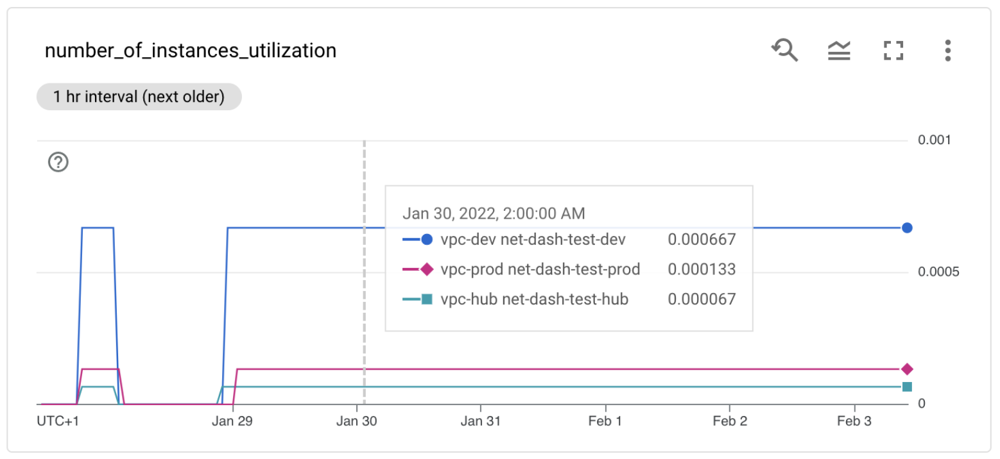

# Network Quota Monitoring

This repository provides an end-to-end solution to gather some GCP networking quotas, limits, and their corresponding usage, store them in Cloud Operations timeseries which can displayed in one or more dashboards or wired to alerts.

The goal is to allow for better visibility of these limits, some of which cannot be seen in the GCP console today, facilitating capacity planning and being notified when actual usage approaches them.

The tool tracks several distinct usage types across a variety of resources: projects, policies, networks, subnetworks, peering groups, etc. For each usage type three distinct metrics are created tracking usage count, limit and utilization ratio.

The screenshot below is an example of a simple dashboard provided with this blueprint, showing utilization for a specific metric (number of instances per VPC) for multiple VPCs and projects:

One other example is the IP utilization information per subnet, allowing you to monitor the percentage of used IP addresses in your GCP subnets.

More complex scenarios are possible by leveraging and combining the 50 different timeseries created by this tool, and connecting them to Cloud Operations dashboards and alerts.

Refer to the [Cloud Function](./deploy-cloud-function/) or [Cloud Run Job](./deploy-cloudrun-job/) instructions for a high level overview and end-to-end deployment examples, and to the[discovery tool documentation](./src/) to try it as a standalone program or to package it in alternative ways.

## Metrics created

- `firewall_policy/tuples_available`
- `firewall_policy/tuples_used`
- `firewall_policy/tuples_used_ratio`
- `network/firewall_rules_used`
- `network/forwarding_rules_l4_available`
- `network/forwarding_rules_l4_used`
- `network/forwarding_rules_l4_used_ratio`
- `network/forwarding_rules_l7_available`
- `network/forwarding_rules_l7_used`
- `network/forwarding_rules_l7_used_ratio`
- `network/instances_available`
- `network/instances_used`
- `network/instances_used_ratio`
- `network/peerings_active_available`
- `network/peerings_active_used`
- `network/peerings_active_used_ratio`
- `network/peerings_total_available`
- `network/peerings_total_used`
- `network/peerings_total_used_ratio`
- `network/routes_dynamic_available`
- `network/routes_dynamic_used`
- `network/routes_dynamic_used_ratio`
- `network/routes_static_used`
- `network/subnets_available`
- `network/subnets_used`
- `network/subnets_used_ratio`
- `peering_group/forwarding_rules_l4_available`
- `peering_group/forwarding_rules_l4_used`
- `peering_group/forwarding_rules_l4_used_ratio`
- `peering_group/forwarding_rules_l7_available`
- `peering_group/forwarding_rules_l7_used`
- `peering_group/forwarding_rules_l7_used_ratio`
- `peering_group/instances_available`
- `peering_group/instances_used`
- `peering_group/instances_used_ratio`
- `peering_group/routes_dynamic_available`
- `peering_group/routes_dynamic_used`
- `peering_group/routes_dynamic_used_ratio`
- `peering_group/routes_static_available`
- `peering_group/routes_static_used`
- `peering_group/routes_static_used_ratio`
- `project/firewall_rules_available`
- `project/firewall_rules_used`
- `project/firewall_rules_used_ratio`
- `project/routes_static_available`
- `project/routes_static_used`
- `project/routes_static_used_ratio`
- `subnetwork/addresses_available`
- `subnetwork/addresses_used`
- `subnetwork/addresses_used_ratio`

## Assumptions and limitations

- The tool assumes all VPCs in peering groups are within the same organization, except for PSA peerings.
- The tool will only fetch subnet utilization data from the PSA peerings (not the VMs, LB or routes usage).
- The tool assumes global routing is ON, this impacts dynamic routes usage calculation.
- The tool assumes custom routes importing/exporting is ON, this impacts static and dynamic routes usage calculation.
- The tool assumes all networks in peering groups have the same global routing and custom routes sharing configuration.
- The tool assumes both Shared VPCs service projects and host projects to be in scope.

## TODO

These are some of our ideas for additional features:

- support PSA-peered Google VPCs (Cloud SQL, Memorystore, etc.)
- dynamic routes for VPCs/peering groups with "global routing" turned off
- static routes calculation for projects/peering groups with custom routes import/export turned off
- cross-organization peering groups

If you are interested in this and/or would like to contribute, please open an issue in this repository or send us a PR.
