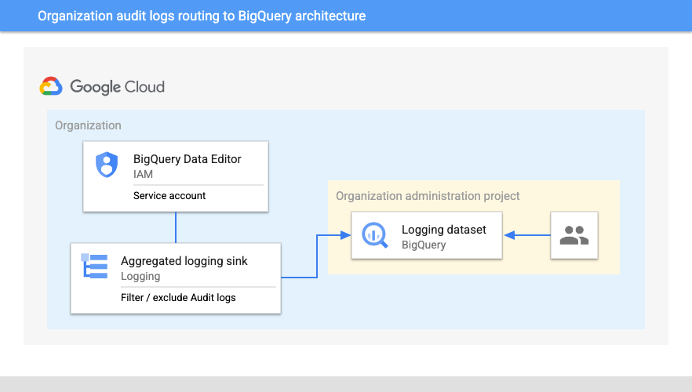

# Ingestion and analysis of audit logs for a Workspace / Google Cloud organization

As a Workspace / Google Cloud [organization administrator](https://cloud.google.com/resource-manager/docs/creating-managing-organization), being able to oversee and monitor events happening across projects, users and resources for security, auditing and regulatory reasons is a core part of an administrator's responsibilities. Unfortunately, as these organizations generate a large variety and volume of events, this task requires a robust infrastructure to both ingest and analyze the logs.

This repository contains the necessary Terraform files and steps to deploy an easy-to-manage pipeline for ingestion audit logs at the organization level to monitor Workspace or any Google Cloud audit logs events through a simple SQL interface in BigQuery. This allows simple query and rapid analytic capabilities as well as a powerful backend for any dashboard like Looker or Datastudio.  

## Use cases

### Google Workspace organization monitoring

By filtering on specific events like a login failure, admin rights grant, Google Drive ownership change or any security settings change etc., this architecture allows an organization administrator to query information about potential weak signals indicating a security breach or a lack of compliance across the organization and its users.
For more information, please refer to the [Google Workspace Reports API](https://developers.google.com/admin-sdk/reports/v1/appendix/activity/admin-event-names) and the [Audit logs for Google Workspace pages](https://cloud.google.com/logging/docs/audit/gsuite-audit-logging).

### Google Cloud Data access auditing

As we store and consume a growing volume of data and insights, securing assets like data has become a high priority. This is true on both competitive and regulatory aspects of a business. Not only is data a differentiator but since the GDPR, poor security and compliance processes around data accesses can lead to major fines that can put a business at risk both on financial and reputational aspects. This is especially true for businesses handling PII data that need strict auditing to ensure accesses and edits are recorded and monitored. The [Data Access audit logs](https://cloud.google.com/logging/docs/audit#data-access) allow an administrator to monitor data read / writes on these assets as well as oversee accesses to Google Cloud product configuration or metadata.

### Google Cloud system events monitoring

System Event audit logs are log entries generated by Google System for actions that modify configuration of resources such as a VM live migration without any user interaction.
Depending on the architecture, these events can interact with customers' services availability and reliability. Having this information accessible through an easy interface like BigQuery allows customers to gain clear visibility on these events as well as help them investigate service degradation and eventually improve their overall architecture resilience to system events.
Many support cases open today because these events occur without the customers knowing.

### And more…  

This architecture is naturally compatible with other critical audit log types:

* [Admin Activity](https://cloud.google.com/logging/docs/audit#admin-activity) audit logs: record of any configuration or metadata changes made to a Google Cloud resource inside an organization
* [Policy Denied](https://cloud.google.com/logging/docs/audit#policy_denied) audit logs: record any GPC Services Controls violation

Note that the Google Workspace Reports API offers a [native export to BigQuery](https://support.google.com/a/answer/9079365?hl=en#) that is available for Enterprise, Education Standard and Education Plus editions.

## Architecture



The main components that are deployed in this architecture are the following (you can learn about them by following the hyperlinks):

* [Cloud logging aggregated sinks](https://cloud.google.com/logging/docs/export/aggregated_sinks): combine and route log entries from the resources container by an organization or a folder.
* [BigQuery](https://cloud.google.com/bigquery): managed data warehouse solution that offers a powerful scalable SQL engine for analytical workloads
* [Service accounts](https://cloud.google.com/iam/docs/service-accounts): credentials used by Google Cloud services to interact with other Google Cloud components

## Setup

### Prerequisites

#### Google Workspace data sharing enabled

If you are interested to route Google Workspace audit logs to Google Cloud, this will require to enable data sharing between both environments. To enable sharing Google Workspace data with Google Cloud from your Google Workspace, Cloud Identity, or Drive Enterprise account, follow the instructions in [Share data with Google Cloud services](https://support.google.com/a/answer/9320190).

#### Setting up the project for the deployment

This example will deploy all its resources into the project defined by the `project_id` variable. Please note that we assume this project already exists. However, if you provide the appropriate values to the `project_create` variable, the project will be created as part of the deployment.

If `project_create` is left to `null`, the identity performing the deployment needs the `owner` role on the project defined by the `project_id` variable. Otherwise, the identity performing the deployment needs `resourcemanager.projectCreator` on the resource hierarchy node specified by `project_create.parent` and `billing.user` on the billing account specified by `project_create.billing_account_id`.

### Deployment

#### Step 0: Cloning the repository

Click on the image below, sign in if required and when the prompt appears, click on “confirm”.

[<p align="center">  </p>]()

LINK NEEDED

Before we deploy the architecture, you will at least need the following information (for more precise configuration see the Variables section):

* The project Id.
* The organization Id (as mentioned [here](https://cloud.google.com/sdk/gcloud/reference/projects/get-ancestors), the following command outputs the organization: `gcloud projects get-ancestors PROJECT_ID`)
* A dataset Id to export logs to (see [naming conventions](https://cloud.google.com/bigquery/docs/datasets#dataset-naming)). Note: this will create a new dataset (to use an existing dataset, see the following section below: "Use an already existing BigQuery dataset")
* A log filter to target specific audit logs to route to BigQuery (see examples in the [`terraform.tfvars.sample`](terraform.tfvars.sample) file).

#### Step 1: Deploy resources

Once you have the required information, head back to the cloud shell editor. Make sure you’re in the following directory: `cloudshell_open/cloud-foundation-fabric/examples/data-solutions/org_audit_logs_bq/`.

Configure the Terraform variables in your `terraform.tfvars` file. See [`terraform.tfvars.sample`](terraform.tfvars.sample) as starting point - just copy it to `terraform.tfvars` and edit the latter.

Initialize your Terraform environment and deploy the resources:

``` {shell}
terraform init
terraform apply
```

The resource creation will take a few minutes, at the end this is the output you should expect for successful completion along with a list of the created resources.

#### Clean up your environment

The easiest way to remove all the deployed resources is to run the following command in Cloud Shell:

``` {shell}
terraform destroy -var-file="terraform.tfvars.sample"
```

The above command will delete the associated resources so there will be no billable charges made afterwards.

Note: This will also destroy the BigQuery dataset as the following option in `main.tf` is set to `true`: `delete_contents_on_destroy`.

### Customizing to your environment

#### Use an already existing BigQuery dataset

In order to push the audit logs to a BigQuery dataset that already exists, follow these steps:

1. Remove the `"bigquery-dataset"` module block at the end of the [`main.tf`](main.tf) file.
2. Replace the following line in the `"google_logging_organization_sink"` resource block

```{terrafom}
  destination      = "bigquery.googleapis.com/projects/${module.project.project_id}/datasets/${module.bigquery-dataset.dataset_id}"
```

with:

```{terrafom}
  destination      = "bigquery.googleapis.com/projects/${module.project.project_id}/datasets/${var.dataset_id}"
```
<!-- BEGIN TFDOC -->

## Variables

| name | description | type | required | default |
|---|---|:---:|:---:|:---:|
| [dataset_id](variables.tf#L1) | Dataset id to store the routed logs | <code>string</code> | ✓ |  |
| [filter](variables.tf#L12) | The filter to apply when exporting logs | <code>string</code> | ✓ |  |
| [org_id](variables.tf#L23) | Organization Id | <code>string</code> | ✓ |  |
| [project_id](variables.tf#L43) | Project id, references existing project if `project_create` is null. | <code>string</code> | ✓ |  |
| [exclusions](variables.tf#L6) | Logging exclusions for the sink in the form {NAME -> FILTER}. | <code>map&#40;string&#41;</code> |  | <code>&#123;&#125;</code> |
| [location](variables.tf#L17) | Dataset location | <code>string</code> |  | <code>&#34;EU&#34;</code> |
| [prefix](variables.tf#L28) | Prefix used to generate project id and name. | <code>string</code> |  | <code>null</code> |
| [project_create](variables.tf#L34) | Provide values if project creation is needed, uses existing project if null. Parent is in 'folders/nnn' or 'organizations/nnn' format. | <code title="object&#40;&#123;&#10;  billing_account_id &#61; string&#10;  parent             &#61; string&#10;&#125;&#41;">object&#40;&#123;&#8230;&#125;&#41;</code> |  | <code>null</code> |

## Outputs

| name | description | sensitive |
|---|---|:---:|
| [dataset_id](outputs.tf#L16) | Dataset Id where logs are routed. |  |
| [org_id](outputs.tf#L1) | Organization Id. |  |
| [org_log_service_account](outputs.tf#L6) | Serice account used by the org sink to write to the BigQuery table. |  |
| [org_log_sink_id](outputs.tf#L11) | Organization level log sink Id. |  |
| [project_id](outputs.tf#L21) | Project containing the BigQuery dataset where logs are routed. |  |

<!-- END TFDOC -->
