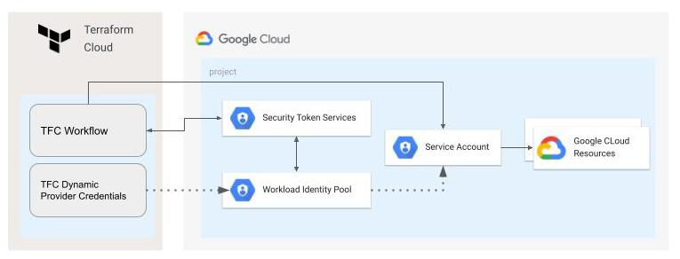

# Configuration of workload identity federation for Terraform Cloud/Enterprise workflows

The most common way to use Terraform Cloud for GCP deployments is to store a GCP Service Account Key as a part of TFC Workflow configuration, as we all know there are security risks due to the fact that keys are long term credentials that could be compromised.

Workload identity federation enables applications running outside of Google Cloud to replace long-lived service account keys with short-lived access tokens. This is achieved by configuring Google Cloud to trust an external identity provider, so applications can use the credentials issued by the external identity provider to impersonate a service account.

This blueprint shows how to set up [Workload Identity Federation](https://cloud.google.com/iam/docs/workload-identity-federation) between [Terraform Cloud/Enterprise](https://developer.hashicorp.com/terraform/enterprise) instance and Google Cloud. This will be possible by configuring workload identity federation and [Terraform Cloud Dynamic Provider Credentials](https://www.hashicorp.com/blog/terraform-cloud-adds-dynamic-provider-credentials-vault-official-cloud-providers).

The following diagram illustrates how the VM will get a short-lived access token and use it to access a resource:

 

## Running the blueprint

### Create Terraform Cloud Workflow
If you don't have an existing Terraform Cloud organization you can sign up for a [free trial](https://app.terraform.io/public/signup/account) account. 

Create a new Workspace for a `CLI-driven workflow` (Identity Federation will work for any workflow type, but for simplicity of the blueprint we use CLI driven workflow). 

Note workspace name and id (id starts with `ws-`), we will use them on a later stage.

Go to the organization settings and note the org name and id (id starts with `org-`).

### Deploy GCP Workload Identity Pool Provider for Terraform Cloud integration

> **_NOTE:_**  This is a preparation part and should be executed on behalf of a user with enough permissions. 

Required permissions when new project is created:
 - Project Creator on the parent folder/org.
 
 Required permissions when an existing project is used:
 - Workload Identity Admin on the project level
 - Project IAM Admin on the project level

Fill out required variables, use TFC Org and Workspace IDs from the previous steps (IDs are not the names).
```bash
cd gcp-workload-identity-provider

mv terraform.auto.tfvars.template terraform.auto.tfvars

vi terraform.auto.tfvars
```

Authenticate using application default credentials, execute terraform code and deploy resources
```
gcloud auth application-default login

terraform init

terraform apply
```

You will receive a set of outputs (your values may be different), note them because we will need them in the next steps.

```
project_id = "tfc-dynamic-creds-gcp"
tfc_workspace_wariables = {
  "TFC_GCP_PROJECT_NUMBER" = "200635100209"
  "TFC_GCP_PROVIDER_AUTH" = "true"
  "TFC_GCP_RUN_SERVICE_ACCOUNT_EMAIL" = "sa-tfc@tfc-dynamic-creds-gcp.iam.gserviceaccount.com"
  "TFC_GCP_WORKLOAD_POOL_ID" = "tfc-pool"
  "TFC_GCP_WORKLOAD_PROVIDER_ID" = "tfc-provider"
}
```

### Configure Dynamic Provider Credentials for your TFC Workflow

To configure [GCP Dynamic Provider Credentials](https://developer.hashicorp.com/terraform/cloud-docs/workspaces/dynamic-provider-credentials/gcp-configuration) for a TFC workflow, you need to set a set of environment variables:
- `TFC_GCP_PROVIDER_AUTH`
- `TFC_GCP_PROJECT_NUMBER`
- `TFC_GCP_RUN_SERVICE_ACCOUNT_EMAIL`
- `TFC_GCP_WORKLOAD_POOL_ID`
- `TFC_GCP_WORKLOAD_PROVIDER_ID`

Go to the Workflow -> Variables page and click the + Add variable button. For variable type select ` Environment variable`. The variable names listed above are the names of the variables that you need to set. The values provided in the terraform output in the previous step are the values that you need to provide for each variable.

At that point we set up GCP Identity Federation to trust TFC generated OIDC tokens, workflow should be able to use Dynamic Provider Credentials to impersonate a GCP Service Account. 

## Testing the blueprint

To test the setup, we will deploy a GCS bucket from the TFC Workflow created in the previous step.

This will allow us to verify that the workflow can successfully interact with GCP services using the TFC Dynamic Provider Credentials.

### Configure backend and variables

First, we need to configure the TFC Remote backend for our testing Terraform code. Use the TFC Organization name and workspace name (names are not the same as ids).

```
cd ../tfc-workflow-using-wif

mv backend.tf.template backend.tf


vi backend.tf

```

Fill out `project_id` variable based on the output from the preparation steps:

```
mv terraform.auto.tfvars.template terraform.auto.tfvars

vi terraform.auto.tfvars

```

### Authenticate terraform for triggering CLI-driven workflow

Follow this [documentation](https://learn.hashicorp.com/tutorials/terraform/cloud-login) to login to terraform cloud from the CLI.

### Trigger the workflow

```
terraform init

terraform apply
```

As a result we have a successfully deployed GCS bucket from Terraform Cloud workflow using Workload Identity Federation.

Once done testing, you can clean up resources by running `terraform destroy` first in the `tfc-workflow-using-wif` and then `gcp-workload-identity-provider` folders. 

