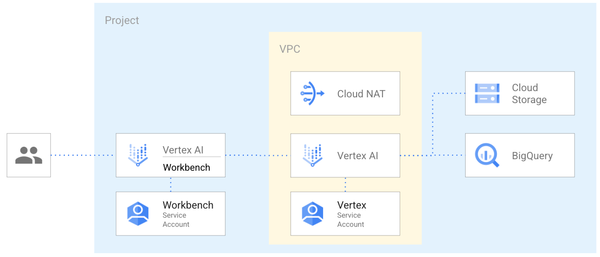

# BigQuery ML and Vertex AI Pipeline

This blueprint provides the necessary infrastructure to create a complete development environment for building and deploying machine learning models using BigQuery ML and Vertex AI. With this blueprint, you can deploy your models to a Vertex AI endpoint or use them within BigQuery ML.

This is the high-level diagram:



It also includes the IAM wiring needed to make such scenarios work. Regional resources are used in this example, but the same logic applies to 'dual regional', 'multi regional', or 'global' resources.

The example is designed to match real-world use cases with a minimum amount of resources and be used as a starting point for your scenario.

## Managed resources and services

This sample creates several distinct groups of resources:

- Networking
  - VPC network
  - Subnet
  - Firewall rules for SSH access via IAP and open communication within the VPC
  - Cloud Nat
- IAM
  - Vertex AI workbench service account
  - Vertex AI pipeline service account
- Storage
  - GCS bucket
  - Bigquery dataset

## Customization

### Virtual Private Cloud (VPC) design

As is often the case in real-world configurations, this blueprint accepts an existing Shared-VPC via the `vpc_config` variable as input.

### Customer Managed Encryption Keys

As is often the case in real-world configurations, this blueprint accepts as input existing Cloud KMS keys to encrypt resources via the `service_encryption_keys` variable.

## Demo

In the [`demo`](./demo/) folder, you can find an example of creating a Vertex AI pipeline from a publicly available dataset and deploying the model to be used from a Vertex AI managed endpoint or from within Bigquery.

To run the demo:

- Connect to the Vertex AI workbench instance
- Clone this repository
- Run the and run [`demo/bmql_pipeline.ipynb`](demo/bmql_pipeline.ipynb) Jupyter Notebook.

## Files

| name | description | modules | resources |
|---|---|---|---|
| [datastorage.tf](./datastorage.tf) | Datastorage resources. | <code>bigquery-dataset</code> · <code>gcs</code> |  |
| [main.tf](./main.tf) | Core resources. | <code>project</code> |  |
| [outputs.tf](./outputs.tf) | Output variables. |  |  |
| [variables.tf](./variables.tf) | Terraform variables. |  |  |
| [versions.tf](./versions.tf) | Version pins. |  |  |
| [vertex.tf](./vertex.tf) | Vertex resources. | <code>iam-service-account</code> | <code>google_notebooks_instance</code> · <code>google_vertex_ai_metadata_store</code> |
| [vpc.tf](./vpc.tf) | VPC resources. | <code>net-cloudnat</code> · <code>net-vpc</code> · <code>net-vpc-firewall</code> | <code>google_project_iam_member</code> |
<!-- BEGIN TFDOC -->
## Variables

| name | description | type | required | default |
|---|---|:---:|:---:|:---:|
| [prefix](variables.tf#L30) | Prefix used for resource names. | <code>string</code> | ✓ |  |
| [project_id](variables.tf#L48) | Project id references existing project if `project_create` is null. | <code>string</code> | ✓ |  |
| [deletion_protection](variables.tf#L17) | Prevent Terraform from destroying data storage resources (storage buckets, GKE clusters, CloudSQL instances) in this blueprint. When this field is set in Terraform state, a terraform destroy or terraform apply that would delete data storage resources will fail. | <code>bool</code> |  | <code>false</code> |
| [location](variables.tf#L24) | The location where resources will be deployed. | <code>string</code> |  | <code>&#34;US&#34;</code> |
| [project_create](variables.tf#L39) | Provide values if project creation is needed, use existing project if null. Parent format:  folders/folder_id or organizations/org_id. | <code title="object&#40;&#123;&#10;  billing_account_id &#61; string&#10;  parent             &#61; string&#10;&#125;&#41;">object&#40;&#123;&#8230;&#125;&#41;</code> |  | <code>null</code> |
| [region](variables.tf#L53) | The region where resources will be deployed. | <code>string</code> |  | <code>&#34;us-central1&#34;</code> |
| [service_encryption_keys](variables.tf#L59) | Cloud KMS to use to encrypt different services. The key location should match the service region. | <code title="object&#40;&#123;&#10;  aiplatform &#61; optional&#40;string, null&#41;&#10;  bq         &#61; optional&#40;string, null&#41;&#10;  compute    &#61; optional&#40;string, null&#41;&#10;  storage    &#61; optional&#40;string, null&#41;&#10;&#125;&#41;">object&#40;&#123;&#8230;&#125;&#41;</code> |  | <code>null</code> |
| [vpc_config](variables.tf#L70) | Shared VPC network configurations to use. If null networks will be created in projects with pre-configured values. | <code title="object&#40;&#123;&#10;  host_project      &#61; string&#10;  network_self_link &#61; string&#10;  subnet_self_link  &#61; string&#10;&#125;&#41;">object&#40;&#123;&#8230;&#125;&#41;</code> |  | <code>null</code> |

## Outputs

| name | description | sensitive |
|---|---|:---:|
| [bucket](outputs.tf#L17) | GCS Bucket URL. |  |
| [dataset](outputs.tf#L22) | GCS Bucket URL. |  |
| [notebook](outputs.tf#L27) | Vertex AI notebook details. |  |
| [project](outputs.tf#L35) | Project id. |  |
| [service-account-vertex](outputs.tf#L40) | Service account to be used for Vertex AI pipelines. |  |
| [vertex-ai-metadata-store](outputs.tf#L45) | Vertex AI Metadata Store ID. |  |
| [vpc](outputs.tf#L50) | VPC Network. |  |
<!-- END TFDOC -->
## Test

```hcl
module "test" {
  source = "./fabric/blueprints/data-solutions/bq-ml/"
  project_create = {
    billing_account_id = "123456-123456-123456"
    parent             = "folders/12345678"
  }
  project_id = "project-1"
  prefix     = "prefix"
}

# tftest modules=9 resources=50
```
