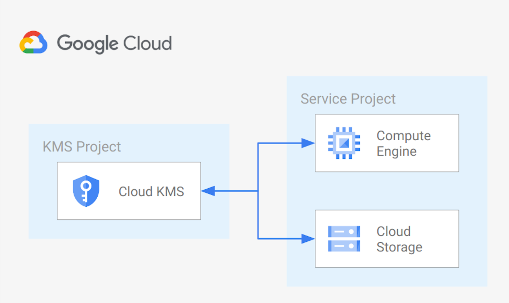

# GCE and GCS CMEK via centralized Cloud KMS

This example creates a sample centralized [Cloud KMS](https://cloud.google.com/kms?hl=it) configuration, and uses it to implement CMEK for [Cloud Storage](https://cloud.google.com/storage/docs/encryption/using-customer-managed-keys) and [Compute Engine](https://cloud.google.com/compute/docs/disks/customer-managed-encryption) in a service project.

The example is designed to match real-world use cases with a minimum amount of resources, and be used as a starting point for scenarios where application projects implement CMEK using keys managed by a central team. It also includes the IAM wiring needed to make such scenarios work. Regional resources are used in this example, but the same logic will apply for 'dual regional', 'multi regional' or 'global' resources.

This is the high level diagram:



## Managed resources and services

This sample creates several distinct groups of resources:

- projects
  - Cloud KMS project
  - Service Project configured for GCE instances and GCS buckets
- networking
  - VPC network
  - One subnet
  - Firewall rules for [SSH access via IAP](https://cloud.google.com/iap/docs/using-tcp-forwarding) and open communication within the VPC
- IAM
  - One service account for the GGE instance
- KMS
  - One key ring
  - One crypto key (Protection level: software) for Cloud Engine
  - One crypto key (Protection level: software) for Cloud Storage
- GCE
  - One instance encrypted with a CMEK Cryptokey hosted in Cloud KMS
- GCS
  - One bucket encrypted with a CMEK Cryptokey hosted in Cloud KMS
<!-- BEGIN TFDOC -->
## Variables

| name | description | type | required | default |
|---|---|:---:|:---:|:---:|
| [prefix](variables.tf#L28) | Optional prefix used to generate resources names. | <code>string</code> | ✓ |  |
| [project_config](variables.tf#L34) | Provide 'billing_account_id' and 'parent' values if project creation is needed, uses existing 'projects_id' if null. Parent is in 'folders/nnn' or 'organizations/nnn' format. | <code title="object&#40;&#123;&#10;  billing_account_id &#61; optional&#40;string, null&#41;&#10;  parent             &#61; optional&#40;string, null&#41;&#10;  project_ids &#61; optional&#40;object&#40;&#123;&#10;    encryption &#61; string&#10;    service    &#61; string&#10;    &#125;&#41;, &#123;&#10;    encryption &#61; &#34;encryption&#34;,&#10;    service    &#61; &#34;service&#34;&#10;    &#125;&#10;  &#41;&#10;&#125;&#41;">object&#40;&#123;&#8230;&#125;&#41;</code> | ✓ |  |
| [deletion_protection](variables.tf#L15) | Prevent Terraform from destroying data storage resources (storage buckets, GKE clusters, CloudSQL instances) in this blueprint. When this field is set in Terraform state, a terraform destroy or terraform apply that would delete data storage resources will fail. | <code>bool</code> |  | <code>false</code> |
| [location](variables.tf#L22) | The location where resources will be deployed. | <code>string</code> |  | <code>&#34;europe&#34;</code> |
| [region](variables.tf#L51) | The region where resources will be deployed. | <code>string</code> |  | <code>&#34;europe-west1&#34;</code> |
| [vpc_ip_cidr_range](variables.tf#L57) | Ip range used in the subnet deployef in the Service Project. | <code>string</code> |  | <code>&#34;10.0.0.0&#47;20&#34;</code> |
| [vpc_name](variables.tf#L63) | Name of the VPC created in the Service Project. | <code>string</code> |  | <code>&#34;local&#34;</code> |
| [vpc_subnet_name](variables.tf#L69) | Name of the subnet created in the Service Project. | <code>string</code> |  | <code>&#34;subnet&#34;</code> |

## Outputs

| name | description | sensitive |
|---|---|:---:|
| [bucket](outputs.tf#L15) | GCS Bucket URL. |  |
| [bucket_keys](outputs.tf#L20) | GCS Bucket Cloud KMS crypto keys. |  |
| [projects](outputs.tf#L25) | Project ids. |  |
| [vm](outputs.tf#L33) | GCE VM. |  |
| [vm_keys](outputs.tf#L41) | GCE VM Cloud KMS crypto keys. |  |
<!-- END TFDOC -->
## Test

```hcl
module "test" {
  source = "./fabric/blueprints/data-solutions/cmek-via-centralized-kms/"
  project_config = {
    billing_account_id = "123456-123456-123456"
    parent             = "folders/12345678"
  }
  prefix = "prefix"
}
# tftest modules=8 resources=32
```
