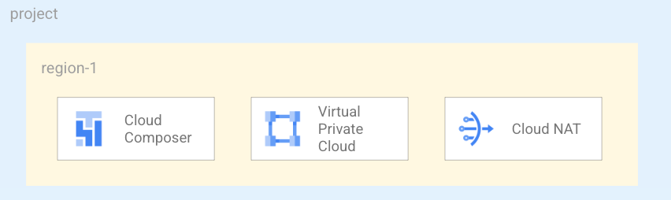

# Cloud Composer version 2 private instance, supporting Shared VPC and external CMEK key

This blueprint creates a Private instance of [Cloud Composer version 2](https://cloud.google.com/composer/docs/composer-2/composer-versioning-overview) on a VPC with a dedicated service account. Cloud Composer 2 is the new major verion for Cloud Composer that supports:
 - environment autoscaling
 - workloads configuration: CPU, memory, and storage parameters for Airflow workers, schedulers, web server, and database.

Please consult the [documentation page](https://cloud.google.com/composer/docs/composer-2/composer-versioning-overview) for an exaustive comparison between Composer Version 1 and Version 2.

The solution will use:
 - Cloud Composer 
 - VPC with Private Service Access to deploy resources, if no Shared VPC configuration provided.
 - Google Cloud NAT to access internet resources, if no Shared VPC configuration provided.

The solution supports as inputs:
 - Shared VPC 
 - Cloud KMS CMEK keys

This is the high level diagram:



# Requirements
This blueprint will deploy all its resources into the project defined by the project_id variable. Please note that we assume this project already exists. However, if you provide the appropriate values to the `project_create` variable, the project will be created as part of the deployment.

If `project_create` is left to null, the identity performing the deployment needs the owner role on the project defined by the `project_id` variable. Otherwise, the identity performing the deployment needs `resourcemanager.projectCreator` on the resource hierarchy node specified by `project_create.parent` and `billing.user` on the billing account specified by `project_create.billing_account_id`.

# Deployment
Run Terraform init:

```bash
$ terraform init
```

Configure the Terraform variable in your terraform.tfvars file. You need to spefify at least the following variables:

```tfvars
project_id          = "lcaggioni-sandbox"
prefix              = "lc"
```

You can run now:

```bash
$ terraform apply
```

You can now connect to your instance.

# Customizations

## Shared VPC
As is often the case in real-world configurations, this blueprint accepts as input an existing [`Shared-VPC`](https://cloud.google.com/vpc/docs/shared-vpc) via the `network_config` variable. 

Example:
```tfvars
network_config = {
  host_project      = "PROJECT"
  network_self_link = "projects/PROJECT/global/networks/VPC_NAME"
  subnet_self_link  = "projects/PROJECT/regions/REGION/subnetworks/VPC_NAME"
  composer_secondary_ranges = {
    pods     = "pods"
    services = "services"
  }
}
```

Make sure that:
- The GKE API (`container.googleapis.com`) is enabled in the VPC host project.
- The subnet has secondary ranges configured with 2 ranges:
    - pods: `/22` example: `10.10.8.0/22`
    - services = `/24` example: 10.10.12.0/24`
- Firewall rules are set, as described in the [documentation](https://cloud.google.com/composer/docs/how-to/managing/configuring-private-ip#step_3_configure_firewall_rules)

In order to run the example and deploy Cloud Composer on a shared VPC the identity running Terraform must have the following IAM role on the Shared VPC Host project.
 - Compute Network Admin (roles/compute.networkAdmin)
 - Compute Shared VPC Admin (roles/compute.xpnAdmin)

## Encryption
As is often the case in real-world configurations, this blueprint accepts as input an existing [`Cloud KMS keys`](https://cloud.google.com/kms/docs/cmek) via the `service_encryption_keys` variable. 

Example:
```tfvars
service_encryption_keys = {
  `europe/west1` = `projects/PROJECT/locations/REGION/keyRings/KR_NAME/cryptoKeys/KEY_NAME`
}
```
<!-- BEGIN TFDOC -->

## Variables

| name | description | type | required | default |
|---|---|:---:|:---:|:---:|
| [prefix](variables.tf#L49) | Unique prefix used for resource names. Not used for project if 'project_create' is null. | <code>string</code> | ✓ |  |
| [project_id](variables.tf#L63) | Project id, references existing project if `project_create` is null. | <code>string</code> | ✓ |  |
| [composer_config](variables.tf#L17) | Composer environemnt configuration. | <code title="object&#40;&#123;&#10;  environment_size &#61; string&#10;  image_version    &#61; string&#10;&#125;&#41;">object&#40;&#123;&#8230;&#125;&#41;</code> |  | <code title="&#123;&#10;  environment_size &#61; &#34;ENVIRONMENT_SIZE_SMALL&#34;&#10;  image_version    &#61; &#34;composer-2-airflow-2&#34;&#10;&#125;">&#123;&#8230;&#125;</code> |
| [iam_groups_map](variables.tf#L29) | Map of Role => groups to be added on the project. Example: { \"roles/composer.admin\" = [\"group:gcp-data-engineers@example.com\"]}. | <code>map&#40;list&#40;string&#41;&#41;</code> |  | <code>null</code> |
| [network_config](variables.tf#L35) | Shared VPC network configurations to use. If null networks will be created in projects with preconfigured values. | <code title="object&#40;&#123;&#10;  host_project      &#61; string&#10;  network_self_link &#61; string&#10;  subnet_self_link  &#61; string&#10;  composer_secondary_ranges &#61; object&#40;&#123;&#10;    pods     &#61; string&#10;    services &#61; string&#10;  &#125;&#41;&#10;&#125;&#41;">object&#40;&#123;&#8230;&#125;&#41;</code> |  | <code>null</code> |
| [project_create](variables.tf#L54) | Provide values if project creation is needed, uses existing project if null. Parent is in 'folders/nnn' or 'organizations/nnn' format. | <code title="object&#40;&#123;&#10;  billing_account_id &#61; string&#10;  parent             &#61; string&#10;&#125;&#41;">object&#40;&#123;&#8230;&#125;&#41;</code> |  | <code>null</code> |
| [region](variables.tf#L68) | Region where instances will be deployed. | <code>string</code> |  | <code>&#34;europe-west1&#34;</code> |
| [service_encryption_keys](variables.tf#L74) | Cloud KMS keys to use to encrypt resources. Provide a key for each reagion in use. | <code>map&#40;string&#41;</code> |  | <code>null</code> |

## Outputs

| name | description | sensitive |
|---|---|:---:|
| [composer_airflow_uri](outputs.tf#L22) | The URI of the Apache Airflow Web UI hosted within the Cloud Composer environment.. |  |
| [composer_dag_gcs](outputs.tf#L17) | The Cloud Storage prefix of the DAGs for the Cloud Composer environment. |  |

<!-- END TFDOC -->
