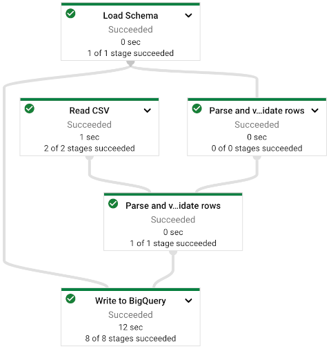

## Pipeline summary
This demo serves as a simple example of building and launching a Flex Template Dataflow pipeline. The code mainly focuses on reading a CSV file as input along with a JSON schema file as side input. The pipeline Parses both inputs and writes the data to the relevant BigQuery table while applying the schema passed from input.



## Example build run

Below is an example for triggering the Dataflow flex template build pipeline defined in `cloudbuild.yaml`. The Terraform output provides an example as well filled with the parameters values based on the generated resources in the data platform.

```
GCP_PROJECT="[ORCHESTRATION-PROJECT]"
TEMPLATE_IMAGE="[REGION].pkg.dev/[ORCHESTRATION-PROJECT]/[REPOSITORY]/csv2bq:latest"
TEMPLATE_PATH="gs://[DATAFLOW-TEMPLATE-BUCKEt]/csv2bq.json"
STAGIN_PATH="gs://[ORCHESTRATION-STAGING-BUCKET]/build"
LOG_PATH="gs://[ORCHESTRATION-LOGS-BUCKET]/logs"
REGION="[REGION]"
BUILD_SERVICE_ACCOUNT=orc-sa-df-build@[SERVICE_PROJECT_ID].iam.gserviceaccount.com

gcloud builds submit \
           --config=cloudbuild.yaml \
           --project=$GCP_PROJECT \
           --region=$REGION \
           --gcs-log-dir=$LOG_PATH \
           --gcs-source-staging-dir=$STAGIN_PATH \
           --substitutions=_TEMPLATE_IMAGE=$TEMPLATE_IMAGE,_TEMPLATE_PATH=$TEMPLATE_PATH,_DOCKER_DIR="." \
           --impersonate-service-account=$BUILD_SERVICE_ACCOUNT
```

**Note:** For the scope of the demo, the launch of this build is manual, but in production, this build would be launched via a configured cloud build trigger when new changes are merged into the code branch of the Dataflow template.

## Example Dataflow pipeline launch in bash (from flex template)

Below is an example of launching a dataflow pipeline manually, based on the built template. When launched manually, the Dataflow pipeline would be launched via the orchestration service account, which is what the Airflow DAG is also using in the scope of this demo.

**Note:** In the data platform demo, the launch of this Dataflow pipeline is handled by the airflow operator (DataflowStartFlexTemplateOperator).

```
#!/bin/bash

PROJECT_ID=[LOAD-PROJECT]
REGION=[REGION]
ORCH_SERVICE_ACCOUNT=orchestrator@[SERVICE_PROJECT_ID].iam.gserviceaccount.com
SUBNET=[SUBNET-NAME]

PIPELINE_STAGIN_PATH="gs://[LOAD-STAGING-BUCKET]/build"
CSV_FILE=gs://[DROP-ZONE-BUCKET]/customers.csv
JSON_SCHEMA=gs://[ORCHESTRATION-BUCKET]/customers_schema.json
OUTPUT_TABLE=[DESTINATION-PROJ].[DESTINATION-DATASET].customers
TEMPLATE_PATH=gs://[ORCHESTRATION-DF-GCS]/csv2bq.json


gcloud dataflow flex-template run "csv2bq-`date +%Y%m%d-%H%M%S`" \
    --template-file-gcs-location $TEMPLATE_PATH \
    --parameters temp_location="$PIPELINE_STAGIN_PATH/tmp" \
    --parameters staging_location="$PIPELINE_STAGIN_PATH/stage" \
    --parameters csv_file=$CSV_FILE \
    --parameters json_schema=$JSON_SCHEMA\
    --parameters output_table=$OUTPUT_TABLE \
    --region $REGION \
    --project $PROJECT_ID \
    --subnetwork="regions/$REGION/subnetworks/$SUBNET" \
    --service-account-email=$ORCH_SERVICE_ACCOUNT
```
