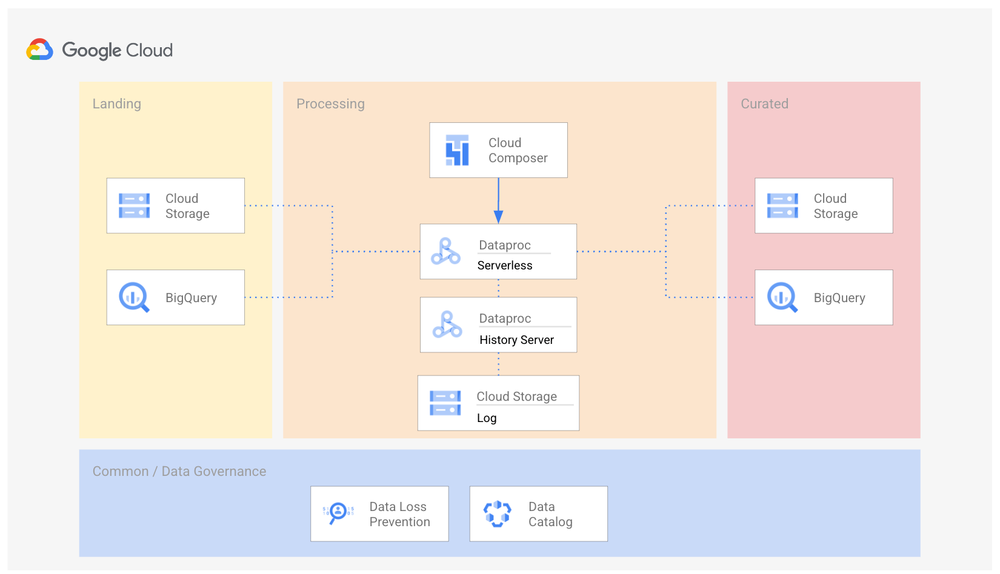
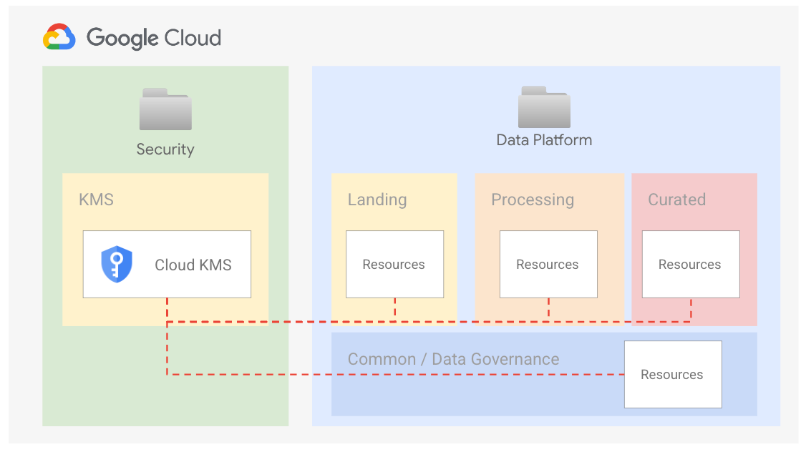
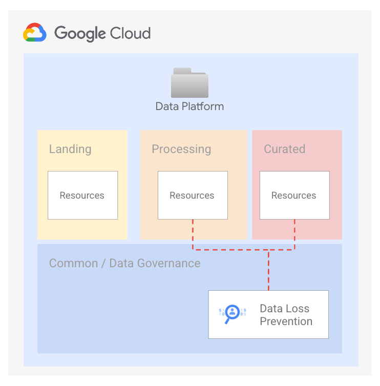

# Minimal Data Platform

This module implements a minimal opinionated Data Platform Architecture based on Dataproc Serverless resources. It creates and sets up projects and related resources that compose an end-to-end data environment.

This minimal Data Platform Architecture keep to a minimal set of projects the solution. The approach make the architecture easy to read and operate but limit the ability to scale to handle multiple worklaods. To better handle more complex use cases where workloads need processing role segmentation betwneed transformations or deeper cost attribution are needed, it is suggested to refer to the [Data Platform](../data-platform-foundations/) blueprint.

The code is intentionally simple, as it's intended to provide a generic initial setup and then allow easy customizations to complete the implementation of the intended design.

The following diagram is a high-level reference of the resources created and managed here:



A set of demo [Airflow pipelines](./demo/) are also part of this blueprint: they can be run on top of the foundational infrastructure to verify and test the setup.

<!-- BEGIN TOC -->
- [Design overview and choices](#design-overview-and-choices)
- [Project structure](#project-structure)
- [Roles](#roles)
- [Service accounts](#service-accounts)
- [User groups](#user-groups)
  - [Virtual Private Cloud (VPC) design](#virtual-private-cloud-vpc-design)
  - [IP ranges and subnetting](#ip-ranges-and-subnetting)
  - [Resource naming conventions](#resource-naming-conventions)
  - [Encryption](#encryption)
- [Data Anonymization](#data-anonymization)
- [Data Catalog](#data-catalog)
- [How to run this script](#how-to-run-this-script)
- [Variable configuration](#variable-configuration)
- [How to use this blueprint from Terraform](#how-to-use-this-blueprint-from-terraform)
- [Customizations](#customizations)
  - [Assign roles at BQ Dataset level](#assign-roles-at-bq-dataset-level)
  - [Project Configuration](#project-configuration)
  - [Shared VPC](#shared-vpc)
  - [Customer Managed Encryption key](#customer-managed-encryption-key)
- [Demo pipeline](#demo-pipeline)
- [Files](#files)
- [Variables](#variables)
- [Outputs](#outputs)
<!-- END TOC -->

## Design overview and choices

Despite its simplicity, this stage implements the basics of a design that we've seen working well for various customers.

The approach adapts to different high-level requirements:

- boundaries for each step
- clearly defined actors
- least privilege principle
- rely on service account impersonation

The code in this blueprint doesn't address Organization-level configurations (Organization policy, VPC-SC, centralized logs). We expect those elements to be managed by automation stages external to this script like those in [FAST](../../../fast) and this blueprint deployed on top of them as one of the [stages](../../../fast/stages/3-data-platform/dev/README.md).

## Project structure

The Data Platform is designed to rely on several projects, one project per data stage. The stages identified are:

- landing
- processing
- curated
- common

This separation into projects allows adhering to the least-privilege principle by using project-level roles.

The script will create the following projects:

- **Landing** Data, stored in relevant formats. Structured data can be stored in BigQuery or in GCS using an appropriate file format such as AVRO or Parquet. Unstructured data stored on Cloud Storage.
- **Processing** Used to host all resources needed to process and orchestrate data movement. Cloud Composer orchestrates all tasks that move data across layers. Cloud Dataproc Serverless process and move data between layers. Anonymization or tokenization of Personally Identifiable Information (PII) can be implemented here using Cloud DLP or a custom solution, depending on your requirements.
- **Curated** Cleansed, aggregated and curated data.
- **Common** Common services such as [Cloud DLP](https://cloud.google.com/dlp) or [Data Catalog](https://cloud.google.com/data-catalog/docs/concepts/overview).

## Roles

We assign roles on resources at the project level, granting the appropriate roles via groups (humans) and service accounts (services and applications) according to best practices.

## Service accounts

Service account creation follows the least privilege principle, performing a single task which requires access to a defined set of resources. The table below shows a high level overview of roles for each service account on each data layer, using READ or WRITE access patterns for simplicity.

A full reference of IAM roles managed by the Data Platform is [available here](IAM.md).

For detailed roles please refer to the code.

Using of service account keys within a data pipeline exposes to several security risks deriving from a credentials leak. This blueprint shows how to leverage impersonation to avoid the need of creating keys.

## User groups

User groups provide a stable frame of reference that allows decoupling the final set of permissions from the stage where entities and resources are created, and their IAM bindings defined.

We use three groups to control access to resources:

- *Data Engineers* They handle and run the Data Hub, with read access to all resources in order to troubleshoot possible issues with pipelines. This team can also impersonate any service account.
- *Data Analysts*. They perform analysis on datasets, with read access to the Data Warehouse Confidential project, and BigQuery READ/WRITE access to the playground project.
- *Data Security*:. They handle security configurations related to the Data Hub. This team has admin access to the common project to configure Cloud DLP templates or Data Catalog policy tags.

### Virtual Private Cloud (VPC) design

As is often the case in real-world configurations, this blueprint accepts as input an existing [Shared-VPC](https://cloud.google.com/vpc/docs/shared-vpc) via the `network_config` variable. Make sure that the GKE API (`container.googleapis.com`) is enabled in the VPC host project. Remember also to configure firewall rules needed for the different products you are going to use: Composer, Dataflow or Dataproc.

If the `network_config` variable is not provided, one VPC will be created in each project that supports network resources (load, transformation and orchestration).

### IP ranges and subnetting

To deploy this blueprint with self-managed VPCs you need the following ranges:

- one /24 for the processing project VPC subnet used for Cloud Dataproc workers
- one /24 range for the orchestration VPC subnet used for Composer workers
- one /22 and one /24 ranges for the secondary ranges associated with the orchestration VPC subnet

If you are using Shared VPC, you need one subnet with one /22 and one /24 secondary range defined for Composer pods and services.

In both VPC scenarios, you also need these ranges for Composer:

- one /24 for Cloud SQL
- one /28 for the GKE control plane

### Resource naming conventions

Resources follow the naming convention described below.

- `prefix-layer` for projects
- `prefix-layer-product` for resources
- `prefix-layer[2]-gcp-product[2]-counter` for services and service accounts

### Encryption

We suggest a centralized approach to key management, where Organization Security is the only team that can access encryption material, and keyrings and keys are managed in a project external to the Data Platform.



To configure the use of Cloud KMS on resources, you have to specify the key id on the `service_encryption_keys` variable. Key locations should match resource locations. Example:

```tfvars
service_encryption_keys = {
    bq       = "KEY_URL"
    composer = "KEY_URL"
    compute  = "KEY_URL"
    storage  = "KEY_URL"
}
```

This step is optional and depends on customer policies and security best practices.

## Data Anonymization

We suggest using Cloud Data Loss Prevention to identify/mask/tokenize your confidential data.

While implementing a Data Loss Prevention strategy is out of scope for this blueprint, we enable the service in two different projects so that [Cloud Data Loss Prevention templates](https://cloud.google.com/dlp/docs/concepts-templates) can be configured in one of two ways:

- during the ingestion phase, from Cloud Dataproc
- within the curated layer, in [BigQuery](https://cloud.google.com/bigquery/docs/scan-with-dlp) or [Cloud Dataproc](https://cloud.google.com/dataproct)

Cloud Data Loss Prevention resources and templates should be stored in the Common project:



You can find more details and best practices on using DLP to De-identification and re-identification of PII in large-scale datasets in the [GCP documentation](https://cloud.google.com/architecture/de-identification-re-identification-pii-using-cloud-dlp).

## Data Catalog

[Data Catalog](https://cloud.google.com/data-catalog) helps you to document your data entry at scale. Data Catalog relies on [tags](https://cloud.google.com/data-catalog/docs/tags-and-tag-templates#tags) and [tag template](https://cloud.google.com/data-catalog/docs/tags-and-tag-templates#tag-templates) to manage metadata for all data entries in a unified and centralized service. To implement [column-level security](https://cloud.google.com/bigquery/docs/column-level-security-intro) on BigQuery, we suggest to use `Tags` and `Tag templates`.

The default configuration will implement 3 tags:

- `3_Confidential`: policy tag for columns that include very sensitive information, such as credit card numbers.
- `2_Private`: policy tag for columns that include sensitive personal identifiable information (PII) information, such as a person's first name.
- `1_Sensitive`: policy tag for columns that include data that cannot be made public, such as the credit limit.

Anything that is not tagged is available to all users who have access to the data warehouse.

For the purpose of the blueprint no groups has access to tagged data. You can configure your tags and roles associated by configuring the `data_catalog_tags` variable. We suggest using the "[Best practices for using policy tags in BigQuery](https://cloud.google.com/bigquery/docs/best-practices-policy-tags)" article as a guide to designing your tags structure and access pattern.

## How to run this script

To deploy this blueprint on your GCP organization, you will need

- a folder or organization where new projects will be created
- a billing account that will be associated with the new projects

The Data Platform is meant to be executed by a Service Account (or a regular user) having this minimal set of permission:

- **Billing account**
  - `roles/billing.user`
- **Folder level**:
  - `roles/resourcemanager.folderAdmin`
  - `roles/resourcemanager.projectCreator`
- **KMS Keys** (If CMEK encryption in use):
  - `roles/cloudkms.admin` or a custom role with `cloudkms.cryptoKeys.getIamPolicy`, `cloudkms.cryptoKeys.list`, `cloudkms.cryptoKeys.setIamPolicy` permissions
- **Shared VPC host project** (if configured):\
  - `roles/compute.xpnAdmin` on the host project folder or org
  - `roles/resourcemanager.projectIamAdmin` on the host project, either with no conditions or with a condition allowing [delegated role grants](https://medium.com/google-cloud/managing-gcp-service-usage-through-delegated-role-grants-a843610f2226#:~:text=Delegated%20role%20grants%20is%20a,setIamPolicy%20permission%20on%20a%20resource.) for `roles/compute.networkUser`, `roles/composer.sharedVpcAgent`, `roles/container.hostServiceAgentUser`

## Variable configuration

There are three sets of variables you will need to fill in:

```tfvars
project_config = {
    billing_account_id = "123456-123456-123456"
    parent             = "folders/12345678"
}
organization_domain = "domain.com"
prefix              = "myprefix"
```

For more fine details check variables on [`variables.tf`](./variables.tf) and update according to the desired configuration.

*Remember* to create team groups described [below](#groups).

Once the configuration is complete, run the project factory by running

```bash
terraform init
terraform apply
```

## How to use this blueprint from Terraform

While this blueprint can be used as a standalone deployment, it can also be called directly as a Terraform module by providing the variables values as show below:

```hcl
module "data-platform" {
  source              = "./fabric/blueprints/data-solutions/data-platform-minimal/"
  organization_domain = "example.com"
  project_config = {
    billing_account_id = "123456-123456-123456"
    parent             = "folders/12345678"
  }
  prefix = "myprefix"
}

# tftest modules=23 resources=157
```

## Customizations

### Assign roles at BQ Dataset level

To handle multiple groups of `data-analysts` accessing the same Data Warehouse layer projects but only to the dataset belonging to a specific group, you may want to assign roles at BigQuery dataset level instead of at project-level.
To do this, you need to remove IAM binging at project-level for the `data-analysts` group and give roles at BigQuery dataset level using the `iam` variable on `bigquery-dataset` modules.

### Project Configuration

The solution can be deployed by creating projects on a given parent (organization or folder) or on existing projects. Configure variable `project_config` accordingly.

When you deploy the blueprint on existing projects, the blueprint is designed to rely on different projects configuring IAM binding with an additive approach.

Once you have identified the required project granularity for your use case, we suggest adapting the terraform script accordingly and relying on authoritative IAM binding.

### Shared VPC

To configure the use of a shared VPC, configure the `network_config`, example:

```tfvars
network_config = {
  host_project      = "PROJECT_ID"
  network_self_link = "https://www.googleapis.com/compute/v1/projects/PROJECT_ID/global/networks/NAME"
  subnet_self_link = "https://www.googleapis.com/compute/v1/projects/PROJECT_ID/regions/REGION/subnetworks/NAME"
  composer_ip_ranges = {    
    cloudsql   = "192.168.XXX.XXX/24"
    gke_master = "192.168.XXX.XXX/28"
  }
  composer_secondary_ranges = {
    pods     = "pods"
    services = "services"
  }
}
```

### Customer Managed Encryption key

To configure the use of Cloud KMS on resources, configure the `service_encryption_keys` variable. Key locations should match resource locations. Example:

```tfvars
service_encryption_keys = {
    bq       = "KEY_URL"
    composer = "KEY_URL"
    compute  = "KEY_URL"
    storage  = "KEY_URL"
}
```

## Demo pipeline

The application layer is out of scope of this script. As a demo purpuse only, one Cloud Composer DAGs is provided to document how to deploy a Cloud Dataproc Serverless job on the architecture. You can find examples in the `[demo](./demo)` folder.

## Files

| name | description | modules | resources |
|---|---|---|---|
| [01-landing.tf](./01-landing.tf) | Landing project and resources. | <code>gcs</code> · <code>iam-service-account</code> · <code>project</code> |  |
| [02-composer.tf](./02-composer.tf) | Cloud Composer resources. | <code>iam-service-account</code> | <code>google_composer_environment</code> |
| [02-dataproc.tf](./02-dataproc.tf) | Cloud Dataproc resources. | <code>dataproc</code> · <code>gcs</code> · <code>iam-service-account</code> |  |
| [02-processing.tf](./02-processing.tf) | Processing project and VPC. | <code>gcs</code> · <code>net-cloudnat</code> · <code>net-vpc</code> · <code>net-vpc-firewall</code> · <code>project</code> |  |
| [03-curated.tf](./03-curated.tf) | Data curated project and resources. | <code>bigquery-dataset</code> · <code>gcs</code> · <code>project</code> |  |
| [04-common.tf](./04-common.tf) | Common project and resources. | <code>data-catalog-policy-tag</code> · <code>project</code> |  |
| [main.tf](./main.tf) | Core locals. |  | <code>google_project_iam_member</code> |
| [outputs.tf](./outputs.tf) | Output variables. |  |  |
| [variables.tf](./variables.tf) | Terraform Variables. |  |  |
<!-- BEGIN TFDOC -->
## Variables

| name | description | type | required | default |
|---|---|:---:|:---:|:---:|
| [organization_domain](variables.tf#L124) | Organization domain. | <code>string</code> | ✓ |  |
| [prefix](variables.tf#L129) | Prefix used for resource names. | <code>string</code> | ✓ |  |
| [project_config](variables.tf#L138) | Provide 'billing_account_id' value if project creation is needed, uses existing 'project_ids' if null. Parent is in 'folders/nnn' or 'organizations/nnn' format. | <code title="object&#40;&#123;&#10;  billing_account_id &#61; optional&#40;string, null&#41;&#10;  parent             &#61; string&#10;  project_ids &#61; optional&#40;object&#40;&#123;&#10;    landing    &#61; string&#10;    processing &#61; string&#10;    curated    &#61; string&#10;    common     &#61; string&#10;    &#125;&#41;, &#123;&#10;    landing    &#61; &#34;lnd&#34;&#10;    processing &#61; &#34;prc&#34;&#10;    curated    &#61; &#34;cur&#34;&#10;    common     &#61; &#34;cmn&#34;&#10;    &#125;&#10;  &#41;&#10;&#125;&#41;">object&#40;&#123;&#8230;&#125;&#41;</code> | ✓ |  |
| [composer_config](variables.tf#L17) | Cloud Composer config. | <code title="object&#40;&#123;&#10;  environment_size &#61; optional&#40;string, &#34;ENVIRONMENT_SIZE_SMALL&#34;&#41;&#10;  software_config &#61; optional&#40;object&#40;&#123;&#10;    airflow_config_overrides       &#61; optional&#40;map&#40;string&#41;, &#123;&#125;&#41;&#10;    pypi_packages                  &#61; optional&#40;map&#40;string&#41;, &#123;&#125;&#41;&#10;    env_variables                  &#61; optional&#40;map&#40;string&#41;, &#123;&#125;&#41;&#10;    image_version                  &#61; optional&#40;string, &#34;composer-2-airflow-2&#34;&#41;&#10;    cloud_data_lineage_integration &#61; optional&#40;bool, true&#41;&#10;  &#125;&#41;, &#123;&#125;&#41;&#10;  web_server_access_control &#61; optional&#40;map&#40;string&#41;, &#123;&#125;&#41;&#10;  workloads_config &#61; optional&#40;object&#40;&#123;&#10;    scheduler &#61; optional&#40;object&#40;&#123;&#10;      cpu        &#61; optional&#40;number, 0.5&#41;&#10;      memory_gb  &#61; optional&#40;number, 1.875&#41;&#10;      storage_gb &#61; optional&#40;number, 1&#41;&#10;      count      &#61; optional&#40;number, 1&#41;&#10;      &#125;&#10;    &#41;, &#123;&#125;&#41;&#10;    web_server &#61; optional&#40;object&#40;&#123;&#10;      cpu        &#61; optional&#40;number, 0.5&#41;&#10;      memory_gb  &#61; optional&#40;number, 1.875&#41;&#10;      storage_gb &#61; optional&#40;number, 1&#41;&#10;    &#125;&#41;, &#123;&#125;&#41;&#10;    worker &#61; optional&#40;object&#40;&#123;&#10;      cpu        &#61; optional&#40;number, 0.5&#41;&#10;      memory_gb  &#61; optional&#40;number, 1.875&#41;&#10;      storage_gb &#61; optional&#40;number, 1&#41;&#10;      min_count  &#61; optional&#40;number, 1&#41;&#10;      max_count  &#61; optional&#40;number, 3&#41;&#10;      &#125;&#10;    &#41;, &#123;&#125;&#41;&#10;  &#125;&#41;, &#123;&#125;&#41;&#10;&#125;&#41;">object&#40;&#123;&#8230;&#125;&#41;</code> |  | <code>&#123;&#125;</code> |
| [data_catalog_tags](variables.tf#L56) | List of Data Catalog Policy tags to be created with optional IAM binging configuration in {tag => {ROLE => [MEMBERS]}} format. | <code title="map&#40;object&#40;&#123;&#10;  description &#61; optional&#40;string&#41;&#10;  iam         &#61; optional&#40;map&#40;list&#40;string&#41;&#41;, &#123;&#125;&#41;&#10;&#125;&#41;&#41;">map&#40;object&#40;&#123;&#8230;&#125;&#41;&#41;</code> |  | <code title="&#123;&#10;  &#34;3_Confidential&#34; &#61; &#123;&#125;&#10;  &#34;2_Private&#34;      &#61; &#123;&#125;&#10;  &#34;1_Sensitive&#34;    &#61; &#123;&#125;&#10;&#125;">&#123;&#8230;&#125;</code> |
| [deletion_protection](variables.tf#L70) | Prevent Terraform from destroying data storage resources (storage buckets, GKE clusters, CloudSQL instances) in this blueprint. When this field is set in Terraform state, a terraform destroy or terraform apply that would delete data storage resources will fail. | <code>bool</code> |  | <code>false</code> |
| [enable_services](variables.tf#L77) | Flag to enable or disable services in the Data Platform. | <code title="object&#40;&#123;&#10;  composer                &#61; optional&#40;bool, true&#41;&#10;  dataproc_history_server &#61; optional&#40;bool, true&#41;&#10;&#125;&#41;">object&#40;&#123;&#8230;&#125;&#41;</code> |  | <code>&#123;&#125;</code> |
| [groups](variables.tf#L86) | User groups. | <code>map&#40;string&#41;</code> |  | <code title="&#123;&#10;  data-analysts  &#61; &#34;gcp-data-analysts&#34;&#10;  data-engineers &#61; &#34;gcp-data-engineers&#34;&#10;  data-security  &#61; &#34;gcp-data-security&#34;&#10;&#125;">&#123;&#8230;&#125;</code> |
| [location](variables.tf#L96) | Location used for multi-regional resources. | <code>string</code> |  | <code>&#34;eu&#34;</code> |
| [network_config](variables.tf#L102) | Shared VPC network configurations to use. If null networks will be created in projects. | <code title="object&#40;&#123;&#10;  host_project      &#61; optional&#40;string&#41;&#10;  network_self_link &#61; optional&#40;string&#41;&#10;  subnet_self_link  &#61; optional&#40;string&#41;&#10;  composer_ip_ranges &#61; optional&#40;object&#40;&#123;&#10;    connection_subnetwork &#61; optional&#40;string&#41;&#10;    cloud_sql             &#61; optional&#40;string, &#34;10.20.10.0&#47;24&#34;&#41;&#10;    gke_master            &#61; optional&#40;string, &#34;10.20.11.0&#47;28&#34;&#41;&#10;    pods_range_name       &#61; optional&#40;string, &#34;pods&#34;&#41;&#10;    services_range_name   &#61; optional&#40;string, &#34;services&#34;&#41;&#10;  &#125;&#41;, &#123;&#125;&#41;&#10;&#125;&#41;">object&#40;&#123;&#8230;&#125;&#41;</code> |  | <code>&#123;&#125;</code> |
| [project_suffix](variables.tf#L162) | Suffix used only for project ids. | <code>string</code> |  | <code>null</code> |
| [region](variables.tf#L168) | Region used for regional resources. | <code>string</code> |  | <code>&#34;europe-west1&#34;</code> |
| [service_encryption_keys](variables.tf#L174) | Cloud KMS to use to encrypt different services. Key location should match service region. | <code title="object&#40;&#123;&#10;  bq       &#61; optional&#40;string&#41;&#10;  composer &#61; optional&#40;string&#41;&#10;  compute  &#61; optional&#40;string&#41;&#10;  storage  &#61; optional&#40;string&#41;&#10;&#125;&#41;">object&#40;&#123;&#8230;&#125;&#41;</code> |  | <code>&#123;&#125;</code> |

## Outputs

| name | description | sensitive |
|---|---|:---:|
| [bigquery-datasets](outputs.tf#L17) | BigQuery datasets. |  |
| [composer](outputs.tf#L25) | Composer variables. |  |
| [dataproc-history-server](outputs.tf#L33) | List of bucket names which have been assigned to the cluster. |  |
| [gcs_buckets](outputs.tf#L38) | GCS buckets. |  |
| [kms_keys](outputs.tf#L47) | Cloud MKS keys. |  |
| [network](outputs.tf#L52) | VPC network. |  |
| [projects](outputs.tf#L60) | GCP Projects information. |  |
| [service_accounts](outputs.tf#L78) | Service account created. |  |
<!-- END TFDOC -->
