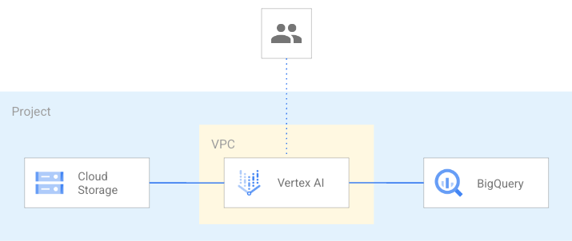

# Data Playground

This blueprint creates a minimum viable architecture for a data experimentation project with the needed APIs enabled, VPC and Firewall set in place, BigQuery dataset, GCS bucket and an AI notebook to get started.

This is the high level diagram:



## Managed resources and services

This sample creates several distinct groups of resources:

- project
- networking
- Vertex AI Workbench notebook configured with a private IP and using a dedicated Service Account
- One GCS bucket
- One BigQuery dataset

## Virtual Private Cloud (VPC) design

As is often the case in real-world configurations, this blueprint accepts as input an existing Shared-VPC via the network_config variable. Make sure that 'container.googleapis.com', 'notebooks.googleapis.com' and 'servicenetworking.googleapis.com' are enabled in the VPC host project.

If the network_config variable is not provided, one VPC will be created in each project that supports network resources (load, transformation and orchestration).

## Deploy your environment

We assume the identity running the following steps has the following role:

- resourcemanager.projectCreator in case a new project will be created.
- owner on the project in case you use an existing project.

Run Terraform init:

```
terraform init
```

Configure the Terraform variable in your terraform.tfvars file. You need to specify at least the following variables:

```
prefix = "prefix"
project_id      = "data-001"
```

You can run now:

```
terraform apply
```

You can now connect to the Vertex AI notbook to perform your data analysis.
<!-- BEGIN TFDOC -->
## Variables

| name | description | type | required | default |
|---|---|:---:|:---:|:---:|
| [prefix](variables.tf#L39) | Prefix used for resource names. | <code>string</code> | ✓ |  |
| [project_id](variables.tf#L57) | Project id, references existing project if `project_create` is null. | <code>string</code> | ✓ |  |
| [deletion_protection](variables.tf#L16) | Prevent Terraform from destroying data storage resources (storage buckets, GKE clusters, CloudSQL instances) in this blueprint. When this field is set in Terraform state, a terraform destroy or terraform apply that would delete data storage resources will fail. | <code>bool</code> |  | <code>false</code> |
| [location](variables.tf#L23) | The location where resources will be deployed. | <code>string</code> |  | <code>&#34;EU&#34;</code> |
| [network_config](variables.tf#L29) | Shared VPC network configurations to use. If null networks will be created in projects with preconfigured values. | <code title="object&#40;&#123;&#10;  host_project      &#61; string&#10;  network_self_link &#61; string&#10;  subnet_self_link  &#61; string&#10;&#125;&#41;">object&#40;&#123;&#8230;&#125;&#41;</code> |  | <code>null</code> |
| [project_create](variables.tf#L48) | Provide values if project creation is needed, uses existing project if null. Parent format:  folders/folder_id or organizations/org_id. | <code title="object&#40;&#123;&#10;  billing_account_id &#61; string&#10;  parent             &#61; string&#10;&#125;&#41;">object&#40;&#123;&#8230;&#125;&#41;</code> |  | <code>null</code> |
| [region](variables.tf#L62) | The region where resources will be deployed. | <code>string</code> |  | <code>&#34;europe-west1&#34;</code> |

## Outputs

| name | description | sensitive |
|---|---|:---:|
| [bucket](outputs.tf#L15) | GCS Bucket URL. |  |
| [dataset](outputs.tf#L20) | GCS Bucket URL. |  |
| [notebook](outputs.tf#L25) | Vertex AI notebook details. |  |
| [project](outputs.tf#L33) | Project id. |  |
| [vpc](outputs.tf#L38) | VPC Network. |  |
<!-- END TFDOC -->
## Test

```hcl
module "test" {
  source     = "./fabric/blueprints/data-solutions/data-playground"
  project_id = "sampleproject"
  prefix     = "tst"
  project_create = {
    billing_account_id = "123456-123456-123456",
    parent             = "folders/467898377"
  }
}
# tftest modules=8 resources=66
```
