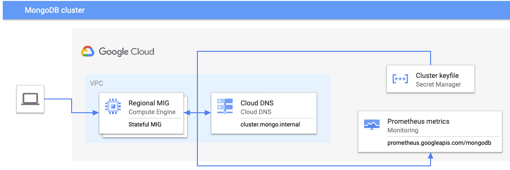

## MongoDB cluster blueprint

This is an blueprint of building a [MongoDB replica set](https://www.mongodb.com/docs/manual/replication/) 
using Fabric modules and Regional Managed Instance Groups.

The initial bootstrap and scaling actions have been scripted out using startup scripts. The whole system
has been built on top of ContainerOS using containers:

  - [MongoDB container](https://hub.docker.com/_/mongo)
  - [Startup container](init/)
  - [Healthcheck container](healthcheck/)
  - Percona's [Prometheus exporter for MongoDB](https://github.com/percona/mongodb_exporter)
  - [Self-deployed](https://cloud.google.com/stackdriver/docs/managed-prometheus/setup-unmanaged) [Prometheus metric collection](https://github.com/GoogleCloudPlatform/prometheus)

The cluster also sets up the necessary private Cloud DNS records for the [`mongodb+srv://` connection schema](https://www.mongodb.com/developer/products/mongodb/srv-connection-strings/).

<!-- TFDOC OPTS files:1 -->
<!-- BEGIN TFDOC -->

## Files

| name | description | modules | resources |
|---|---|---|---|
| [dns.tf](./dns.tf) | Cloud DNS resources. | <code>dns</code> |  |
| [instances.tf](./instances.tf) | Compute Engine resources. | <code>compute-mig</code> · <code>compute-vm</code> · <code>iam-service-account</code> · <code>mongodb</code> |  |
| [main.tf](./main.tf) | Project. | <code>project</code> |  |
| [outputs.tf](./outputs.tf) | Output variables. |  |  |
| [secrets.tf](./secrets.tf) | Secrets. | <code>secret-manager</code> | <code>random_password</code> |
| [variables.tf](./variables.tf) | Input variables. |  |  |
| [versions.tf](./versions.tf) | Version pins. |  |  |
| [vpc.tf](./vpc.tf) | Compute Engine networking. | <code>net-vpc</code> · <code>net-vpc-firewall</code> |  |

## Variables

| name | description | type | required | default |
|---|---|:---:|:---:|:---:|
| [healthcheck_image](variables.tf#L31) | Container image for healthcheck. | <code>string</code> | ✓ |  |
| [project_id](variables.tf#L42) | Google Cloud project ID. | <code>string</code> | ✓ |  |
| [startup_image](variables.tf#L53) | Container image for cluster startup. | <code>string</code> | ✓ |  |
| [vpc_config](variables.tf#L58) | Network and subnetwork to use. | <code title="object&#40;&#123;&#10;  create               &#61; bool&#10;  network              &#61; string&#10;  network_project      &#61; optional&#40;string&#41;&#10;  subnetwork           &#61; optional&#40;string&#41;&#10;  subnetwork_self_link &#61; optional&#40;string&#41;&#10;&#125;&#41;">object&#40;&#123;&#8230;&#125;&#41;</code> | ✓ |  |
| [cluster_id](variables.tf#L19) | Cluster ID when deploying multiple clusters. Defaults to 'default'. | <code>string</code> |  | <code>&#34;default&#34;</code> |
| [data_disk_size](variables.tf#L25) | Size of MongoDB data disks in GB. | <code>number</code> |  | <code>10</code> |
| [project_create](variables.tf#L36) | Create project instead ofusing an existing one. | <code>bool</code> |  | <code>false</code> |
| [region](variables.tf#L47) | Region to use. | <code>string</code> |  | <code>&#34;europe-west4&#34;</code> |

## Outputs

| name | description | sensitive |
|---|---|:---:|
| [authentication](outputs.tf#L19) | Authentication details. | ✓ |

<!-- END TFDOC -->
