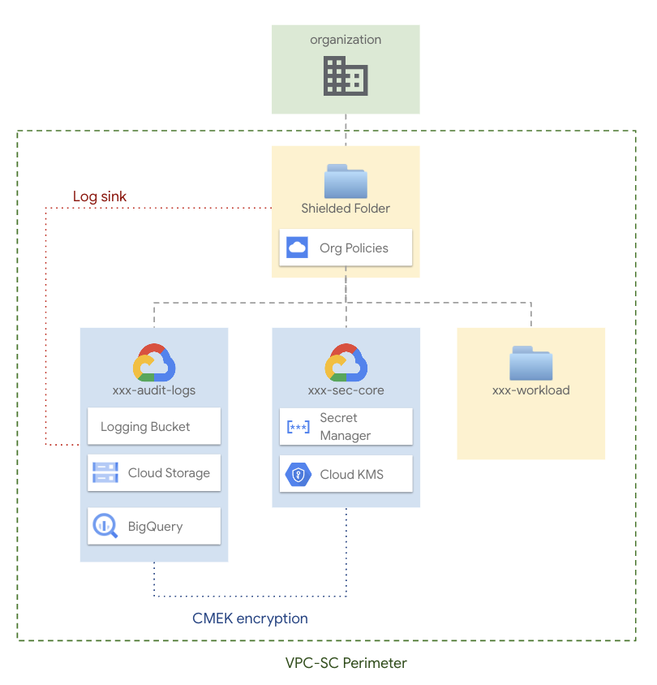

# Shielded folder

This blueprint implements an opinionated folder configuration according to GCP best practices. Configurations set at the folder level would be beneficial to host workloads inheriting constraints from the folder they belong to.

In this blueprint, a folder will be created setting following features:

- Organizational policies
- Hierarchical firewall rules
- Cloud KMS
- VPC-SC

Within the folder, the following projects will be created:

- 'audit-logs' where Audit Logs sink will be created
- 'sec-core' where Cloud KMS and Cloud Secret manager will be configured

The following diagram is a high-level reference of the resources created and managed here:



## Design overview and choices

Despite its simplicity, this blueprint implements the basics of a design that we've seen working well for various customers.

The approach adapts to different high-level requirements:

- IAM roles inheritance
- Organizational policies
- Audit log sink
- VPC Service Control
- Cloud KMS

## Project structure

The Shielded Folder blueprint is designed to rely on several projects:

- `audit-log`: to host Audit logging buckets and Audit log sync to GCS, BigQuery or PubSub
- `sec-core`: to host security-related resources such as Cloud KMS and Cloud Secrets Manager

This separation into projects allows adhering to the least-privilege principle by using project-level roles.

## User groups

User groups provide a stable frame of reference that allows decoupling the final set of permissions from the stage where entities and resources are created, and their IAM bindings are defined.

We use groups to control access to resources:

- `gcp-data-engineers`: They handle and run workloads on the `workload` subfolder. They have editor access to all resources in the `workload` folder in order to troubleshoot possible issues within the workload. This team can also impersonate any service account in the workload folder.
- `gcp-data-security`: They handle security configurations for the shielded folder. They have owner access to the `audit-log` and `sec-core` projects.

## Encryption

The blueprint supports the configuration of an instance of Cloud KMS to handle encryption on the resources. The encryption is disabled by default, but you can enable it by configuring the `enable_features.encryption` variable.

The script will create keys to encrypt log sink buckets/datasets/topics in the specified regions. Configuring the `kms_keys` variable, you can create additional KMS keys needed by your workload.

## Customizations

### Organization policy

You can configure the Organization policies enforced on the folder editing yaml files in the [org-policies](./data/org-policies/) folder. An opinionated list of policies that we suggest enforcing is listed.

Some additional Organization policy constraints you may want to evaluate adding:

- `gcp.resourceLocations`: to define the locations where location-based GCP resources can be created.
- `gcp.restrictCmekCryptoKeyProjects`: to define which projects may be used to supply Customer-Managed Encryption Keys (CMEK) when creating resources.

### VPC Service Control

VPC Service Control is configured to have a Perimeter containing all projects within the folder. Additional projects you may add to the folder won't be automatically added to the perimeter, and a new `terraform apply` is needed to add the project to the perimeter.

The VPC SC configuration is set to dry-run mode, but switching to enforced mode is a simple operation involving modifying a few lines of code highlighted by ad-hoc comments.

Access level rules are not defined. Before moving the configuration to enforced mode, configure access policies to continue accessing resources from outside of the perimeter.

An access level based on the network range you are using to reach the console (e.g. Proxy IP, Internet connection, ...) is suggested. Example:

```tfvars
vpc_sc_access_levels = {
  users = {
    conditions = [
      { members = ["user:user1@example.com"] }
    ]
  }
}
```

Alternatively, you can configure an access level based on the identity that needs to reach resources from outside the perimeter.

```tfvars
vpc_sc_access_levels = {
  users = {
  conditions = [
        { ip_subnetworks = ["101.101.101.0/24"] }
      ]
  }
}
```

## How to run this script

To deploy this blueprint in your GCP organization, you will need

- a folder or organization where resources will be created
- a billing account that will be associated with the new projects

The Shielded Folder blueprint is meant to be executed by a Service Account having this minimal set of permission:

- **Billing account**
  - `roles/billing.user`
- **Organization level**:
  - `roles/logging.configWriter`
  - `roles/resourcemanager.folderAdmin`
  - `roles/compute.orgFirewallPolicyAdmin`
  - `roles/resourcemanager.projectCreator`
  - `roles/orgpolicy.policyAdmin`

The shielded Folder blueprint assumes [groups described](#user-groups) are created in your GCP organization. Please create them from the [https://admin.google.com/][Google Admin] console.

### Variable configuration

There are several sets of variables you will need to fill in:

```tfvars
access_policy_config = {
  access_policy_create = {
    parent = "organizations/1234567890123"
    title  = "ShieldedMVP"
  }
}
folder_config = {
  folder_create = {
    display_name = "ShieldedMVP"
    parent       = "organizations/1234567890123"
  }
}
organization = {
  domain = "example.com"
  id     = "1122334455"
}
prefix = "prefix"
project_config = {
  billing_account_id = "123456-123456-123456"
}
```

### Deploying the blueprint

Once the configuration is complete, run the project factory by running

```bash
terraform init
terraform apply
```
<!-- BEGIN TFDOC -->
## Variables

| name | description | type | required | default |
|---|---|:---:|:---:|:---:|
| [access_policy_config](variables.tf#L17) | Provide 'access_policy_create' values if a folder scoped Access Policy creation is needed, uses existing 'policy_name' otherwise. Parent is in 'organizations/123456' format. Policy will be created scoped to the folder. | <code title="object&#40;&#123;&#10;  policy_name &#61; optional&#40;string, null&#41;&#10;  access_policy_create &#61; optional&#40;object&#40;&#123;&#10;    parent &#61; string&#10;    title  &#61; string&#10;  &#125;&#41;, null&#41;&#10;&#125;&#41;">object&#40;&#123;&#8230;&#125;&#41;</code> | ✓ |  |
| [folder_config](variables.tf#L49) | Provide 'folder_create' values if folder creation is needed, uses existing 'folder_id' otherwise. Parent is in 'folders/nnn' or 'organizations/nnn' format. | <code title="object&#40;&#123;&#10;  folder_id &#61; optional&#40;string, null&#41;&#10;  folder_create &#61; optional&#40;object&#40;&#123;&#10;    display_name &#61; string&#10;    parent       &#61; string&#10;  &#125;&#41;, null&#41;&#10;&#125;&#41;">object&#40;&#123;&#8230;&#125;&#41;</code> | ✓ |  |
| [organization](variables.tf#L148) | Organization details. | <code title="object&#40;&#123;&#10;  domain &#61; string&#10;  id     &#61; string&#10;&#125;&#41;">object&#40;&#123;&#8230;&#125;&#41;</code> | ✓ |  |
| [prefix](variables.tf#L156) | Prefix used for resources that need unique names. | <code>string</code> | ✓ |  |
| [project_config](variables.tf#L161) | Provide 'billing_account_id' value if project creation is needed, uses existing 'project_ids' if null. Parent is in 'folders/nnn' or 'organizations/nnn' format. | <code title="object&#40;&#123;&#10;  billing_account_id &#61; optional&#40;string, null&#41;&#10;  project_ids &#61; optional&#40;object&#40;&#123;&#10;    sec-core   &#61; string&#10;    audit-logs &#61; string&#10;    &#125;&#41;, &#123;&#10;    sec-core   &#61; &#34;sec-core&#34;&#10;    audit-logs &#61; &#34;audit-logs&#34;&#10;    &#125;&#10;  &#41;&#10;&#125;&#41;">object&#40;&#123;&#8230;&#125;&#41;</code> | ✓ |  |
| [data_dir](variables.tf#L29) | Relative path for the folder storing configuration data. | <code>string</code> |  | <code>&#34;data&#34;</code> |
| [enable_features](variables.tf#L35) | Flag to enable features on the solution. | <code title="object&#40;&#123;&#10;  encryption &#61; optional&#40;bool, false&#41;&#10;  log_sink   &#61; optional&#40;bool, true&#41;&#10;  vpc_sc     &#61; optional&#40;bool, true&#41;&#10;&#125;&#41;">object&#40;&#123;&#8230;&#125;&#41;</code> |  | <code title="&#123;&#10;  encryption &#61; false&#10;  log_sink   &#61; true&#10;  vpc_sc     &#61; true&#10;&#125;">&#123;&#8230;&#125;</code> |
| [groups](variables.tf#L65) | User groups. | <code title="object&#40;&#123;&#10;  workload-engineers &#61; optional&#40;string, &#34;gcp-data-engineers&#34;&#41;&#10;  workload-security  &#61; optional&#40;string, &#34;gcp-data-security&#34;&#41;&#10;&#125;&#41;">object&#40;&#123;&#8230;&#125;&#41;</code> |  | <code>&#123;&#125;</code> |
| [kms_keys](variables.tf#L75) | KMS keys to create, keyed by name. | <code title="map&#40;object&#40;&#123;&#10;  labels                        &#61; optional&#40;map&#40;string&#41;&#41;&#10;  locations                     &#61; optional&#40;list&#40;string&#41;, &#91;&#34;global&#34;, &#34;europe&#34;, &#34;europe-west1&#34;&#93;&#41;&#10;  rotation_period               &#61; optional&#40;string, &#34;7776000s&#34;&#41;&#10;  purpose                       &#61; optional&#40;string, &#34;ENCRYPT_DECRYPT&#34;&#41;&#10;  skip_initial_version_creation &#61; optional&#40;bool, false&#41;&#10;  version_template &#61; optional&#40;object&#40;&#123;&#10;    algorithm        &#61; string&#10;    protection_level &#61; optional&#40;string, &#34;SOFTWARE&#34;&#41;&#10;  &#125;&#41;&#41;&#10;&#10;&#10;  iam &#61; optional&#40;map&#40;list&#40;string&#41;&#41;, &#123;&#125;&#41;&#10;  iam_bindings &#61; optional&#40;map&#40;object&#40;&#123;&#10;    members &#61; list&#40;string&#41;&#10;    condition &#61; optional&#40;object&#40;&#123;&#10;      expression  &#61; string&#10;      title       &#61; string&#10;      description &#61; optional&#40;string&#41;&#10;    &#125;&#41;&#41;&#10;  &#125;&#41;&#41;, &#123;&#125;&#41;&#10;  iam_bindings_additive &#61; optional&#40;map&#40;object&#40;&#123;&#10;    member &#61; string&#10;    role   &#61; string&#10;    condition &#61; optional&#40;object&#40;&#123;&#10;      expression  &#61; string&#10;      title       &#61; string&#10;      description &#61; optional&#40;string&#41;&#10;    &#125;&#41;&#41;&#10;  &#125;&#41;&#41;, &#123;&#125;&#41;&#10;&#10;&#10;&#125;&#41;&#41;">map&#40;object&#40;&#123;&#8230;&#125;&#41;&#41;</code> |  | <code>&#123;&#125;</code> |
| [log_locations](variables.tf#L111) | Optional locations for GCS, BigQuery, and logging buckets created here. | <code title="object&#40;&#123;&#10;  bq      &#61; optional&#40;string, &#34;europe&#34;&#41;&#10;  storage &#61; optional&#40;string, &#34;europe&#34;&#41;&#10;  logging &#61; optional&#40;string, &#34;global&#34;&#41;&#10;  pubsub  &#61; optional&#40;string, &#34;global&#34;&#41;&#10;&#125;&#41;">object&#40;&#123;&#8230;&#125;&#41;</code> |  | <code>&#123;&#125;</code> |
| [log_sinks](variables.tf#L123) | Org-level log sinks, in name => {type, filter} format. | <code title="map&#40;object&#40;&#123;&#10;  filter &#61; string&#10;  type   &#61; string&#10;&#125;&#41;&#41;">map&#40;object&#40;&#123;&#8230;&#125;&#41;&#41;</code> |  | <code title="&#123;&#10;  audit-logs &#61; &#123;&#10;    filter &#61; &#34;logName:&#92;&#34;&#47;logs&#47;cloudaudit.googleapis.com&#37;2Factivity&#92;&#34; OR logName:&#92;&#34;&#47;logs&#47;cloudaudit.googleapis.com&#37;2Fsystem_event&#92;&#34;&#34;&#10;    type   &#61; &#34;bigquery&#34;&#10;  &#125;&#10;  vpc-sc &#61; &#123;&#10;    filter &#61; &#34;protoPayload.metadata.&#64;type&#61;&#92;&#34;type.googleapis.com&#47;google.cloud.audit.VpcServiceControlAuditMetadata&#92;&#34;&#34;&#10;    type   &#61; &#34;bigquery&#34;&#10;  &#125;&#10;&#125;">&#123;&#8230;&#125;</code> |
| [vpc_sc_access_levels](variables.tf#L181) | VPC SC access level definitions. | <code title="map&#40;object&#40;&#123;&#10;  combining_function &#61; optional&#40;string&#41;&#10;  conditions &#61; optional&#40;list&#40;object&#40;&#123;&#10;    device_policy &#61; optional&#40;object&#40;&#123;&#10;      allowed_device_management_levels &#61; optional&#40;list&#40;string&#41;&#41;&#10;      allowed_encryption_statuses      &#61; optional&#40;list&#40;string&#41;&#41;&#10;      require_admin_approval           &#61; bool&#10;      require_corp_owned               &#61; bool&#10;      require_screen_lock              &#61; optional&#40;bool&#41;&#10;      os_constraints &#61; optional&#40;list&#40;object&#40;&#123;&#10;        os_type                    &#61; string&#10;        minimum_version            &#61; optional&#40;string&#41;&#10;        require_verified_chrome_os &#61; optional&#40;bool&#41;&#10;      &#125;&#41;&#41;&#41;&#10;    &#125;&#41;&#41;&#10;    ip_subnetworks         &#61; optional&#40;list&#40;string&#41;, &#91;&#93;&#41;&#10;    members                &#61; optional&#40;list&#40;string&#41;, &#91;&#93;&#41;&#10;    negate                 &#61; optional&#40;bool&#41;&#10;    regions                &#61; optional&#40;list&#40;string&#41;, &#91;&#93;&#41;&#10;    required_access_levels &#61; optional&#40;list&#40;string&#41;, &#91;&#93;&#41;&#10;  &#125;&#41;&#41;, &#91;&#93;&#41;&#10;  description &#61; optional&#40;string&#41;&#10;&#125;&#41;&#41;">map&#40;object&#40;&#123;&#8230;&#125;&#41;&#41;</code> |  | <code>&#123;&#125;</code> |
| [vpc_sc_egress_policies](variables.tf#L210) | VPC SC egress policy definitions. | <code title="map&#40;object&#40;&#123;&#10;  from &#61; object&#40;&#123;&#10;    identity_type &#61; optional&#40;string, &#34;ANY_IDENTITY&#34;&#41;&#10;    identities    &#61; optional&#40;list&#40;string&#41;&#41;&#10;  &#125;&#41;&#10;  to &#61; object&#40;&#123;&#10;    operations &#61; optional&#40;list&#40;object&#40;&#123;&#10;      method_selectors &#61; optional&#40;list&#40;string&#41;&#41;&#10;      service_name     &#61; string&#10;    &#125;&#41;&#41;, &#91;&#93;&#41;&#10;    resources              &#61; optional&#40;list&#40;string&#41;&#41;&#10;    resource_type_external &#61; optional&#40;bool, false&#41;&#10;  &#125;&#41;&#10;&#125;&#41;&#41;">map&#40;object&#40;&#123;&#8230;&#125;&#41;&#41;</code> |  | <code>&#123;&#125;</code> |
| [vpc_sc_ingress_policies](variables.tf#L230) | VPC SC ingress policy definitions. | <code title="map&#40;object&#40;&#123;&#10;  from &#61; object&#40;&#123;&#10;    access_levels &#61; optional&#40;list&#40;string&#41;, &#91;&#93;&#41;&#10;    identity_type &#61; optional&#40;string&#41;&#10;    identities    &#61; optional&#40;list&#40;string&#41;&#41;&#10;    resources     &#61; optional&#40;list&#40;string&#41;, &#91;&#93;&#41;&#10;  &#125;&#41;&#10;  to &#61; object&#40;&#123;&#10;    operations &#61; optional&#40;list&#40;object&#40;&#123;&#10;      method_selectors &#61; optional&#40;list&#40;string&#41;&#41;&#10;      service_name     &#61; string&#10;    &#125;&#41;&#41;, &#91;&#93;&#41;&#10;    resources &#61; optional&#40;list&#40;string&#41;&#41;&#10;  &#125;&#41;&#10;&#125;&#41;&#41;">map&#40;object&#40;&#123;&#8230;&#125;&#41;&#41;</code> |  | <code>&#123;&#125;</code> |

## Outputs

| name | description | sensitive |
|---|---|:---:|
| [folders](outputs.tf#L15) | Folders id. |  |
| [folders_sink_writer_identities](outputs.tf#L23) | Folders id. |  |
| [kms_keys](outputs.tf#L31) | Cloud KMS encryption keys created. |  |
<!-- END TFDOC -->
## Test

```hcl
module "test" {
  source   = "./fabric/blueprints/data-solutions/shielded-folder"
  data_dir = "./fabric/blueprints/data-solutions/shielded-folder/data"
  access_policy_config = {
    access_policy_create = {
      parent = "organizations/1234567890123"
      title  = "ShieldedMVP"
    }
  }
  folder_config = {
    folder_create = {
      display_name = "ShieldedMVP"
      parent       = "organizations/1234567890123"
    }
  }
  organization = {
    domain = "example.com"
    id     = "1122334455"
  }
  prefix = "prefix"
  project_config = {
    billing_account_id = "123456-123456-123456"
  }
}
# tftest modules=7 resources=39
```
