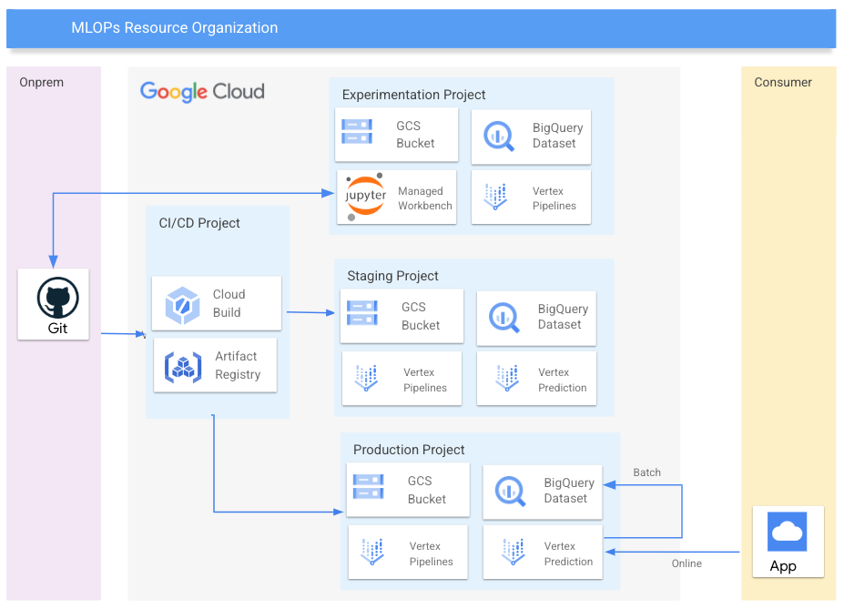

# MLOps with Vertex AI

## Tagline

Create a Vertex AI environment needed for MLOps.

## Detailed

This example implements the infrastructure required to deploy an end-to-end [MLOps process](https://services.google.com/fh/files/misc/practitioners_guide_to_mlops_whitepaper.pdf) using [Vertex AI](https://cloud.google.com/vertex-ai) platform.

## Architecture

The blueprint will deploy all the required resources to have a fully functional MLOPs environment containing:

1. Vertex Workbench (for the experimentation environment).
1. GCP Project (optional) to host all the resources.
1. Isolated VPC network and a subnet to be used by Vertex and Dataflow. Alternatively, an external Shared VPC can be configured using the `network_config`variable.
1. Firewall rule to allow the internal subnet communication required by Dataflow.
1. Cloud NAT required to reach the internet from the different computing resources (Vertex and Dataflow).
1. GCS buckets to host Vertex AI and Cloud Build Artifacts. By default the buckets will be regional and should match the Vertex AI region for the different resources (i.e. Vertex Managed Dataset) and processes (i.e. Vertex trainining).
1. BigQuery Dataset where the training data will be stored. This is optional, since the training data could be already hosted in an existing BigQuery dataset.
1. Artifact Registry Docker repository to host the custom images.
1. Service account (`PREFIX-sa-mlops`) with the minimum permissions required by Vertex AI and Dataflow (if this service is used inside of the Vertex AI Pipeline).
1. Service account (`PREFIX-sa-github@`) to be used by Workload Identity Federation, to federate Github identity (Optional).
1. Secret Manager to store the Github SSH key to get access the CICD code repo.

## Documentation



## Pre-requirements

### User groups

Assign roles relying on User groups is a way to decouple the final set of permissions from the stage where entities and resources are created, and their IAM bindings defined. You can configure the group names through the `groups` variable. These groups should be created before launching Terraform.

We use the following groups to control access to resources:

- *Data Scientist* (gcp-ml-ds@<company.org>). They manage notebooks and create ML pipelines.
- *ML Engineers* (gcp-ml-eng@<company.org>). They manage the different Vertex resources.
- *ML Viewer* (gcp-ml-eng@<company.org>). Group with wiewer permission for the different resources.

Please note that these groups are not suitable for production grade environments. Roles can be customized in the `main.tf`file.

## Instructions

### Deploy the experimentation environment

- Create a `terraform.tfvars` file and specify the variables to match your desired configuration. You can use the provided `terraform.tfvars.sample`  as reference.
- Run `terraform init` and `terraform apply`

## What's next?

This blueprint can be used as a building block for setting up an end2end ML Ops solution. As next step, you can follow this [guide](https://cloud.google.com/architecture/architecture-for-mlops-using-tfx-kubeflow-pipelines-and-cloud-build) to setup a Vertex AI pipeline and run it on the deployed infraestructure.

## Usage

Basic usage of this module is as follows:

```hcl
module "test" {
  source = "./fabric/blueprints/data-solutions/vertex-mlops/"
  notebooks = {
    "myworkbench" = {
      type = "USER_MANAGED"
    }
  }
  prefix = "pref-dev"
  project_config = {
    billing_account_id = "000000-123456-123456"
    parent             = "folders/111111111111"
    project_id         = "test-dev"
  }
}
# tftest modules=11 resources=89
```
<!-- BEGIN TFDOC -->
## Variables

| name | description | type | required | default |
|---|---|:---:|:---:|:---:|
| [notebooks](variables.tf#L82) | Vertex AI workbenches to be deployed. Service Account runtime/instances deployed. | <code title="map&#40;object&#40;&#123;&#10;  type             &#61; string&#10;  machine_type     &#61; optional&#40;string, &#34;n1-standard-4&#34;&#41;&#10;  internal_ip_only &#61; optional&#40;bool, true&#41;&#10;  idle_shutdown    &#61; optional&#40;bool, false&#41;&#10;  owner            &#61; optional&#40;string&#41;&#10;&#125;&#41;&#41;">map&#40;object&#40;&#123;&#8230;&#125;&#41;&#41;</code> | ✓ |  |
| [project_config](variables.tf#L109) | Provide 'billing_account_id' value if project creation is needed, uses existing 'project_id' if null. Parent is in 'folders/nnn' or 'organizations/nnn' format. | <code title="object&#40;&#123;&#10;  billing_account_id &#61; optional&#40;string&#41;&#10;  parent             &#61; optional&#40;string&#41;&#10;  project_id         &#61; string&#10;&#125;&#41;">object&#40;&#123;&#8230;&#125;&#41;</code> | ✓ |  |
| [bucket_name](variables.tf#L18) | GCS bucket name to store the Vertex AI artifacts. | <code>string</code> |  | <code>null</code> |
| [dataset_name](variables.tf#L24) | BigQuery Dataset to store the training data. | <code>string</code> |  | <code>null</code> |
| [deletion_protection](variables.tf#L30) | Prevent Terraform from destroying data storage resources (storage buckets, GKE clusters, CloudSQL instances) in this blueprint. When this field is set in Terraform state, a terraform destroy or terraform apply that would delete data storage resources will fail. | <code>bool</code> |  | <code>false</code> |
| [groups](variables.tf#L37) | Name of the groups (name@domain.org) to apply opinionated IAM permissions. | <code title="object&#40;&#123;&#10;  gcp-ml-ds     &#61; optional&#40;string&#41;&#10;  gcp-ml-eng    &#61; optional&#40;string&#41;&#10;  gcp-ml-viewer &#61; optional&#40;string&#41;&#10;&#125;&#41;">object&#40;&#123;&#8230;&#125;&#41;</code> |  | <code>&#123;&#125;</code> |
| [identity_pool_assertions](variables.tf#L48) | Assertions to be used by Workload Identityf Federation on tokens, for example: assertion.repository_owner=='ORGANIZATION'. | <code>string</code> |  | <code>null</code> |
| [identity_pool_claims](variables.tf#L54) | Claims to be used by Workload Identity Federation (i.e.: attribute.repository/ORGANIZATION/REPO). If a not null value is provided, then google_iam_workload_identity_pool resource will be created. | <code>string</code> |  | <code>null</code> |
| [labels](variables.tf#L60) | Labels to be assigned at project level. | <code>map&#40;string&#41;</code> |  | <code>&#123;&#125;</code> |
| [location](variables.tf#L66) | Location used for multi-regional resources. | <code>string</code> |  | <code>&#34;eu&#34;</code> |
| [network_config](variables.tf#L72) | Shared VPC network configurations to use. If null networks will be created in projects with preconfigured values. | <code title="object&#40;&#123;&#10;  host_project      &#61; string&#10;  network_self_link &#61; string&#10;  subnet_self_link  &#61; string&#10;&#125;&#41;">object&#40;&#123;&#8230;&#125;&#41;</code> |  | <code>null</code> |
| [prefix](variables.tf#L103) | Prefix used for the project id. | <code>string</code> |  | <code>null</code> |
| [region](variables.tf#L123) | Region used for regional resources. | <code>string</code> |  | <code>&#34;europe-west4&#34;</code> |
| [repo_name](variables.tf#L129) | Cloud Source Repository name. null to avoid to create it. | <code>string</code> |  | <code>null</code> |
| [service_encryption_keys](variables.tf#L135) | Cloud KMS to use to encrypt different services. Key location should match service region. | <code title="object&#40;&#123;&#10;  aiplatform    &#61; optional&#40;string&#41;&#10;  bq            &#61; optional&#40;string&#41;&#10;  notebooks     &#61; optional&#40;string&#41;&#10;  secretmanager &#61; optional&#40;string&#41;&#10;  storage       &#61; optional&#40;string&#41;&#10;&#125;&#41;">object&#40;&#123;&#8230;&#125;&#41;</code> |  | <code>&#123;&#125;</code> |

## Outputs

| name | description | sensitive |
|---|---|:---:|
| [github](outputs.tf#L30) | Github Configuration. |  |
| [notebook](outputs.tf#L35) | Vertex AI notebooks ids. |  |
| [project_id](outputs.tf#L43) | Project ID. |  |
<!-- END TFDOC -->
## Test

```hcl
module "test" {
  source = "./fabric/blueprints/data-solutions/vertex-mlops/"
  labels = {
    "env"  = "dev",
    "team" = "ml"
  }
  bucket_name              = "gcs-test"
  dataset_name             = "bq_test"
  identity_pool_assertions = "assertion.repository_owner=='ORGANIZATION'"
  identity_pool_claims     = "attribute.repository/ORGANIZATION/REPO"
  notebooks = {
    "myworkbench" = {
      type = "USER_MANAGED"
    }
  }
  prefix = var.prefix
  project_config = {
    billing_account_id = var.billing_account_id
    parent             = var.folder_id
    project_id         = "test-dev"
  }
}
# tftest modules=13 resources=94 e2e
```
