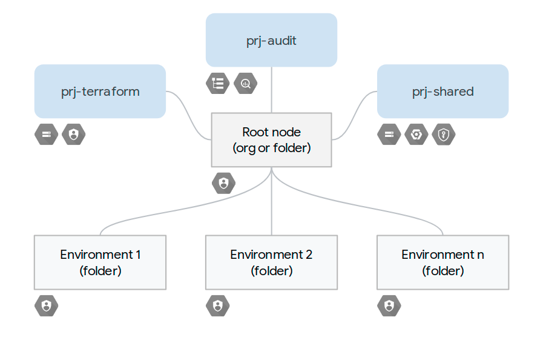

# Environment-based organizational sample

This sample creates an organizational layout with a single level, where each  folder is usually mapped to one infrastructure environment (test, dev, etc.). It also sets up all prerequisites for automation (GCS state buckets, service accounts, etc.), and the correct roles on those to enforce separation of duties at the environment level.

This layout is well suited for medium-sized infrastructures managed by a small set of teams, where the complexity in application resource ownership and access roles is mostly dealt with at the project level, and/or in the individual services (GKE, Cloud SQL, etc.). Its simplicity also makes it a good starting point for more complex or specialized layouts.

Refer to the [section-level README](../README.md) for general considerations about this type of samples, and usage instructions.

## Managed resources and services

This sample creates several distinct groups of resources:

- one folder per environment
- one top-level project to hold Terraform-related resources
- one top-level project to set up and host centralized audit log exports (optional)
- one top-level shared services project

The number of resources in this sample is kept to a minimum so as to make it generally applicable, more resources can be easily added by leveraging other [modules from our bundle](../../../modules/), or from other sources like the [CFT suite](https://github.com/terraform-google-modules).

## Shared services project

This sample contains a single, top-level project used to host services shared across environments (eg GCS, GCR, KMS, Cloud Build, etc.). In our experience, that is enough for many customers, especially those using this organizational layout.

For more complex setups where multiple shared services projects are needed to encapsulate a larger number of resources, shared services should be treated as an extra environment so that they can be managed by a dedicated set of Terraform files, using a separate service account and GCS bucket, with a folder to contain shared projects.

If no shared services are needed, the shared service project module can of course be removed from `main.tf`.
<!-- BEGIN TFDOC -->

## Variables

| name | description | type | required | default |
|---|---|:---:|:---:|:---:|
| [billing_account_id](variables.tf#L25) | Billing account id used as to create projects. | <code>string</code> | ✓ |  |
| [environments](variables.tf#L30) | Environment short names. | <code>set&#40;string&#41;</code> | ✓ |  |
| [organization_id](variables.tf#L94) | Organization id in organizations/nnnnnnnn format. | <code>string</code> | ✓ |  |
| [prefix](variables.tf#L99) | Prefix used for resources that need unique names. | <code>string</code> | ✓ |  |
| [root_node](variables.tf#L113) | Root node for the new hierarchy, either 'organizations/org_id' or 'folders/folder_id'. | <code>string</code> | ✓ |  |
| [audit_filter](variables.tf#L15) | Audit log filter used for the log sink. | <code>string</code> |  | <code title="&#34;&#10;logName: &#34;&#47;logs&#47;cloudaudit.googleapis.com&#37;2Factivity&#34;&#10;OR&#10;logName: &#34;&#47;logs&#47;cloudaudit.googleapis.com&#37;2Fsystem_event&#34;&#34;">&#8230;</code> |
| [gcs_location](variables.tf#L35) | GCS bucket location. | <code>string</code> |  | <code>&#34;EU&#34;</code> |
| [iam_audit_viewers](variables.tf#L41) | Audit project viewers, in IAM format. | <code>list&#40;string&#41;</code> |  | <code>&#91;&#93;</code> |
| [iam_billing_config](variables.tf#L47) | Control granting billing user role to service accounts. Target the billing account by default. | <code title="object&#40;&#123;&#10;  grant      &#61; bool&#10;  target_org &#61; bool&#10;&#125;&#41;">object&#40;&#123;&#8230;&#125;&#41;</code> |  | <code title="&#123;&#10;  grant      &#61; true&#10;  target_org &#61; false&#10;&#125;">&#123;&#8230;&#125;</code> |
| [iam_folder_roles](variables.tf#L59) | List of roles granted to each service account on its respective folder (excluding XPN roles). | <code>list&#40;string&#41;</code> |  | <code title="&#91;&#10;  &#34;roles&#47;compute.networkAdmin&#34;,&#10;  &#34;roles&#47;owner&#34;,&#10;  &#34;roles&#47;resourcemanager.folderViewer&#34;,&#10;  &#34;roles&#47;resourcemanager.projectCreator&#34;,&#10;&#93;">&#91;&#8230;&#93;</code> |
| [iam_shared_owners](variables.tf#L70) | Shared services project owners, in IAM format. | <code>list&#40;string&#41;</code> |  | <code>&#91;&#93;</code> |
| [iam_terraform_owners](variables.tf#L76) | Terraform project owners, in IAM format. | <code>list&#40;string&#41;</code> |  | <code>&#91;&#93;</code> |
| [iam_xpn_config](variables.tf#L82) | Control granting Shared VPC creation roles to service accounts. Target the root node by default. | <code title="object&#40;&#123;&#10;  grant      &#61; bool&#10;  target_org &#61; bool&#10;&#125;&#41;">object&#40;&#123;&#8230;&#125;&#41;</code> |  | <code title="&#123;&#10;  grant      &#61; true&#10;  target_org &#61; true&#10;&#125;">&#123;&#8230;&#125;</code> |
| [project_services](variables.tf#L104) | Service APIs enabled by default in new projects. | <code>list&#40;string&#41;</code> |  | <code title="&#91;&#10;  &#34;container.googleapis.com&#34;,&#10;  &#34;stackdriver.googleapis.com&#34;,&#10;&#93;">&#91;&#8230;&#93;</code> |
| [service_account_keys](variables.tf#L118) | Generate and store service account keys in the state file. | <code>bool</code> |  | <code>true</code> |

## Outputs

| name | description | sensitive |
|---|---|:---:|
| [audit_logs_bq_dataset](outputs.tf#L15) | Bigquery dataset for the audit logs export. |  |
| [audit_logs_project](outputs.tf#L20) | Project that holds the audit logs export resources. |  |
| [bootstrap_tf_gcs_bucket](outputs.tf#L25) | GCS bucket used for the bootstrap Terraform state. |  |
| [environment_folders](outputs.tf#L30) | Top-level environment folders. |  |
| [environment_service_account_keys](outputs.tf#L35) | Service account keys used to run each environment Terraform modules. | ✓ |
| [environment_service_accounts](outputs.tf#L40) | Service accounts used to run each environment Terraform modules. |  |
| [environment_tf_gcs_buckets](outputs.tf#L45) | GCS buckets used for each environment Terraform state. |  |
| [shared_services_project](outputs.tf#L50) | Project that holdes resources shared across environments. |  |
| [terraform_project](outputs.tf#L55) | Project that holds the base Terraform resources. |  |

<!-- END TFDOC -->
