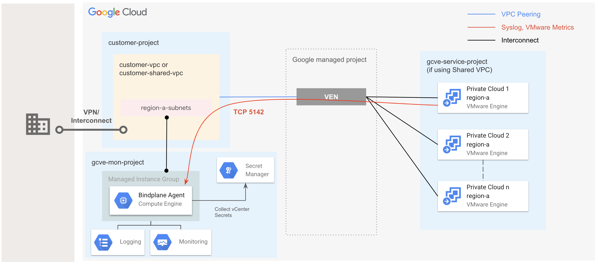

# Google Cloud VMWare Engine Logging Monitoring Module

This Blueprint simplifies the setup of monitoring and syslog logging for Google Cloud VMware Engine (GCVE) private clouds.

## Overview

Infrastructure monitoring and logging for GCVE are typically set up using a [standalone Bindplane agent](https://cloud.google.com/vmware-engine/docs/environment/howto-cloud-monitoring-standalone). This blueprint automates the deployment of the Bindplane agent using a Managed Instance Group. The agent collects metrics and syslog logs from VMware vCenter and forwards them to Cloud Monitoring and Cloud Logging.

<p align="center">
  
</p>

## Deployed Resources

This blueprint deploys and configures the following resources:

* **Service Account:** Grants the Bindplane agent permissions to write logs/metrics and access Secret Manager.
* **Firewall Rule (optional):** Allows health checks on TCP port 5142 to ensure the agent is running.
* **Monitoring Dashboards (optional):** Provides default dashboards for GCVE metrics.
* **VM Template:** Creates a Debian 11-based template for the Bindplane agent.
* **Managed Instance Group:** Manages the deployment and provides autohealing to the Bindplane agent.
* **Secret Manager Secrets:** Stores vCenter credentials (username, password, FQDN).

## Completing the Setup

After deploying this blueprint, you need to complete the following steps:
* [Configure GCVE to send traffic to the Bindplane agent](https://cloud.google.com/vmware-engine/docs/environment/howto-forward-syslog), which listens on TCP port 5142 by default.
* Update secrets in Secret Manager with vCenter credentials and FQDN.

## Troubleshooting

If you encounter issues, check the following:

* **Firewall:** Ensure that the firewall rule allows traffic to TCP port 5142.
* **vCenter Configuration:** Verify that GCVE is correctly configured to forward syslog messages.
* **Agent Logs:** Examine the Bindplane agent logs for errors.

## Security Considerations

* **Least Privilege:** Grant the Bindplane agent service account only the necessary permissions.
* **Secret Management:** Store vCenter credentials securely in Secret Manager.

<!-- BEGIN TOC -->
- [Overview](#overview)
- [Deployed Resources](#deployed-resources)
- [Completing the Setup](#completing-the-setup)
- [Troubleshooting](#troubleshooting)
- [Security Considerations](#security-considerations)
- [Basic Monitoring setup with default settings](#basic-monitoring-setup-with-default-settings)
- [Variables](#variables)
- [Outputs](#outputs)
<!-- END TOC -->

## Basic Monitoring setup with default settings

```hcl

module "gcve-monitoring" {
  source     = "./fabric/blueprints/gcve/monitoring"
  project_id = "gcve-mon-project"
  project_create = {
    billing_account = "0123AB-ABCDEF-123456"
    parent          = "folders/1234567890"
    shared_vpc_host = "abcde-prod-net-spoke-0"
  }

  vm_mon_config = {
    vm_mon_name = "bp-agent"
    vm_mon_type = "e2-small"
    vm_mon_zone = "europe-west1-b"
  }

  vpc_config = {
    host_project_id      = "abcde-prod-net-spoke-0"
    vpc_self_link        = "https://www.googleapis.com/compute/v1/projects/abcde-prod-net-spoke-0/global/networks/prod-spoke-0"
    subnetwork_self_link = "projects/abcde-prod-net-spoke-0/regions/europe-west1/subnetworks/prod-default-ew1"
  }

  vsphere_secrets = {
    vsphere_server   = "gcve-mon-vsphere-server"
    vsphere_user     = "gcve-mon-vsphere-user"
    vsphere_password = "gcve-mon-vsphere-password"
  }

  sa_gcve_monitoring   = "gcve-mon-sa"
  gcve_region          = "europe-west1"
  initial_delay_sec    = 180
  create_dashboards    = true
  create_firewall_rule = true
}
# tftest modules=7 resources=25
```
<!-- BEGIN TFDOC -->
## Variables

| name | description | type | required | default |
|---|---|:---:|:---:|:---:|
| [gcve_region](variables.tf#L29) | Region where the Private Cloud is deployed. | <code>string</code> | ✓ |  |
| [project_id](variables.tf#L56) | Project id of existing or created project. | <code>string</code> | ✓ |  |
| [vm_mon_config](variables.tf#L67) | GCE monitoring instance configuration. | <code title="object&#40;&#123;&#10;  vm_mon_name &#61; optional&#40;string, &#34;bp-agent&#34;&#41;&#10;  vm_mon_type &#61; optional&#40;string, &#34;e2-small&#34;&#41;&#10;  vm_mon_zone &#61; string&#10;&#125;&#41;">object&#40;&#123;&#8230;&#125;&#41;</code> | ✓ |  |
| [vpc_config](variables.tf#L77) | Shared VPC project and VPC details. | <code title="object&#40;&#123;&#10;  host_project_id      &#61; string&#10;  vpc_self_link        &#61; string&#10;  subnetwork_self_link &#61; string&#10;&#125;&#41;">object&#40;&#123;&#8230;&#125;&#41;</code> | ✓ |  |
| [create_dashboards](variables.tf#L17) | Specify sample GCVE monitoring dashboards should be installed. | <code>bool</code> |  | <code>true</code> |
| [create_firewall_rule](variables.tf#L23) | Specify whether a firewall rule to allow Load Balancer Healthcheck should be implemented. | <code>bool</code> |  | <code>true</code> |
| [initial_delay_sec](variables.tf#L34) | How long to delay checking for healthcheck upon initialization. | <code>number</code> |  | <code>180</code> |
| [monitoring_image](variables.tf#L40) | Resource URI for OS image used to deploy monitoring agent. | <code>string</code> |  | <code>&#34;projects&#47;debian-cloud&#47;global&#47;images&#47;family&#47;debian-11&#34;</code> |
| [project_create](variables.tf#L46) | Project configuration for newly created project. Leave null to use existing project. Project creation forces VPC and cluster creation. | <code title="object&#40;&#123;&#10;  billing_account &#61; string&#10;  parent          &#61; optional&#40;string&#41;&#10;  shared_vpc_host &#61; optional&#40;string&#41;&#10;&#125;&#41;">object&#40;&#123;&#8230;&#125;&#41;</code> |  | <code>null</code> |
| [sa_gcve_monitoring](variables.tf#L61) | Service account for GCVE monitoring agent. | <code>string</code> |  | <code>&#34;gcve-mon-sa&#34;</code> |
| [vsphere_secrets](variables.tf#L87) | Secret Manager secrets that contain vSphere credentials and FQDN. | <code title="object&#40;&#123;&#10;  vsphere_password &#61; optional&#40;string, &#34;gcve-mon-vsphere-password&#34;&#41;&#10;  vsphere_server   &#61; optional&#40;string, &#34;gcve-mon-vsphere-server&#34;&#41;&#10;  vsphere_user     &#61; optional&#40;string, &#34;gcve-mon-vsphere-user&#34;&#41;&#10;&#125;&#41;">object&#40;&#123;&#8230;&#125;&#41;</code> |  | <code>&#123;&#125;</code> |

## Outputs

| name | description | sensitive |
|---|---|:---:|
| [gcve-mon-firewall](outputs.tf#L17) | Ingress rule to allow GCVE Syslog traffic. |  |
| [gcve-mon-mig](outputs.tf#L22) | Managed Instance Group for GCVE Monitoring. |  |
| [gcve-mon-sa](outputs.tf#L27) | Service Account for GCVE Monitoring. |  |
<!-- END TFDOC -->
