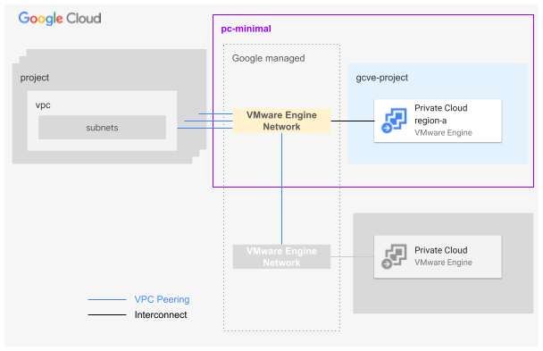

# GCVE Private Cloud Minimal

This blueprint presents an opinionated architecture to handle different Google VMware Engine deployment scenarios: from a simple single region private cloud to multi-region private clouds spread across different locations. The general idea behind this blueprint is to deploy a single project hosting one or more GCVE private clouds connected to a shared VMware Engine Network (VEN).
Optionally this blueprint can deploy the VMWare Engine Network peerings to pre-existing VPCs.

Multiple deployments of this blueprint allow the user to achieve more complex design solutions as for example GCVE private clouds deployed on different projects or connected to independent VMWare Engine Networks.

This blueprint is used as part of the [FAST GCVE stage](../../../fast/stages/3-gcve/) but it can also be used independently if desired.

<p align="center">
  
</p>

The blueprint manages:
- project creation
- project-level organization policy definitions
- billing setup (billing account attachment)
- API/services enablement
- IAM role assignment for groups
- VMware Engine private clouds creation
- [VMware Engine Network](https://cloud.google.com/vmware-engine/docs/networking/vmware-engine-network#standard_networks) creation
- VPC attachment (Optional)

### User groups

Based on our GCP best practices, a GCVE private cloud relies on user groups to assign roles to human identities. These are the specific groups bound to the main GCVE [predefined roles](https://cloud.google.com/vmware-engine/docs/iam#vmware-engine-roles):
- *VMware Engine Administrators*. They have full access to the VMWare Engine Service.
- *VMware Engine Viewers*. They have read-only access to the VMware Engine Service.


### Network

This blueprint expects the user to provision a VPC upfront, either from one of the FAST networking stages (e.g. [Networking with separated single environment](../../../fast/stages/2-networking-c-separate-envs)) or from an external source.
The blueprint can optionally configure the [VMware Engine Network peering](https://cloud.google.com/vmware-engine/docs/networking/peer-vpc-network) on the peer VPC by granting the following permissions on the project that hosts the VPC:
- vmwareengine.networkPeerings.create
- vmwareengine.networkPeerings.get
- vmwareengine.networkPeerings.list
- vmwareengine.operations.get
The permissions can be assigned through the predefined role *vmwareengine.vmwareengineAdmin*. The creation of a dedicated custom role is strongly recommended anyway to comply with the least privilege principle.

## Basic usage

The following example shows how to deploy a CGVE private cloud and connect it to a VPC

```hcl
module "gcve-pc" {
  source             = "./fabric/blueprints/gcve/pc-minimal"
  billing_account_id = "000000-000000-000000"
  folder_id          = "folders/000000000000"
  project_id         = "myprojectid"
  groups = {
    gcp-gcve-admins  = "group:gcp-gcve-admins@acme.com"
    gcp-gcve-viewers = "group:gcp-gcve-viewers@acme.com"
  }

  prefix = "myprefix"

  network_peerings = {
    dev-spoke-ven = {
      peer_network    = "projects/spokeproject/regions/europe-west1/subnetworks/dev-default-ew1"
      peer_project_id = "peerprojectid"
    }
  }

  private_cloud_configs = {
    dev-pc = {
      cidr = "172.26.16.0/22"
      zone = "europe-west1-a"
      management_cluster_config = {
        name         = "mgmt-cluster"
        node_count   = 1
        node_type_id = "standard-72"
      }
    }
  }
}
# tftest modules=3 resources=9
```

<!-- TFDOC OPTS files:1 -->
<!-- BEGIN TFDOC -->
## Files

| name | description | modules | resources |
|---|---|---|---|
| [gcve-pc.tf](./gcve-pc.tf) | GCVE private cloud. | <code>gcve-private-cloud</code> | <code>google_vmwareengine_network_peering</code> |
| [main.tf](./main.tf) | Project. | <code>project</code> |  |
| [output.tf](./output.tf) | Output variables. |  |  |
| [variables.tf](./variables.tf) | Module variables. |  |  |

## Variables

| name | description | type | required | default |
|---|---|:---:|:---:|:---:|
| [billing_account_id](variables.tf#L17) | Billing account ID. | <code>string</code> | ✓ |  |
| [folder_id](variables.tf#L22) | Folder used for the GCVE project in folders/nnnnnnnnnnn format. | <code>string</code> | ✓ |  |
| [groups](variables.tf#L27) | GCVE groups. | <code title="object&#40;&#123;&#10;  gcp-gcve-admins  &#61; string&#10;  gcp-gcve-viewers &#61; string&#10;&#125;&#41;">object&#40;&#123;&#8230;&#125;&#41;</code> | ✓ |  |
| [prefix](variables.tf#L81) | Prefix used for resource names. | <code>string</code> | ✓ |  |
| [private_cloud_configs](variables.tf#L90) | The VMware private cloud configurations. The key is the unique private cloud name suffix. | <code title="map&#40;object&#40;&#123;&#10;  cidr &#61; string&#10;  zone &#61; string&#10;  additional_cluster_configs &#61; optional&#40;map&#40;object&#40;&#123;&#10;    custom_core_count &#61; optional&#40;number&#41;&#10;    node_count        &#61; optional&#40;number, 3&#41;&#10;    node_type_id      &#61; optional&#40;string, &#34;standard-72&#34;&#41;&#10;  &#125;&#41;&#41;, &#123;&#125;&#41;&#10;  management_cluster_config &#61; optional&#40;object&#40;&#123;&#10;    custom_core_count &#61; optional&#40;number&#41;&#10;    name              &#61; optional&#40;string, &#34;mgmt-cluster&#34;&#41;&#10;    node_count        &#61; optional&#40;number, 3&#41;&#10;    node_type_id      &#61; optional&#40;string, &#34;standard-72&#34;&#41;&#10;  &#125;&#41;, &#123;&#125;&#41;&#10;  description &#61; optional&#40;string, &#34;Managed by Terraform.&#34;&#41;&#10;&#125;&#41;&#41;">map&#40;object&#40;&#123;&#8230;&#125;&#41;&#41;</code> | ✓ |  |
| [project_id](variables.tf#L112) | ID of the project that will contain the GCVE private cloud. | <code>string</code> | ✓ |  |
| [iam](variables.tf#L36) | Project-level authoritative IAM bindings for users and service accounts in  {ROLE => [MEMBERS]} format. | <code>map&#40;list&#40;string&#41;&#41;</code> |  | <code>&#123;&#125;</code> |
| [iam_by_principals](variables.tf#L43) | Authoritative IAM binding in {PRINCIPAL => [ROLES]} format. Principals need to be statically defined to avoid cycle errors. Merged internally with the `iam` variable. | <code>map&#40;list&#40;string&#41;&#41;</code> |  | <code>&#123;&#125;</code> |
| [labels](variables.tf#L50) | Project-level labels. | <code>map&#40;string&#41;</code> |  | <code>&#123;&#125;</code> |
| [network_peerings](variables.tf#L56) | The network peerings between users' VPCs and the VMware Engine networks. The key is the peering name suffix. | <code title="map&#40;object&#40;&#123;&#10;  peer_network           &#61; string&#10;  configure_peer_network &#61; optional&#40;bool, false&#41;&#10;  custom_routes &#61; optional&#40;object&#40;&#123;&#10;    export_to_peer   &#61; optional&#40;bool, false&#41;&#10;    import_from_peer &#61; optional&#40;bool, false&#41;&#10;    export_to_ven    &#61; optional&#40;bool, false&#41;&#10;    import_from_ven  &#61; optional&#40;bool, false&#41;&#10;  &#125;&#41;, &#123;&#125;&#41;&#10;  custom_routes_with_public_ip &#61; optional&#40;object&#40;&#123;&#10;    export_to_peer   &#61; optional&#40;bool, false&#41;&#10;    import_from_peer &#61; optional&#40;bool, false&#41;&#10;    export_to_ven    &#61; optional&#40;bool, false&#41;&#10;    import_from_ven  &#61; optional&#40;bool, false&#41;&#10;  &#125;&#41;, &#123;&#125;&#41;&#10;  description                   &#61; optional&#40;string, &#34;Managed by Terraform.&#34;&#41;&#10;  peer_project_id               &#61; optional&#40;string&#41;&#10;  peer_to_vmware_engine_network &#61; optional&#40;bool, false&#41;&#10;&#125;&#41;&#41;">map&#40;object&#40;&#123;&#8230;&#125;&#41;&#41;</code> |  | <code>&#123;&#125;</code> |
| [project_services](variables.tf#L117) | Additional project services to enable. | <code>list&#40;string&#41;</code> |  | <code>&#91;&#93;</code> |
<!-- END TFDOC -->
