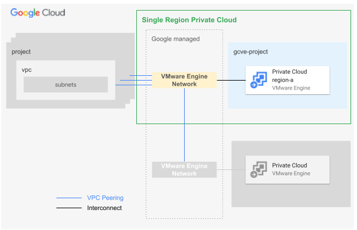

# Single Region GCVE Private Cloud

This blueprint presents an opinionated architecture to handle a simple single region GCVE private cloud. The general idea behind this blueprint is to deploy a single project hosting a GCVE private cloud connected to existing VPCs, the user needs to create before using this blueprint.

Multiple deployments of this blueprints allow the user to create multiple private clouds that are tipically required to provide the physical separation (eg app enviroments).

This blueprint is used as part of the [FAST GCVE stage](../../../fast/stages/3-gcve/) but it can also be used independently if desired.

<p align="center">
  
</p>

The overall architecture is based on the following design decisions:

- Each GCVE Private Cloud resides on a dedicated GCP project.
- Each GCVE Private Cloud is connected to a dedicated VMware Engine Network (VEN).
- Two Private Clouds can connect by establishing a peering between their rispectively VENs. (Shared VEN are not supported).
- The internet inbound/oubound connectivity is managed on the user VPC.   

The blueprint manages:

- project creation
- API/Services enablement
- IAM role assignment for groups
- VPC attachment
- project-level organization policy definitions
- billing setup (billing account attachment)

### User groups

As per our GCP best practices a GCVE private cloud relies on user groups to assign roles to human identities. These are the specific groups used by the Data Platform and their access patterns, from the [module documentation](../../../../blueprints/data-solutions/data-platform-foundations/#groups):

- *Data Engineers* They handle and run the Data Hub, with read access to all resources in order to troubleshoot possible issues with pipelines. This team can also impersonate any service account.
- *Data Analysts*. They perform analysis on datasets, with read access to the data warehouse Curated or Confidential projects depending on their privileges.
- *Data Security*:. They handle security configurations related to the Data Hub. This team has admin access to the common project to configure Cloud DLP templates or Data Catalog policy tags.

### Network

A Shared VPC is used here, either from one of the FAST networking stages (e.g. [hub and spoke via VPN](../../2-networking-b-vpn)) or from an external source.

## Basic usage

The following example shows how to deploy a CGVE private cloud and connect it to a VPC

```hcl
module "gcve-pc" {
  source             = "../../../../blueprints/gcve/single-region-pc"
  billing_account_id = var.billing_account.id
  folder_id          = var.folder_ids.gcve-prod
  groups_gcve = {
    gcp-gcve-admin   = "gcp-gcve-admin"
    gcp-gcve-viewers = "gcp-gcve-viewers"
  }
  labels = {
    environment = "dev"
  }
  organization_domain = var.organization.domain
  prefix              = "${var.prefix}-dev"
  project_id          = "gcve-0"
  vmw_network_peerings = {
    dev-landing = {
      peer_network                        = "https://www.googleapis.com/compute/v1/projects/em-dev-net-spoke-0/global/networks/dev-spoke-0"
      export_custom_routes                = false
      export_custom_routes_with_public_ip = false
      import_custom_routes                = false
      import_custom_routes_with_public_ip = false
      peer_to_vmware_engine_network       = false
    }
  }

  vmw_private_cloud_config = {
    cidr = "172.26.16.0/22"
    zone = "europe-west8-a"
    management_cluster_config = {
      name         = "mgmt-cluster"
      node_count   = 1
      node_type_id = "standard-72"
    }
  }
}
# tftest modules=7 resources=27
```

<!-- TFDOC OPTS files:1 -->
<!-- BEGIN TFDOC -->
## Files

| name | description | modules |
|---|---|---|
| [gcve-pc.tf](./gcve-pc.tf) | GCVE private cloud. | <code>gcve-private-cloud</code> |
| [main.tf](./main.tf) | Project. | <code>project</code> |
| [output.tf](./output.tf) | Output variables. |  |
| [variables.tf](./variables.tf) | Module variables. |  |

## Variables

| name | description | type | required | default |
|---|---|:---:|:---:|:---:|
| [billing_account_id](variables.tf#L17) | Billing account ID. | <code>string</code> | ✓ |  |
| [folder_id](variables.tf#L22) | Folder used for the GCVE project in folders/nnnnnnnnnnn format. | <code>string</code> | ✓ |  |
| [groups_gcve](variables.tf#L27) | GCVE groups. | <code title="object&#40;&#123;&#10;  gcp-gcve-admin   &#61; string&#10;  gcp-gcve-viewers &#61; string&#10;&#125;&#41;">object&#40;&#123;&#8230;&#125;&#41;</code> | ✓ |  |
| [organization_domain](variables.tf#L56) | Organization domain. | <code>string</code> | ✓ |  |
| [prefix](variables.tf#L61) | Prefix used for resource names. | <code>string</code> | ✓ |  |
| [project_id](variables.tf#L70) | ID of the project that will contain the GCVE private cloud. | <code>string</code> | ✓ |  |
| [vmw_private_cloud_config](variables.tf#L97) | The VMware private cloud configurations. The key is the unique private cloud name suffix. | <code title="object&#40;&#123;&#10;  cidr &#61; string&#10;  zone &#61; string&#10;  additional_cluster_configs &#61; optional&#40;map&#40;object&#40;&#123;&#10;    custom_core_count &#61; optional&#40;number&#41;&#10;    node_count        &#61; optional&#40;number, 3&#41;&#10;    node_type_id      &#61; optional&#40;string, &#34;standard-72&#34;&#41;&#10;  &#125;&#41;&#41;, &#123;&#125;&#41;&#10;  management_cluster_config &#61; optional&#40;object&#40;&#123;&#10;    custom_core_count &#61; optional&#40;number&#41;&#10;    name              &#61; optional&#40;string, &#34;mgmt-cluster&#34;&#41;&#10;    node_count        &#61; optional&#40;number, 3&#41;&#10;    node_type_id      &#61; optional&#40;string, &#34;standard-72&#34;&#41;&#10;  &#125;&#41;, &#123;&#125;&#41;&#10;  description &#61; optional&#40;string, &#34;Managed by Terraform.&#34;&#41;&#10;&#125;&#41;">object&#40;&#123;&#8230;&#125;&#41;</code> | ✓ |  |
| [group_iam](variables.tf#L36) | Project-level IAM bindings for groups. Use group emails as keys, list of roles as values. | <code>map&#40;list&#40;string&#41;&#41;</code> |  | <code>&#123;&#125;</code> |
| [iam](variables.tf#L43) | Project-level authoritative IAM bindings for users and service accounts in  {ROLE => [MEMBERS]} format. | <code>map&#40;list&#40;string&#41;&#41;</code> |  | <code>&#123;&#125;</code> |
| [labels](variables.tf#L50) | Project-level labels. | <code>map&#40;string&#41;</code> |  | <code>&#123;&#125;</code> |
| [project_services](variables.tf#L75) | Additional project services to enable. | <code>list&#40;string&#41;</code> |  | <code>&#91;&#93;</code> |
| [vmw_network_peerings](variables.tf#L82) | The network peerings towards users' VPCs or other VMware Engine networks. The key is the peering name suffix. | <code title="map&#40;object&#40;&#123;&#10;  peer_network                        &#61; string&#10;  description                         &#61; optional&#40;string, &#34;Managed by Terraform.&#34;&#41;&#10;  export_custom_routes                &#61; optional&#40;bool, false&#41;&#10;  export_custom_routes_with_public_ip &#61; optional&#40;bool, false&#41;&#10;  import_custom_routes                &#61; optional&#40;bool, false&#41;&#10;  import_custom_routes_with_public_ip &#61; optional&#40;bool, false&#41;&#10;  peer_to_vmware_engine_network       &#61; optional&#40;bool, false&#41;&#10;&#125;&#41;&#41;">map&#40;object&#40;&#123;&#8230;&#125;&#41;&#41;</code> |  | <code>&#123;&#125;</code> |
<!-- END TFDOC -->
