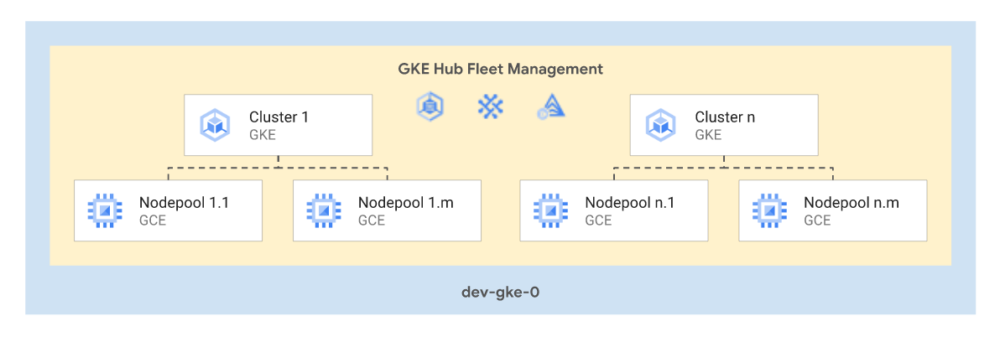

# GKE and Serverless examples

The examples in this folder show implement **end-to-end scenarios** for GKE or Serveless topologies that show how to automate common configurations or leverage specific products.

They are meant to be used as minimal but complete starting points to create actual infrastructure, and as playgrounds to experiment with Google Cloud features.

## Examples

### Multitenant GKE fleet

 This [example](./multitenant-fleet/) allows simple centralized management of similar sets of GKE clusters and their nodepools in a single project, and optional fleet management via GKE Hub templated configurations.
 
