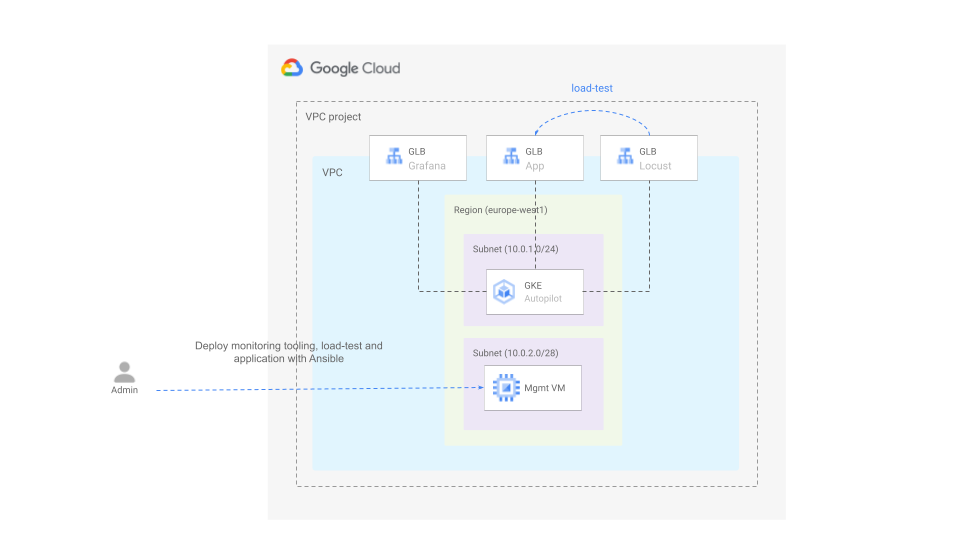

# Load testing an application running on an autopilot cluster

This blueprint creates an Autopilot cluster with Google-managed Prometheus enabled and installs an application that scales as the traffic that is hitting the load balancer exposing it grows. It also installs the tooling required to distributed load test with [locust](https://locust.io) on that application and the monitoring tooling required to observe how things evolve in the cluster during the load test. Ansible is used to install the application and all the tooling on a management VM. 

The diagram below depicts the architecture.



## Running the blueprint

1. Clone this repository or [open it in cloud shell](https://ssh.cloud.google.com/cloudshell/editor?cloudshell_git_repo=https%3A%2F%2Fgithub.com%2Fterraform-google-modules%2Fcloud-foundation-fabric&cloudshell_print=cloud-shell-readme.txt&cloudshell_working_dir=blueprints%2Fgke%2Fautopilot), then go through the following steps to create resources:

2. Initialize the terraform configuration

    ```
    terraform init
    ```

3. Apply the terraform configuration

    ```
    terraform apply -var project_id=my-project-id
    ```

4. Copy the IP addresses for grafana, the locust master.    

4. Change to the ansible directory and run the following command

    ```
    ansible-playbook -v playbook.yaml
    ```

5. Open to the locust master web interface url in your browser and start the load test


6. SSH to the management VM

    ```
    gcloud compute ssh mgmt --project my-project
    ```

7. Run the following command to check that the application pods are running on different nodes than the load testing and monitoring tooling.

    ```
    kubectl get pods -A -o wide
    ```    
  
8. Run the following command to see how the application pods scale

    ```
    kubectl get hpa -n sample -w
    ```

9. Run the following command to see how the cluster nodes scale

    ```
    kubectl get nodes -n
    ```

Alternatively you can also check all the above using the dashboards available in grafana.
<!-- BEGIN TFDOC -->
## Variables

| name | description | type | required | default |
|---|---|:---:|:---:|:---:|
| [project_id](variables.tf#L75) | Project ID. | <code>string</code> | ✓ |  |
| [cluster_network_config](variables.tf#L17) | Cluster network configuration. | <code title="object&#40;&#123;&#10;  nodes_cidr_block              &#61; string&#10;  pods_cidr_block               &#61; string&#10;  services_cidr_block           &#61; string&#10;  master_authorized_cidr_blocks &#61; map&#40;string&#41;&#10;  master_cidr_block             &#61; string&#10;&#125;&#41;">object&#40;&#123;&#8230;&#125;&#41;</code> |  | <code title="&#123;&#10;  nodes_cidr_block    &#61; &#34;10.0.1.0&#47;24&#34;&#10;  pods_cidr_block     &#61; &#34;172.16.0.0&#47;20&#34;&#10;  services_cidr_block &#61; &#34;192.168.0.0&#47;24&#34;&#10;  master_authorized_cidr_blocks &#61; &#123;&#10;    internal &#61; &#34;10.0.0.0&#47;8&#34;&#10;  &#125;&#10;  master_cidr_block &#61; &#34;10.0.0.0&#47;28&#34;&#10;&#125;">&#123;&#8230;&#125;</code> |
| [deletion_protection](variables.tf#L37) | Prevent Terraform from destroying data storage resources (storage buckets, GKE clusters, CloudSQL instances) in this blueprint. When this field is set in Terraform state, a terraform destroy or terraform apply that would delete data storage resources will fail. | <code>bool</code> |  | <code>false</code> |
| [mgmt_server_config](variables.tf#L44) | Management server configuration. | <code title="object&#40;&#123;&#10;  disk_size     &#61; number&#10;  disk_type     &#61; string&#10;  image         &#61; string&#10;  instance_type &#61; string&#10;&#125;&#41;">object&#40;&#123;&#8230;&#125;&#41;</code> |  | <code title="&#123;&#10;  disk_size     &#61; 50&#10;  disk_type     &#61; &#34;pd-ssd&#34;&#10;  image         &#61; &#34;projects&#47;ubuntu-os-cloud&#47;global&#47;images&#47;family&#47;ubuntu-2204-lts&#34;&#10;  instance_type &#61; &#34;n1-standard-2&#34;&#10;&#125;">&#123;&#8230;&#125;</code> |
| [mgmt_subnet_cidr_block](variables.tf#L60) | Management subnet IP CIDR range. | <code>string</code> |  | <code>&#34;10.0.2.0&#47;24&#34;</code> |
| [project_create](variables.tf#L66) | Parameters for the creation of the new project. | <code title="object&#40;&#123;&#10;  billing_account_id &#61; string&#10;  parent             &#61; string&#10;&#125;&#41;">object&#40;&#123;&#8230;&#125;&#41;</code> |  | <code>null</code> |
| [region](variables.tf#L80) | Region. | <code>string</code> |  | <code>&#34;europe-west1&#34;</code> |
| [vpc_create](variables.tf#L86) | Flag indicating whether the VPC should be created or not. | <code>bool</code> |  | <code>true</code> |
| [vpc_name](variables.tf#L92) | VPC name. | <code>string</code> |  | <code>&#34;vpc&#34;</code> |

## Outputs

| name | description | sensitive |
|---|---|:---:|
| [urls](outputs.tf#L17) | Grafanam, locust and application URLs. |  |
<!-- END TFDOC -->
## Test

```hcl
module "test" {
  source = "./fabric/blueprints/gke/autopilot"
  project_create = {
    billing_account_id = "12345-12345-12345"
    parent             = "folders/123456789"
  }
  project_id = "my-project"
}
# tftest modules=11 resources=36
```
