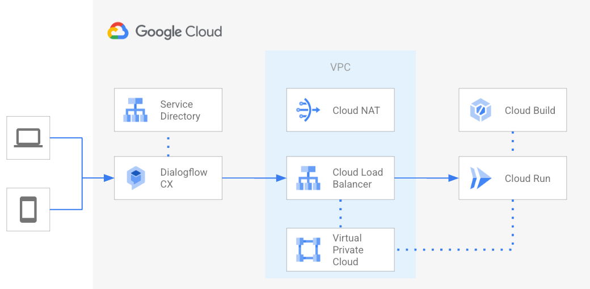

# GCP ML/AI Services blueprints

The blueprints in this folder implement **typical ML/AI service topologies** and **end-to-end scenarios**, that allow testing specific features.

They are meant to be used as minimal but complete starting points to create actual infrastructure, and as playgrounds to experiment with specific Google Cloud features.

## Blueprints

### Dialgoflow CX - Private deployment

This [blueprint](./dialogflow-cx/) creates a [Dialgoflow CX agent](https://cloud.google.com/dialogflow/cx/docs/concept/agent) with private connectivity to a Cloud Run instance acting as webhook.

 
