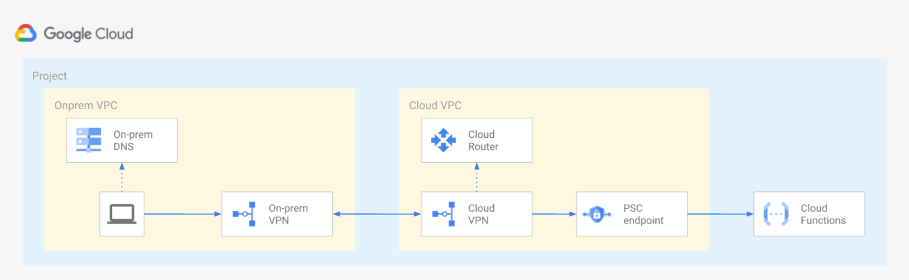
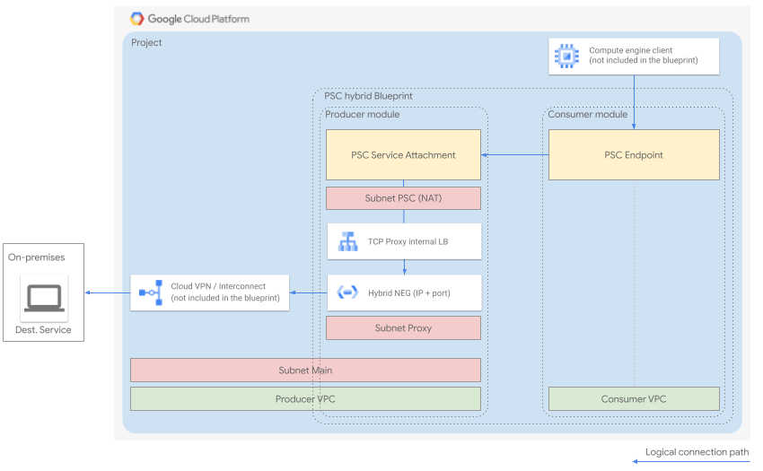
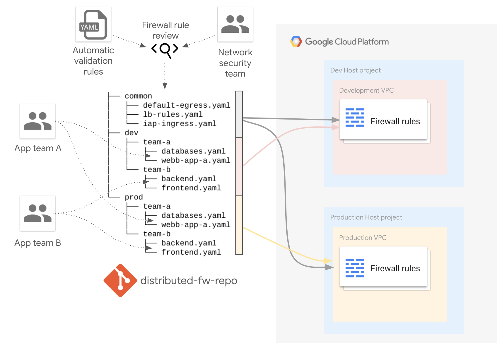
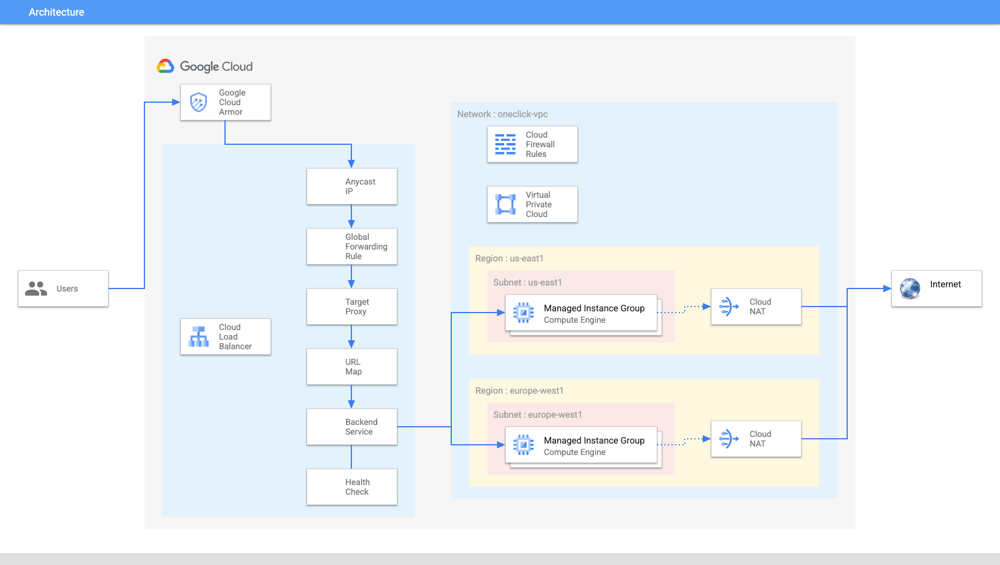
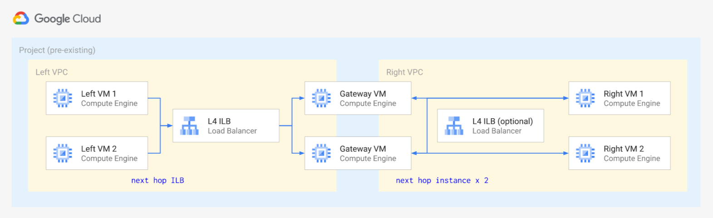
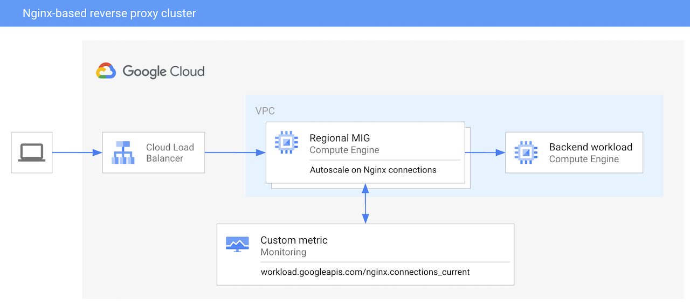
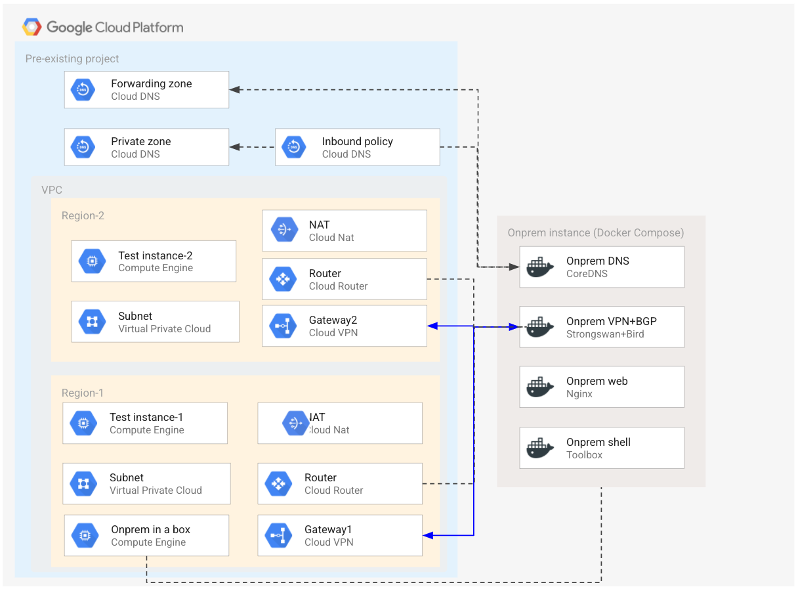
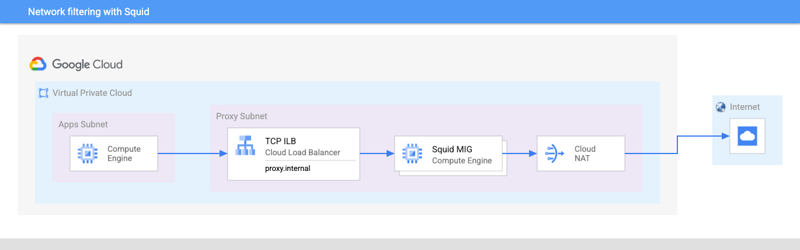
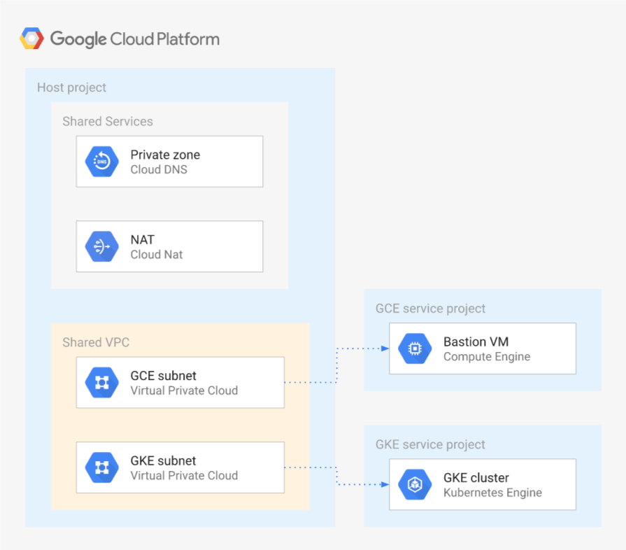

# Networking and infrastructure blueprints

The blueprints in this folder implement **typical network topologies** like hub and spoke, or **end-to-end scenarios** that allow testing specific features like on-premises DNS policies and Private Google Access.

They are meant to be used as minimal but complete starting points to create actual infrastructure, and as playgrounds to experiment with specific Google Cloud features.

## Blueprints

### Calling a private Cloud Function from on-premises

 This [blueprint](./private-cloud-function-from-onprem/) shows how to invoke a [private Google Cloud Function](https://cloud.google.com/functions/docs/networking/network-settings) from the on-prem environment via a [Private Service Connect endpoint](https://cloud.google.com/vpc/docs/private-service-connect#benefits-apis).

 

### Calling on-premise services through PSC and hybrid NEGs

 This [blueprint](./psc-hybrid/) shows how to privately connect to on-premise services (IP + port) from GCP, leveraging [Private Service Connect (PSC)](https://cloud.google.com/vpc/docs/private-service-connect) and [Hybrid Network Endpoint Groups](https://cloud.google.com/load-balancing/docs/negs/hybrid-neg-concepts).

 

### Decentralized firewall management

 This [blueprint](./decentralized-firewall/) shows how a decentralized firewall management can be organized using the [firewall factory](../factories/net-vpc-firewall-yaml/).

 

### GLB and multi-regional daisy-chaining through hybrid NEGs

 This [blueprint](./glb-hybrid-neg-internal/) shows the experimental use of hybrid NEGs behind external Global Load Balancers (GLBs) to connect to GCP instances living in spoke VPCs and behind Network Virtual Appliances (NVAs).

 

## HTTP Load Balancer with Cloud Armor

 This [blueprint](./glb-and-armor/) contains all necessary Terraform modules to build a multi-regional infrastructure with horizontally scalable managed instance group backends, HTTP load balancing and Google’s advanced WAF security tool (Cloud Armor) on top to securely deploy an application at global scale.

 

### Hub and Spoke via Dynamic VPN

 This [blueprint](./hub-and-spoke-vpn/) implements a hub and spoke topology via dynamic VPN tunnels, a common design where peering cannot be used due to limitations on the number of spokes or connectivity to managed services.

The blueprint shows how to implement spoke transitivity via BGP advertisements, how to expose hub DNS zones to spokes via DNS peering, and allows easy testing of different VPN and BGP configurations.

 

### Hub and Spoke via Peering

 This [blueprint](./hub-and-spoke-peering/) implements a hub and spoke topology via VPC peering, a common design where a landing zone VPC (hub) is connected to on-premises, and then peered with satellite VPCs (spokes) to further partition the infrastructure.

The sample highlights the lack of transitivity in peering: the absence of connectivity between spokes, and the need create workarounds for private service access to managed services. One such workaround is shown for private GKE, allowing access from hub and all spokes to GKE masters via a dedicated VPN.

 

### Internal Network LB as next hop

 This [blueprint](./ilb-next-hop/) allows testing [Internal Network LB as next hop](https://cloud.google.com/load-balancing/docs/internal/ilb-next-hop-overview) using simple Linux gateway VMS between two VPCs, to emulate virtual appliances. An optional additional Internal Network LB can be enabled to test multiple load balancer configurations and hashing.

 

<!--
### Nginx-based reverse proxy cluster

 This [blueprint](./nginx-reverse-proxy-cluster/) how to deploy an autoscaling reverse proxy cluster using Nginx, based on regional Managed Instance Groups. The autoscaling is driven by Nginx current connections metric, sent by Cloud Ops Agent.

 

### DNS and Private Access for On-premises

 This [blueprint](./onprem-google-access-dns/) uses an emulated on-premises environment running in Docker containers inside a GCE instance, to allow testing specific features like DNS policies, DNS forwarding zones across VPN, and Private Access for On-premises hosts.

The emulated on-premises environment can be used to test access to different services from outside Google Cloud, by implementing a VPN connection and BGP to Google CLoud via Strongswan and Bird.

 

-->

### Network filtering with Squid

 This [blueprint](./filtering-proxy/) how to deploy a filtering HTTP proxy to restrict Internet access, in a simplified setup using a VPC with two subnets and a Cloud DNS zone, and an optional MIG for scaling.

 

### Shared VPC with GKE and per-subnet support

 This [blueprint](./shared-vpc-gke/) shows how to configure a Shared VPC, including the specific IAM configurations needed for GKE, and to give different level of access to the VPC subnets to different identities.

It is meant to be used as a starting point for most Shared VPC configurations, and to be integrated to the above blueprints where Shared VPC is needed in more complex network topologies.

 

### Exposing applications to the internet via GCLB and Private Service Connect

 This [blueprint](./psc-glb-and-armor/) shows how to configure an external Google Cloud Load Balancer, with a simple Cloud Armor rule to protect against DDOS attacks, to provide an external endpoint to an application provided by another team via Private Service Connect (PSC).

It is meant to be used as a starting point for users that want to explore PSC to reduce some of the complexity in their network setup.

 
