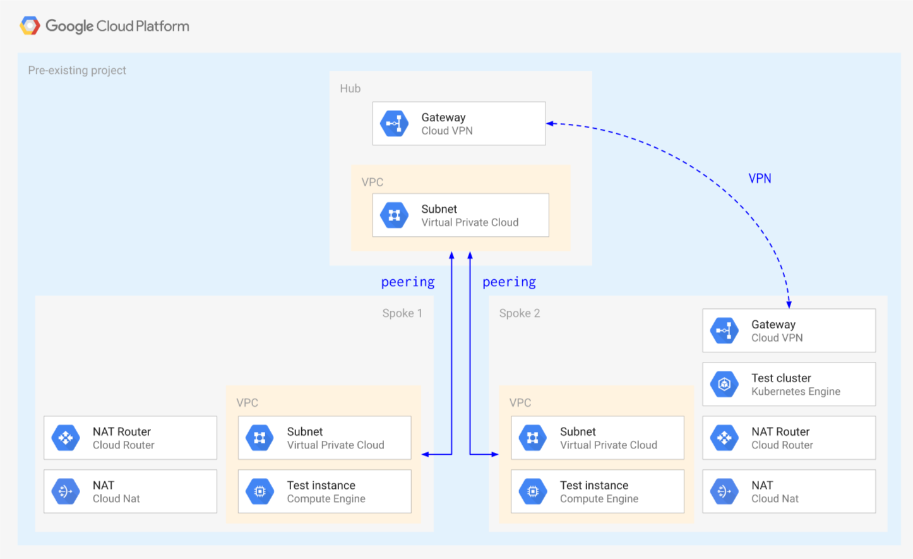
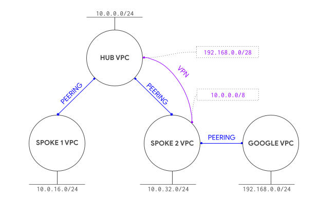

# Hub and Spoke using VPC Network Peering

This blueprint creates a simple **Hub and Spoke** setup, where the VPC network connects satellite locations (spokes) through a single intermediary location (hub) via [VPC Network Peering](https://cloud.google.com/vpc/docs/vpc-peering).

Since VPC Network Peering does not provide transitive routing, some things
don't work without additional configuration. By default, spokes cannot
talk with other spokes, and managed services in tenent networks can only be
reached from the attached spoke.

To get around these limitations, this blueprint uses [Cloud
VPN](https://cloud.google.com/network-connectivity/docs/vpn/concepts/overview)
to provide transitive routing and to establish connectivity to the Google Kubernetes Engine (GKE)
masters in the tenant project ([courtesy of @drebes](https://github.com/drebes/tf-samples/blob/master/gke-master-from-hub/main.tf#L10)). Other solutions typically involve the use of proxies, as [described in this GKE article](https://cloud.google.com/solutions/creating-kubernetes-engine-private-clusters-with-net-proxies).

One other topic that needs to be considered when using peering is the limit of 25 peerings in each peering group, which constrains the scalability of design like the one presented here.

The blueprint has been purposefully kept simple to show how to use and wire the VPC modules together, and so that it can be used as a basis for more complex scenarios. This is the high level diagram:




## Managed resources and services

This sample creates several distinct groups of resources:

- three VPC networks, one each for the hub and spokes, each with one subnet
- VPC Network Peering configurations between the hub network and each spoke
- a Compute Engine VM instance for each VPC network. The VMs are created
 using an accompanying service account
- private GKE cluster with a single node pool in the spoke-2 VPC network. The GKE nodes have an accompanying service account.
- one set of firewall rules for each VPC network
- one Cloud NAT configuration for each network
- one test instance for each spoke
- VPN gateways in the hub and spoke-2 networks with accompanying tunnels. These tunnels allow the Cloud Routers to exchange transitive routes so that resources in spoke-1 and spoke-2 can reach each other, and so that resources in the hub network can reach the control plane of the GKE cluster hosted in spoke-2.

## Testing GKE access from spoke 1

As mentioned above, VPN tunnels are to provide transitive routing so that
the hub network can connect to the GKE master. This diagram illustrates the solution



To test cluster access, first log on to the spoke 2 instance and confirm cluster and IAM roles are set up correctly:

```bash
gcloud container clusters get-credentials cluster-1 --zone europe-west1-b
kubectl get all
```

The blueprint configures the peering with the GKE master VPC network to export routes for you, so that VPN routes are passed through the peering. You can disable by hand in the console or by editing the `peering_config` variable in the `gke-cluster` module, to test non-working configurations or switch to using the [GKE proxy](https://cloud.google.com/solutions/creating-kubernetes-engine-private-clusters-with-net-proxies).

### Export routes via Terraform (recommended)

Change the GKE cluster module and add a new variable after `private_cluster_config`:

```tfvars
 peering_config = {
   export_routes = true
   import_routes = false
 }
```

If you added the variable after applying, simply apply Terraform again.


### Export routes via gcloud (alternative)

If you prefer to use `gcloud` to export routes on the peering, first identify the peering (it has a name like `gke-xxxxxxxxxxxxxxxxxxxx-xxxx-xxxx-peer`) in the Cloud Console from the *VPC network peering* page, or using `gcloud`, then configure it to export routes:

```
gcloud compute networks peerings list
# find the gke-xxxxxxxxxxxxxxxxxxxx-xxxx-xxxx-peer in the spoke-2 network
gcloud compute networks peerings update [peering name from above] \
 --network spoke-2 --export-custom-routes
```

### Test routes

Then connect via SSH to the hub VM instance and run the same commands you ran on the spoke 2 instance above. You should be able to run `kubectl` commands against the cluster. To test the default situation with no supporting VPN, just comment out the two VPN modules in `main.tf` and run `terraform apply` to bring down the VPN gateways and tunnels. GKE should only become accessible from spoke 2.

## Operational considerations

A single pre-existing project is used in this blueprint to keep variables and complexity to a minimum, in a real world scenario each spoke would use a separate project (and Shared VPC).

A few APIs need to be enabled in the project, if `apply` fails due to a service not being enabled just click on the link in the error message to enable it for the project, then resume `apply`.

You can connect your hub to on-premises using Cloud Interconnect or HA VPN. On-premises networks would be able to reach the hub and all spokes, and the hub and all spokes would be able to reach on-premises, assuming the on-premises network is configured to allow access.

You can add additional spoke to the architecture. All of these spokes have networking similar to spoke-1: They will have connectivity to the hub and to spoke-2, but not to each other unless you also create VPN tunnels for the new spokes.
<!-- BEGIN TFDOC -->
## Variables

| name | description | type | required | default |
|---|---|:---:|:---:|:---:|
| [prefix](variables.tf#L41) | Prefix used for resource names. | <code>string</code> | ✓ |  |
| [project_id](variables.tf#L76) | Project id used for all resources. | <code>string</code> | ✓ |  |
| [deletion_protection](variables.tf#L15) | Prevent Terraform from destroying data storage resources (storage buckets, GKE clusters, CloudSQL instances) in this blueprint. When this field is set in Terraform state, a terraform destroy or terraform apply that would delete data storage resources will fail. | <code>bool</code> |  | <code>false</code> |
| [ip_ranges](variables.tf#L22) | IP CIDR ranges. | <code>map&#40;string&#41;</code> |  | <code title="&#123;&#10;  hub     &#61; &#34;10.0.0.0&#47;24&#34;&#10;  spoke-1 &#61; &#34;10.0.16.0&#47;24&#34;&#10;  spoke-2 &#61; &#34;10.0.32.0&#47;24&#34;&#10;&#125;">&#123;&#8230;&#125;</code> |
| [ip_secondary_ranges](variables.tf#L32) | Secondary IP CIDR ranges. | <code>map&#40;string&#41;</code> |  | <code title="&#123;&#10;  spoke-2-pods     &#61; &#34;10.128.0.0&#47;18&#34;&#10;  spoke-2-services &#61; &#34;172.16.0.0&#47;24&#34;&#10;&#125;">&#123;&#8230;&#125;</code> |
| [private_service_ranges](variables.tf#L50) | Private service IP CIDR ranges. | <code>map&#40;string&#41;</code> |  | <code title="&#123;&#10;  spoke-2-cluster-1 &#61; &#34;192.168.0.0&#47;28&#34;&#10;&#125;">&#123;&#8230;&#125;</code> |
| [project_create](variables.tf#L58) | Set to non null if project needs to be created. | <code title="object&#40;&#123;&#10;  billing_account &#61; string&#10;  oslogin         &#61; bool&#10;  parent          &#61; string&#10;&#125;&#41;">object&#40;&#123;&#8230;&#125;&#41;</code> |  | <code>null</code> |
| [region](variables.tf#L81) | VPC region. | <code>string</code> |  | <code>&#34;europe-west1&#34;</code> |

## Outputs

| name | description | sensitive |
|---|---|:---:|
| [project](outputs.tf#L15) | Project id. |  |
| [vms](outputs.tf#L20) | GCE VMs. |  |
<!-- END TFDOC -->
## Test

```hcl
module "test" {
  source = "./fabric/blueprints/networking/hub-and-spoke-peering"
  prefix = "prefix"
  project_create = {
    billing_account = "123456-123456-123456"
    oslogin         = true
    parent          = "folders/123456789"
  }
  project_id = "project-1"
}

# tftest modules=22 resources=69
```
