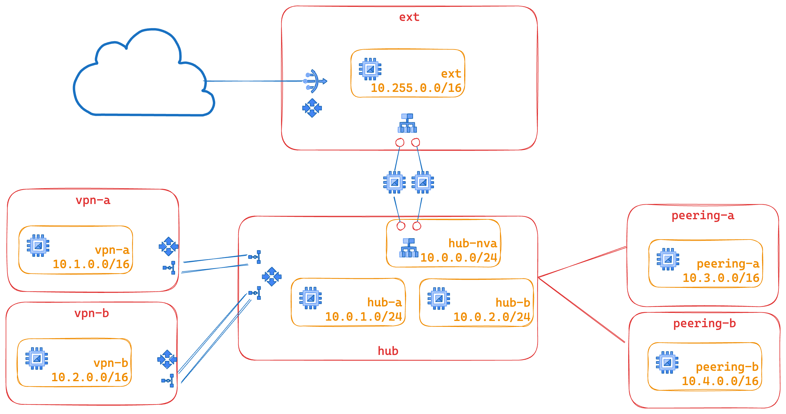

# Network Sandbox

This blueprint creates a networking playground showing a number of different VPC connectivity options:

* Hub and spoke via HA VPN
* Hub and spoke via VPC peering
* Interconnecting two networks via a network virtual appliance (aka NVA)

On top of that, this blueprint implements Policy Based Routing (aka PBR) to show how to implement an Intrusion Prevention System (IPS) within the `hub` VPC.

The blueprint has been purposefully kept simple to show how to use and wire the VPC and VPN-HA modules together, and so that it can be used as a basis for experimentation.

This is the high level diagram of this blueprint:



## Prerequisites

A single pre-existing project is used in this blueprint to keep variables and complexity to a minimum, in a real world scenarios each spoke would probably use a separate project.

The provided project needs a valid billing account.

You can easily create such a project by commenting turning on project creation in the project module contained in `main.tf`, as shown in this snippet:

```hcl
module "project" {
  source = "../../../modules/project"
  name   = var.project_id
  # comment or remove this line to enable project creation
  # project_create = false
  # add the following line with your billing account id value
  billing_account = "12345-ABCD-12345"
  services = [
    "compute.googleapis.com",
    "dns.googleapis.com"
  ]
}

# tftest skip
```

## Testing

Once the blueprint is up, you can quickly test features by logging in to one of the test VMs:

```bash
gcloud compute ssh hs-ha-lnd-test-r1
# test DNS resolution of the landing zone
ping test-r1.example.com
# test DNS resolution of the prod zone, and prod reachability
ping test-r1.prod.example.com
# test DNS resolution of the dev zone, and dev reachability via global routing
ping test-r2.dev.example.com
```

<!-- TFDOC OPTS files:1 -->
<!-- BEGIN TFDOC -->

<!-- END TFDOC -->
## Test

```hcl
module "test" {
  source = "./fabric/blueprints/networking/hub-and-spoke-vpn"
  prefix = "prefix"
  project_create_config = {
    billing_account_id = "123456-123456-123456"
    parent_id          = "folders/123456789"
  }
  project_id = "project-1"
}

# tftest modules=20 resources=79
```
