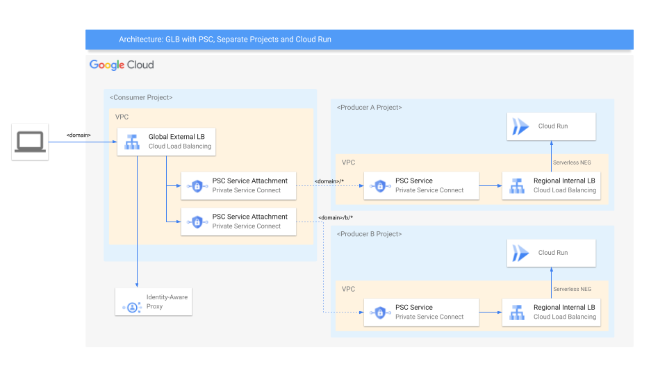
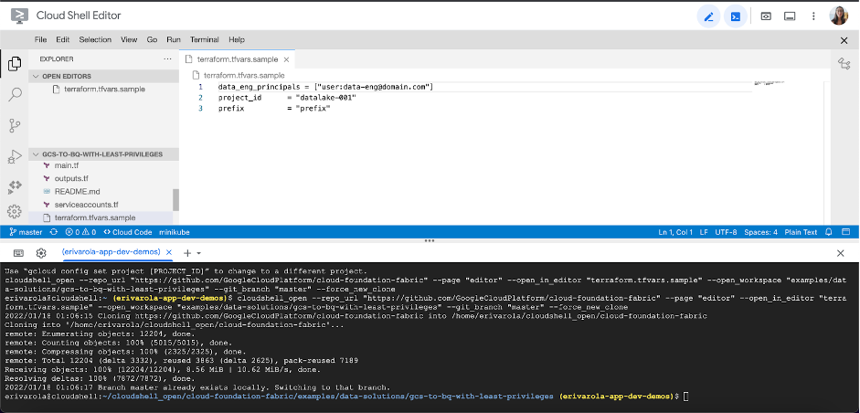

# HTTP Load Balancer with Cloud Armor and Private Service Connect

## Introduction

This blueprint contains all necessary Terraform code to configure HTTP load balancing and Google’s advanced WAF security tool (Cloud Armor) on top to securely deploy an application, provided by another team.

This tutorial is general enough to fit in a variety of use-cases, from hosting a mobile app's backend to deploy proprietary workloads at scale.

## Architecture

<p align="center">  </p>

The main components that we would be setting up are (to learn more about these products, click on the hyperlinks):

* [Cloud Armor](https://cloud.google.com/armor) - Google Cloud Armor is the web-application firewall (WAF) and DDoS mitigation service that helps users defend their web apps and services at Google scale at the edge of Google’s network.
* [Cloud Load Balancer](https://cloud.google.com/load-balancing) - When your app usage spikes, it is important to scale, optimize and secure the app. Cloud Load Balancing is a fully distributed solution that balances user traffic to multiple backends to avoid congestion, reduce latency and increase security. Some important features it offers that we use here are:
  * Single global anycast IP and autoscaling - CLB acts as a frontend to all your backend instances across all regions. It provides cross-region load balancing, automatic multi-region failover and scales to support increase in resources.
  * Global Forwarding Rule - To route traffic to different regions, global load balancers use global forwarding rules, which bind the global IP address and a single target proxy.
  * Target Proxy - For external HTTP(S) load balancers, proxies route incoming requests to a URL map. This is essentially how you can handle the connections.
  * URL Map - URL Maps are used to route requests to a backend service based on the rules that you define for the host and path of an incoming URL.
  * Backend Service - A Backend Service defines CLB distributes traffic. The backend service configuration consists of a set of values - protocols to connect to backends, session settings, health checks and timeouts.
  * Health Check - Health check is a method provided to determine if the corresponding backends respond to traffic. Health checks connect to backends on a configurable, periodic basis. Each connection attempt is called a probe. Google Cloud records the success or failure of each probe.
* [Private Service Connect](https://cloud.google.com/vpc/docs/private-service-connect) - Private Service Connect. Private Service Connect allows private consumption of services across VPC networks that belong to different groups, teams, projects, or organizations. You can publish and consume services using IP addresses that you define and that are internal to your VPC network. No VPC peering or VPN is needed between the consumer and produce of the service.
* [Cloud Run](https://cloud.google.com/run) - Cloud Run is a fully managed container runtime on Google Cloud. In this blueprint it's used to host [httpbin](http://httpbin.org/), which is a simple HTTP server application. The setup the blueprint showcases will also work with GCE or GKE, but might need small adjustments.

This architecture is ideal, if the external Load Balancer and the application are managed by different teams. The application team configures the application using the Internal Load Balancer, they have all the freedom how they evolve and change their implementation. The load balancer team, configures the load balancer and assures security using Cloud Armor.

In a real world implementation, the IaC code might be split into two separate repositories, and the application team raises changes to the load balancer using a pull request. Also the service attachment in the producer project is configured to allow all connections via `connection_preference = "ACCEPT_AUTOMATIC"` in a real world setup you would want to use a manual white listing instead.

The Terraform IaC also deploys a VM to the producer VPC network, this VM is only needed for the internal Layer 7 Load Balancer to properly work with Cloud Run, but has no logical function in the setup, no traffic is routed via this machine.

## Setup

This solution assumes you already have two projects created and set up where you wish to host these resources. If not, and you would like for the projects to create a new project as well, please refer to the [github repository](https://github.com/GoogleCloudPlatform/cloud-foundation-fabric/tree/master/blueprints/data-solutions/gcs-to-bq-with-least-privileges) for instructions.

### Prerequisites

* Have an [organization](https://cloud.google.com/resource-manager/docs/creating-managing-organization) set up in Google cloud.
* Have a [billing account](https://cloud.google.com/billing/docs/how-to/manage-billing-account) set up.
* Have three existing [projects](https://cloud.google.com/resource-manager/docs/creating-managing-projects) with [billing enabled](https://cloud.google.com/billing/docs/how-to/modify-project).

### Roles & Permissions

In order to spin up this architecture, you will need to be a user with the “__Project owner__” [IAM](https://cloud.google.com/iam) role on the existing project:

Note: To grant a user a role, take a look at the [Granting and Revoking Access](https://cloud.google.com/iam/docs/granting-changing-revoking-access#grant-single-role) documentation.

### Spinning up the architecture

#### Step 1: Cloning the repository

Click on the button below, sign in if required and when the prompt appears, click on “confirm”.

[](https://ssh.cloud.google.com/cloudshell/editor?cloudshell_git_repo=https%3A%2F%2Fgithub.com%2Fterraform-google-modules%2Fcloud-foundation-fabric&cloudshell_print=cloud-shell-readme.txt&cloudshell_working_dir=blueprints%2Fnetworking%2Fpsc-glb-and-armor)

This will clone the repository to your cloud shell and a screen like this one will appear:



Before we deploy the architecture, you will need the following information:

* The __project IDs__.

#### Step 2: Deploying the resources

1. After cloning the repo, and going through the prerequisites, head back to the cloud shell editor.
2. Make sure you’re in the following directory. if not, you can change your directory to it via the ‘cd’ command:

       cloudshell_open/cloud-foundation-fabric/blueprints/cloud-operations/glb_and_armor

3. Run the following command to initialize the terraform working directory:

       terraform init

4. Copy the following command into a console and replace __[consumer-project-id]__ and __[producer-a-project-id]__ and __[producer-b-project-id]__ with your project’s IDs. Then run the following command to run the terraform script and create all relevant resources for this architecture:

       terraform apply -var consumer_project_id=[consumer-project-id] -var producer_a_project_id=[producer-a-project-id] -var producer_b_project_id=[producer-b-project-id] -var region=[gcp-region]

The resource creation will take a few minutes… but when it’s complete, you should see an output stating the command completed successfully with a list of the created resources.

__Congratulations__! You have successfully deployed an HTTP Load Balancer with Cloud Armor security and a PSC based backend server.

## Testing your architecture

You can simply invoke the service by calling

       Check the default path (producer A):
       curl -H "Authorization: Bearer $(gcloud auth print-identity-token)" -H "Content-Type: application/json" http://$(terraform output -raw lb_ip)/uuid

       Specifically call the producer A path:
       curl -H "Authorization: Bearer $(gcloud auth print-identity-token)" -H "Content-Type: application/json" http://$(terraform output -raw lb_ip)/a/uuid

       Specifically call the producer B path:
       curl -H "Authorization: Bearer $(gcloud auth print-identity-token)" -H "Content-Type: application/json" http://$(terraform output -raw lb_ip)/b/uuid

## Cleaning up your environment

The easiest way to remove all the deployed resources is to run the following command in Cloud Shell:

        terraform destroy

The above command will delete the associated resources so there will be no billable charges made afterwards.
<!-- BEGIN TFDOC -->
## Variables

| name | description | type | required | default |
|---|---|:---:|:---:|:---:|
| [consumer_project_id](variables.tf#L17) | The consumer project, in which the GCLB and Cloud Armor should be created. | <code>string</code> | ✓ |  |
| [producer_a_project_id](variables.tf#L28) | The producer A project, in which the LB, PSC Service Attachment and Cloud Run service should be created. | <code>string</code> | ✓ |  |
| [producer_b_project_id](variables.tf#L33) | The producer B project, in which the LB, PSC Service Attachment and Cloud Run service should be created. | <code>string</code> | ✓ |  |
| [region](variables.tf#L47) | The GCP region in which the resources should be deployed. | <code>string</code> | ✓ |  |
| [prefix](variables.tf#L22) | Prefix used for resource names. | <code>string</code> |  | <code>null</code> |
| [project_create_config](variables.tf#L38) | Create project instead of using an existing one. | <code title="object&#40;&#123;&#10;  billing_account &#61; string&#10;  parent          &#61; optional&#40;string&#41;&#10;&#125;&#41;">object&#40;&#123;&#8230;&#125;&#41;</code> |  | <code>null</code> |

## Outputs

| name | description | sensitive |
|---|---|:---:|
| [lb_ip](outputs.tf#L17) | Load balancer IP address. |  |
<!-- END TFDOC -->
## Test

```hcl
module "psc-glb-and-armor-test" {
  source = "./fabric/blueprints/networking/psc-glb-and-armor"
  prefix = "test"
  project_create_config = {
    billing_account = var.billing_account_id
  }
  consumer_project_id   = "project-1"
  producer_a_project_id = "project-2"
  producer_b_project_id = "project-3"
  region                = "europe-west2"
}
# tftest modules=14 resources=64
```
