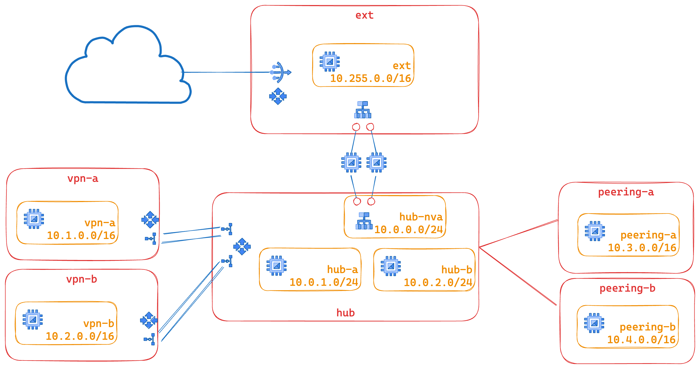

# VPC Connectivity Lab

This blueprint creates a networking playground showing a number of different VPC connectivity options:

* Hub and spoke via HA VPN
* Hub and spoke via VPC peering
* Interconnecting two networks via a network virtual appliance (aka NVA)

On top of that, this blueprint implements Policy Based Routing (aka PBR) to show how to force all traffic within a VPC to be funneled through an internal network passthrough load balancer, to implement an Intrusion Prevention System (IPS). PBR is enabled in the `hub` VPC, matching all traffic originating from within that VPC.

The blueprint has been purposefully kept simple to show how to use and wire VPCs together, and so that it can be used as a basis for experimentation.

This is the high level diagram of this blueprint:



## Prerequisites

This blueprint is contained within a single project to keep complexity to a minimum, even though in a real world scenario each spoke would probably use a separate project.

The blueprint can either create a new project or consume an existing one.
If the variable `var.project_create_config` is populated, the blueprint will create a new project named `var.project_id`, otherwise the blueprint will use an existing project with the same id.

## Testing reachability

After running terraform, and in case `var.test_vms` is set to true (as it is by default), a set of ping commands will be printed to check the reachability of all VMs. The blueprint is configured to ensure that all VMs can ping each other - so you can simply SSH to each one, and run the generated ping commands, e.g.:

```bash
ping -c 1 ext.example
ping -c 1 hub-a.example
ping -c 1 hub-b.example
ping -c 1 spoke-peering-a.example
ping -c 1 spoke-peering-b.example
ping -c 1 spoke-vpn-a.example
ping -c 1 spoke-vpn-b.example
```

## Testing IPS/NVA

Per blueprint setup, not all traffic will flow through the deployed test NVAs.
You should expect the following flows to be routed through them:

* `ext` to {`hub`, `peering-a`, `peering-b`, `vpn-a`, `vpn-b`}
* `peering-a` to {`ext`, `peering-b`}
* `peering-b` to {`ext`, `peering-a`}
* `vpn-a` to {`ext`}
* `vpn-b` to {`ext`}

Additional PBR routes could be configured to force all traffic coming from `vpn-{a,b}` to go through the NVA - however traffic coming from `peering-{a,b}` can NOT be subjected to PBR routes, due to product constrains.

In order to see the actual traffic flow, you'll want to manually stop one of the NVA instances (to force all traffic to be sent through a single VM), SSH to the active NVA instance and run the following commands:

```bash
# Setting the toolbox up might take a while since we're using cheap instances :)
$ toolbox

# Once inside the toolbox
$ tcpdump -i any icmp -n

```

<!-- TFDOC OPTS files:1 -->
<!-- BEGIN TFDOC -->
## Files

| name | description | modules | resources |
|---|---|---|---|
| [dns-hub.tf](./dns-hub.tf) | DNS setup. | <code>dns</code> |  |
| [main.tf](./main.tf) | Project setup. | <code>project</code> |  |
| [nva.tf](./nva.tf) | None | <code>compute-vm</code> · <code>simple-nva</code> | <code>google_compute_instance_group</code> |
| [outputs.tf](./outputs.tf) | Module outputs. |  |  |
| [test-resources.tf](./test-resources.tf) | None |  |  |
| [variables.tf](./variables.tf) | Module variables. |  |  |
| [vpc-ext.tf](./vpc-ext.tf) | External VPC. | <code>net-address</code> · <code>net-cloudnat</code> · <code>net-lb-int</code> · <code>net-vpc</code> · <code>net-vpc-firewall</code> | <code>google_compute_route</code> |
| [vpc-hub.tf](./vpc-hub.tf) | Internal Hub VPC. | <code>net-address</code> · <code>net-lb-int</code> · <code>net-vpc</code> · <code>net-vpc-firewall</code> · <code>net-vpc-peering</code> · <code>net-vpn-ha</code> | <code>google_compute_route</code> |
| [vpc-peering-a.tf](./vpc-peering-a.tf) | None | <code>net-vpc</code> · <code>net-vpc-firewall</code> |  |
| [vpc-peering-b.tf](./vpc-peering-b.tf) | None | <code>net-vpc</code> · <code>net-vpc-firewall</code> |  |
| [vpc-vpn-a.tf](./vpc-vpn-a.tf) | None | <code>net-vpc</code> · <code>net-vpc-firewall</code> · <code>net-vpn-ha</code> |  |
| [vpc-vpn-b.tf](./vpc-vpn-b.tf) | None | <code>net-vpc</code> · <code>net-vpc-firewall</code> · <code>net-vpn-ha</code> |  |

## Variables

| name | description | type | required | default |
|---|---|:---:|:---:|:---:|
| [prefix](variables.tf#L37) | Prefix used for resource names. | <code>string</code> | ✓ |  |
| [ip_ranges](variables.tf#L17) | Subnet/Routes IP CIDR ranges. | <code>map&#40;string&#41;</code> |  | <code title="&#123;&#10;  ext         &#61; &#34;10.255.0.0&#47;16&#34;&#10;  hub-a       &#61; &#34;10.0.1.0&#47;24&#34;&#10;  hub-all     &#61; &#34;10.0.0.0&#47;16&#34;&#10;  hub-b       &#61; &#34;10.0.2.0&#47;24&#34;&#10;  hub-nva     &#61; &#34;10.0.0.0&#47;24&#34;&#10;  int         &#61; &#34;10.0.0.0&#47;9&#34;&#10;  peering-a   &#61; &#34;10.3.0.0&#47;24&#34;&#10;  peering-b   &#61; &#34;10.4.0.0&#47;24&#34;&#10;  rfc1918_10  &#61; &#34;10.0.0.0&#47;8&#34;&#10;  rfc1918_172 &#61; &#34;172.16.0.0&#47;12&#34;&#10;  rfc1918_192 &#61; &#34;192.168.0.0&#47;16&#34;&#10;  vpn-a       &#61; &#34;10.1.0.0&#47;24&#34;&#10;  vpn-b       &#61; &#34;10.2.0.0&#47;24&#34;&#10;&#125;">&#123;&#8230;&#125;</code> |
| [project_create_config](variables.tf#L46) | Populate with billing account id to trigger project creation. | <code title="object&#40;&#123;&#10;  billing_account_id &#61; string&#10;  parent_id          &#61; string&#10;&#125;&#41;">object&#40;&#123;&#8230;&#125;&#41;</code> |  | <code>null</code> |
| [project_id](variables.tf#L55) | Project id for all resources. | <code>string</code> |  | <code>&#34;net-test-02&#34;</code> |
| [region](variables.tf#L61) | Region used to deploy resources. | <code>string</code> |  | <code>&#34;europe-west8&#34;</code> |
| [test_vms](variables.tf#L67) | Enable the creation of test resources. | <code>bool</code> |  | <code>true</code> |

## Outputs

| name | description | sensitive |
|---|---|:---:|
| [ping_commands](outputs.tf#L17) | Ping commands that can be run to check VPC reachability. |  |
<!-- END TFDOC -->
## Test

```hcl
module "test" {
  source = "./fabric/blueprints/networking/vpc-connectivity-lab"
  project_create_config = {
    billing_account_id = "123456-123456-123456"
    parent_id          = "folders/123456789"
  }
  project_id = "net-test-04"
  prefix     = "fast-sr0-sbox"
}

# tftest modules=35 resources=136
```
