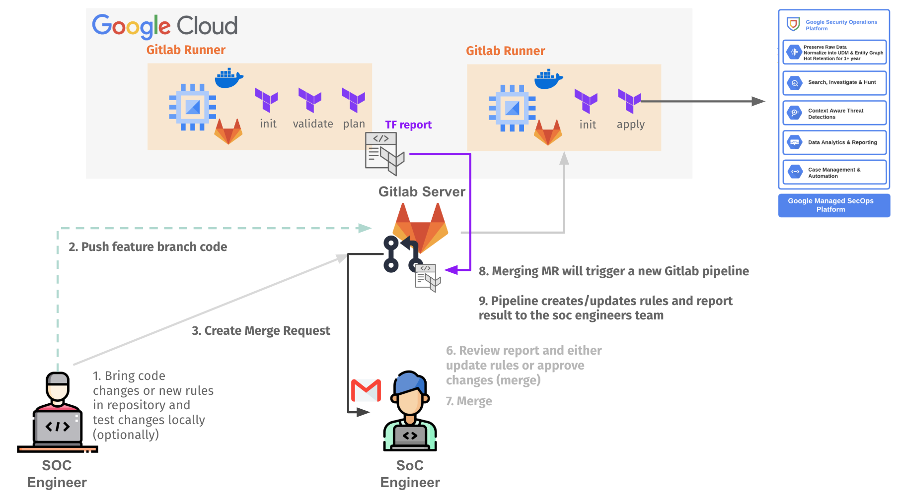

# Operations blueprints

This repository provides a collection of Terraform blueprints designed to automate the implementation of custom integrations, agents and configurations for Google Cloud Security and Operations SecOps (aka Chronicle).

## BindPlane OP Management on GKE

 This [blueprint](./bindplane-gke/) is a modular and scalable solution for deployment of the BindPlane OP Management Console within a Google Kubernetes Engine (GKE) environment.

 

## Detection as Code with Terraform for Google SecOps

 This [blueprint](./detection-as-code/) is a sample terraform repository to implementing a Detection as code pipeline for managing Google SecOps rules based on Terraform code.

 

## SecOps GKE Forwarder

 This [blueprint](./secops-gke-forwarder/) is a modular and scalable solution for setting up a SecOps forwarder on Google Kubernetes Engine (GKE). This forwarder is designed to handle multi-tenant data ingestion, ensuring secure and efficient log forwarding to your SecOps SIEM instances.

 
