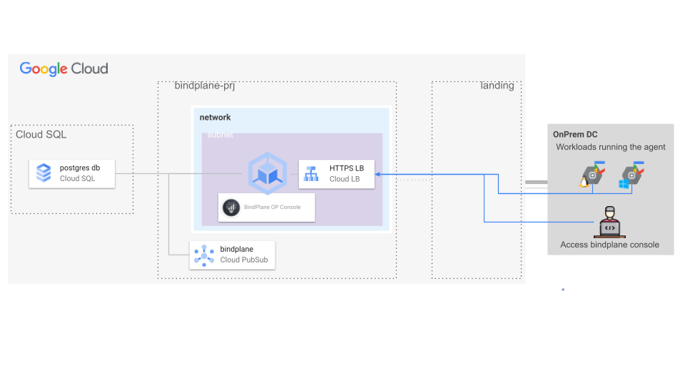
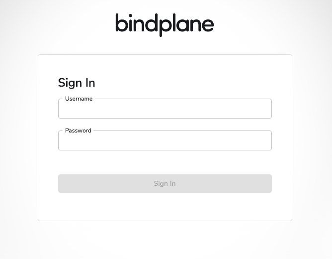

# BindPlane OP Management console on GKE

This Terraform module simplifies the deployment of the BindPlane OP Management Console within a Google Kubernetes Engine (GKE) environment. It's specifically engineered for organizations seeking a scalable and highly available solution, capitalizing on the strengths of containerization and managed platform services like Cloud SQL for PostgreSQL.

This module streamlines the process of deploying BindPlane OP, by leveraging GKE, PubSub and Cloud SQL, this module provides:

- **Simplified Deployment**: Deploy a production-ready BindPlane OP environment with minimal manual configuration.
- **Enhanced Scalability**: Easily adapt to increasing demands and data volumes as your needs evolve.
- **Increased Resilience**: Benefit from the high availability and fault tolerance offered by GKE and Cloud SQL.
- **Operational Efficiency**: Reduce operational overhead by utilizing managed Kubernetes and database services.

This module encapsulates best practices for deploying BindPlane OP in a cloud-native environment, ensuring a robust and reliable foundation for your observability platform.

### High level architecture

The following diagram illustrates the high-level design of created resources, which can be adapted to specific requirements via variables:



BindPlane OP Management console will be exposed via Internal HTTPS Load Balancer, this module assume a private connection to GCP environment is in place to reach the BindPlane management console over private IPs.
In case no private connection is in place it should be pretty straightforward to setup a proxy VM to proxy the connection towards the bindplane console. Of course such a deployment can only deal with agents running on the same GCP infrastructure.

### Deployment

#### Step 0: Cloning the repository

If you want to deploy from your Cloud Shell, click on the image below, sign in
if required and when the prompt appears, click on “confirm”.

[](https://shell.cloud.google.com/cloudshell/editor?cloudshell_git_repo=https%3A%2F%2Fgithub.com%2FGoogleCloudPlatform%2Fcloud-foundation-fabric&cloudshell_workspace=blueprints%2Fthird-party-solutions%2Fwordpress%2Fcloudrun)

Otherwise, in your console of choice:

```bash
git clone https://github.com/GoogleCloudPlatform/cloud-foundation-fabric.git
```

Before you deploy the architecture, you will need at least the following
information/configurations in place (for more precise configuration see the Variables section):

* The project ID
* The VPC host project
* VPC and subnets should already exist
* Subnet must be configured with pods and services secondary ranges (default names for secondary ranges is "pod" and "services")

#### Step 2: Prepare the variables

Once you have the required information, head back to your cloned repository.
Make sure you’re in the directory of this tutorial (where this README is in).

Configure the Terraform variables in your `terraform.tfvars` file.
See the example test at the end of this README.md as starting point - just
copy it to `terraform.tfvars` and edit the latter. See the variables
documentation below.

> **Warning**  
>
> BindPlane secrets (such as license and admin password) specified as variables within this Terraform configuration will be stored in plain text within the Terraform state file.

#### Step 3: Prepare the providers in the root module

Setup terraform providers in the root module to deal with kubernetes resources as follows:

```terraform
data "google_client_config" "identity" {
  count = module.bindplane-gke.fleet_host != null ? 1 : 0
}

provider "kubernetes" {
  host  = module.bindplane-gke.fleet_host
  token = try(data.google_client_config.identity.0.access_token, null)
}

provider "kubectl" {
  host = module.bindplane-gke.fleet_host
  token = try(data.google_client_config.identity.0.access_token, null)
}
```

#### Step 4: Deploy resources

Initialize your Terraform environment and deploy the resources:

```shell
terraform init
terraform apply
```

Get kubeconfig to connect to the cluster using the command below:

```shell
gcloud container fleet memberships get-credentials CLUSTER_NAME --project PROJECT
```

Then running the command `kubectl get pods` you should receive the following message:

```
"No resources found in default namespace."
```

In case private connection is available and DNS configuration is properly in place you should be able to reach the BindPlane OP Management console navigating the url (e.g. https://bindplane.example.com/), the following login page should show up.



Access the management console leveraging credentials bootstrapped via terraform (user and password in `bindplane_secrets` variable).
<!-- BEGIN TFDOC -->
## Variables

| name | description | type | required | default |
|---|---|:---:|:---:|:---:|
| [bindplane_secrets](variables.tf#L26) | Bindplane secrets. | <code title="object&#40;&#123;&#10;  license         &#61; string&#10;  user            &#61; optional&#40;string, &#34;admin&#34;&#41;&#10;  password        &#61; optional&#40;string, null&#41;&#10;  sessions_secret &#61; string&#10;&#125;&#41;">object&#40;&#123;&#8230;&#125;&#41;</code> | ✓ |  |
| [network_config](variables.tf#L57) | Shared VPC network configurations to use for GKE cluster. | <code title="object&#40;&#123;&#10;  host_project                  &#61; optional&#40;string&#41;&#10;  network_self_link             &#61; string&#10;  subnet_self_link              &#61; string&#10;  ip_range_gke_master           &#61; string&#10;  secondary_pod_range_name      &#61; optional&#40;string, &#34;pods&#34;&#41;&#10;  secondary_services_range_name &#61; optional&#40;string, &#34;services&#34;&#41;&#10;&#125;&#41;">object&#40;&#123;&#8230;&#125;&#41;</code> | ✓ |  |
| [prefix](variables.tf#L79) | Prefix used for resource names. | <code>string</code> | ✓ |  |
| [project_id](variables.tf#L98) | Project id, references existing project if `project_create` is null. | <code>string</code> | ✓ |  |
| [region](variables.tf#L103) | GCP region. | <code>string</code> | ✓ |  |
| [bindplane_config](variables.tf#L17) | Bindplane config. | <code title="object&#40;&#123;&#10;  tls_certificate_cer &#61; optional&#40;string, null&#41;&#10;  tls_certificate_key &#61; optional&#40;string, null&#41;&#10;&#125;&#41;">object&#40;&#123;&#8230;&#125;&#41;</code> |  | <code>&#123;&#125;</code> |
| [cluster_config](variables.tf#L36) | GKE cluster configuration. | <code title="object&#40;&#123;&#10;  cluster_name &#61; optional&#40;string, &#34;bindplane-op&#34;&#41;&#10;  master_authorized_ranges &#61; optional&#40;map&#40;string&#41;, &#123;&#10;    rfc-1918-10-8 &#61; &#34;10.0.0.0&#47;8&#34;&#10;  &#125;&#41;&#10;&#125;&#41;">object&#40;&#123;&#8230;&#125;&#41;</code> |  | <code>&#123;&#125;</code> |
| [dns_config](variables.tf#L47) | DNS config. | <code title="object&#40;&#123;&#10;  bootstrap_private_zone &#61; optional&#40;bool, false&#41;&#10;  domain                 &#61; optional&#40;string, &#34;example.com&#34;&#41;&#10;  hostname               &#61; optional&#40;string, &#34;bindplane&#34;&#41;&#10;&#125;&#41;">object&#40;&#123;&#8230;&#125;&#41;</code> |  | <code>&#123;&#125;</code> |
| [postgresql_config](variables.tf#L69) | Cloud SQL postgresql config. | <code title="object&#40;&#123;&#10;  availability_type &#61; optional&#40;string, &#34;REGIONAL&#34;&#41;&#10;  database_version  &#61; optional&#40;string, &#34;POSTGRES_13&#34;&#41;&#10;  tier              &#61; optional&#40;string, &#34;db-g1-small&#34;&#41;&#10;&#125;&#41;">object&#40;&#123;&#8230;&#125;&#41;</code> |  | <code>&#123;&#125;</code> |
| [project_create](variables.tf#L89) | Provide values if project creation is needed, uses existing project if null. Parent is in 'folders/nnn' or 'organizations/nnn' format. | <code title="object&#40;&#123;&#10;  billing_account_id &#61; string&#10;  parent             &#61; string&#10;&#125;&#41;">object&#40;&#123;&#8230;&#125;&#41;</code> |  | <code>null</code> |

## Outputs

| name | description | sensitive |
|---|---|:---:|
| [bindplane_hostname](outputs.tf#L17) | BindPlane OP Management console hostname. |  |
| [ca_cert](outputs.tf#L22) | TLS CA certificate. |  |
| [cluster_ca_certificate](outputs.tf#L27) | GKE CA Certificate. |  |
| [fleet_host](outputs.tf#L32) | GKE Fleet host. |  |
| [lb_ip_address](outputs.tf#L37) | Ingress LB address. |  |
<!-- END TFDOC -->
## Test

```hcl
module "bindplane-gke" {
  source     = "./fabric/blueprints/secops/bindplane-gke"
  project_id = "test"
  project_create = {
    billing_account_id = "12345-ABCDEF-12345"
    parent             = "folders/2345678901"
  }
  bindplane_secrets = {
    user            = "admin"
    password        = "thisisnotasecret"
    sessions_secret = "xxxxxx-xxxxxxx-xxxxxx"
    license         = "XXXXXXXXXXXXXXXXXXXXXX"
  }
  dns_config = {
    bootstrap_private_zone = true
    domain                 = "example.com"
    hostname               = "bindplane"
  }
  network_config = {
    network_self_link   = "https://www.googleapis.com/compute/v1/projects/prod-net-landing-0/global/networks/prod-landing-0"
    subnet_self_link    = "https://www.googleapis.com/compute/v1/projects/prod-net-landing-0/regions/europe-west1/subnetworks/gke"
    ip_range_gke_master = "192.168.0.0/28"
  }
  region = "europe-west8"
  prefix = "tmp"
}
# tftest modules=10 resources=45
```
