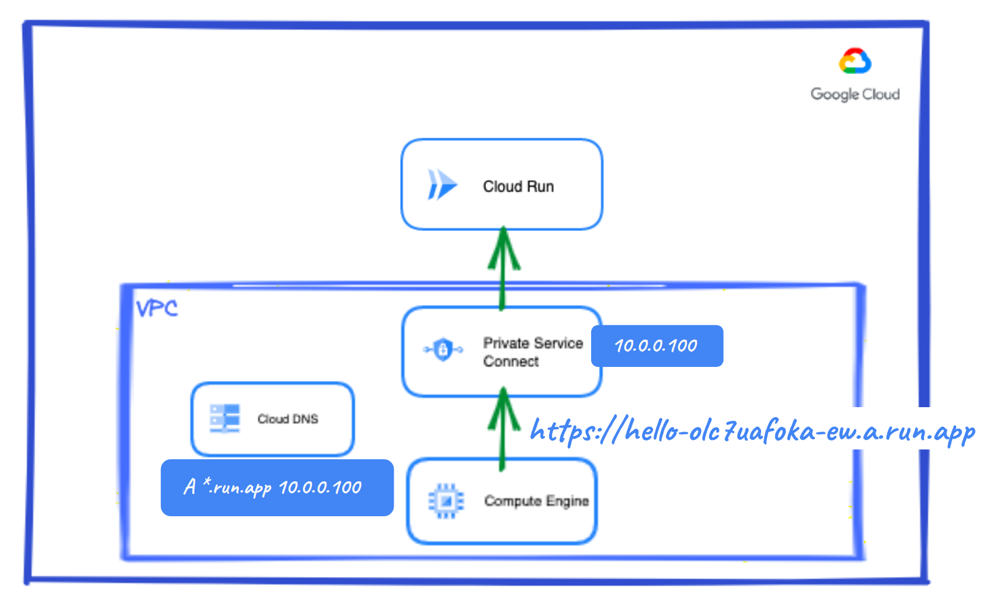
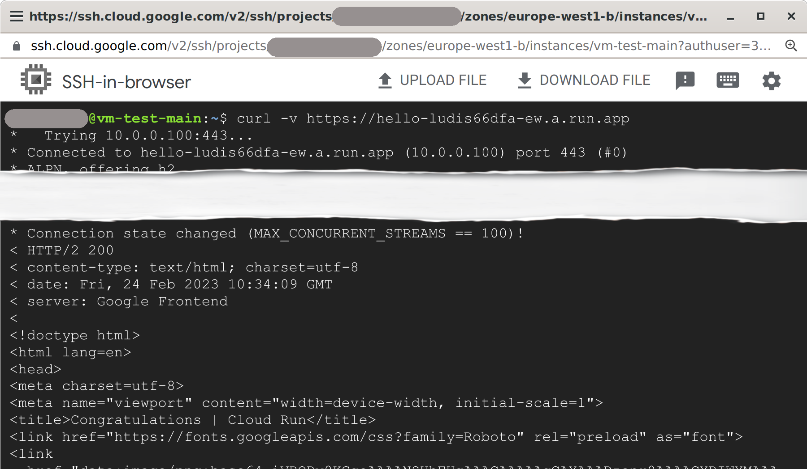
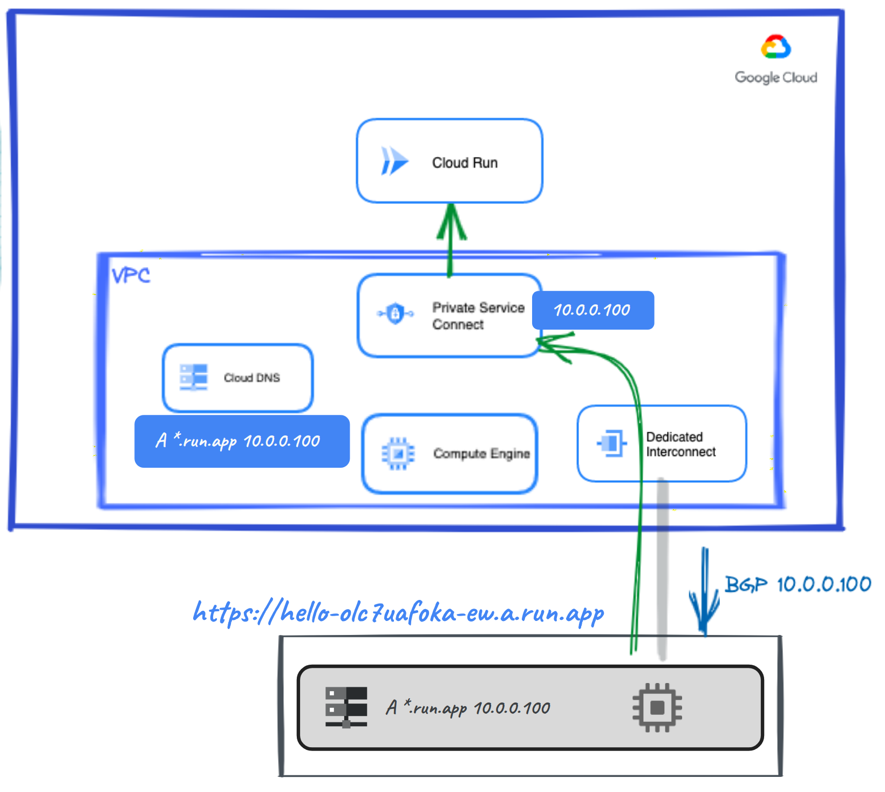
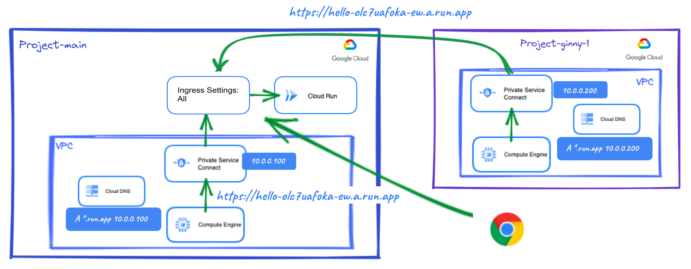
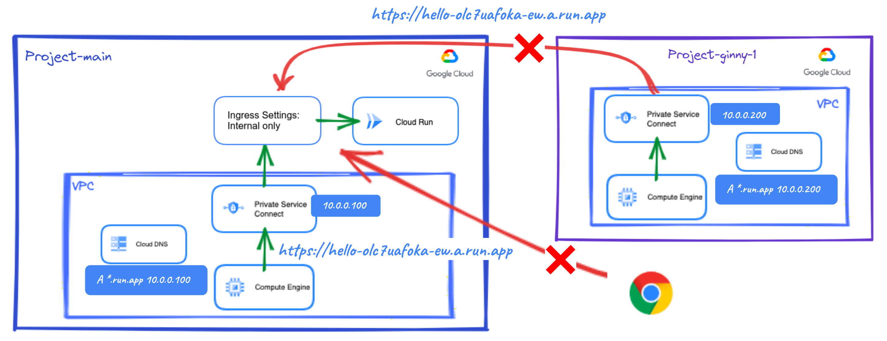
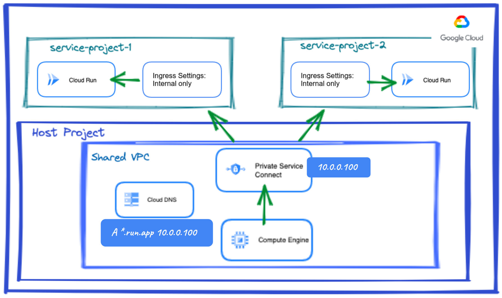
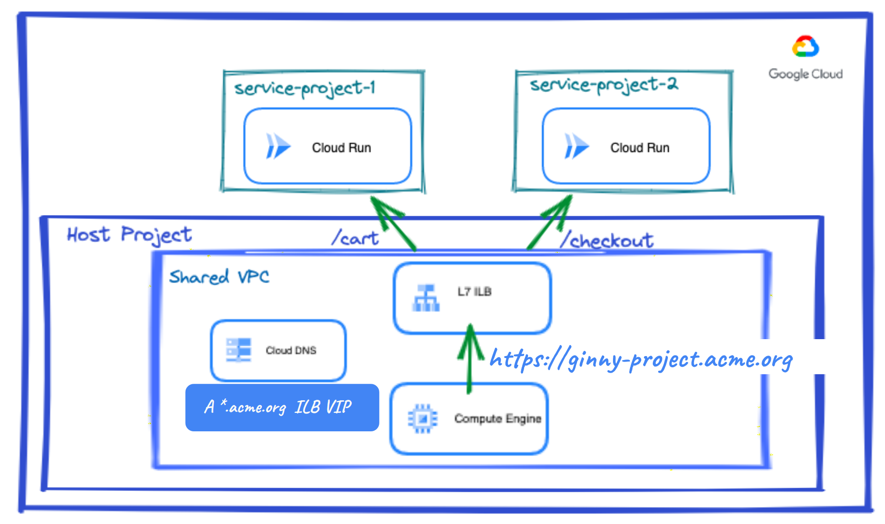
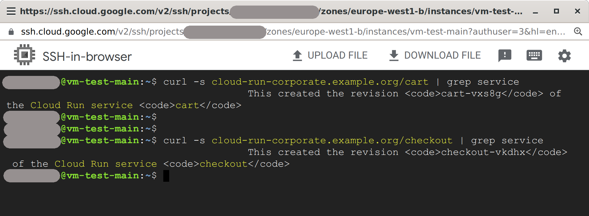

# Cloud Run Corporate

## Introduction

This blueprint contains all the necessary Terraform modules to build and __privately__ expose a Cloud Run service in a variety of use cases.

The content of this blueprint corresponds to the chapter '_The corporate environment - Developing an enterprise application_' of the [__Serverless Networking Guide__](https://services.google.com/fh/files/misc/serverless_networking_guide.pdf). This guide is an easy to follow introduction to Cloud Run, where a couple of friendly characters will guide you from the basics to more advanced topics with a very practical approach and in record time! The code here complements this learning and allows you to test the scenarios presented and your knowledge.

If you are interested in following this guide, take a look to the chapters' blueprints:

* [Exploring Cloud Run - My serverless "Hello, World!"](https://github.com/GoogleCloudPlatform/cloud-foundation-fabric/tree/master/blueprints/serverless/cloud-run-explore)
* [The corporate environment - Developing an enterprise application](https://github.com/GoogleCloudPlatform/cloud-foundation-fabric/tree/master/blueprints/serverless/cloud-run-corporate)
* [Microservices architectures - Developing Microservices applications](https://github.com/GoogleCloudPlatform/cloud-foundation-fabric/tree/master/blueprints/serverless/cloud-run-microservices)

## Architecture

This blueprint creates multiple architectures depending on the use case. Some may have one or two projects while others may have three or more. Some use [Private Service Connect (PSC)](https://cloud.google.com/vpc/docs/private-service-connect) to access Google APIs, and others a [Layer 7 Internal Load Balancer](https://cloud.google.com/load-balancing/docs/l7-internal). Even security plays a role and [VPC Service Controls (VPC SC)](https://cloud.google.com/vpc-service-controls) is introduced.

## Prerequisites

Depending on the use case, you will need one or more projects. You can use existing projects or let the blueprint create them for you but in that case you will need to add extra information for each project. E.g.:

```tfvars
# Create the main project
prj_main_create = {
  billing_account_id = "ABCDE-12345-ABCDE"
  parent             = "organizations/0123456789"
}
```

How to set this kind of information is explained in the next section.

## Spinning up the architecture

### General steps

1. Clone the repo to your local machine or Cloud Shell:

```bash
git clone https://github.com/GoogleCloudPlatform/cloud-foundation-fabric
```

2. Change to the directory of the blueprint:

```bash
cd cloud-foundation-fabric/blueprints/serverless/cloud-run-corporate
```

You should see this README and some terraform files.

3. To deploy a specific use case, you will need to create a file in this directory called `terraform.tfvars` and follow the corresponding instructions to set variables. Values that are meant to be substituted will be shown inside brackets but you need to omit these brackets. E.g.:

```tfvars
project_id = "[your-project_id]"
```

may become

```tfvars
project_id = "spiritual-hour-331417"
```

Use cases are self-contained so you can deploy any of them at will.

4. The usual terraform commands will do the work:

```bash
terraform init
terraform plan
terraform apply
```

It will take a few minutes. When complete, you should see an output stating the command completed successfully, a list of the created resources, and some output variables with information to access your services.

__Congratulations!__ You have successfully deployed the use case you chose based on the variables configuration.

### Use case 1: Access to Cloud Run from a VM in the project

This use case deploys a Cloud Run service and a VM in the same project. To privately access Cloud Run from the VM, PSC is used. A PSC endpoint is created so that the VM can reach the service through an RFC1918 IP. Also, a DNS entry is created to point the service's default URL to that IP.

<p align="center">  </p>

In this case the only variable that you need to set in `terraform.tfvars` is the main project ID:

```tfvars
prj_main_id = "[your-main-project-id]"
```

Alternatively you can pass this value on the command line:

```bash
terraform apply -var prj_main_id="[your-main-project-id]"
```

The default URL is automatically created and shown as a terraform output variable. It will be similar to the one shown in the picture above. Now SSH into the VM and run `curl`, you should see the following:

<p align="center">  </p>

Note that the VM is resolving the Cloud Run service to an internal IP, 10.0.0.100. Public access is restricted, if you try to `curl` from e.g. your laptop you will get a `403 Forbidden` error.

### Use case 2: Access to Cloud Run from on-prem environment

This use case deploys a Cloud Run service in a GCP project and simulates an on-prem environment with another GCP project and a HA VPN connection between them. PSC is still used but now the DNS configuration should happen in on-premises. Since this environment is implemented in GCP, the blueprint takes care of this configuration. The PSC endpoint is announced through the VPN via BGP so that on-prem knows how to reach it. A VM is deployed in the on-prem environment to test this setup.

<p align="center">  </p>

You will need to set both the main and the on-prem project IDs in `terraform.tfvars`:

```tfvars
prj_main_id   = "[your-main-project-id]"
prj_onprem_id = "[your-onprem-project-id]"
```

SSH into the test VM and run `curl`, you should see the same output as in the previous use case.

### Use case 3: Access to Cloud Run from another project

Corporate apps are used by multiple teams and projects. This blueprint explores accessing from a different project to where Cloud Run is deployed. For simplicity only one more project is used but the concepts would apply to any number of projects. Three different cases are implemented:

#### Use case 3.1

The first case allows access to Cloud Run from any project as well as the Internet.

<p style="left">  </p>

This is achieved with `ingress_settings` value set to `"all"`. This is the default if not specified but this blueprint sets it to `"internal"` instead. Add a new project and this setting in `terraform.tfvars`:

```tfvars
prj_main_id      = "[your-main-project-id]"
prj_prj1_id      = "[your-project1-id]"
ingress_settings = "all"
```

Note the different PSC endpoints created in each project and the different IPs. Each project can choose its own RFC1918 IP to reach the same Cloud Run service.

#### Use case 3.2

It is possible to block access from the Internet restoring `ingress_settings` to `"internal"` but this will also block access from any other project. This feature is interesting, as will be shown in the next use case.

<p style="left">  </p>

Simply omit `ingress_settings` in `terraform.tfvars`:

```tfvars
prj_main_id = "[your-main-project-id]"
prj_prj1_id = "[your-project1-id]"
```

#### Use case 3.3

To allow access from other projects while keeping access from the Internet restricted, you need to add those projects to a VPC SC perimeter together with Cloud Run. Projects outside the perimeter will be blocked. This way you can control which projects can gain access.

<p style="left">  </p>

VPC SC requires an [Access Policy](https://cloud.google.com/access-context-manager/docs/overview#access-policies). You can use an existing policy or create a new one, but an organization can only have one organization-level access policy. The policy name is a unique numeric identifier assigned by Google Cloud.

Make sure to check out the [IAM roles](https://cloud.google.com/access-context-manager/docs/access-control) required to configure access policies and VPC SC. Also, include the identity that runs Terraform to avoid losing access from it once the perimeter is created. Set the following in `terraform.tfvars`:

```tfvars
prj_main_id   = "[your-main-project-id]"
prj_prj1_id   = "[your-project1-id]"
access_policy = "[policy-name]"
tf_identity   = "[user or SA account]"
```

#### Use case 3.4

Another possibility is to use an architecture based on Shared VPC that allows direct service-to-service calls while ensuring all traffic stays within your private network. In this case a VPC SC perimeter is not needed.

<p style="left">  </p>

For simplicity, the two Cloud Run services are deployed in the same service project. To test access, VMs are created in the host and service projects. Note that the service project can't have a different DNS entry for the same domain, so it uses the DNS and PSC configuration of the host project. Set the following in `terraform.tfvars`:

```tfvars
prj_main_id = "[your-main-project-id]" # Used as host project
prj_svc1_id = "[your-service-project1-id]"
```

### Use case 4: Access to Cloud Run with custom domain

You need to use an Internal Application LB (L7) with Serverless NEGs (in Preview) to set a custom domain for Cloud Run. As a practical example, this blueprint deploys this configuration in a Shared VPC environment with two Cloud Run services running in a service project and the LB exposing them via a custom domain, pointing to them through a URL map: `/cart` and `/checkout`.

<p align="center">  </p>

The blueprint uses an HTTP connection to the LB to avoid management of SSL certificates. To test access, VMs are created in the host and service projects. Set the following in `terraform.tfvars`:

```tfvars
prj_main_id   = "[your-main-project-id]" # Used as host project
prj_svc1_id   = "[your-service-project1-id]"
custom_domain = "cloud-run-corporate.example.org"
```

SSH into a test VM and run `curl` specifying as URL the host, your custom domain, and a path, `/cart` or `/checkout`. You will see each service responding to the request:

<p align="center">  </p>

## Cleaning up your environment

The easiest way to remove all the deployed resources is to run the following command:

```bash
terraform destroy
```

The above command will delete the associated resources so there will be no billable charges afterwards. Projects are removed from Terraform state but not deleted from Google Cloud.
<!-- BEGIN TFDOC -->

## Variables

| name | description | type | required | default |
|---|---|:---:|:---:|:---:|
| [prj_main_id](variables.tf#L79) | Main Project ID. | <code>string</code> | ✓ |  |
| [access_policy](variables.tf#L17) | VPC SC access policy, if it exists. | <code>string</code> |  | <code>null</code> |
| [access_policy_create](variables.tf#L23) | Parameters for the creation of a VPC SC access policy. | <code title="object&#40;&#123;&#10;  parent &#61; string&#10;  title  &#61; string&#10;&#125;&#41;">object&#40;&#123;&#8230;&#125;&#41;</code> |  | <code>null</code> |
| [custom_domain](variables.tf#L32) | Custom domain for the Load Balancer. | <code>string</code> |  | <code>null</code> |
| [image](variables.tf#L38) | Container image to deploy. | <code>string</code> |  | <code>&#34;us-docker.pkg.dev&#47;cloudrun&#47;container&#47;hello&#34;</code> |
| [ingress_settings](variables.tf#L44) | Ingress traffic sources allowed to call the service. | <code>string</code> |  | <code>&#34;internal&#34;</code> |
| [ip_ranges](variables.tf#L50) | IPs or IP ranges used by VPCs. | <code>map&#40;map&#40;string&#41;&#41;</code> |  | <code title="&#123;&#10;  main &#61; &#123;&#10;    subnet            &#61; &#34;10.0.1.0&#47;24&#34;&#10;    subnet_proxy      &#61; &#34;10.10.0.0&#47;24&#34;&#10;    subnet_vpc_access &#61; &#34;10.10.10.0&#47;28&#34;&#10;    psc_addr          &#61; &#34;10.0.0.100&#34;&#10;  &#125;&#10;  onprem &#61; &#123;&#10;    subnet &#61; &#34;172.16.1.0&#47;24&#34;&#10;  &#125;&#10;  prj1 &#61; &#123;&#10;    subnet   &#61; &#34;10.0.2.0&#47;24&#34;&#10;    psc_addr &#61; &#34;10.0.0.200&#34;&#10;  &#125;&#10;&#125;">&#123;&#8230;&#125;</code> |
| [prj_main_create](variables.tf#L70) | Parameters for the creation of the main project. | <code title="object&#40;&#123;&#10;  billing_account_id &#61; string&#10;  parent             &#61; string&#10;&#125;&#41;">object&#40;&#123;&#8230;&#125;&#41;</code> |  | <code>null</code> |
| [prj_onprem_create](variables.tf#L84) | Parameters for the creation of an 'onprem' project. | <code title="object&#40;&#123;&#10;  billing_account_id &#61; string&#10;  parent             &#61; string&#10;&#125;&#41;">object&#40;&#123;&#8230;&#125;&#41;</code> |  | <code>null</code> |
| [prj_onprem_id](variables.tf#L93) | Onprem Project ID. | <code>string</code> |  | <code>null</code> |
| [prj_prj1_create](variables.tf#L99) | Parameters for the creation of project 1. | <code title="object&#40;&#123;&#10;  billing_account_id &#61; string&#10;  parent             &#61; string&#10;&#125;&#41;">object&#40;&#123;&#8230;&#125;&#41;</code> |  | <code>null</code> |
| [prj_prj1_id](variables.tf#L108) | Project 1 ID. | <code>string</code> |  | <code>null</code> |
| [prj_svc1_create](variables.tf#L114) | Parameters for the creation of service project 1. | <code title="object&#40;&#123;&#10;  billing_account_id &#61; string&#10;  parent             &#61; string&#10;&#125;&#41;">object&#40;&#123;&#8230;&#125;&#41;</code> |  | <code>null</code> |
| [prj_svc1_id](variables.tf#L123) | Service Project 1 ID. | <code>string</code> |  | <code>null</code> |
| [region](variables.tf#L129) | Cloud region where resource will be deployed. | <code>string</code> |  | <code>&#34;europe-west1&#34;</code> |
| [tf_identity](variables.tf#L135) | Terraform identity to include in VPC SC perimeter. | <code>string</code> |  | <code>null</code> |

## Outputs

| name | description | sensitive |
|---|---|:---:|
| [default_URL_cart](outputs.tf#L17) | Cloud Run service 'cart' default URL. |  |
| [default_URL_checkout](outputs.tf#L23) | Cloud Run service 'checkout' default URL. |  |
| [default_URL_hello](outputs.tf#L29) | Cloud Run service 'hello' default URL. |  |
| [load_balancer_ip](outputs.tf#L34) | Load Balancer IP address. |  |

<!-- END TFDOC -->
## Tests

```hcl
module "test" {
  source = "./fabric/blueprints/serverless/cloud-run-corporate"
  prj_main_create = {
    billing_account_id = "ABCDE-12345-ABCDE"
    parent             = "organizations/0123456789"
  }
  prj_main_id = "main-project-id" # Used as host project
  prj_onprem_create = {
    billing_account_id = "ABCDE-12345-ABCDE"
    parent             = "organizations/0123456789"
  }
  prj_onprem_id = "onprem-project-id"
}

# tftest modules=15 resources=58
```

```hcl
module "test" {
  source = "./fabric/blueprints/serverless/cloud-run-corporate"
  prj_main_create = {
    billing_account_id = "ABCDE-12345-ABCDE"
    parent             = "organizations/0123456789"
  }
  prj_main_id = "main-project-id"
  prj_prj1_create = {
    billing_account_id = "ABCDE-12345-ABCDE"
    parent             = "organizations/0123456789"
  }
  prj_prj1_id   = "project1-id"
  access_policy = null
  access_policy_create = {
    parent = "organizations/0123456789"
    title  = "vpcsc-cloudrun"
  }
  tf_identity = "user@example.org"
}

# tftest modules=15 resources=44
```

```hcl
module "test" {
  source = "./fabric/blueprints/serverless/cloud-run-corporate"
  prj_main_create = {
    billing_account_id = "ABCDE-12345-ABCDE"
    parent             = "organizations/0123456789"
  }
  prj_main_id = "main-project-id" # Used as host project
  prj_svc1_create = {
    billing_account_id = "ABCDE-12345-ABCDE"
    parent             = "organizations/0123456789"
  }
  prj_svc1_id   = "service-project1-id"
  custom_domain = "cloud-run-corporate.example.org"
}

# tftest modules=14 resources=57
```
