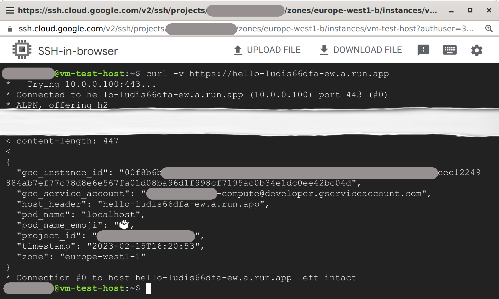

# Cloud Run Corporate

## Introduction

This blueprint contains all the necessary Terraform modules to build and privately expose a Cloud Run service in a variety of use cases.

The content of this blueprint corresponds to the chapter '_Developing an enterprise application - The corporate environment_' of the __Serverless Networking Guide__ (to be released soon). This guide is an easy to follow introduction to Cloud Run, where a couple of friendly characters will guide you from the basics to more advanced topics with a very practical approach and in record time! The code here complements this learning and allows you to test the scenarios presented and your knowledge.

If you are interested in following this guide, take a look to the chapters' blueprints:
* [My serverless "Hello, World! - Exploring Cloud Run](https://github.com/GoogleCloudPlatform/cloud-foundation-fabric/tree/master/blueprints/serverless/cloud-run-explore)
* [Developing an enterprise application - The corporate environment](https://github.com/GoogleCloudPlatform/cloud-foundation-fabric/tree/master/blueprints/serverless/cloud-run-corporate)

## Architecture

This blueprint creates multiple architectures depending on the use case. Some may have one or two projecs while others may have four or more. Some use [Private Service Connect (PSC)](https://cloud.google.com/vpc/docs/private-service-connect) to access Google APIs, and others a [Layer 7 Internal Load Balancer](https://cloud.google.com/load-balancing/docs/l7-internal). Even security plays a role and [VPC Service Controls](https://cloud.google.com/vpc-service-controls) is introduced.

## Prerequisites

Depending on the use case, you will need one or more projects with [billing enabled](https://cloud.google.com/billing/docs/how-to/modify-project) and a user with the “Project owner” [IAM](https://cloud.google.com/iam) role on those projects. You can use existing projects or let the blueprint creates them for you but in that case you will need to add extra information for each project. E.g.:

```tfvars
# Create the main or host project
prj_host_create = {
  billing_account_id = "ABCDE-12345-ABCDE"
  parent             = "organizations/0123456789"
}
```

Below it is explained how to set this information.

## Spinning up the architecture

### General steps

1. Clone the repo to your local machine or Cloud Shell:
```bash
git clone https://github.com/GoogleCloudPlatform/cloud-foundation-fabric
```

2. Change to the directory of the blueprint:
```bash
cd cloud-foundation-fabric/blueprints/serverless/cloud-run-corporate
```
You should see this README and some terraform files.

3. To deploy a specific use case, you will need to create a file in this directory called `terraform.tfvars` and follow the corresponding instructions to set variables. Sometimes values that are meant to be substituted will be shown inside brackets but you need to omit these brackets. E.g.:
```tfvars
project_id = "[your-project_id]"
```
may become
```tfvars
project_id = "spiritual-hour-331417"
```

Use cases are self-contained so you can deploy any of them at will.

4. The usual terraform commands will do the work:
```bash
terraform init
terraform plan
terraform apply
```

The resource creation will take a few minutes but when it’s complete, you should see an output stating the command completed successfully with a list of the created resources, and some output variables with information to access your service.

__Congratulations!__ You have successfully deployed the use case you chose based on the variables configuration.

### Use case 1: Access to Cloud Run from a VM in the project

This use case deploys a Cloud Run service and a VM in the same project. To privately access Cloud Run from the VM, PSC is used. A PSC endpoint is created so that the VM can reach the service through an RFC1918 IP. Also, a DNS entry is created to point the service's default URL to that IP.

<p align="center">  </p>

In this case the only variable that you need to set in `terraform.tfvars` is the main or host project ID:
```tfvars
prj_host_id = "[your-project-id]"
```
Alternatively you can pass this value on the command line:
```bash
terraform apply -var prj_host_id="[your-project-id]"
```

The main project is also referenced as host project because some use cases use it with a Shared VPC. The default URL is automatically created and shown as a terraform output variable. It will be similar to the one shown in the picture above. Now SSH into the VM and run `curl`, you should see the following:

<p align="center">  </p>

Note that public access is restricted. If you try to `curl` from e.g. your laptop you will get a `403 Forbidden` error.

### Use case 2: Access to Cloud Run from on-prem environment

This use case deploys a Cloud Run service in a GCP project and simulates an on-prem environment with another GCP project and a HA VPN connection between them. PSC is still used but now the DNS configuration should happen in on-premises. Since this environment is implemented in GCP, the blueprint takes care of this configuration. The PSC endpoint is announced through the VPN via BGP so that on-prem knows how to reach it. A VM is deployed in the on-prem environment to test this setup.

<p align="center">  </p>

You will need to set both the main and the on-prem project IDs in `terraform.tfvars`:
```tfvars
prj_host_id   = "[your-project-id]"
prj_onprem_id = "[your-onprem-project-id]"
```

SSH into the test VM and run `curl`, you should see the same output as in the previous use case.

### Use case 3:

### Use case 4:

### Use case 5:

## Cleaning up your environment

The easiest way to remove all the deployed resources is to run the following command:
```bash
terraform destroy
```
The above command will delete the associated resources so there will be no billable charges made afterwards. IAP Brands, though, can only be created once per project and not deleted. Destroying a Terraform-managed IAP Brand will remove it from state but will not delete it from Google Cloud.
<!-- BEGIN TFDOC -->

<!-- END TFDOC -->

## Tests
