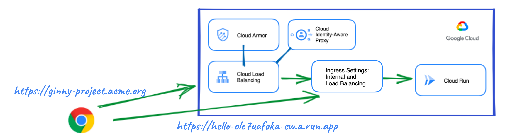
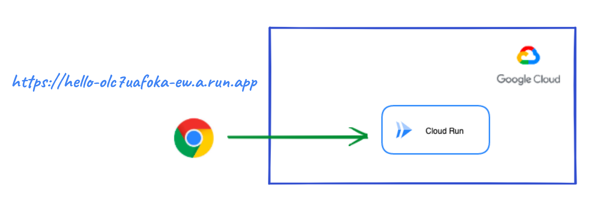
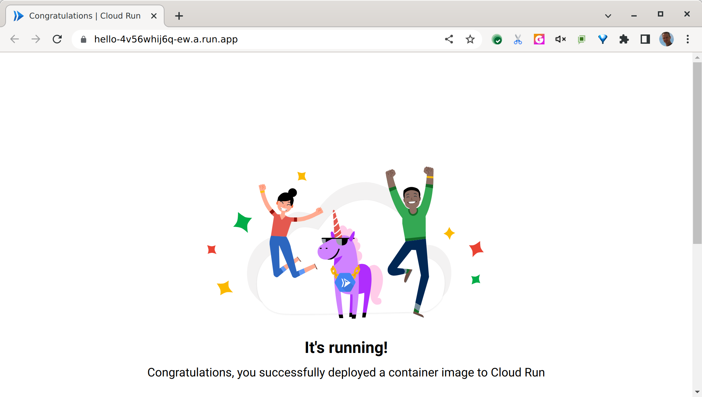
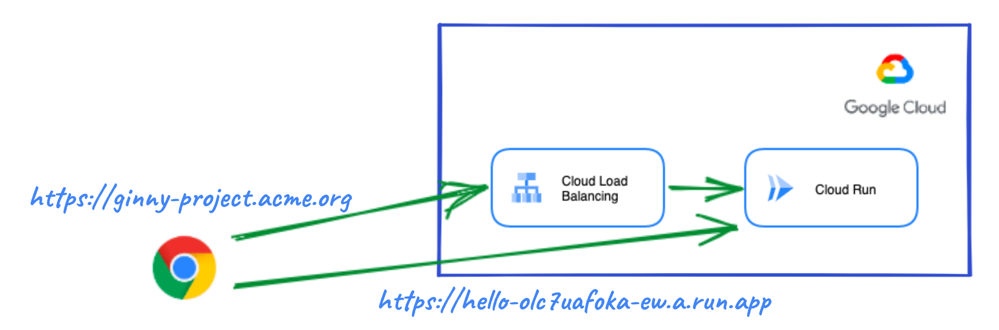
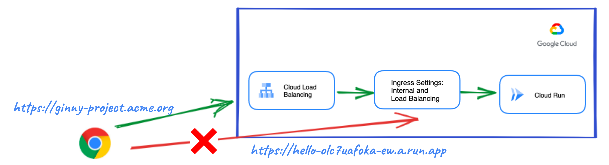
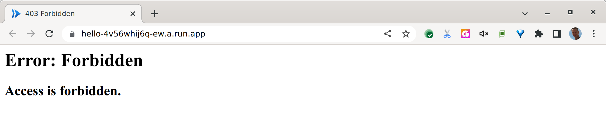
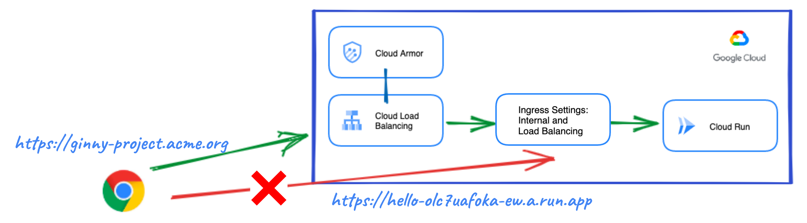
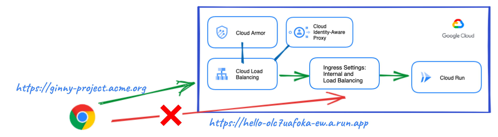

# Cloud Run Explore

## Introduction

This blueprint contains all the necessary Terraform modules to build and __publicly__ expose Cloud Run services in a variety of use cases.

The content of this blueprint corresponds to the chapter '_My serverless "Hello, World! - Exploring Cloud Run_' of the [__Serverless Networking Guide__](https://services.google.com/fh/files/misc/serverless_networking_guide.pdf). This guide is an easy to follow introduction to Cloud Run, where a couple of friendly characters will guide you from the basics to more advanced topics with a very practical approach and in record time! The code here complements this learning and allows you to test the scenarios presented and your knowledge.

If you are interested in following this guide, take a look to the chapters' blueprints:
* [My serverless "Hello, World! - Exploring Cloud Run](https://github.com/GoogleCloudPlatform/cloud-foundation-fabric/tree/master/blueprints/serverless/cloud-run-explore)
* [Developing an enterprise application - The corporate environment](https://github.com/GoogleCloudPlatform/cloud-foundation-fabric/tree/master/blueprints/serverless/cloud-run-corporate)

## Architecture

The following diagram depicts the main components that this blueprint will set up:

<p align="center">  </p>

The following products or features are used to fulfill the different use cases covered in this blueprint (to learn more about them click on the hyperlinks):

* [Cloud Run](https://cloud.google.com/run/docs/overview/what-is-cloud-run) -  Cloud Run is a managed compute platform that lets you run containers directly on top of Google's scalable infrastructure.
* [Cloud Run Ingress Settings](https://cloud.google.com/run/docs/securing/ingress) - feature that restricts network access to your Cloud Run service. At a network level, by default, any resource on the Internet can reach your Cloud Run service on its run.app URL or at a custom domain set up in Cloud Run. You can change this default by specifying a different setting for its ingress. All ingress paths, including the default run.app URL, are subject to your ingress setting. Ingress is set at the service level. The following settings are available: 
  * __Internal__: Allows requests from VPC networks that are in the same project or VPC Service Controls perimeter as your Cloud Run service.
  * __Internal and Cloud Load Balancing__: Allows requests from resources allowed by the more restrictive Internal setting and an External HTTP(S) load balancer.
  * __All__ (default):  Allows all requests, including requests directly from the Internet to the default run.app URL.
* [Google Cloud Load Balancer](https://cloud.google.com/run/docs/mapping-custom-domains#https-load-balancer) - When an HTTP(S) load balancer is enabled for Cloud Run, you can reach your serverless app through a custom domain mapped to a single dedicated global Anycast IP address that is not shared with other services.
* [Cloud Armor](https://cloud.google.com/armor) - Google Cloud Armor is the web-application firewall (WAF) and DDoS mitigation service that helps users defend their web apps and services at Google scale at the edge of Google’s network.
* [Identity Aware Proxy](https://cloud.google.com/iap/docs/concepts-overview) - IAP lets you establish a central authorization layer for applications accessed by HTTPS, so you can use an application-level access control model instead of relying on network-level firewalls. [External Load Balancing with IAP](https://cloud.google.com/iap/docs/load-balancer-howto) is supported for Cloud Run with Serverless NEGs.
* [Cloud CDN](https://cloud.google.com/cdn) - Configure fast, reliable web and video content delivery with global scale and reach. __Note__: Cloud CDN is not part of this blueprint yet.

## Prerequisites

You will need an existing [project](https://cloud.google.com/resource-manager/docs/creating-managing-projects) with [billing enabled](https://cloud.google.com/billing/docs/how-to/modify-project) and a user with the “Project owner” [IAM](https://cloud.google.com/iam) role on that project. __Note__: to grant a user a role, take a look at the [Granting and Revoking Access](https://cloud.google.com/iam/docs/granting-changing-revoking-access#grant-single-role) documentation.

## Spinning up the architecture

### General steps

1. Clone the repo to your local machine or Cloud Shell:
```bash
git clone https://github.com/GoogleCloudPlatform/cloud-foundation-fabric
```

2. Change to the directory of the blueprint:
```bash
cd cloud-foundation-fabric/blueprints/serverless/cloud-run-explore
```
You should see this README and some terraform files.

3. To deploy a specific use case, you will need to create a file in this directory called `terraform.tfvars` and follow the corresponding instructions to set variables. Sometimes values that are meant to be substituted will be shown inside brackets but you need to omit these brackets. E.g.:
```tfvars
project_id = "[your-project_id]"
```
may become
```tfvars
project_id = "spiritual-hour-331417"
```

Although each use case is somehow built around the previous one they are self-contained so you can deploy any of them at will.

4. The usual terraform commands will do the work:
```bash
terraform init
terraform plan
terraform apply
```

The resource creation will take a few minutes but when it’s complete, you should see an output stating the command completed successfully with a list of the created resources, and some output variables with information to access your service.

__Congratulations!__ You have successfully deployed the use case you chose based on the variables configuration.

### Use case 1: Cloud Run service with default URL

This is the simplest case, the "Hello World" for Cloud Run. A Cloud Run service is deployed with a default URL based in your project, service name and cloud region where it is deployed:

<p align="center">  </p>

In this case the only variable that you need to set in `terraform.tfvars` is the project ID:
```tfvars
project_id = "[your-project-id]"
```
Alternatively you can pass this value on the command line:
```bash
terraform apply -var project_id="[your-project-id]"
```

The default URL is automatically created and shown as a terraform output variable. It will be similar to the one shown in the picture above. Now use your browser to visit it, you should see the following:

<p align="center">  </p>

### Use case 2: Cloud Run service with custom domain

If you want to use your own custom domain you need a GCLB in front of your Cloud Run app:

<p align="center">  </p>

The following values will need to be set in `terraform.tfvars`, replacing the custom_domain value with your own domain:
```tfvars
project_id    = "[your-project-id]"
custom_domain = "cloud-run-explore.example.org"
```
Since it is an HTTPS connection a Google managed certificate is created, but for it to be provisioned correctly you will need to point to the load balancer IP address with an A DNS record at your registrar: [Use Google-managed SSL certificates | Load Balancing](https://cloud.google.com/load-balancing/docs/ssl-certificates/google-managed-certs#update-dns). The LB IP is shown as a terraform output.

Be aware that in this case the Cloud Run service can also be reached through the default URL. To limit access only through the custom domain see the next use case.

### Use case 3: Cloud Run service exposed only via custom domain

To block access to the default URL, you can configure Ingress Settings so that Internet requests will be accepted only if they come through the Load Balancer:

<p align="center">  </p>

You only need to set one more value in the previous `terraform.tfvars` file:
```tfvars
project_id       = "[your-project-id]"
custom_domain    = "cloud-run-explore.example.org"
ingress_settings = "internal-and-cloud-load-balancing"
```

The default URL is still created but if you try to visit it, you should see a forbidden error:
<p align="center">  </p>

### Use case 4: Cloud Run service protected by Cloud Armor

To use Cloud Armor to protect the Cloud Run service, you need to create a security policy to enforce in the load balancer:
<p align="center">  </p>

The code allows to block a list of IPs and a specific URL path. For example, you may want to block access to a login page to external users. To test its behavior, by default all IPs and the path `"/login.html"` are blocked, but you can override any of these settings with your own values:
```tfvars
project_id       = "[your-project-id]"
custom_domain    = "cloud-run-explore.example.org"
ingress_settings = "internal-and-cloud-load-balancing"
security_policy = {
  enabled      = true
  ip_blacklist = ["79.149.0.0/16"]
  path_blocked = "/admin.html"
}
```

Note that to avoid users to bypass the Cloud Armor policy you need to block access through the default URL. Ingress settings is configured to do that.

### Use case 5: Cloud Run service protected by Cloud Armor and Identity-Aware Proxy

You can enable IAP at the load balancer to control access using identity and context:
<p align="center">  </p>
Use your own email as identity to access the Cloud Run service:

```tfvars
project_id       = "[your-project-id]"
custom_domain    = "cloud-run-explore.example.org"
ingress_settings = "internal-and-cloud-load-balancing"
security_policy = {
  enabled      = true
  ip_blacklist = ["79.149.0.0/16"]
}
iap = {
  enabled = true
  email   = "user@example.org"
}
```
When visiting it you may be redirected to login with Google. You can use an incognito window to test this behavior.

## Cleaning up your environment

The easiest way to remove all the deployed resources is to run the following command:
```bash
terraform destroy
```
The above command will delete the associated resources so there will be no billable charges made afterwards. IAP Brands, though, can only be created once per project and not deleted. Destroying a Terraform-managed IAP Brand will remove it from state but will not delete it from Google Cloud.
<!-- BEGIN TFDOC -->

## Variables

| name | description | type | required | default |
|---|---|:---:|:---:|:---:|
| [project_id](variables.tf#L55) | Project ID. | <code>string</code> | ✓ |  |
| [custom_domain](variables.tf#L17) | Custom domain for the Load Balancer. | <code>string</code> |  | <code>null</code> |
| [iap](variables.tf#L23) | Identity-Aware Proxy for Cloud Run in the LB. | <code title="object&#40;&#123;&#10;  enabled            &#61; optional&#40;bool, false&#41;&#10;  app_title          &#61; optional&#40;string, &#34;Cloud Run Explore Application&#34;&#41;&#10;  oauth2_client_name &#61; optional&#40;string, &#34;Test Client&#34;&#41;&#10;  email              &#61; optional&#40;string&#41;&#10;&#125;&#41;">object&#40;&#123;&#8230;&#125;&#41;</code> |  | <code>&#123;&#125;</code> |
| [image](variables.tf#L34) | Container image to deploy. | <code>string</code> |  | <code>&#34;us-docker.pkg.dev&#47;cloudrun&#47;container&#47;hello&#34;</code> |
| [ingress_settings](variables.tf#L40) | Ingress traffic sources allowed to call the service. | <code>string</code> |  | <code>&#34;all&#34;</code> |
| [project_create](variables.tf#L46) | Parameters for the creation of a new project. | <code title="object&#40;&#123;&#10;  billing_account_id &#61; string&#10;  parent             &#61; string&#10;&#125;&#41;">object&#40;&#123;&#8230;&#125;&#41;</code> |  | <code>null</code> |
| [region](variables.tf#L60) | Cloud region where resource will be deployed. | <code>string</code> |  | <code>&#34;europe-west1&#34;</code> |
| [run_svc_name](variables.tf#L66) | Cloud Run service name. | <code>string</code> |  | <code>&#34;hello&#34;</code> |
| [security_policy](variables.tf#L72) | Security policy (Cloud Armor) to enforce in the LB. | <code title="object&#40;&#123;&#10;  enabled      &#61; optional&#40;bool, false&#41;&#10;  ip_blacklist &#61; optional&#40;list&#40;string&#41;, &#91;&#34;&#42;&#34;&#93;&#41;&#10;  path_blocked &#61; optional&#40;string, &#34;&#47;login.html&#34;&#41;&#10;&#125;&#41;">object&#40;&#123;&#8230;&#125;&#41;</code> |  | <code>&#123;&#125;</code> |

## Outputs

| name | description | sensitive |
|---|---|:---:|
| [custom_domain](outputs.tf#L19) | Custom domain for the Load Balancer. |  |
| [default_URL](outputs.tf#L24) | Cloud Run service default URL. |  |
| [load_balancer_ip](outputs.tf#L29) | LB IP that forwards to Cloud Run service. |  |

<!-- END TFDOC -->

## Tests

```hcl
module "test" {
  source = "./fabric/blueprints/serverless/cloud-run-explore"
  project_create = {
    billing_account_id = "ABCDE-12345-ABCDE"
    parent             = "organizations/0123456789"
  }
  project_id       = "myproject"
  custom_domain    = "cloud-run-explore.example.org"
  ingress_settings = "internal-and-cloud-load-balancing"
  security_policy = {
    enabled      = true
    ip_blacklist = ["79.149.0.0/16"]
  }
  iap = {
    enabled = true
    email   = "user@example.org"
  }
}

# tftest modules=4 resources=19
```
