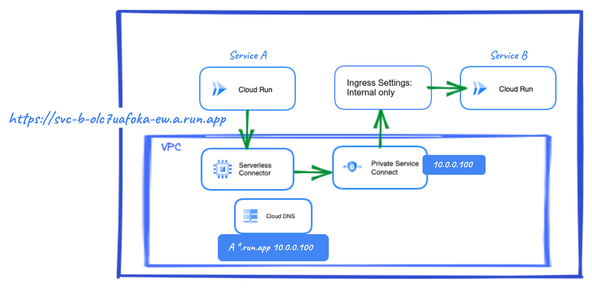
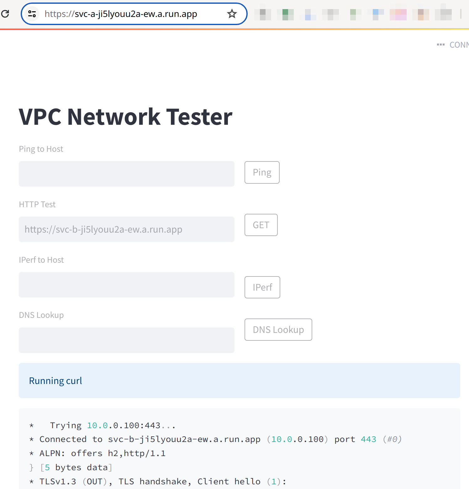
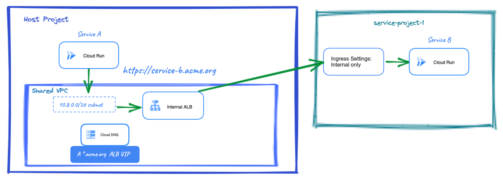
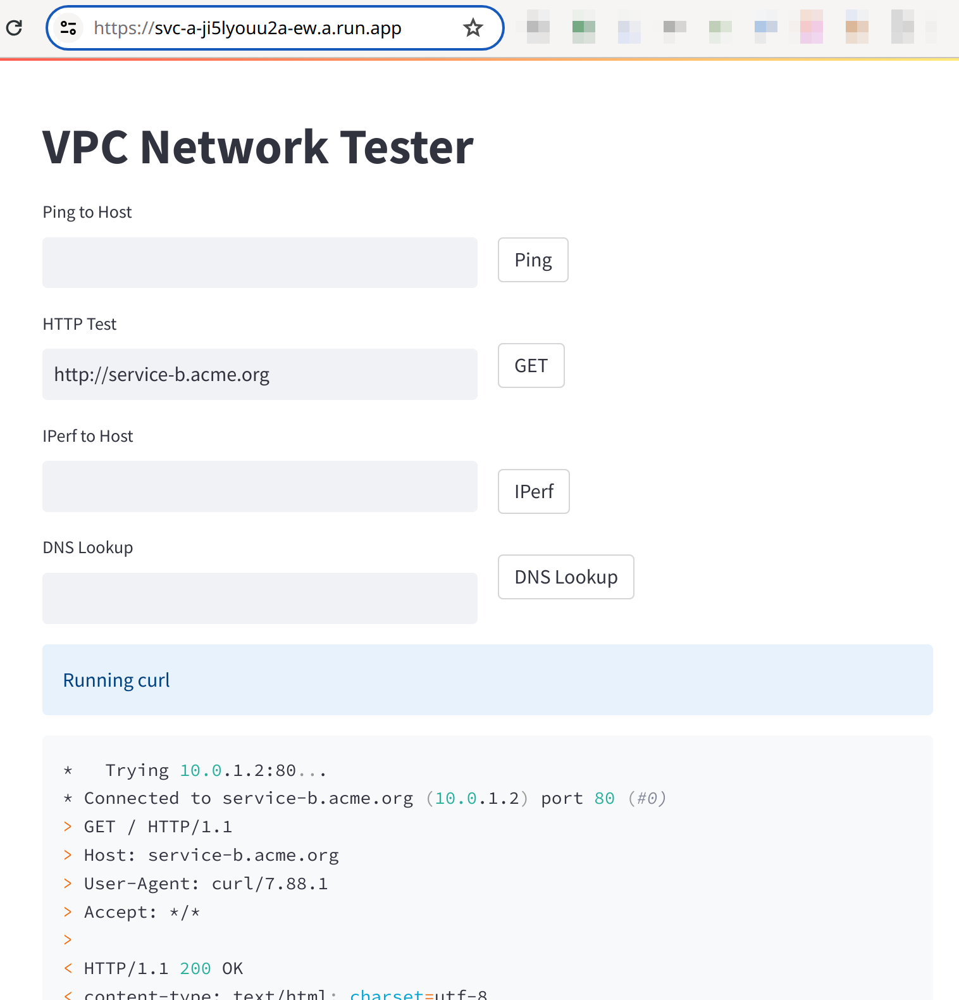

# Cloud Run Microservices

## Introduction

This blueprint contains all the necessary Terraform modules to deploy two microservices running in Cloud Run and communicating with each other.

The content of this blueprint corresponds to the chapter '_Microservices architectures - Developing Microservices applications_' of the [__Serverless Networking Guide__](https://services.google.com/fh/files/misc/serverless_networking_guide.pdf). This guide is an easy to follow introduction to Cloud Run, where a couple of friendly characters will guide you from the basics to more advanced topics with a very practical approach and in record time! The code here complements this learning and allows you to test the scenarios presented and your knowledge.

If you are interested in following this guide, take a look to the chapters' blueprints:

* [Exploring Cloud Run - My serverless "Hello, World!"](https://github.com/GoogleCloudPlatform/cloud-foundation-fabric/tree/master/blueprints/serverless/cloud-run-explore)
* [The corporate environment - Developing an enterprise application](https://github.com/GoogleCloudPlatform/cloud-foundation-fabric/tree/master/blueprints/serverless/cloud-run-corporate)
* [Microservices architectures - Developing Microservices applications](https://github.com/GoogleCloudPlatform/cloud-foundation-fabric/tree/master/blueprints/serverless/cloud-run-microservices)

## Prerequisites

Depending on the use case, you will need one or two projects with [billing enabled](https://cloud.google.com/billing/docs/how-to/modify-project) and a user with the “Project owner” [IAM](https://cloud.google.com/iam) role on those projects. You can use existing projects or let the blueprint create them for you but in that case you will need to add extra information for each project. E.g.:

```tfvars
project_configs = {
  main = {
    billing_account_id = "ABCDE-12345-ABCDE"
    parent             = "organizations/0123456789"
    project_id         = "spiritual-hour-331417"
  }
}
```

How to set this information is explained below.

## Spinning up the architecture

### General steps

1. Clone the repo to your local machine or Cloud Shell:

```bash
git clone https://github.com/GoogleCloudPlatform/cloud-foundation-fabric
```

2. Change to the directory of the blueprint:

```bash
cd cloud-foundation-fabric/blueprints/serverless/cloud-run-microservices
```

You should see this README and some terraform files.

3. To deploy a specific use case, you will need to create a file in this directory called `terraform.tfvars` and follow the corresponding instructions to set variables. Values that are meant to be substituted will be shown inside brackets but you need to omit these brackets. E.g.:

```tfvars
project_configs = {
  main = {
    project_id = "[project_id]"
  }
}
```

may become

```tfvars
project_configs = {
  main = {
    project_id = "spiritual-hour-331417"
  }
}
```

Use cases are self-contained so you can deploy any of them at will.

4. The usual terraform commands will do the work:

```bash
terraform init
terraform plan
terraform apply
```

It will take a few minutes. When complete, you should see an output stating the command completed successfully, a list of the created resources, and some output variables with information to access your services.

__Congratulations!__ You have successfully deployed the use case you chose based on the variables configuration.

### Use case 1: Service to service communication in the same project

This use case deploys two Cloud Run services in the same project. Service B is protected as an _internal only_ service and communication between Cloud Run services, even in the same project, is not considered internal by default. To communicate them, one option is to use PSC/PGA (the second option is shown in the use case 2). We will use a PSC endpoint and a Serverless VPC connector to reach Service B. A DNS record for the PSC endpoint is created.

<p align="center">  </p>

Service A uses an application with a GUI to test connectivity. You can find its source code in:

https://github.com/willypalacin/vpc-network-tester/tree/main

You will need to [build an image and push it to Artifact Registry](https://cloud.google.com/artifact-registry/docs/docker/store-docker-container-images), setting the corresponding Terraform variable to its URL. Add the main project ID in `terraform.tfvars`. E.g.:

```tfvars
image_configs = {
  svc_a = "us-docker.pkg.dev/[project-id]/[repo-name]/[tester-app]"
}
prefix = "[prefix]"
project_configs = {
  main = {
    project_id = "[project_id]"
  }
}
```

Note that final project ids will be of the form "[prefix]-[project-id]".

The service B default URL is created and shown as a terraform output variable. It will be similar to the one shown in the picture above. Get into service A and try to reach service B URL as shown below:

<p align="center">  </p>

You can see service A is resolving service B to an internal IP, 10.0.0.100, the PSC endpoint (see variable 'ip_configs'). Public access is restricted, if you try to e.g. `curl` from your laptop you will get an error.

### Use case 2: Service to service communication in different projects

The second option for internal service to service communication is to use an internal Application Load Balancer (ALB). This use case extends the previous architecture using a Shared VPC and a service project. Instead of a VPC connector, it uses Direct VPC Egress which allows Cloud Run to directly use IPs from a subnet. And the ALB allows you to use a custom domain.

<p align="center">  </p>

Set the following in `terraform.tfvars`:

```tfvars
image_configs = {
  svc_a = "us-docker.pkg.dev/[project-id]/[repo-name]/[tester-app]"
}
prefix = "[prefix]"
project_configs = {
  main = { # Used as host project
    project_id = "[project_id]"
  }
  service = {
    project_id = "[project_id]"
  }
}
```

The blueprint uses an HTTP connection to the ALB to avoid management of SSL certificates. Try to reach service B custom URL as shown below:

<p align="center">  </p>

## Cleaning up your environment

The easiest way to remove all the deployed resources is to run the following command:

```bash
terraform destroy
```

The above command will delete the associated resources so there will be no billable charges afterwards. Projects are removed from Terraform state but not deleted from Google Cloud.

<!-- TFDOC OPTS files:1 -->
<!-- BEGIN TFDOC -->
## Files

| name | description | modules | resources |
|---|---|---|---|
| [alb.tf](./alb.tf) | Internal Application Load Balancer resource. | <code>net-lb-app-int</code> |  |
| [cloudrun.tf](./cloudrun.tf) | Cloud Run services. | <code>cloud-run-v2</code> |  |
| [dns.tf](./dns.tf) | DNS resources. | <code>dns</code> |  |
| [main.tf](./main.tf) | Project resources. | <code>project</code> |  |
| [outputs.tf](./outputs.tf) | Module outputs. |  |  |
| [psc.tf](./psc.tf) | Private Service Connect resources. | <code>net-address</code> | <code>google_compute_global_forwarding_rule</code> |
| [variables.tf](./variables.tf) | Module variables. |  |  |
| [vpc.tf](./vpc.tf) | VPC resources. | <code>net-vpc</code> |  |

## Variables

| name | description | type | required | default |
|---|---|:---:|:---:|:---:|
| [image_configs](variables.tf#L23) | Container images for Cloud Run services. | <code title="object&#40;&#123;&#10;  svc_a &#61; string&#10;  svc_b &#61; optional&#40;string, &#34;us-docker.pkg.dev&#47;cloudrun&#47;container&#47;hello&#34;&#41;&#10;&#125;&#41;">object&#40;&#123;&#8230;&#125;&#41;</code> | ✓ |  |
| [prefix](variables.tf#L44) | Prefix used for project names. | <code>string</code> | ✓ |  |
| [custom_domain](variables.tf#L17) | Custom domain for the Load Balancer. | <code>string</code> |  | <code>&#34;service-b.acme.org&#34;</code> |
| [ip_configs](variables.tf#L32) | IP ranges or IPs used by the VPC. | <code>map&#40;string&#41;</code> |  | <code title="&#123;&#10;  subnet_main       &#61; &#34;10.0.1.0&#47;24&#34;&#10;  subnet_proxy      &#61; &#34;10.10.0.0&#47;24&#34;&#10;  subnet_vpc_access &#61; &#34;10.10.10.0&#47;28&#34;&#10;  subnet_vpc_direct &#61; &#34;10.8.0.0&#47;26&#34;&#10;  psc_addr          &#61; &#34;10.0.0.100&#34;&#10;&#125;">&#123;&#8230;&#125;</code> |
| [project_configs](variables.tf#L53) | Projects to use, one project or host and service projects. | <code title="map&#40;object&#40;&#123;&#10;  billing_account_id &#61; optional&#40;string&#41;&#10;  parent             &#61; optional&#40;string&#41;&#10;  project_id         &#61; optional&#40;string&#41;&#10;&#125;&#41;&#41;">map&#40;object&#40;&#123;&#8230;&#125;&#41;&#41;</code> |  | <code title="&#123;&#10;  main    &#61; &#123;&#125; &#35; Or host project&#10;  service &#61; &#123;&#125;&#10;&#125;">&#123;&#8230;&#125;</code> |
| [region](variables.tf#L71) | Cloud region where resources will be deployed. | <code>string</code> |  | <code>&#34;europe-west1&#34;</code> |

## Outputs

| name | description | sensitive |
|---|---|:---:|
| [custom_domain](outputs.tf#L17) | Custom domain for the Application Load Balancer. |  |
| [default_URLs](outputs.tf#L24) | Cloud Run services default URLs. |  |
| [load_balancer_ip](outputs.tf#L32) | Load Balancer IP address. |  |
<!-- END TFDOC -->
## Tests

```hcl
module "test" {
  source = "./fabric/blueprints/serverless/cloud-run-microservices"
  image_configs = {
    svc_a = "cloud-run-image"
  }
  prefix = "prefix"
  project_configs = {
    main = {
      billing_account_id = "ABCDE-12345-ABCDE"
      parent             = "organizations/0123456789"
      project_id         = "main-project-id"
    }
  }
}

# tftest modules=7 resources=29
```

```hcl
module "test" {
  source = "./fabric/blueprints/serverless/cloud-run-microservices"
  image_configs = {
    svc_a = "cloud-run-image"
  }
  prefix = "prefix"
  project_configs = {
    main = { # Used as host project
      billing_account_id = "ABCDE-12345-ABCDE"
      parent             = "organizations/0123456789"
      project_id         = "main-project-id"
    }
    service = {
      billing_account_id = "ABCDE-12345-ABCDE"
      parent             = "organizations/0123456789"
      project_id         = "service-project-id"
    }
  }
}

# tftest modules=10 resources=42
```
