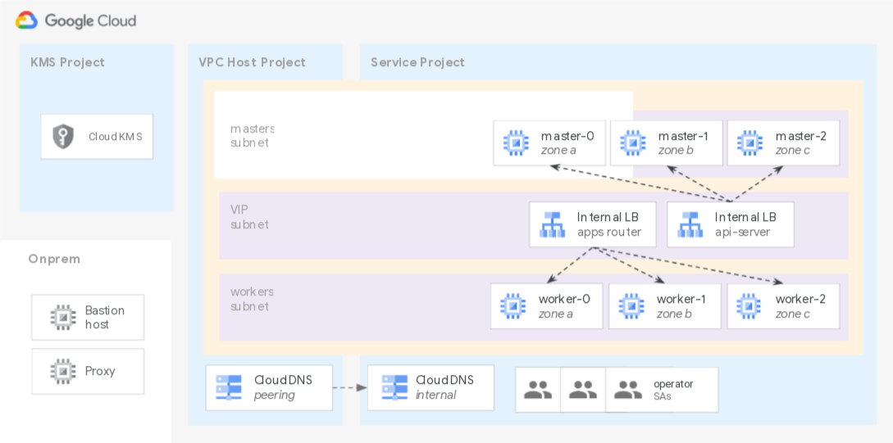
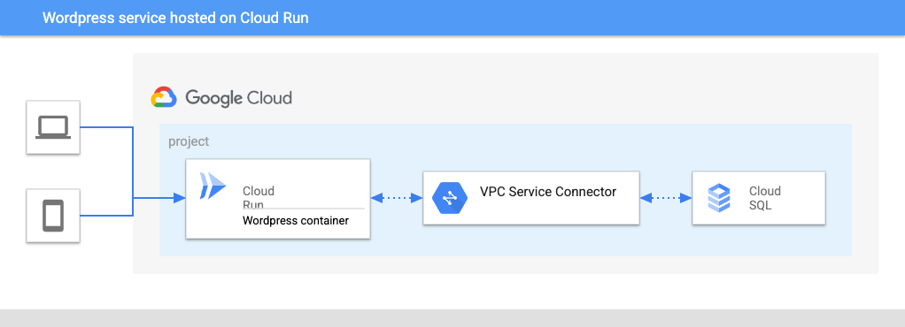

# Third Party Solutions

The blueprints in this folder show how to automate installation of specific third party products on GCP, following typical best practices.

## Blueprints

### OpenShift cluster bootstrap on Shared VPC

 
 This [example](./openshift/) shows how to quickly bootstrap an OpenShift 4.7 cluster on GCP, using typical enterprise features like Shared VPC and CMEK for instance disks. 

 

### Wordpress deployment on Cloud Run

 
 This [example](./wordpress/cloudrun/) shows how to deploy a functioning new Wordpress website exposed to the public internet via CloudRun and Cloud SQL, with minimal technical overhead. 

 

### Serverless phpIPAM on Cloud Run

 
This [example](./phpipam/) shows how to quickly bootstrap a serverless phpIPAM instance on GCP using Cloud Run. This comes with typical enterprise features like Shared VPC, Cloud Armor with IAP and, possibly, private exposure via Internal Application Load Balancer. Indeed, the script supports deploying the application either publicly via Global Application Load Balancer with restricted access based on IPs (Cloud Armor) and identities (Identity Aware Proxy) or privately via Internal Application Load Balancer.

 