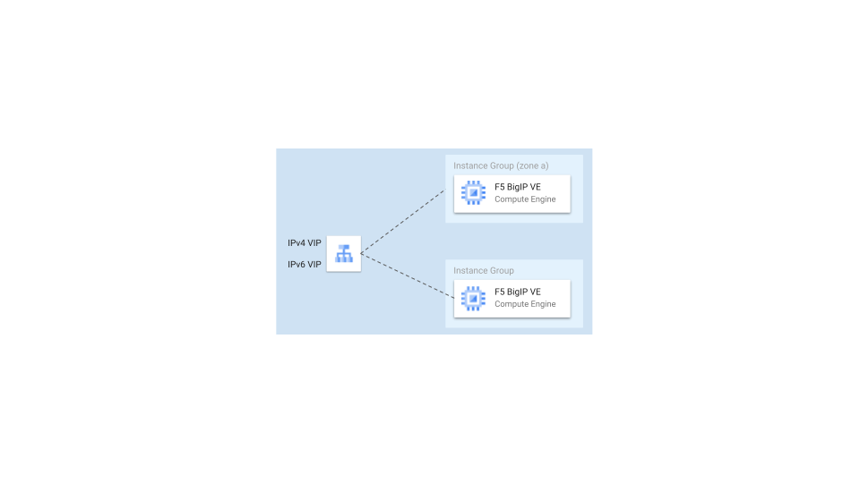

# Third Party Solutions

The blueprints in this folder show how to deploy both private and public active/active F5 BigIP-VE load balancers in GCP.

## Blueprints

### F5 BigIP

 
This example shows how to deploy both private and public active/active F5 BigIP-VE load balancers in GCP. It deploys external and/or internal GCP network passthrough load balancers in front of the F5 VMs in order to load balance the ingress traffic between them and it supports both IPv4 and IPv6.

 