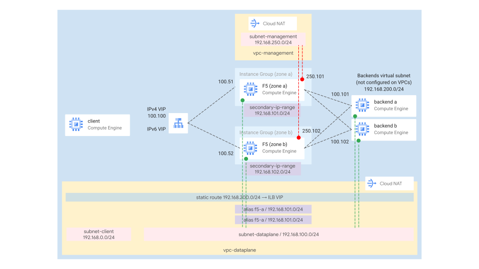
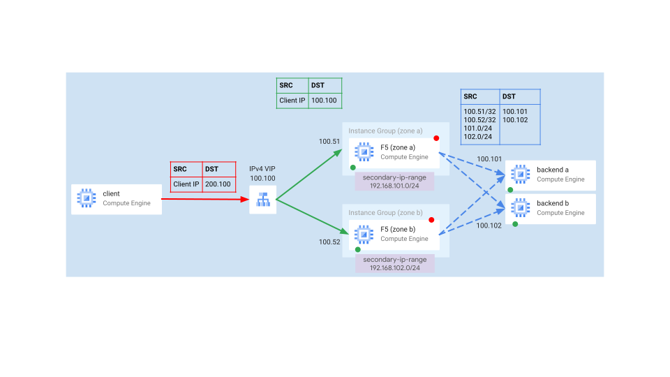

# F5 Big-IP

This blueprint shows how to the deploy [F5 BigIP Virtual Edition (VE)](https://www.f5.com/trials/big-ip-virtual-edition) on GCP, leveraging the [f5-bigip-ha-active blueprint](../f5-bigip-ha-active/README.md).

<p align="center">
  
</p>

Calling the [f5-bigip-ha-active blueprint](../f5-bigip-ha-active/README.md), we deploy:
- 2 F5 BigIP VMs, each in an unmanaged instance group, in a dedicated zone
- 1 internal network passthrough load balancer in `L3_default` mode, pointing to the F5 instance groups. By default, the load balancer will expose two forwarding rules (IPs): one for IPv4, one for IPv6

Additionally, we deploy directly through this blueprint:
- 1 project containing all the other resources (optional)
- 1 dataplane VPC where all VM NICs are attached, equipped with Cloud NAT (so that the backend VMs can access the Internet). One subnet is dedicated to clients. One subnet is dedicated to F5 VMs and backend VMs
- 1 management VPC used by F5 VMs only, equipped with Cloud NAT (for F5 management connectivity)
- 2 demo backend VMs running Nginx, installed at startup
- Different firewall rules to allow the clients to connect to the F5 instances, and the F5 instances to connect to the backends
- 1 static route in the dataplane VPC that forwards traffic destined to the backends to the internal network passthrough load balancer

## Apply this blueprint

- If you're leveraging an existing project, make sure you have the roles to attach service accounts and log into VMs (typically, `roles/iam.serviceAccountUser`).
- Register an F5 BigIP-VE license or apply for an F5 BigIP-VE trial license.
- Substitute the default values for each F5 instance in the `instance_dedicated_config` variable.
- Substitute the [default public key](data/my_key.pub) in the `data` folder with your own public key. This should automatically grant you SSH access.
- Run `terraform init, terraform apply`
- At startup, the F5 VMs should download some software and reboot twice. Check the serial console logs to make sure everything works as expected and no errors occur.

Please, refer to the [blueprint documentation](../f5-bigip-ha-active/README.md) for variables definitions and further module customizations.

## Access the F5 machines through IAP tunnels

F5 management IPs are private. If you haven't setup any hybrid connectivity (i.e. VPN/Interconnect) you can still access the VMs with SSH and their GUI leveraging IAP tunnels.

```shell
gcloud compute ssh YOUR_F5_VM_NAME \
  --project YOUR_PROJECT \
  --zone europe-west8-a -- \
  -L 4431:127.0.0.1:8443 \
  -L 221:127.0.0.1:22 \
  -N -q -f

gcloud compute ssh YOUR_F5_VM_NAME \
  --project YOUR_PROJECT \
  --zone europe-west8-b -- \
  -L 4432:127.0.0.1:8443 \
  -L 222:127.0.0.1:22 \
  -N -q -f
```

Once tunnels are established, from your machine:

Connect to the machine in zone `a` using:
- SSH: `127.0.0.1`, port `221`
- GUI: `127.0.0.1`, port `4431`

Connect to the machine in zone `b` using:
- SSH: `127.0.0.1`, port `222`
- GUI: `127.0.0.1`, port `4432`

The default username is `admin` and the password is `MyFabricSecret123!`

## F5 configuration

Please, refer to the [f5-bigip-ha-active blueprint section](../f5-bigip-ha-active/README.md#f5-configuration)

## Internal IPv4 traffic routing

For private IPv4 traffic, you have two options:

- Create as many forwarding rules as you need and point your clients directly to the forwarding rules virtual IPs.
- Create one forwarding rule and create one static route that points to a virtual subnet representing your backend servers, that uses the load balancer VIP as the next-hop.

The blueprint chooses the second option, although this configuration is not enforced in the [f5-bigip-ha-active blueprint](../f5-bigip-ha-active/README.md) itself. This helps to minimize the number of forwarding rules.

The diagram shows the path of the traffic and how we modify the packet as it goes through the load balancers.

<p align="center">
  
</p>

Please, note there are a few caveats:

- Forwarding rules of protocol type `L3_DEFAULT` cannot be set as next-hops of static routes. That's why we set all the IPv4 load balancers with protocol type `TCP`. Anyway, if a load balancer is used as a next-hop for a route it can forward multiple protocols.
- At the moment of writing, IPv6 forwarding rules cannot be used as route next-hops. You will need to create as many IPv6 forwarding rules you need.
- The "route path" doesn't apply to external traffic.
- The backend servers virtual subnet (`192.168.200.0/24`) is (by design) not configured on any VPC and is different from the backend VMs subnet (`192.168.0.0/24`). It's just a commodity subnet used to identify a backend service that we use as the static route destination. Traffic should land on your F5s using a (destination) IP in that subnet. Your irules should match those virtual IPs and change the packets destination IPs, as they forward it to the backends.
<!-- BEGIN TFDOC -->
## Variables

| name | description | type | required | default |
|---|---|:---:|:---:|:---:|
| [prefix](variables.tf#L82) | The name prefix used for resources. | <code>string</code> | ✓ |  |
| [project_id](variables.tf#L93) | The project id where we deploy the resources. | <code>string</code> | ✓ |  |
| [region](variables.tf#L98) | The region where we deploy the F5 IPs. | <code>string</code> | ✓ |  |
| [backend_vm_configs](variables.tf#L17) | The sample backend VMs configuration. Keys are the zones where VMs are deployed. | <code title="map&#40;object&#40;&#123;&#10;  address        &#61; string&#10;  instance_type  &#61; string&#10;  startup_script &#61; string&#10;&#125;&#41;&#41;">map&#40;object&#40;&#123;&#8230;&#125;&#41;&#41;</code> |  | <code title="&#123;&#10;  a &#61; &#123;&#10;    address        &#61; &#34;192.168.100.101&#34;&#10;    instance_type  &#61; &#34;e2-micro&#34;&#10;    startup_script &#61; &#34;apt update &#38;&#38; apt install -y nginx&#34;&#10;  &#125;&#10;  b &#61; &#123;&#10;    address        &#61; &#34;192.168.100.102&#34;&#10;    instance_type  &#61; &#34;e2-micro&#34;&#10;    startup_script &#61; &#34;apt update &#38;&#38; apt install -y nginx&#34;&#10;  &#125;&#10;&#125;">&#123;&#8230;&#125;</code> |
| [forwarding_rules_config](variables.tf#L38) | The optional configurations of the GCP load balancers forwarding rules. | <code>map&#40;any&#41;</code> |  | <code title="&#123;&#10;  &#34;ipv4&#34; &#61; &#123;&#10;    address  &#61; &#34;192.168.100.100&#34;&#10;    protocol &#61; &#34;TCP&#34;&#10;  &#125;&#10;  &#34;ipv6&#34; &#61; &#123;&#10;    ip_version &#61; &#34;IPV6&#34;&#10;  &#125;&#10;&#125;">&#123;&#8230;&#125;</code> |
| [instance_dedicated_configs](variables.tf#L52) | The F5 VMs configuration. The map keys are the zones where the VMs are deployed. | <code>map&#40;any&#41;</code> |  | <code title="&#123;&#10;  a &#61; &#123;&#10;    license_key &#61; &#34;AAAAA-BBBBB-CCCCC-DDDDD-EEEEEEE&#34;&#10;    network_config &#61; &#123;&#10;      alias_ip_range_address &#61; &#34;192.168.101.0&#47;24&#34;&#10;      alias_ip_range_name    &#61; &#34;f5-a&#34;&#10;    &#125;&#10;  &#125;&#10;  b &#61; &#123;&#10;    license_key &#61; &#34;AAAAA-BBBBB-CCCCC-DDDDD-EEEEEEE&#34;&#10;    network_config &#61; &#123;&#10;      alias_ip_range_address &#61; &#34;192.168.102.0&#47;24&#34;&#10;      alias_ip_range_name    &#61; &#34;f5-b&#34;&#10;    &#125;&#10;  &#125;&#10;&#125;">&#123;&#8230;&#125;</code> |
| [instance_shared_config](variables.tf#L73) | The F5 VMs shared configurations. | <code>map&#40;any&#41;</code> |  | <code title="&#123;&#10;  enable_ipv6    &#61; true&#10;  ssh_public_key &#61; &#34;.&#47;data&#47;mykey.pub&#34;&#10;&#125;">&#123;&#8230;&#125;</code> |
| [project_create](variables.tf#L87) | Whether to automatically create a project. | <code>bool</code> |  | <code>false</code> |
| [vpc_config](variables.tf#L103) | VPC and subnet ids, in case existing VPCs are used. | <code title="object&#40;&#123;&#10;  backend_vms_cidr &#61; string &#35; used by F5s. Not configured on the VPC.&#10;  dataplane &#61; object&#40;&#123;&#10;    subnets &#61; map&#40;object&#40;&#123;&#10;      cidr                &#61; optional&#40;string&#41;&#10;      secondary_ip_ranges &#61; optional&#40;map&#40;string&#41;&#41; &#35; name -&#62; cidr&#10;    &#125;&#41;&#41;&#10;  &#125;&#41;&#10;  management &#61; object&#40;&#123;&#10;    subnets &#61; map&#40;object&#40;&#123;&#10;      cidr                &#61; optional&#40;string&#41;&#10;      secondary_ip_ranges &#61; optional&#40;map&#40;string&#41;&#41; &#35; name -&#62; cidr&#10;    &#125;&#41;&#41;&#10;  &#125;&#41;&#10;&#125;&#41;">object&#40;&#123;&#8230;&#125;&#41;</code> |  | <code title="&#123;&#10;  backend_vms_cidr &#61; &#34;192.168.200.0&#47;24&#34;&#10;  dataplane &#61; &#123;&#10;    subnets &#61; &#123;&#10;      clients &#61; &#123;&#10;        cidr &#61; &#34;192.168.0.0&#47;24&#34;&#10;      &#125;&#10;      dataplane &#61; &#123;&#10;        cidr &#61; &#34;192.168.100.0&#47;24&#34;&#10;        secondary_ip_ranges &#61; &#123;&#10;          f5-a &#61; &#34;192.168.101.0&#47;24&#34;&#10;          f5-b &#61; &#34;192.168.102.0&#47;24&#34;&#10;        &#125;&#10;      &#125;&#10;    &#125;&#10;  &#125;&#10;  management &#61; &#123;&#10;    subnets &#61; &#123;&#10;      management &#61; &#123;&#10;        cidr &#61; &#34;192.168.250.0&#47;24&#34;&#10;      &#125;&#10;    &#125;&#10;  &#125;&#10;&#125;">&#123;&#8230;&#125;</code> |

## Outputs

| name | description | sensitive |
|---|---|:---:|
| [f5_management_ips](outputs.tf#L17) | The F5 management interfaces IP addresses. |  |
| [forwarding_rule_configss](outputs.tf#L22) | The GCP forwarding rules configurations. |  |
<!-- END TFDOC -->

## Test
```hcl
module "f5-deployment" {
  source         = "./fabric/blueprints/third-party-solutions/f5-bigip/f5-bigip-ha-active-deployment"
  prefix         = "test"
  project_create = true
  project_id     = "test-project"
  region         = "europe-west1"
}
# tftest modules=21 resources=46
```
