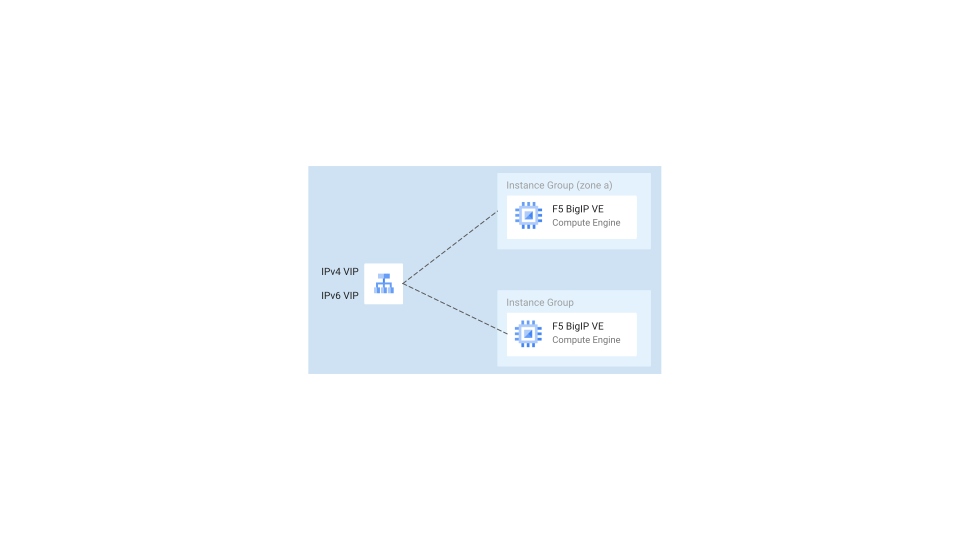

# F5 BigIP-VE HA active-active blueprint

This blueprint allows to create active/active private and/or public F5 BigIP-VE load balancers.

<p align="center">
  
</p>

## Design notes

- The blueprint supports by default two VPCs: a `dataplane` network and a `management` network.
- We don't use the `F5 Cloud Failover Extension (CFE)`. This would imply an active/passive architecture, it would limit the number of instances to two, it would use static routes and it would require F5 VMs service accounts to have roles set, so they can configure routes.
- Instead, users can deploy as many active instances they need and we make them reachable through passthrough GCP load balancers.
- The blueprint allows to expose the F5 instances both externally and internally, using internal and external network passthrough load balancers. You can also choose to expose the same F5 instances both externally and internally at the same time.
- The blueprint supports dual-stack (IPv4/IPv6).
- We deliberately use the original F5-BigIP `startup-script.tpl` file. We haven't changed it and we pass to it the same variables, so it should be easier to swap it with custom scripts (copyright reported in the template file and down in this readme).

## Access the F5 machines through IAP tunnels

F5 management IPs are private. If you haven't setup any hybrid connectivity (i.e. VPN/Interconnect) you can still access the VMs with SSH and their GUI leveraging IAP tunnels.

For example, you can first establish a tunnel:

```shell
gcloud compute ssh YOUR_F5_VM_NAME \
  --project YOUR_PROJECT \
  --zone europe-west8-a -- \
  -L 4431:127.0.0.1:8443 \
  -L 221:127.0.0.1:22 \
  -N -q -f
```

And then connect to:

- SSH: `127.0.0.1`, port `221`
- GUI: `127.0.0.1`, port `4431`

The default username is `admin` and the password is `MyFabricSecret123!`

## F5 configuration

You won't be able to pass traffic through the F5 load balancers until you perform some further configurations. We hope to automate these configuration steps soon. **Contributions are welcome!**

- Disable traffic-group and -optionally- configure config-sync.
- Configure the secondary IP range IPs assigned to each machine as a self-ip on each F5. These need to be self IPs as opposed to NAT pools, so they will be different for each instance, even if config sync is active.
- Enable `automap` so that traffic is source natted using the self IPs configured, before going to the backends.
- Create as many `virtual servers`/`irules` as you need, so you can match incoming traffic and redirect it to the backends.
- By default, Google load balancers' health checks will query the F5 VMs on port `65535` from a set of [well-known IPs](https://cloud.google.com/load-balancing/docs/health-check-concepts#ip-ranges). We recommend creating a dedicated virtual server that answers on port `65535`. You can redirect the connection to the loopback interface.

## Examples

<!-- BEGIN TOC -->
- [Design notes](#design-notes)
- [Access the F5 machines through IAP tunnels](#access-the-f5-machines-through-iap-tunnels)
- [F5 configuration](#f5-configuration)
- [Examples](#examples)
  - [Single instance](#single-instance)
  - [Active/active instances](#activeactive-instances)
  - [Change the shared instances configuration](#change-the-shared-instances-configuration)
  - [Public load F5 load balancers](#public-load-f5-load-balancers)
  - [Multiple forwarding rules and dual-stack (IPv4/IPv6)](#multiple-forwarding-rules-and-dual-stack-ipv4ipv6)
  - [Use the GCP secret manager](#use-the-gcp-secret-manager)
- [F5 code copyright](#f5-code-copyright)
- [Variables](#variables)
- [Outputs](#outputs)
<!-- END TOC -->

### Single instance

By default, the blueprint deploys one or more instances in a region. These instances are behind an internal network passthrough (`L3_DEFAULT`) load balancer.

```hcl
module "f5-lb" {
  source     = "./fabric/blueprints/third-party-solutions/f5-bigip/f5-bigip-ha-active"
  project_id = "my-project"
  prefix     = "test"
  region     = "europe-west1"

  instance_dedicated_configs = {
    a = {
      license_key = "AAAAA-BBBBB-CCCCC-DDDDD-EEEEEEE"
      network_config = {
        alias_ip_range_address = "192.168.1.0/24"
        alias_ip_range_name    = "ip-range-a"
      }
    }
  }

  vpc_config = {
    dataplane = {
      network    = "projects/my-project/global/networks/dataplane"
      subnetwork = "projects/my-project/regions/europe-west1/subnetworks/dataplane"
    }
    management = {
      network    = "projects/my-project/global/networks/management"
      subnetwork = "projects/my-project/regions/europe-west1/subnetworks/management"
    }
  }
}
# tftest modules=6 resources=8 inventory=single-instance.yaml
```

### Active/active instances

To add more than one instance, add items to the `instance_dedicated_configs` variable. Keys specify the the zones where the instances are deployed.

```hcl
module "f5-lb" {
  source     = "./fabric/blueprints/third-party-solutions/f5-bigip/f5-bigip-ha-active"
  project_id = "my-project"
  prefix     = "test"
  region     = "europe-west1"

  instance_dedicated_configs = {
    a = {
      license_key = "AAAAA-BBBBB-CCCCC-DDDDD-EEEEEEE"
      network_config = {
        alias_ip_range_address = "192.168.1.0/24"
        alias_ip_range_name    = "ip-range-a"
      }
    }
    b = {
      license_key = "XXXXX-YYYYY-WWWWW-ZZZZZ-PPPPPP"
      network_config = {
        alias_ip_range_address = "192.168.2.0/24"
        alias_ip_range_name    = "ip-range-b"
      }
    }
  }

  vpc_config = {
    dataplane = {
      network    = "projects/my-project/global/networks/dataplane"
      subnetwork = "projects/my-project/regions/europe-west1/subnetworks/dataplane"
    }
    management = {
      network    = "projects/my-project/global/networks/management"
      subnetwork = "projects/my-project/regions/europe-west1/subnetworks/management"
    }
  }
}
# tftest modules=7 resources=12 inventory=active-active-instances.yaml
```

### Change the shared instances configuration

You can change one or more properties used by the shared instances, leveraging the `instance_shared_config` variable.

```hcl
module "f5-lb" {
  source     = "./fabric/blueprints/third-party-solutions/f5-bigip/f5-bigip-ha-active"
  project_id = "my-project"
  prefix     = "test"
  region     = "europe-west1"

  instance_dedicated_configs = {
    a = {
      license_key = "AAAAA-BBBBB-CCCCC-DDDDD-EEEEEEE"
      network_config = {
        alias_ip_range_address = "192.168.1.0/24"
        alias_ip_range_name    = "ip-range-a"
      }
    }
    b = {
      license_key = "XXXXX-YYYYY-WWWWW-ZZZZZ-PPPPPP"
      network_config = {
        alias_ip_range_address = "192.168.2.0/24"
        alias_ip_range_name    = "ip-range-b"
      }
    }
  }

  instance_shared_config = {
    boot_disk = {
      size = 150
    }
    instance_type = "n2-standard-8"
    tags          = ["f5-lbs"]
    username      = "f5admin"
  }

  vpc_config = {
    dataplane = {
      network    = "projects/my-project/global/networks/dataplane"
      subnetwork = "projects/my-project/regions/europe-west1/subnetworks/dataplane"
    }
    management = {
      network    = "projects/my-project/global/networks/management"
      subnetwork = "projects/my-project/regions/europe-west1/subnetworks/management"
    }
  }
}
# tftest modules=7 resources=12 inventory=shared-config.yaml
```

### Public load F5 load balancers

You can configure the blueprint so it deploys external network passthrough load balancers, so you can expose on Internet your F5 load balancer(s).

```hcl
module "f5-lb" {
  source     = "./fabric/blueprints/third-party-solutions/f5-bigip/f5-bigip-ha-active"
  project_id = "my-project"
  prefix     = "test"
  region     = "europe-west1"

  instance_dedicated_configs = {
    a = {
      license_key = "AAAAA-BBBBB-CCCCC-DDDDD-EEEEEEE"
      network_config = {
        alias_ip_range_address = "192.168.1.0/24"
        alias_ip_range_name    = "ip-range-a"
      }
    }
    b = {
      license_key = "XXXXX-YYYYY-WWWWW-ZZZZZ-PPPPPP"
      network_config = {
        alias_ip_range_address = "192.168.2.0/24"
        alias_ip_range_name    = "ip-range-b"
      }
    }
  }

  forwarding_rules_config = {
    "ext-ipv4" = {
      external = true
    }
  }

  vpc_config = {
    dataplane = {
      network    = "projects/my-project/global/networks/dataplane"
      subnetwork = "projects/my-project/regions/europe-west1/subnetworks/dataplane"
    }
    management = {
      network    = "projects/my-project/global/networks/management"
      subnetwork = "projects/my-project/regions/europe-west1/subnetworks/management"
    }
  }
}
# tftest modules=7 resources=12 inventory=public-load-balancers.yaml
```

### Multiple forwarding rules and dual-stack (IPv4/IPv6)

You can configure the blueprint in order to expose both internal and external load balancers.
Each load balancer can have multiple forwarding rules, eventually both IPv4 and IPv6.

```hcl
module "f5-lb" {
  source     = "./fabric/blueprints/third-party-solutions/f5-bigip/f5-bigip-ha-active"
  project_id = "my-project"
  prefix     = "test"
  region     = "europe-west1"

  instance_dedicated_configs = {
    a = {
      license_key = "AAAAA-BBBBB-CCCCC-DDDDD-EEEEEEE"
      network_config = {
        alias_ip_range_address = "192.168.1.0/24"
        alias_ip_range_name    = "ip-range-a"
      }
    }
    b = {
      license_key = "XXXXX-YYYYY-WWWWW-ZZZZZ-PPPPPP"
      network_config = {
        alias_ip_range_address = "192.168.2.0/24"
        alias_ip_range_name    = "ip-range-b"
      }
    }
  }

  forwarding_rules_config = {
    "ext-ipv4" = {
      external = true
    }
    "ext-ipv6" = {
      external   = true
      ipv6       = true
      subnetwork = "projects/my-project/regions/europe-west1/subnetworks/ipv6_external"
    }
    "int-ipv4" = {}
    "int-ipv6" = {
      ipv6 = true
    }
  }

  vpc_config = {
    dataplane = {
      network    = "projects/my-project/global/networks/dataplane"
      subnetwork = "projects/my-project/regions/europe-west1/subnetworks/dataplane"
    }
    management = {
      network    = "projects/my-project/global/networks/management"
      subnetwork = "projects/my-project/regions/europe-west1/subnetworks/management"
    }
  }
}
# tftest modules=8 resources=20 inventory=multiple-fw-rules.yaml
```

### Use the GCP secret manager

By default, this blueprint (and the `startup-script.tpl`) stores the F5 admin password in plain-text as a metadata of the F5 VMs. Most of administrators change this password in F5 soon after the boot.
The example shows how to leverage instead the GCP secret manager.

```hcl
module "f5-lb" {
  source     = "./fabric/blueprints/third-party-solutions/f5-bigip/f5-bigip-ha-active"
  project_id = "my-project"
  prefix     = "test"
  region     = "europe-west1"

  instance_shared_config = {
    secret = {
      is_gcp = true
      value  = "MyNewFabricSecret123!" # needs to be defined in the same project
    }
  }

  instance_dedicated_configs = {
    a = {
      license_key = "AAAAA-BBBBB-CCCCC-DDDDD-EEEEEEE"
      network_config = {
        alias_ip_range_address = "192.168.1.0/24"
        alias_ip_range_name    = "ip-range-a"
      }
    }
  }

  vpc_config = {
    dataplane = {
      network    = "projects/my-project/global/networks/dataplane"
      subnetwork = "projects/my-project/regions/europe-west1/subnetworks/dataplane"
    }
    management = {
      network    = "projects/my-project/global/networks/management"
      subnetwork = "projects/my-project/regions/europe-west1/subnetworks/management"
    }
  }
}
# tftest modules=6 resources=8 inventory=secret-manager.yaml
```

## F5 code copyright

This repository uses code from the third-party project [terraform-gcp-bigip-module](https://github.com/F5Networks/terraform-gcp-bigip-module).

This code is also licensed as Apache 2.0.

This is the original copyright notice from the third-party repository: `Copyright 2014-2019 F5 Networks Inc.`
<!-- BEGIN TFDOC -->
## Variables

| name | description | type | required | default |
|---|---|:---:|:---:|:---:|
| [instance_dedicated_configs](variables.tf#L43) | The F5 VMs configuration. The map keys are the zones where the VMs are deployed. | <code title="map&#40;object&#40;&#123;&#10;  network_config &#61; object&#40;&#123;&#10;    alias_ip_range_address &#61; string&#10;    alias_ip_range_name    &#61; string&#10;    dataplane_address      &#61; optional&#40;string&#41;&#10;    management_address     &#61; optional&#40;string&#41;&#10;  &#125;&#41;&#10;  license_key &#61; optional&#40;string, &#34;AAAAA-BBBBB-CCCCC-DDDDD-EEEEEEE&#34;&#41;&#10;&#125;&#41;&#41;">map&#40;object&#40;&#123;&#8230;&#125;&#41;&#41;</code> | ✓ |  |
| [prefix](variables.tf#L78) | The name prefix used for resources. | <code>string</code> | ✓ |  |
| [project_id](variables.tf#L83) | The project id where we deploy the resources. | <code>string</code> | ✓ |  |
| [region](variables.tf#L88) | The region where we deploy the F5 IPs. | <code>string</code> | ✓ |  |
| [vpc_config](variables.tf#L93) | The dataplane and mgmt network and subnetwork self links. | <code title="object&#40;&#123;&#10;  dataplane &#61; object&#40;&#123;&#10;    network    &#61; string&#10;    subnetwork &#61; string&#10;  &#125;&#41;&#10;  management &#61; object&#40;&#123;&#10;    network    &#61; string&#10;    subnetwork &#61; string&#10;  &#125;&#41;&#10;&#125;&#41;">object&#40;&#123;&#8230;&#125;&#41;</code> | ✓ |  |
| [forwarding_rules_config](variables.tf#L17) | The optional configurations of the GCP load balancers forwarding rules. | <code title="map&#40;object&#40;&#123;&#10;  address       &#61; optional&#40;string&#41;&#10;  external      &#61; optional&#40;bool, false&#41;&#10;  global_access &#61; optional&#40;bool, true&#41;&#10;  ipv6          &#61; optional&#40;bool, false&#41;&#10;  protocol      &#61; optional&#40;string, &#34;L3_DEFAULT&#34;&#41;&#10;  subnetwork    &#61; optional&#40;string&#41; &#35; used for IPv6 NLBs&#10;&#125;&#41;&#41;">map&#40;object&#40;&#123;&#8230;&#125;&#41;&#41;</code> |  | <code title="&#123;&#10;  l4 &#61; &#123;&#125;&#10;&#125;">&#123;&#8230;&#125;</code> |
| [health_check_config](variables.tf#L32) | The optional health check configuration. The variable types are enforced by the underlying module. | <code>map&#40;any&#41;</code> |  | <code title="&#123;&#10;  tcp &#61; &#123;&#10;    port               &#61; 65535&#10;    port_specification &#61; &#34;USE_FIXED_PORT&#34;&#10;  &#125;&#10;&#125;">&#123;&#8230;&#125;</code> |
| [instance_shared_config](variables.tf#L56) | The F5 VMs shared configurations. | <code title="object&#40;&#123;&#10;  boot_disk &#61; optional&#40;object&#40;&#123;&#10;    image &#61; optional&#40;string, &#34;projects&#47;f5-7626-networks-public&#47;global&#47;images&#47;f5-bigip-15-1-2-1-0-0-10-byol-ltm-2boot-loc-210115160742&#34;&#41;&#10;    size  &#61; optional&#40;number, 100&#41;&#10;    type  &#61; optional&#40;string, &#34;pd-ssd&#34;&#41;&#10;  &#125;&#41;, &#123;&#125;&#41;&#10;  enable_ipv6   &#61; optional&#40;bool, false&#41; &#35; needs to be true to receive traffic from IPv6 forwarding rules&#10;  instance_type &#61; optional&#40;string, &#34;n2-standard-4&#34;&#41;&#10;  secret &#61; optional&#40;object&#40;&#123;&#10;    is_gcp &#61; optional&#40;bool, false&#41;&#10;    value  &#61; optional&#40;string, &#34;MyFabricSecret123&#33;&#34;&#41;&#10;  &#125;&#41;, &#123;&#125;&#41;&#10;  service_account &#61; optional&#40;string&#41;&#10;  ssh_public_key  &#61; optional&#40;string, &#34;my_key.pub&#34;&#41;&#10;  tags            &#61; optional&#40;list&#40;string&#41;, &#91;&#93;&#41;&#10;  username        &#61; optional&#40;string, &#34;admin&#34;&#41;&#10;&#125;&#41;">object&#40;&#123;&#8230;&#125;&#41;</code> |  | <code>&#123;&#125;</code> |

## Outputs

| name | description | sensitive |
|---|---|:---:|
| [f5_management_ips](outputs.tf#L17) | The F5 management interfaces IP addresses. |  |
| [forwarding_rules_configs](outputs.tf#L25) | The GCP forwarding rules configurations. |  |
<!-- END TFDOC -->
