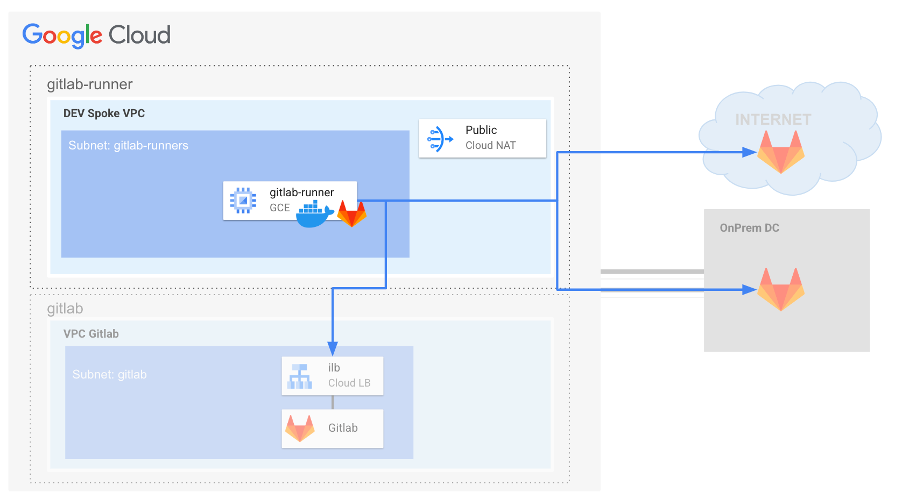
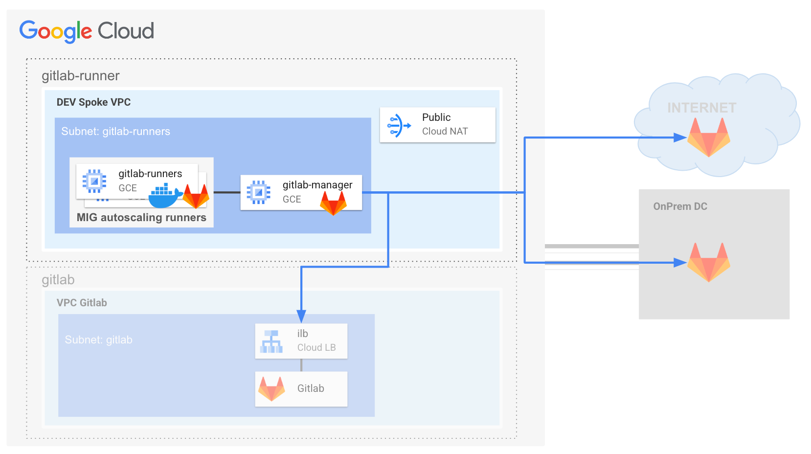

# GitLab Runner Blueprint

This Terraform module provides a streamlined and automated way to provision and
configure a GitLab CI/CD runner on Google Cloud Platform (GCP). It leverages
GCP's infrastructure and GitLab's runner capabilities to create a flexible and
scalable solution for your CI/CD pipelines.

## Gitlab Runner options

### Docker executor

In GitLab CI/CD,
the ["docker executor"](https://docs.gitlab.com/runner/executors/docker.html) is
one of the methods used to determine
the environment in which your CI/CD jobs will be executed. When you use the
docker executor, your jobs run within Docker containers.



Key features and how it works:

- **Leverages Docker**: The GitLab Runner relies on the presence of Docker on
  the machine (or host) where it is installed. During job execution, the runner
  creates and manages Docker containers to run the steps defined in your
  .gitlab-ci.yml file.

- **Job Isolation**: Each job is executed within its own, isolated Docker
  container. This provides a clean and independent environment for each build or
  test process, preventing conflicts or side effects from previous jobs.

- **Flexibility through Images**:
  You specify the Docker image to be used as the base for each container. This
  allows you to choose the operating system, tools, and pre-installed software
  needed for your build environment. You can use official images from Docker Hub
  or create your custom images.

Please find below a sample terraform.tfvars for bootstrapping a Gitlab runner
with Docker executor via this blueprint.

```tfvars
project_id = "test-project"
gitlab_config = {
  hostname    = "gitlab.gcp.example.com"
  ca_cert_pem = "-----BEGIN CERTIFICATE-----.."
}
gitlab_runner_config = {
  authentication_token = "auth-token"
  executors_config       = {
    docker = {}
  }
}
network_config = {
  network_self_link = "https://www.googleapis.com/compute/v1/projects/test-net-project/global/networks/default"
  subnet_self_link  = "https://www.googleapis.com/compute/v1/projects/test-net-project/regions/europe-west1/subnetworks/subnet"
}
# tftest skip
```

### Docker Autoscale Executor (BETA)

The ["docker autoscaler executor"](https://docs.gitlab.com/runner/executors/docker_autoscaler.html)
in GitLab is a powerful mechanism designed to dynamically scale your CI/CD
resources based on the demand of your pipelines. It achieves this by
intelligently managing virtual machines (VMs) on cloud platforms, provisioning
or terminating VMs as needed.



Key Features:

- **Dynamic Scaling**: When the workload increases (many CI/CD jobs queued), the
  docker autoscaler executor instructs a cloud provider to spin up new VMs to
  handle the jobs. Conversely, when jobs are completed and the workload
  decreases, it terminates VMs to release resources.

- **Cost Optimization**: By matching resource allocation to your CI/CD demands,
  you avoid paying for idle VMs when they are not needed.

- **Flexibility**: The docker autoscaler executor wraps the docker executor,
  meaning you still benefit from running jobs in isolated Docker containers.

The docker autoscaler executor achieves its dynamic scaling capabilities through
integration
with [Fleeting plugins](https://gitlab.com/gitlab-org/fleeting/fleeting-plugin-googlecompute).
Fleeting is a framework that abstracts the management of autoscaled VM
instances, and it offers plugins for different cloud providers, including Google
Cloud Platform (GCP).

Please find below a sample terraform.tfvars for bootstrapping a Gitlab runner
with Docker executor via this blueprint.

```tfvars
project_id = "test-project"
gitlab_config = {
  hostname    = "gitlab.gcp.example.com"
  ca_cert_pem = "-----BEGIN CERTIFICATE-----.."
}
gitlab_runner_config = {
  authentication_token = "auth-token"
  executors_config       = {
    docker_autoscaler = {
      gcp_project_id = "test-project
      zone           = "europe-west1-b"
      mig_name       = "gitlab-runner"
      machine_type   = "g1-small"
      machine_image  = "coreos-cloud/global/images/family/coreos-stable"
      network_tags   = ["gitlab-runner"]
    }
  }
}
network_config = {
  network_self_link = "https://www.googleapis.com/compute/v1/projects/test-net-project/global/networks/default"
  subnet_self_link  = "https://www.googleapis.com/compute/v1/projects/test-net-project/regions/europe-west1/subnetworks/subnet"
}
# tftest skip
```

#### Requirements

Please be aware of the following requirements for the Docker Autoscaler executor Gitlab runner to work properly in Google Cloud Platform:

- Ensure the gitlab runner (Manager) can connect to the Compute Engine VMs being part of the Managed Instance Group (running the docker executor) on port 22

- Do not enforce os-login either at project or instance level otherwise the Gitlab Runner manager won't be able to connect to the instances with SSH keys added on the Compute Engine metadata. More information on this in the GCP documentation available at the following [link](https://cloud.google.com/compute/docs/troubleshooting/troubleshooting-ssh-errors#linux_errors).
<!-- BEGIN TFDOC -->
## Variables

| name | description | type | required | default |
|---|---|:---:|:---:|:---:|
| [gitlab_config](variables.tf#L23) | Gitlab server configuration. | <code title="object&#40;&#123;&#10;  hostname    &#61; optional&#40;string, &#34;gitlab.gcp.example.com&#34;&#41;&#10;  ca_cert_pem &#61; optional&#40;string, null&#41;&#10;&#125;&#41;">object&#40;&#123;&#8230;&#125;&#41;</code> | ✓ |  |
| [gitlab_runner_config](variables.tf#L31) | Gitlab Runner config. | <code title="object&#40;&#123;&#10;  authentication_token &#61; string&#10;  executors_config &#61; object&#40;&#123;&#10;    docker_autoscaler &#61; optional&#40;object&#40;&#123;&#10;      gcp_project_id &#61; string&#10;      zone           &#61; optional&#40;string&#41;&#10;      mig_name       &#61; optional&#40;string, &#34;gitlab-runner&#34;&#41;&#10;      machine_type   &#61; optional&#40;string, &#34;g1-small&#34;&#41;&#10;      machine_image  &#61; optional&#40;string, &#34;coreos-cloud&#47;global&#47;images&#47;family&#47;coreos-stable&#34;&#41;&#10;      network_tags   &#61; optional&#40;list&#40;string&#41;, &#91;&#34;gitlab-runner&#34;&#93;&#41;&#10;    &#125;&#41;, null&#41;&#10;    docker &#61; optional&#40;object&#40;&#123;&#10;      tls_verify &#61; optional&#40;bool, true&#41;&#10;    &#125;&#41;, null&#41;&#10;  &#125;&#41;&#10;&#125;&#41;">object&#40;&#123;&#8230;&#125;&#41;</code> | ✓ |  |
| [network_config](variables.tf#L58) | Shared VPC network configurations to use for Gitlab Runner VM. | <code title="object&#40;&#123;&#10;  host_project      &#61; optional&#40;string&#41;&#10;  network_self_link &#61; string&#10;  subnet_self_link  &#61; string&#10;&#125;&#41;">object&#40;&#123;&#8230;&#125;&#41;</code> | ✓ |  |
| [prefix](variables.tf#L67) | Prefix used for resource names. | <code>string</code> | ✓ |  |
| [project_id](variables.tf#L86) | Project id, references existing project if `project_create` is null. | <code>string</code> | ✓ |  |
| [region](variables.tf#L91) | Region for the created resources. | <code>string</code> | ✓ |  |
| [vm_config](variables.tf#L96) | Gitlab runner GCE config. | <code title="object&#40;&#123;&#10;  boot_disk_size &#61; optional&#40;number, 100&#41;&#10;  name           &#61; optional&#40;string, &#34;gitlab-runner-0&#34;&#41;&#10;  instance_type  &#61; optional&#40;string, &#34;e2-standard-2&#34;&#41;&#10;  network_tags   &#61; optional&#40;list&#40;string&#41;, &#91;&#93;&#41;&#10;  zone           &#61; optional&#40;string&#41;&#10;&#125;&#41;">object&#40;&#123;&#8230;&#125;&#41;</code> | ✓ |  |
| [admin_principals](variables.tf#L17) | Users, groups and/or service accounts that are assigned roles, in IAM format (`group:foo@example.com`). | <code>list&#40;string&#41;</code> |  | <code>&#91;&#93;</code> |
| [project_create](variables.tf#L77) | Provide values if project creation is needed, uses existing project if null. Parent is in 'folders/nnn' or 'organizations/nnn' format. | <code title="object&#40;&#123;&#10;  billing_account_id &#61; string&#10;  parent             &#61; string&#10;&#125;&#41;">object&#40;&#123;&#8230;&#125;&#41;</code> |  | <code>null</code> |
<!-- END TFDOC -->
