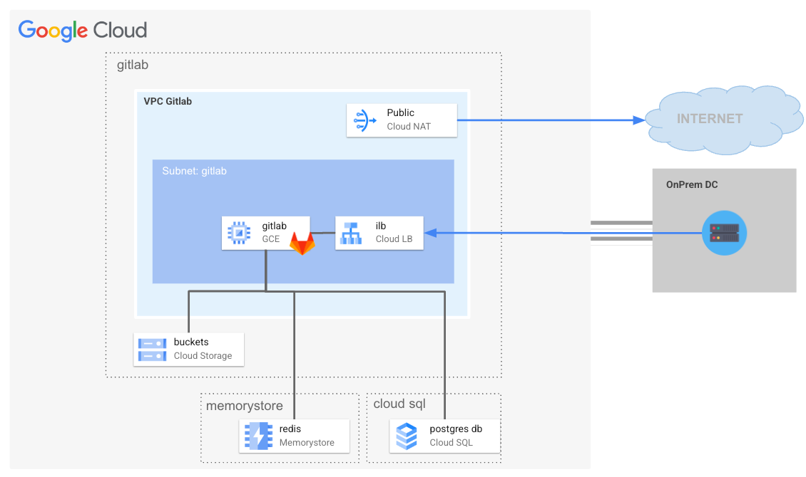

# Gitlab Blueprint

This blueprint is responsible for provisioning a production ready Gitlab instance on the landing zone infrastructure. The [reference architecture](https://docs.gitlab.com/ee/administration/reference_architectures/1k_users.html) of this deployment target 1K users, updates to the current code is required in of HA and/or higher capacity requirements.

The following diagram illustrates the high-level design of created resources, which can be adapted to specific requirements via variables:

<p align="center">
  
</p>

## Table of contents

<!-- TOC -->
* [Gitlab Blueprint](#gitlab-blueprint)
  * [Table of contents](#table-of-contents)
  * [Managed Services for Seamless Operations](#managed-services-for-seamless-operations)
    * [Object Storage <-> Google Cloud Storage](#object-storage-----google-cloud-storage)
  * [Identity](#identity)
    * [SAML Integration](#saml-integration)
      * [Google Workspace Setup](#google-workspace-setup)
    * [Others Identity Integration](#others-identity-integration)
  * [Email](#email)
    * [Sendgrid integration](#sendgrid-integration)
  * [SSL Certificate Configuration](#ssl-certificate-configuration)
  * [Networking and scalability](#networking-and-scalability)
  * [HA](#ha)
    * [Deployment](#deployment)
      * [Step 0: Cloning the repository](#step-0--cloning-the-repository)
      * [Step 2: Prepare the variables](#step-2--prepare-the-variables)
      * [Step 3: Deploy resources](#step-3--deploy-resources)
      * [Step 4: Use the created resources](#step-4--use-the-created-resources)
  * [Reference and useful links](#reference-and-useful-links)
  * [Files](#files)
  * [Variables](#variables)
  * [Outputs](#outputs)
<!-- TOC -->

## Managed Services for Seamless Operations

This Gitlab installation prioritizes the use of Google Cloud managed services to
streamline infrastructure management and optimization. Here's a breakdown of the
managed services incorporated:

1. [Google Cloud Storage](https://cloud.google.com/storage): is a highly
   scalable and secure object storage service for storing and accessing data in
   Google Cloud.<br/><br/>
2. [Cloud SQL PostgreSQL](https://cloud.google.com/sql/docs/postgres): Cloud SQL
   for Postgres is a fully managed database service on Google Cloud Platform. It
   eliminates database administration tasks, allowing you to focus on your
   application, while offering high performance, automatic scaling, and secure
   management of your PostgreSQL databases.<br/><br/>
3. [Memorystore](https://cloud.google.com/memorystore?hl=en): GCP Memorystore
   offers a fully managed Redis service for in-memory data caching and
   high-performance data access.

Benefits:

- Reduced Operational Overhead: Google handles infrastructure setup,
  maintenance, and updates, freeing up your time and resources.
- Enhanced Security: Managed services often benefit from Google's comprehensive
  security measures and expertise.
- Scalability: Easily adjust resource allocation to meet evolving demands.
- Cost Optimization: Pay for the resources you use, benefiting from Google's
  infrastructure optimization.
  Integration: Managed services seamlessly integrate with other GCP services,
  promoting a cohesive cloud environment.
  This module embraces managed services to deliver a resilient, scalable, and
  cost-effective application architecture on Google Cloud.

### Object Storage <-> Google Cloud Storage

GitLab supports using an object storage service for holding numerous types of
data. It’s recommended over NFS and in general it’s better in larger setups as
object storage is typically much more performant, reliable, and scalable.

A single storage connection to Cloud Storage is configured for all object types,
which leverages default Google Compute Engine credential (the so called "
consolidated form"). A Cloud Storage bucket is bootstrapped for each object
type, the table below summarized such a configuration:

| Object Type      | Description                            | Cloud Storage Bucket              |
|------------------|----------------------------------------|-----------------------------------|
| artifacts	       | CI artifacts                           | ${prefix}-gitlab-artifacts        |
| external_diffs   | Merge request diffs                    | ${prefix}-mr-diffs                |
| uploads	         | User uploads                           | ${prefix}-gitlab-uploads          |
| lfs	             | Git Large File Storage objects         | ${prefix}-gitlab-lfs              |
| packages	        | Project packages (e.g. PyPI, Maven ..) | ${prefix}-gitlab-packages         |
| dependency_proxy | Dependency Proxy                       | ${prefix}-gitlab-dependency-proxy |
| terraform_state  | Terraform state files                  | ${prefix}-gitlab-terraform-state  |
| pages	           | Pages                                  | ${prefix}-gitlab-pages            |

For more information on Gitlab object storage and Google Cloud Storage
integration please refer to the official Gitlab documentation available at the
following [link](https://docs.gitlab.com/ee/administration/object_storage.html).

- [PostgreSQL service](https://docs.gitlab.com/ee/administration/postgresql/external.html)

Updated postgres configuration to match documentation, created required database
in postgres instance.

- [Redis](https://docs.gitlab.com/ee/administration/redis/replication_and_failover_external.html)

## Identity

GitLab integrates with a number of OmniAuth providers as well as external
authentication and authorization providers such as Google Secure LDAP and many
other providers.
At this time this stage can deal with SAML integration for both user
authentication and provisioning, in order to setup SAML integration please
provide the saml block on gitlab_config variable.

### SAML Integration

This section details how configure GitLab to act as a SAML service provider (
SP). This allows GitLab to consume assertions from a SAML identity provider (
IdP), such as Cloud Identity, to authenticate users. Please find instructions
below for integration with:

- [Google Workspace](#google-workspace-setup)

#### Google Workspace Setup

Setup of Google Workspace is documented in the official Gitlab documentation
available at the
following [link](https://docs.gitlab.com/ee/integration/saml.html#set-up-google-workspace)
which are also reported below for simplicity.

Create a custom SAML webapp following instructions available at the
following [link](https://support.google.com/a/answer/6087519), providing these
information in the service provider configuration:

| Configuration     | Typical Value                                    | Cloud Storage Bucket                                                                        |
|-------------------|--------------------------------------------------|---------------------------------------------------------------------------------------------|
| Name of SAML App	 | Gitlab                                           | Name of the app                                                                             |
| ACS URL           | https://<GITLAB_DOMAIN>/users/auth/saml/callback | Assertion Consumer Service URL.                                                             |
| GITLAB_DOMAIN	    | gitlab.example.com                               | Your GitLab instance domain.                                                                |
| Entity ID	        | https://gitlab.example.com                       | A value unique to your SAML application. Set it to the issuer in your GitLab configuration. |
| Name ID	          | EMAIL                                            | Required value. Also known as name_identifier_format.                                       |

Then setup the following SAML attribute mappings:

| Google Directory attributes    | App attributes |
|--------------------------------|----------------|
| Basic information > Email      | email          |
| Basic Information > First name | first_name     |
| Basic Information > Last name  | last_name      |

After configuring the Google Workspace SAML application, record the following
information:

| Value                  | Description                                                                                                                                                    |
|------------------------|----------------------------------------------------------------------------------------------------------------------------------------------------------------|
| SSO URL                | Setup in gitlab_config.saml.sso_target_url variable                                                                                                            |
| Certificate (download) | Setup in gitlab_config.saml.idp_cert_fingerprint (obtain value with the following command `openssl x509 -in <your_certificate.crt> -noout -fingerprint -sha1`) |

### Others Identity Integration

- [OpenID Connect OmniAuth](https://docs.gitlab.com/ee/administration/auth/oidc.html#configure-google)
- [Google Secure LDAP](https://docs.gitlab.com/ee/administration/auth/ldap/google_secure_ldap.html)

## Email

### Gmail / Workspace

- [ ] [documentation](https://docs.gitlab.com/ee/administration/incoming_email.html#gmail)

### Sendgrid integration

Use
the [Google Cloud Marketplace](https://console.cloud.google.com/marketplace/details/sendgrid-app/sendgrid-email)
to sign up for the SendGrid email service. Make a note of your SendGrid SMTP
account credentials, which include username, password, and hostname. Your SMTP
username and password are the same as what you used to sign up for the service.
The SendGrid hostname is smtp.sendgrid.net.
Create an API key:
Sign in to SendGrid and go to Settings > API Keys.

1. Create an API key.
2. Select the permissions for the key. At a minimum, the key must have Mail send
   permissions to send email.
3. Click Save to create the key.
4. SendGrid generates a new key. This is the only copy of the key, so make sure
   that you copy the key and save it for later.

Configure the sendgrid API key in the gitlab_config variable, under mail,
sendgrid arguments as per the following example:

```terraform
gitlab_config = {
  hostname = "gitlab.example.com"
  mail     = {
    sendgrid = {
      api_key = "test"
    }
  }
}
```

## SSL Certificate Configuration

This module provides flexibility in configuring SSL certificates for the server.
You have two options:

1. **Provide Your Own Certificates**: If you have existing SSL certificates, you
   can place them in the certs folder within the module's directory. The module
   will automatically detect and use them.
   File Names: Ensure the files are named ${gitlab_hostname}.crt (for the
   certificate) and
   gitlab_hostname.key (for the private key). Although it is not required in
   this stage it is mandatory to also place inside the certs folder the server
   CA certificate which is later use to secure HTTPS access from the Gitlab
   runner. Name of the CA certificate should be: ${gitlab_hostname}.ca.crt
2. **Use Automatically Generated Self-Signed Certificates**: If you don't
   provide certificates, the module will generate a self-signed certificate for
   immediate use.
   Updating Later: You can replace the self-signed certificate with your own
   certificates at any time by placing them in the certs folder and re-running
   Terraform.

**Important Notes:**

Certificate Validation: Self-signed certificates are not validated by browsers
and will trigger warnings. Use them only for development or testing
environments.

For more information on how to configure HTTPS on Gitlab please refer to the
original Gitlab documentation available at the
following [link](https://docs.gitlab.com/omnibus/settings/ssl/#configure-https-manually).

## Networking and scalability

- [Load balancer](https://docs.gitlab.com/ee/administration/load_balancer.html)

## HA

- [High Availability](http://ubimol.it/12.0/ee/administration/high_availability/README.html)

### Deployment

#### Step 0: Cloning the repository

If you want to deploy from your Cloud Shell, click on the image below, sign in
if required and when the prompt appears, click on “confirm”.

[](https://shell.cloud.google.com/cloudshell/editor?cloudshell_git_repo=https%3A%2F%2Fgithub.com%2FGoogleCloudPlatform%2Fcloud-foundation-fabric&cloudshell_workspace=blueprints%2Fthird-party-solutions%2Fwordpress%2Fcloudrun)

Otherwise, in your console of choice:

```bash
git clone https://github.com/GoogleCloudPlatform/cloud-foundation-fabric
```

Before you deploy the architecture, you will need at least the following
information (for more precise configuration see the Variables section):

* The project ID

The VPC host project, VPC and subnets should already exist and the following networking requirements are satisfied:
- configured PSA for Cloud SQL on the VPC
- subnets configured with PGA and Cloud NAT for internet access
- Inbound firewall rule for IAP on port 22
- Inbound firewall rule for TCP ports 80, 443, 2222 from proxy subnet CIDR (gitlab)

#### Step 2: Prepare the variables

Once you have the required information, head back to your cloned repository.
Make sure you’re in the directory of this tutorial (where this README is in).

Configure the Terraform variables in your `terraform.tfvars` file.
See [terraform.tfvars.sample](terraform.tfvars.sample) as starting point - just
copy it to `terraform.tfvars` and edit the latter. See the variables
documentation below.

#### Step 3: Deploy resources

Initialize your Terraform environment and deploy the resources:

```shell
terraform init
terraform apply
```

#### Step 4: Use the created resources

Connect to squid-proxy for accessing gitlab instance using the gcloud command
available in the `ssh_to_bastion` terraform output.

```bash
terraform output ssh_to_bastion
```

A gcloud command like the following should be available

```bash 
gcloud compute ssh squid-vm --project ${project} --zone europe-west8-b -- -L 3128:127.0.0.1:3128 -N -q -f
```

Set as system proxy ip 127.0.0.1 and port 3128 and connect to Gitlab hostname https://gitlab.gcp.example.com.
Use default admin password available in /run/gitlab/config/initial_root_password or reset admin password via the following command on the Docker container:

```bash
gitlab-rake “gitlab:password:reset”
```

## Reference and useful links

- [Reference architecture up to 1k users](https://docs.gitlab.com/ee/administration/reference_architectures/1k_users.html)
- [`/etc/gitlab/gitlab.rb` template](https://gitlab.com/gitlab-org/omnibus-gitlab/blob/master/files/gitlab-config-template/gitlab.rb.template)
- [`/etc/gitlab/gitlab.rb` default options](https://docs.gitlab.com/ee/administration/package_information/defaults.html)

<!-- TFDOC OPTS files:1 show_extra:1 -->
<!-- BEGIN TFDOC -->
## Files

| name | description | modules | resources |
|---|---|---|---|
| [gitlab.tf](./gitlab.tf) | None | <code>compute-vm</code> · <code>iam-service-account</code> · <code>net-lb-int</code> |  |
| [main.tf](./main.tf) | Module-level locals and resources. | <code>project</code> |  |
| [outputs.tf](./outputs.tf) | Module outputs. |  |  |
| [services.tf](./services.tf) | None | <code>cloudsql-instance</code> · <code>gcs</code> | <code>google_redis_instance</code> |
| [ssl.tf](./ssl.tf) | None |  | <code>tls_cert_request</code> · <code>tls_locally_signed_cert</code> · <code>tls_private_key</code> · <code>tls_self_signed_cert</code> |
| [variables.tf](./variables.tf) | Module variables. |  |  |

## Variables

| name | description | type | required | default | producer |
|---|---|:---:|:---:|:---:|:---:|
| [gitlab_instance_config](variables.tf#L69) | Gitlab Compute Engine instance config. | <code title="object&#40;&#123;&#10;  instance_type &#61; optional&#40;string, &#34;n1-highcpu-8&#34;&#41;&#10;  name          &#61; optional&#40;string, &#34;gitlab-0&#34;&#41;&#10;  network_tags  &#61; optional&#40;list&#40;string&#41;, &#91;&#93;&#41;&#10;  replica_zone  &#61; optional&#40;string&#41;&#10;  zone          &#61; optional&#40;string&#41;&#10;  boot_disk &#61; optional&#40;object&#40;&#123;&#10;    size &#61; optional&#40;number, 20&#41;&#10;    type &#61; optional&#40;string, &#34;pd-standard&#34;&#41;&#10;  &#125;&#41;, &#123;&#125;&#41;&#10;  data_disk &#61; optional&#40;object&#40;&#123;&#10;    size         &#61; optional&#40;number, 100&#41;&#10;    type         &#61; optional&#40;string, &#34;pd-ssd&#34;&#41;&#10;    replica_zone &#61; optional&#40;string&#41;&#10;  &#125;&#41;, &#123;&#125;&#41;&#10;&#125;&#41;">object&#40;&#123;&#8230;&#125;&#41;</code> | ✓ |  |  |
| [network_config](variables.tf#L89) | Shared VPC network configurations to use for Gitlab Runner VM. | <code title="object&#40;&#123;&#10;  host_project      &#61; optional&#40;string&#41;&#10;  network_self_link &#61; string&#10;  subnet_self_link  &#61; string&#10;&#125;&#41;">object&#40;&#123;&#8230;&#125;&#41;</code> | ✓ |  |  |
| [prefix](variables.tf#L98) | Prefix used for resource names. | <code>string</code> | ✓ |  |  |
| [project_id](variables.tf#L117) | Project id, references existing project if `project_create` is null. | <code>string</code> | ✓ |  |  |
| [region](variables.tf#L136) | GCP Region. | <code>string</code> | ✓ |  |  |
| [admin_principals](variables.tf#L17) | Users, groups and/or service accounts that are assigned roles, in IAM format (`group:foo@example.com`). | <code>list&#40;string&#41;</code> |  | <code>&#91;&#93;</code> |  |
| [cloudsql_config](variables.tf#L23) | Cloud SQL Postgres config. | <code title="object&#40;&#123;&#10;  name             &#61; optional&#40;string, &#34;gitlab-0&#34;&#41;&#10;  database_version &#61; optional&#40;string, &#34;POSTGRES_13&#34;&#41;&#10;  tier             &#61; optional&#40;string, &#34;db-custom-2-8192&#34;&#41;&#10;&#125;&#41;">object&#40;&#123;&#8230;&#125;&#41;</code> |  | <code>&#123;&#125;</code> |  |
| [gcs_config](variables.tf#L34) | GCS for Object Storage config. | <code title="object&#40;&#123;&#10;  enable_versioning &#61; optional&#40;bool, false&#41;&#10;  location          &#61; optional&#40;string, &#34;EU&#34;&#41;&#10;  storage_class     &#61; optional&#40;string, &#34;STANDARD&#34;&#41;&#10;&#125;&#41;">object&#40;&#123;&#8230;&#125;&#41;</code> |  | <code>&#123;&#125;</code> |  |
| [gitlab_config](variables.tf#L45) | Gitlab configuration. | <code title="object&#40;&#123;&#10;  hostname &#61; optional&#40;string, &#34;gitlab.gcp.example.com&#34;&#41;&#10;  mail &#61; optional&#40;object&#40;&#123;&#10;    enabled &#61; optional&#40;bool, false&#41;&#10;    sendgrid &#61; optional&#40;object&#40;&#123;&#10;      api_key        &#61; optional&#40;string&#41;&#10;      email_from     &#61; optional&#40;string, null&#41;&#10;      email_reply_to &#61; optional&#40;string, null&#41;&#10;    &#125;&#41;, null&#41;&#10;  &#125;&#41;, &#123;&#125;&#41;&#10;  saml &#61; optional&#40;object&#40;&#123;&#10;    forced                 &#61; optional&#40;bool, false&#41;&#10;    idp_cert_fingerprint   &#61; string&#10;    sso_target_url         &#61; string&#10;    name_identifier_format &#61; optional&#40;string, &#34;urn:oasis:names:tc:SAML:1.1:nameid-format:emailAddress&#34;&#41;&#10;  &#125;&#41;, null&#41;&#10;  ha_required &#61; optional&#40;bool, false&#41;&#10;&#125;&#41;">object&#40;&#123;&#8230;&#125;&#41;</code> |  | <code>&#123;&#125;</code> |  |
| [project_create](variables.tf#L108) | Provide values if project creation is needed, uses existing project if null. Parent is in 'folders/nnn' or 'organizations/nnn' format. | <code title="object&#40;&#123;&#10;  billing_account_id &#61; string&#10;  parent             &#61; string&#10;&#125;&#41;">object&#40;&#123;&#8230;&#125;&#41;</code> |  | <code>null</code> |  |
| [redis_config](variables.tf#L122) | Redis Config. | <code title="object&#40;&#123;&#10;  memory_size_gb      &#61; optional&#40;number, 1&#41;&#10;  name                &#61; optional&#40;string, &#34;gitlab-0&#34;&#41;&#10;  persistence_mode    &#61; optional&#40;string, &#34;RDB&#34;&#41;&#10;  rdb_snapshot_period &#61; optional&#40;string, &#34;TWELVE_HOURS&#34;&#41;&#10;  tier                &#61; optional&#40;string, &#34;BASIC&#34;&#41;&#10;  version             &#61; optional&#40;string, &#34;REDIS_6_X&#34;&#41;&#10;&#125;&#41;">object&#40;&#123;&#8230;&#125;&#41;</code> |  | <code>&#123;&#125;</code> |  |

## Outputs

| name | description | sensitive | consumers |
|---|---|:---:|---|
| [gitlab_ilb_ip](outputs.tf#L26) | Gitlab Internal Load Balancer IP Address. |  |  |
| [instance](outputs.tf#L31) | Gitlab compute engine instance. |  |  |
| [postgresql_users](outputs.tf#L36) | Gitlab postgres user password. | ✓ |  |
| [project](outputs.tf#L42) | GCP project. |  |  |
| [ssh_to_gitlab](outputs.tf#L47) | gcloud command to ssh gitlab instance. |  |  |
| [ssl_certs](outputs.tf#L52) | Gitlab SSL Certificates. | ✓ |  |
<!-- END TFDOC -->
## Test

```hcl
module "test" {
  source = "./fabric/blueprints/third-party-solutions/gitlab"
  gitlab_config = {
    hostname = "gitlab.gcp.example.com"
    mail = {
      sendgrid = {
        api_key = "sample_api_key"
      }
    }
    saml = {
      idp_cert_fingerprint = "67:90:96.....REPLACE_ME"
      sso_target_url       = "https://accounts.google.com/o/saml2/idp?idpid=REPLACE_ME"
    }
  }
  gitlab_instance_config = {
    replica_zone = "europe-west8-c"
    zone         = "europe-west8-b"
    data_disk = {
      replica_zone = "europe-west8-c"
    }
  }
  network_config = {
    host_project      = "host-project"
    network_self_link = "https://www.googleapis.com/compute/v1/projects/prod-net-landing-0/global/networks/prod-landing-0"
    subnet_self_link  = "https://www.googleapis.com/compute/v1/projects/prod-net-landing-0/regions/europe-west1/subnetworks/landing-default-ew1"
  }
  prefix = "prefix"
  project_create = {
    billing_account_id = "1234-ABCD-1234"
    parent             = "folders/1234563"
  }
  project_id = "my-project"
  region     = "europe-west8"
}
# tftest modules=14 resources=58
```
