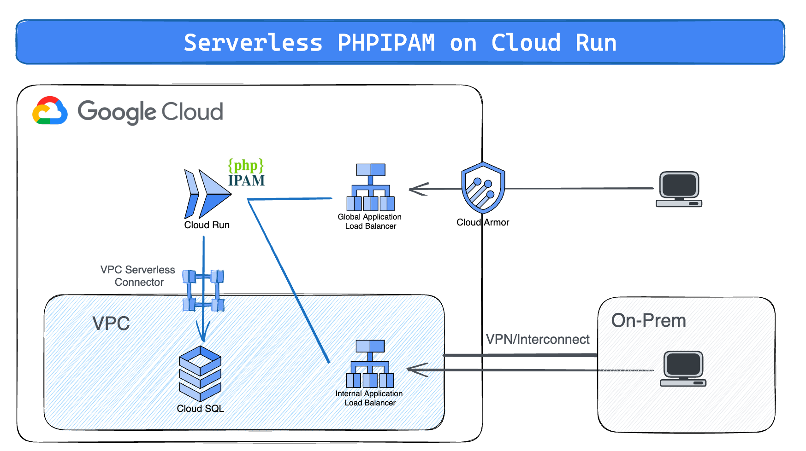
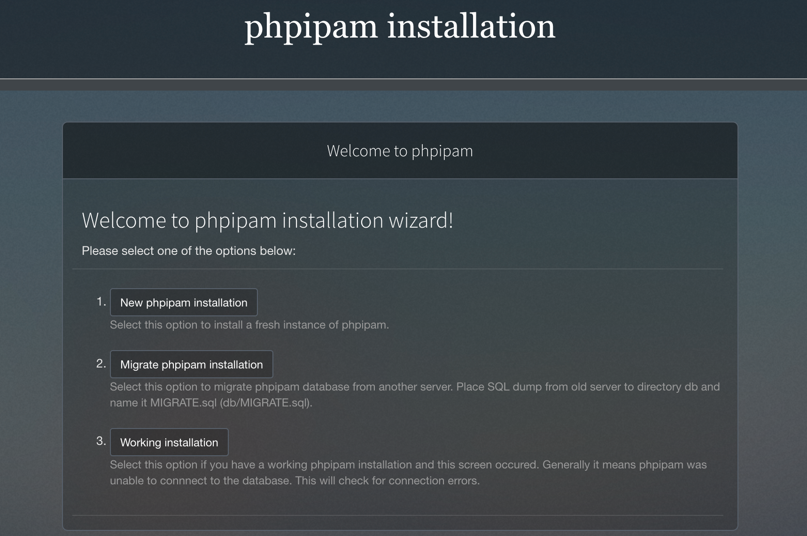
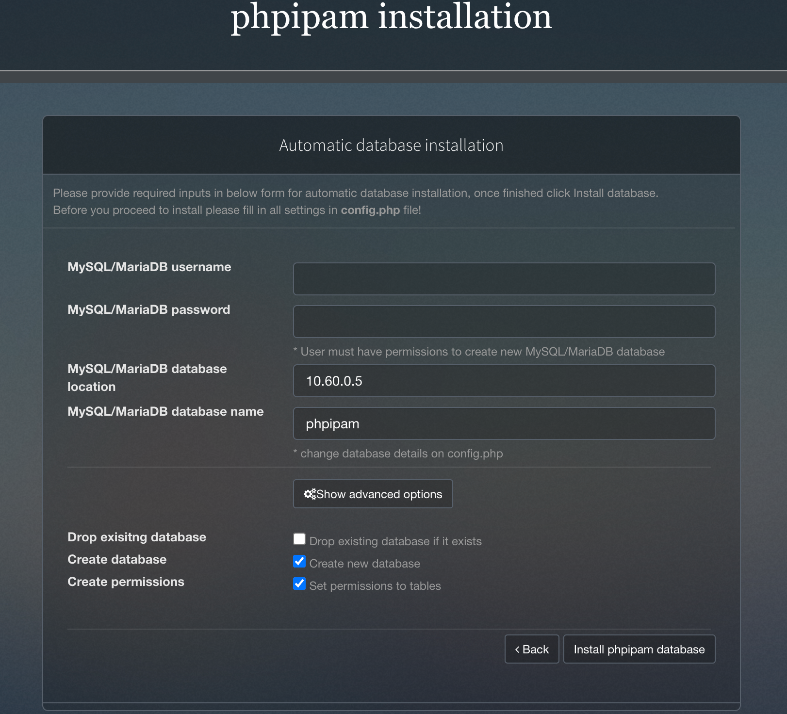
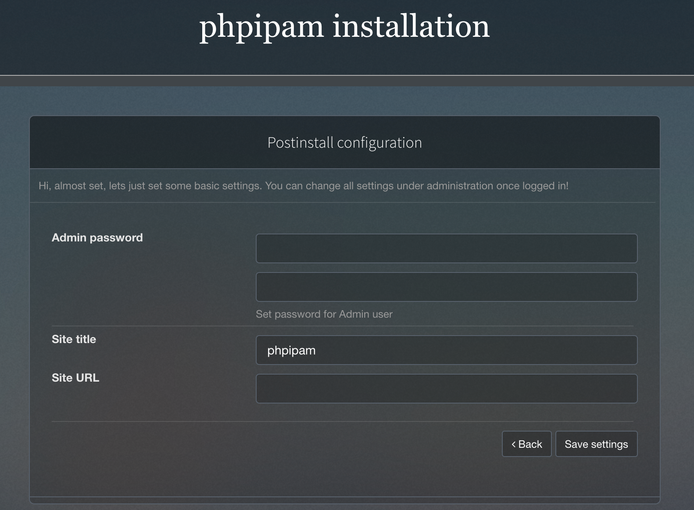
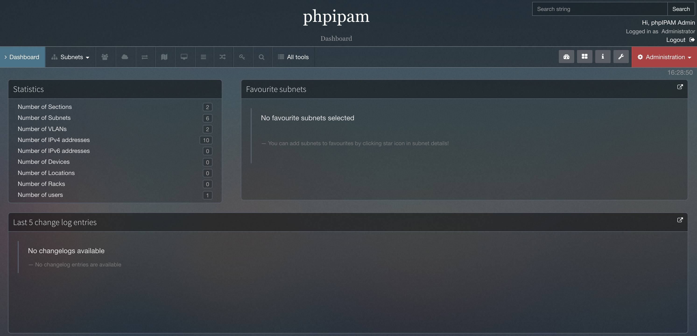

# Serverless phpIPAM on Cloud Run

[phpIPAM](https://phpipam.net/) is an open-source IP address management (IPAM)
system that can be used to manage IP addresses in both on-premises and cloud
environments. It is a powerful tool that can help businesses to automate IP
address management, proactively identify and resolve IP address conflicts, and
plan for future IP address needs.

This repository aims to speed up deployment of phpIPAM software on Google Cloud
Platform Cloud Run serverless product. The web application can be exposed either
publicly via Global Application Load Balancer or internally via Internal
Application Load Balancer. More information on the architecture section.

## Architecture



The main components that are deployed in this architecture are the following (
you can learn about them by following the hyperlinks):

- [Cloud Run](https://cloud.google.com/run): serverless PaaS offering to host
  containers for web-oriented applications, while offering security, scalability
  and easy versioning
- [Cloud SQL](https://cloud.google.com/sql): Managed solution for SQL databases
- [VPC Serverless Connector](https://cloud.google.com/vpc/docs/serverless-vpc-access):
  Solution to access the CloudSQL VPC from Cloud Run, using only internal IP
  addresses
- [Global Application Load Balancer](https://cloud.google.com/load-balancing/docs/https) (\*):
  An external Application Load Balancer is a proxy-based Layer 7 load balancer
  that enables you to run and scale your services behind a single external IP
  address.
- [Cloud Armor](https://cloud.google.com/armor/docs/cloud-armor-overview) (\*):
  Help protect your applications and websites against denial of service and web
  attacks.
- [Identity Aware Proxy](https://cloud.google.com/iap/docs/concepts-overview) (\*):
  IAP lets you establish a central authorization layer for applications accessed
  by HTTPS, so you can use an application-level access control model instead of
  relying on network-level firewalls.
- [Regional Internal Application Load Balancer](https://cloud.google.com/load-balancing/docs/l7-internal) (\*):
  A Google Cloud internal Application Load Balancer is a regional proxy-based
  layer 7 load balancer that enables you expose your services behind a single
  internal IP address.

> (\*) Product deployment depends on input variables

## Setup

### Prerequisites

#### Setting up the project for the deployment

This example will deploy all its resources into the project defined by
the `project_id` variable. Please note that we assume this project already
exists. However, if you provide the appropriate values to the `project_create`
variable, the project will be created as part of the deployment.

If `project_create` is left to null, the identity performing the deployment
needs the `owner` role on the project defined by the `project_id` variable.
Otherwise, the identity performing the deployment
needs `resourcemanager.projectCreator` on the resource hierarchy node specified
by `project_create.parent` and `billing.user` on the billing account specified
by `project_create.billing_account_id`.

### Deployment

#### Step 0: Cloning the repository

If you want to deploy from your Cloud Shell, click on the image below, sign in
if required and when the prompt appears, click on “confirm”.

[](https://shell.cloud.google.com/cloudshell/editor?cloudshell_git_repo=https%3A%2F%2Fgithub.com%2FGoogleCloudPlatform%2Fcloud-foundation-fabric&cloudshell_workspace=blueprints%2Fthird-party-solutions%2Fwordpress%2Fcloudrun)

Otherwise, in your console of choice:

```bash
git clone https://github.com/GoogleCloudPlatform/cloud-foundation-fabric
```

Before you deploy the architecture, you will need at least the following
information (for more precise configuration see the Variables section):

* The project ID.

#### Step 2: Prepare the variables

Once you have the required information, head back to your cloned repository.
Make sure you’re in the directory of this tutorial (where this README is in).

Configure the Terraform variables in your `terraform.tfvars` file.
See [terraform.tfvars.sample](terraform.tfvars.sample) as starting point - just
copy it to `terraform.tfvars` and edit the latter. See the variables
documentation below.

**Notes**:

1. If you have
   the [domain restriction org. policy](https://cloud.google.com/resource-manager/docs/organization-policy/restricting-domains)
   on your organization, you have to edit the `cloud_run_invoker` variable and
   give it a value that will be accepted in accordance to your policy.
2. By default, the application will be exposed externally through Global
   Application Load Balancer, for restricting access to specific identities
   please check IAP configuration or deploy the application internally via the
   ILB
3. Setting the `phpipam_exposure` variable to "INTERNAL" will deploy an Internal
   Application Load Balancer on the same VPC. This might be the preferred option
   for enterprises since it prevents exposing the application publicly still
   allowing internal access through private network (via either VPN and/or
   Interconnect)

#### Step 3: Deploy resources

Initialize your Terraform environment and deploy the resources:

```shell
terraform init
terraform apply
```

#### Step 4: Use the created resources

Upon completion, you will see the output with the values for the Cloud Run
service and the user and password to access the application.
You can also view it later with:

```shell
terraform output
# or for the concrete variable:
terraform output cloud_run_service
```

Please be aware that the password created in the script is not yet configured in the
application, you will be prompted to insert that during phpIPAM installation
process at first login.
To access the newly deployed application follow these instructions:

1. Get the default phpIPAM url from the terraform output in the form
   {IP_ADDRESS}.nip.io
2. Open your browser at that URL and you will see your phpIPAM installation page
   like the following one:



3. Click on "New phpipam installation". On the next page click "Automatic
   database installation", you will be prompted to the following form:



4. Insert "admin" as the MySQL username and the password available on the
   terraform output of this command below (without quotes).
   Untick the "Create new database" otherwise you'll get an error during
   installation, leave all the other values as default and then click on "
   Install phpipam database"

```
terraform output cloudsql_password
```

5. After some time a "Database installed successfully!" message should pop up.
   Then click "continue" and you'll be prompted to the last form for configuring
   admin credentials:



6. Insert the phpipam password available in the output of the following command
   and choose a site title. Then insert the site url and click "Save
   settings". "A Settings updated, installation complete!" message should pop up
   and clicking "Proceed to login." will redirect you to the login page.
   Be aware this is just a convenient way to have a backup admin password in
   terraform, you could use whatever password you prefer.

```
terraform output phpipam_password
```

7. Insert "admin" as username and the password configured on the previous step
   and after login you'll finally get to the phpIPAM homepage.



### Cleaning up your environment

The easiest way to remove all the deployed resources is to run the following
command in Cloud Shell:

``` {shell}
terraform destroy
```

The above command will delete the associated resources so there will be no
billable charges made afterwards.
<!-- BEGIN TFDOC -->
## Variables

| name | description | type | required | default |
|---|---|:---:|:---:|:---:|
| [prefix](variables.tf#L118) | Prefix used for resource names. | <code>string</code> | ✓ |  |
| [project_id](variables.tf#L137) | Project id, references existing project if `project_create` is null. | <code>string</code> | ✓ |  |
| [admin_principals](variables.tf#L19) | Users, groups and/or service accounts that are assigned roles, in IAM format (`group:foo@example.com`). | <code>list&#40;string&#41;</code> |  | <code>&#91;&#93;</code> |
| [cloud_run_invoker](variables.tf#L25) | IAM member authorized to access the end-point (for example, 'user:YOUR_IAM_USER' for only you or 'allUsers' for everyone). | <code>string</code> |  | <code>&#34;allUsers&#34;</code> |
| [cloudsql_password](variables.tf#L31) | CloudSQL password (will be randomly generated by default). | <code>string</code> |  | <code>null</code> |
| [connector](variables.tf#L37) | Existing VPC serverless connector to use if not creating a new one. | <code>string</code> |  | <code>null</code> |
| [create_connector](variables.tf#L43) | Should a VPC serverless connector be created or not. | <code>bool</code> |  | <code>true</code> |
| [custom_domain](variables.tf#L49) | Cloud Run service custom domain for GLB. | <code>string</code> |  | <code>null</code> |
| [deletion_protection](variables.tf#L55) | Prevent Terraform from destroying data storage resources (storage buckets, GKE clusters, CloudSQL instances) in this blueprint. When this field is set in Terraform state, a terraform destroy or terraform apply that would delete data storage resources will fail. | <code>bool</code> |  | <code>false</code> |
| [iap](variables.tf#L62) | Identity-Aware Proxy for Cloud Run in the LB. | <code title="object&#40;&#123;&#10;  enabled            &#61; optional&#40;bool, false&#41;&#10;  app_title          &#61; optional&#40;string, &#34;Cloud Run Explore Application&#34;&#41;&#10;  oauth2_client_name &#61; optional&#40;string, &#34;Test Client&#34;&#41;&#10;  email              &#61; optional&#40;string&#41;&#10;&#125;&#41;">object&#40;&#123;&#8230;&#125;&#41;</code> |  | <code>&#123;&#125;</code> |
| [ip_ranges](variables.tf#L74) | CIDR blocks: VPC serverless connector, Private Service Access(PSA) for CloudSQL, CloudSQL VPC. | <code title="object&#40;&#123;&#10;  connector &#61; string&#10;  proxy     &#61; string&#10;  psa       &#61; string&#10;  ilb       &#61; string&#10;&#125;&#41;">object&#40;&#123;&#8230;&#125;&#41;</code> |  | <code title="&#123;&#10;  connector &#61; &#34;10.8.0.0&#47;28&#34;&#10;  proxy     &#61; &#34;10.10.0.0&#47;26&#34;&#10;  psa       &#61; &#34;10.60.0.0&#47;24&#34;&#10;  ilb       &#61; &#34;10.128.0.0&#47;28&#34;&#10;&#125;">&#123;&#8230;&#125;</code> |
| [phpipam_config](variables.tf#L90) | PHPIpam configuration. | <code title="object&#40;&#123;&#10;  image &#61; optional&#40;string, &#34;phpipam&#47;phpipam-www:latest&#34;&#41;&#10;  port  &#61; optional&#40;number, 80&#41;&#10;&#125;&#41;">object&#40;&#123;&#8230;&#125;&#41;</code> |  | <code title="&#123;&#10;  image &#61; &#34;phpipam&#47;phpipam-www:latest&#34;&#10;  port  &#61; 80&#10;&#125;">&#123;&#8230;&#125;</code> |
| [phpipam_exposure](variables.tf#L102) | Whether to expose the application publicly via GLB or internally via ILB, default GLB. | <code>string</code> |  | <code>&#34;EXTERNAL&#34;</code> |
| [phpipam_password](variables.tf#L112) | Password for the phpipam user (will be randomly generated by default). | <code>string</code> |  | <code>null</code> |
| [project_create](variables.tf#L128) | Provide values if project creation is needed, uses existing project if null. Parent is in 'folders/nnn' or 'organizations/nnn' format. | <code title="object&#40;&#123;&#10;  billing_account_id &#61; string&#10;  parent             &#61; string&#10;&#125;&#41;">object&#40;&#123;&#8230;&#125;&#41;</code> |  | <code>null</code> |
| [region](variables.tf#L142) | Region for the created resources. | <code>string</code> |  | <code>&#34;europe-west4&#34;</code> |
| [security_policy](variables.tf#L148) | Security policy (Cloud Armor) to enforce in the LB. | <code title="object&#40;&#123;&#10;  enabled      &#61; optional&#40;bool, false&#41;&#10;  ip_blacklist &#61; optional&#40;list&#40;string&#41;, &#91;&#34;&#42;&#34;&#93;&#41;&#10;  path_blocked &#61; optional&#40;string, &#34;&#47;login.html&#34;&#41;&#10;&#125;&#41;">object&#40;&#123;&#8230;&#125;&#41;</code> |  | <code>&#123;&#125;</code> |
| [vpc_config](variables.tf#L158) | VPC Network and subnetwork self links for internal LB setup. | <code title="object&#40;&#123;&#10;  network    &#61; string&#10;  subnetwork &#61; string&#10;&#125;&#41;">object&#40;&#123;&#8230;&#125;&#41;</code> |  | <code>null</code> |

## Outputs

| name | description | sensitive |
|---|---|:---:|
| [cloud_run_service](outputs.tf#L17) | CloudRun service URL. | ✓ |
| [cloudsql_password](outputs.tf#L23) | CloudSQL password. | ✓ |
| [phpipam_ip_address](outputs.tf#L29) | PHPIPAM IP Address either external or internal according to app exposure. |  |
| [phpipam_password](outputs.tf#L34) | PHPIPAM user password. | ✓ |
| [phpipam_url](outputs.tf#L40) | PHPIPAM website url. |  |
| [phpipam_user](outputs.tf#L45) | PHPIPAM username. |  |
<!-- END TFDOC -->
## Test

```hcl
module "test" {
  source           = "./fabric/blueprints/third-party-solutions/phpipam"
  admin_principals = ["group:foo@example.com"]
  prefix           = "test"
  project_create = {
    billing_account_id = "1234-ABCD-1234"
    parent             = "folders/1234563"
  }
  project_id = "test-prj"
}
# tftest modules=8 resources=47
```
