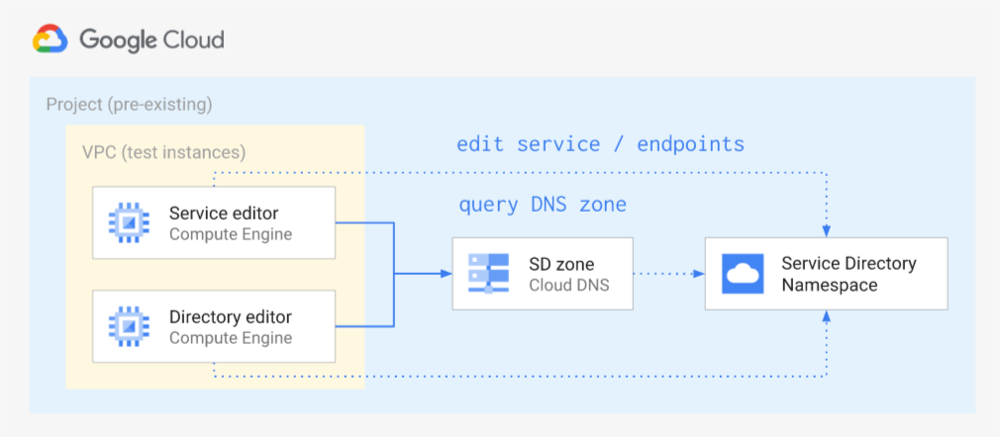

# Operations examples

The examples in this folder show how to wire together different Google Cloud services to simplify operations, and are meant for testing, or as minimal but sufficiently complete starting points for actual use.

## Resource tracking and remediation via Cloud Asset feeds

 This [example](./asset-inventory-feed-remediation) shows how to leverage [Cloud Asset Inventory feeds](https://cloud.google.com/asset-inventory/docs/monitoring-asset-changes) to stream resource changes in real time, and how to programmatically use the feed change notifications for alerting or remediation, via a Cloud Function wired to the feed PubSub queue.

The example's feed tracks changes to Google Compute instances, and the Cloud Function enforces policy compliance on each change so that tags match a set of simple rules. The obious use case is when instance tags are used to scope firewall rules, but the example can easily be adapted to suit different use cases.

 

## Scheduled Cloud Asset Inventory Export to Bigquery

 This [example](./scheduled-asset-inventory-export-bq) shows how to leverage the [Cloud Asset Inventory Exporting to Bigquery](https://cloud.google.com/asset-inventory/docs/exporting-to-bigquery) feature, to keep track of your organization's assets over time storing information in Bigquery. Data stored in Bigquery can then be used for different purposes like dashboarding or analysis.

 

## Granular Cloud DNS IAM via Service Directory

 This [example](./dns-fine-grained-iam) shows how to leverage [Service Directory](https://cloud.google.com/blog/products/networking/introducing-service-directory) and Cloud DNS Service Directory private zones, to implement fine-grained IAM controls on DNS. The example creates a Service Directory namespace, a Cloud DNS private zone that uses it as its authoritative source, service accounts with different levels of permissions, and VMs to test them.

 

## Granular Cloud DNS IAM for Shared VPC

 This [example](./dns-shared-vpc) shows how to create reusable and modular Cloud DNS architectures, by provisioning dedicated Cloud DNS instances for application teams that want to manage their own DNS records, and configuring DNS peering to ensure name resolution works in a common Shared VPC.

 

## Compute Engine quota monitoring

 This [example](./quota-monitoring) shows a practical way of collecting and monitoring [Compute Engine resource quotas](https://cloud.google.com/compute/quotas) via Cloud Monitoring metrics as an alternative to the recently released [built-in quota metrics](https://cloud.google.com/monitoring/alerts/using-quota-metrics). A simple alert on quota thresholds is also part of the example.

 

## Delegated Role Grants

 This [example](./iam-delegated-role-grants) shows how to use delegated role grants to restrict service usage.

 
