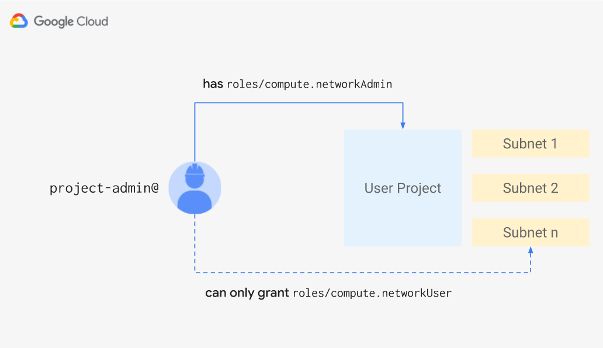

# Delegated Role Grants

This example shows two applications of [delegated role grants](https://cloud.google.com/iam/docs/setting-limits-on-granting-roles):

- how to use them to restrict service usage in a GCP project
- how to use them to allow administrative access to a service via a predefined role, while restricting administrators from minting other admins.

## Restricting service usage

In its default configuration, the example provisions two sets of permissions:

- the roles listed in `direct_role_grants` will be granted unconditionally to the users listed in `project_administrators`.
- additionally, `project_administrators` will be granted the role `roles/resourcemanager.projectIamAdmin` in a restricted fashion, allowing them to only grant the roles listed in `delegated_role_grants` to other users.

By carefully choosing `direct_role_grants` and `delegated_role_grants`, you can restrict which services can be used within the project while still giving enough freedom to project administrators to still grant permissions to other principals within their projects.

This diagram shows the resources and expected behaviour:


A [Medium article](https://medium.com/@jccb/managing-gcp-service-usage-through-delegated-role-grants-a843610f2226) has been published for this example, refer to it for more details on the context and the specifics of running the example.

## Restricting a predefined role

By changing the `restricted_role_grant`, the example can be used to grant administrators a predefined role like `roles/compute.networkAdmin`, which allows setting IAM policies on service resources like subnetworks, but restrict the roles that those administrators are able to confer to other users.

You can easily configure the example for this use case:

```hcl
# terraform.tfvars

delegated_role_grants = ["roles/compute.networkUser"]
direct_role_grants = []
restricted_role_grant = "roles/compute.networkAdmin"
```

This diagram shows the resources and expected behaviour:



## Running the example

Clone this repository or [open it in cloud shell](https://ssh.cloud.google.com/cloudshell/editor?cloudshell_git_repo=https%3A%2F%2Fgithub.com%2Fterraform-google-modules%2Fcloud-foundation-fabric&cloudshell_print=cloud-shell-readme.txt&cloudshell_working_dir=cloud-operations%2Fiam-delegated-role-grants), then go through the following steps to create resources:

- `terraform init`
- `terraform apply -var project_id=my-project-id 'project_administrators=["user:project-admin@example.com"]'`

Once done testing, you can clean up resources by running `terraform destroy`.

## Auditing Roles

This example includes a python script that audits a list of roles to ensure you're not granting the `setIamPolicy` permission at the project, folder or organization level. To audit all the predefined compute roles, run it like this:

```bash
pip3 install -r requirements.txt
gcloud iam roles list --filter="name:roles/compute. stage=GA" --format="get(name)" > roles.txt
python3 audit.py roles.txt
```

If you get any warnings, check the roles and remove any of them granting any of the following permissions:
- `resourcemanager.projects.setIamPolicy`
- `resourcemanager.folders.setIamPolicy`
- `resourcemanager.organizations.setIamPolicy`


<!-- BEGIN TFDOC -->
## Variables

| name | description | type | required | default |
|---|---|:---: |:---:|:---:|
| project_administrators | List identities granted administrator permissions. | <code title="list&#40;string&#41;">list(string)</code> | ✓ |  |
| project_id | GCP project id where to grant direct and delegated roles to the users listed in project_administrators. | <code title="">string</code> | ✓ |  |
| *delegated_role_grants* | List of roles that project administrators will be allowed to grant/revoke. | <code title="list&#40;string&#41;">list(string)</code> |  | <code title="&#91;&#10;&#34;roles&#47;storage.admin&#34;,&#10;&#34;roles&#47;storage.hmacKeyAdmin&#34;,&#10;&#34;roles&#47;storage.legacyBucketOwner&#34;,&#10;&#34;roles&#47;storage.objectAdmin&#34;,&#10;&#34;roles&#47;storage.objectCreator&#34;,&#10;&#34;roles&#47;storage.objectViewer&#34;,&#10;&#34;roles&#47;compute.admin&#34;,&#10;&#34;roles&#47;compute.imageUser&#34;,&#10;&#34;roles&#47;compute.instanceAdmin&#34;,&#10;&#34;roles&#47;compute.instanceAdmin.v1&#34;,&#10;&#34;roles&#47;compute.networkAdmin&#34;,&#10;&#34;roles&#47;compute.networkUser&#34;,&#10;&#34;roles&#47;compute.networkViewer&#34;,&#10;&#34;roles&#47;compute.orgFirewallPolicyAdmin&#34;,&#10;&#34;roles&#47;compute.orgFirewallPolicyUser&#34;,&#10;&#34;roles&#47;compute.orgSecurityPolicyAdmin&#34;,&#10;&#34;roles&#47;compute.orgSecurityPolicyUser&#34;,&#10;&#34;roles&#47;compute.orgSecurityResourceAdmin&#34;,&#10;&#34;roles&#47;compute.osAdminLogin&#34;,&#10;&#34;roles&#47;compute.osLogin&#34;,&#10;&#34;roles&#47;compute.osLoginExternalUser&#34;,&#10;&#34;roles&#47;compute.packetMirroringAdmin&#34;,&#10;&#34;roles&#47;compute.packetMirroringUser&#34;,&#10;&#34;roles&#47;compute.publicIpAdmin&#34;,&#10;&#34;roles&#47;compute.securityAdmin&#34;,&#10;&#34;roles&#47;compute.serviceAgent&#34;,&#10;&#34;roles&#47;compute.storageAdmin&#34;,&#10;&#34;roles&#47;compute.viewer&#34;,&#10;&#34;roles&#47;viewer&#34;&#10;&#93;">...</code> |
| *direct_role_grants* | List of roles granted directly to project administrators. | <code title="list&#40;string&#41;">list(string)</code> |  | <code title="&#91;&#10;&#34;roles&#47;compute.admin&#34;,&#10;&#34;roles&#47;storage.admin&#34;,&#10;&#93;">...</code> |
| *project_create* | Create project instead of using an existing one. | <code title="">bool</code> |  | <code title="">false</code> |
| *restricted_role_grant* | Role grant to which the restrictions will apply. | <code title="">string</code> |  | <code title="">roles/resourcemanager.projectIamAdmin</code> |

## Outputs

<!-- END TFDOC -->
