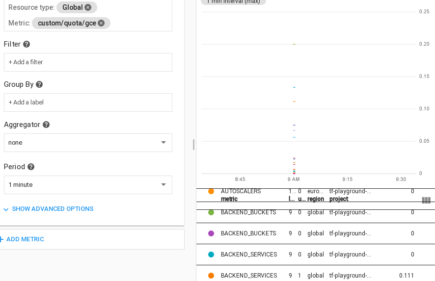

# Compute Quota synchronization

This example improves on the [GCE quota exporter tool](https://github.com/GoogleCloudPlatform/professional-services/tree/master/tools/gce-quota-sync) (by the same author of this example), and shows a practical way of collecting and monitoring [Compute Engine resource quotas](https://cloud.google.com/compute/quotas) via Cloud Monitoring metrics as an alternative to the recently released [built-in quota metrics](https://cloud.google.com/monitoring/alerts/using-quota-metrics).

Compared to the built-in metrics, it offers a simpler representation of quotas and quota ratios which is especially useful in charts, it allows filtering or combining quotas between different projects regardless of their monitoring workspace, and it creates a default alerting policy without the need to interact directly with the monitoring API.

Regardless of its specific purpose, this example is also useful in showing how to manipulate and write time series to cloud monitoring. The resources it creates are shown in the high level diagram below:

The solution is designed so that the Cloud Function arguments that control function execution (eg to set which project quotas to monitor) are defined in the Cloud Scheduler payload set in the PubSub message, so that a single function can be used for different configurations by creating more schedules.

Quota time series are stored using a [custom metric](https://cloud.google.com/monitoring/custom-metrics) with the `custom.googleapis.com/quota/gce` type and [gauge kind](https://cloud.google.com/monitoring/api/v3/kinds-and-types#metric-kinds), tracking the ratio between quota and limit as double to aid in visualization and alerting. Labels are set with the quota name, project id (which may differ from the monitoring workspace projects), value, and limit. This is how they look like in the metrics explorer.

The solution also creates a basic monitoring alert policy, to demonstrate how to raise alerts when any of the tracked quota ratios go over a predefined threshold.

## Running the example

Clone this repository or [open it in cloud shell](https://ssh.cloud.google.com/cloudshell/editor?cloudshell_git_repo=https%3A%2F%2Fgithub.com%2Fterraform-google-modules%2Fcloud-foundation-fabric&cloudshell_print=cloud-shell-readme.txt&cloudshell_working_dir=cloud-operations%2Fquota-monitoring), then go through the following steps to create resources:

- `terraform init`
- `terraform apply -var project_id=my-project-id`

<!-- BEGIN TFDOC -->
## Variables

| name | description | type | required | default |
|---|---|:---: |:---:|:---:|
| project_id | Project id that references existing project. | <code title="">string</code> | ✓ |  |
| *bundle_path* | Path used to write the intermediate Cloud Function code bundle. | <code title="">string</code> |  | <code title="">./bundle.zip</code> |
| *name* | Arbitrary string used to name created resources. | <code title="">string</code> |  | <code title="">asset-feed</code> |
| *region* | Compute region used in the example. | <code title="">string</code> |  | <code title="">europe-west1</code> |

## Outputs

| name | description | sensitive |
|---|---|:---:|
| cf_logs | Cloud Function logs read command. |  |
| feed_create | Feed gcloud command. |  |
| subscription_pull | Subscription pull command. |  |
| tag_add | Instance add tag command. |  |
| tag_show | Instance add tag command. |  |
<!-- END TFDOC -->

