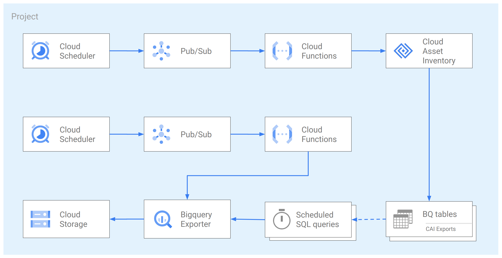

# Scheduled Cloud Asset Inventory Export to Bigquery

This example shows how to leverage [Cloud Asset Inventory Exporting to Bigquery](https://cloud.google.com/asset-inventory/docs/exporting-to-bigquery) feature to keep track of your project wide assets over time storing information in Bigquery.

The data stored in Bigquery can then be used for different purposes:

- dashboarding
- analysis

The example uses export resources at the project level for ease of testing, in actual use a few changes are needed to operate at the resource hierarchy level:

- the export should be set at the folder or organization level
- the `roles/cloudasset.viewer` on the service account should be set at the folder or organization level

The resources created in this example are shown in the high level diagram below:

## Prerequisites

Ensure that you grant your account one of the following roles on your project, folder, or organization:

- Cloud Asset Viewer role (`roles/cloudasset.viewer`)
- Owner primitive role (`roles/owner`)

## Running the example

Clone this repository, specify your variables in a `terraform.tvars` and then go through the following steps to create resources:

- `terraform init`
- `terraform apply`

Once done testing, you can clean up resources by running `terraform destroy`. To persist state, check out the `backend.tf.sample` file.

## Testing the example

Once resources are created, you can run queries on the data you exported on Bigquery. [Here](https://cloud.google.com/asset-inventory/docs/exporting-to-bigquery#querying_an_asset_snapshot) you can find some example of queries you can run.

You can also create a dashboard connecting [Datalab](https://datastudio.google.com/) or any other BI tools of your choice to your Bigquery dataset.

## File exporter for JSON, CSV (optional). 

This is an optional part.

Regular file-based exports of data from Cloud Asset Inventory may be useful for e.g. scale-out network dependencies discovery tools like [Planet Exporter](https://github.com/williamchanrico/planet-exporter), or to update legacy workloads tracking or configuration management systems. Bigquery supports multiple [export formats](https://cloud.google.com/bigquery/docs/exporting-data#export_formats_and_compression_types) and one may upload objects to Storage Bucket using provided Cloud Function. Specify `job.DestinationFormat` as defined in [documentation](https://googleapis.dev/python/bigquery/latest/generated/google.cloud.bigquery.job.DestinationFormat.html), e.g. `NEWLINE_DELIMITED_JSON`.

It helps to create custom [scheduled query](https://cloud.google.com/bigquery/docs/scheduling-queries#console) from CAI export tables, and to write out results in to dedicated table (with overwrites). Define such query's output columns to comply with downstream systems' fields requirements, and time query execution after CAI export into BQ for freshness. See [sample queries](https://cloud.google.com/asset-inventory/docs/exporting-to-bigquery-sample-queries).

This is an optional part, created if `cai_gcs_export` is set to `true`. The high level diagram extends to the following:

<!-- BEGIN TFDOC -->

## Variables

| name | description | type | required | default |
|---|---|:---:|:---:|:---:|
| cai_config | Cloud Asset Inventory export config. | <code title="object&#40;&#123;&#10;  bq_dataset         &#61; string&#10;  bq_table           &#61; string&#10;  bq_table_overwrite &#61; bool&#10;  target_node        &#61; string&#10;&#125;&#41;">object&#40;&#123;&#8230;&#125;&#41;</code> | ✓ |  |
| project_id | Project id that references existing project. | <code>string</code> | ✓ |  |
| billing_account | Billing account id used as default for new projects. | <code>string</code> |  | <code>null</code> |
| bundle_path | Path used to write the intermediate Cloud Function code bundle. | <code>string</code> |  | <code>&#34;.&#47;bundle.zip&#34;</code> |
| bundle_path_cffile | Path used to write the intermediate Cloud Function code bundle. | <code>string</code> |  | <code>&#34;.&#47;bundle_cffile.zip&#34;</code> |
| cai_gcs_export | Enable optional part to export tables to GCS | <code>bool</code> |  | <code>false</code> |
| file_config | Optional BQ table as a file export function config. | <code title="object&#40;&#123;&#10;  bucket     &#61; string&#10;  filename   &#61; string&#10;  format     &#61; string&#10;  bq_dataset &#61; string&#10;  bq_table   &#61; string&#10;&#125;&#41;">object&#40;&#123;&#8230;&#125;&#41;</code> |  | <code title="&#123;&#10;  bucket     &#61; null&#10;  filename   &#61; null&#10;  format     &#61; null&#10;  bq_dataset &#61; null&#10;  bq_table   &#61; null&#10;&#125;">&#123;&#8230;&#125;</code> |
| location | Appe Engine location used in the example. | <code>string</code> |  | <code>&#34;europe-west&#34;</code> |
| name | Arbitrary string used to name created resources. | <code>string</code> |  | <code>&#34;asset-inventory&#34;</code> |
| name_cffile | Arbitrary string used to name created resources. | <code>string</code> |  | <code>&#34;cffile-exporter&#34;</code> |
| project_create | Create project instead ofusing an existing one. | <code>bool</code> |  | <code>true</code> |
| region | Compute region used in the example. | <code>string</code> |  | <code>&#34;europe-west1&#34;</code> |
| root_node | The resource name of the parent folder or organization for project creation, in 'folders/folder_id' or 'organizations/org_id' format. | <code>string</code> |  | <code>null</code> |

## Outputs

| name | description | sensitive |
|---|---|:---:|
| bq-dataset | Bigquery instance details. |  |
| cloud-function | Cloud Function instance details. |  |

<!-- END TFDOC -->

