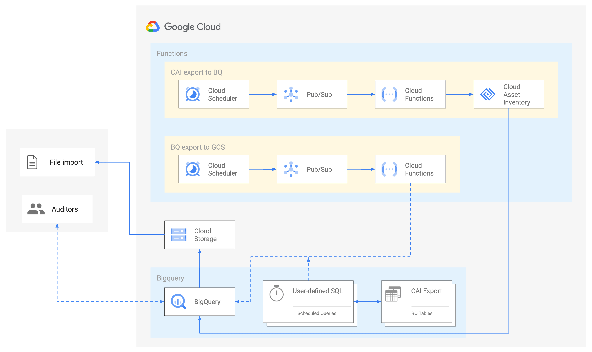

# Scheduled Cloud Asset Inventory Export to Bigquery

This example shows how to leverage [Cloud Asset Inventory Exporting to Bigquery](https://cloud.google.com/asset-inventory/docs/exporting-to-bigquery) feature to keep track of your project wide assets over time storing information in Bigquery.

The data stored in Bigquery can then be used for different purposes:

- dashboarding
- analysis

The example uses export resources at the project level for ease of testing, in actual use a few changes are needed to operate at the resource hierarchy level:

- the export should be set at the folder or organization level
- the `roles/cloudasset.viewer` on the service account should be set at the folder or organization level

The resources created in this example are shown in the high level diagram below:

## Prerequisites

Ensure that you grant your account one of the following roles on your project, folder, or organization:

- Cloud Asset Viewer role (`roles/cloudasset.viewer`)
- Owner primitive role (`roles/owner`)

## Running the example

Clone this repository, specify your variables in a `terraform.tvars` and then go through the following steps to create resources:

- `terraform init`
- `terraform apply`

Once done testing, you can clean up resources by running `terraform destroy`. To persist state, check out the `backend.tf.sample` file.

## Testing the example

Once resources are created, you can run queries on the data you exported on Bigquery. [Here](https://cloud.google.com/asset-inventory/docs/exporting-to-bigquery#querying_an_asset_snapshot) you can find some example of queries you can run.

You can also create a dashboard connecting [Datalab](https://datastudio.google.com/) or any other BI tools of your choice to your Bigquery datase.

<!-- BEGIN TFDOC -->
## Variables

| name | description | type | required | default |
|---|---|:---: |:---:|:---:|
| cai_config | Cloud Asset inventory export config. | <code title="object&#40;&#123;&#10;bq_dataset &#61; string&#10;bq_table   &#61; string&#10;&#125;&#41;">object({...})</code> | ✓ |  |
| project_id | Project id that references existing project. | <code title="">string</code> | ✓ |  |
| *billing_account* | Billing account id used as default for new projects. | <code title="">string</code> |  | <code title="">null</code> |
| *bundle_path* | Path used to write the intermediate Cloud Function code bundle. | <code title="">string</code> |  | <code title="">./bundle.zip</code> |
| *location* | Appe Engine location used in the example. | <code title="">string</code> |  | <code title="">europe-west</code> |
| *name* | Arbitrary string used to name created resources. | <code title="">string</code> |  | <code title="">asset-inventory</code> |
| *project_create* | Create project instead ofusing an existing one. | <code title="">bool</code> |  | <code title="">true</code> |
| *region* | Compute region used in the example. | <code title="">string</code> |  | <code title="">europe-west1</code> |
| *root_node* | The resource name of the parent folder or organization for project creation, in 'folders/folder_id' or 'organizations/org_id' format. | <code title="">string</code> |  | <code title="">null</code> |

## Outputs

| name | description | sensitive |
|---|---|:---:|
| bq-dataset | Bigquery instance details. |  |
| cloud-function | Cloud Function instance details. |  |
<!-- END TFDOC -->
